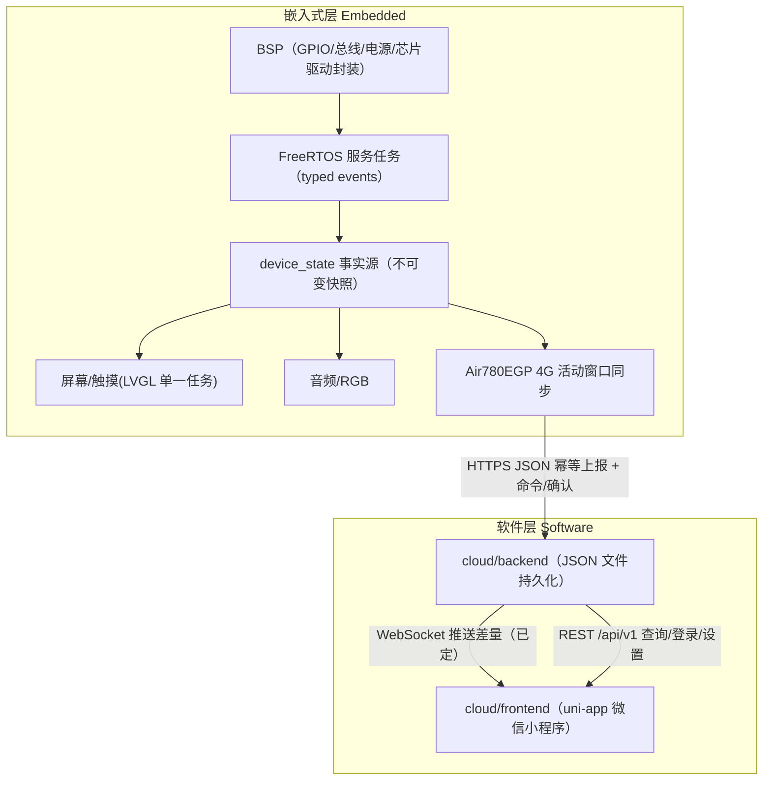
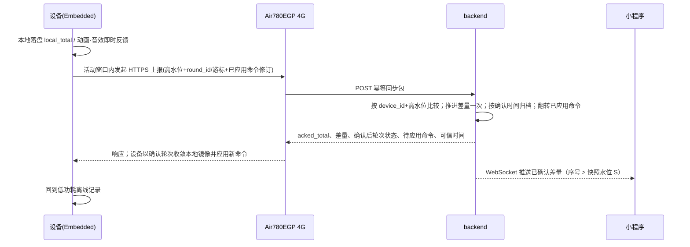

# Architecture Spine — Electronic_Wooden_Fish（电子木鱼）

> **本文件是电子木鱼的不变量契约单一事实源。** 产品意图与功能行为权威为 09-08 [产品简报](../brief-Electronic_Wooden_Fish-2026-09-08/brief.md) 与[附录](../brief-Electronic_Wooden_Fish-2026-09-08/addendum.md)（其中与历史 PRD 冲突处以它们为准）。本项目是个人自用原型：一台设备、一个固定 backend、无量产认证与云运维体系。
>
> **本轮覆盖决策：** 后端持久化改为 **JSON 文件、零数据库**，覆盖 PRD FR-B-009 与旧根文档「单文件 SQLite」决定（AD-16）；backend→小程序实时通道**保留 WebSocket**（AD-17）。Fast-path 推断以 `[ASSUMPTION]` 标注；出处与版本核验见 §版本与依据核验出处。

## Design Paradigm

两层、两种互补范式，由同一条跨层同步契约连起来：

- **嵌入式层（Embedded）**：沿用 `legbot_watch` 的 **分层 BSP/Driver + FreeRTOS 服务任务事件驱动固件**。BSP 独占板级资源；长期能力是服务任务，经 typed event/queue 通信；所有产品状态收敛到单一 `device_state` 事实源，UI/音频/4G/同步只读快照。
- **软件层（Software）**：**backend 权威 + 幂等高水位同步**（offline-first、最终一致）。设备是「本地事实记录器」——先在本地落盘并反馈，网络只是后收敛；backend 是「确认权威」——对已确认进度、经文游标/轮次、完成状态、统计与命令负责并回传确认；小程序只按 backend 确认顺序呈现。同步采用「活动窗口 + 幂等高水位」而非常开会话或逐事件重放。



## Invariants & Rules

### 跨层同步

#### AD-1 — 统一正式输入源，不存在第二计数路径

- **Binds:** Embedded 输入处理（`physical_pvdf`、`device_touch`）、累计/游标/完成/音频/RGB/同步、backend 增量计算
- **Prevents:** 实体敲击与设备触摸各建一套计数、计数与动画/统计错位、伪输入源计入、原始波形留存
- **Rule:** `physical_pvdf`（低功耗比较器唤醒 + ADC 二次确认）与亮屏木鱼页电子木鱼点击 `device_touch` 是仅有的两类正式输入（FR-E-002/003），进入**同一个**有效敲击队列，共享本地累计、经文推进、完成锁定、音频、RGB、持久化与同步语义。除该队列外，任何代码路径不得推进正式累计。充电中、完成遮罩中与故障锁定中直接忽略输入；**熄屏首次触摸只唤醒、不计数**，需亮屏后下一次木鱼页点击才生成 `device_touch`。一次有效敲击推进下一个「可消费」汉字（推进/标点/展示语义见 AD-19）。

#### AD-2 — backend 是云端正式进度的唯一权威

- **Binds:** backend 同步/统计/命令接口、frontend 呈现、设备端「今日/同步状态」展示
- **Prevents:** 小程序把本地待同步数据冒充为云端进度、对已确认进度产生分裂解释
- **Rule:** backend 拥有**已确认的** `acked_total`、经文游标 `round_cursor`/`round_state`/`round_id`、完成锁定、历史统计与命令状态的唯一权威（FR-B-002~007），并对设备上报做校验与确认、把确认结果随同步响应回传（AD-3）。**小程序只呈现 backend 已确认的进度**；**设备屏幕可展示其本地即时镜像（含尚未确认的新字与本地计数），但必须以「同步中 / 待同步」等非正式状态显式标记**；本地待同步数据绝不混入正式统计。

#### AD-3 — 幂等高水位同步，无逐事件重放；轮次只由设备本地推进、backend 确认回传

- **Binds:** 设备↔backend 传输、同步包字段（§Structural Seed 字段清单）、离线积压、轮次对账
- **Prevents:** 重复/乱序/回退提交重复计数、backend 按经文长度对差值盲推游标/完成、设备与 backend 轮次分裂
- **Rule:** 设备在敲击/设置触发的**活动窗口**内用一次 HTTPS 请求上报累计高水位 `local_total`/`acked_total`、轮次 `round_id`/`round_state`/`round_cursor` 与设备状态（FR-E-004/FR-B-002）；backend 按设备身份比较，只对高于已确认高水位的差值幂等推进一次，同值或更低为 no-op。**backend 不以经文长度对差值盲推游标或完成锁定**——单轮推进只在设备本地发生（AD-19），backend 以设备上报的 `round_id`/游标做边界校验并确认，**同步响应回传确认后的 `round_state`/`round_cursor`/完成状态**，供设备收敛本地镜像。同步响应须含最新确认高水位、差量、待应用命令与确认后轮次状态。设备离线积压上限 1000，达到上限拒绝新输入并提示。稳定网络目标 95% 有效敲击在 1 秒内被小程序展示（SM-3，端到端口径）。未确认完成下的设备本地「从头开始」跨轮竞态语义下沉 sync-contract（见 Deferred）。

#### AD-4 — 固定经文版本，单一文本源、构建期一致，不一致即停

- **Binds:** Embedded/backend/frontend 三端文本与字形资源
- **Prevents:** 三端各自誊写导致构建期漂移、版本漂移导致游标错位、端间自动映射异文
- **Rule:** MVP 固定《般若波罗蜜多心经》唯一 canonical 汉字序列与 `scripture_version`（FR-B-004）。canonical 文本有**单一落盘来源**，三端在构建/打包期从该源嵌入或生成，并校验 `scripture_version` 一致；禁止各端各自誊写文本。运行期版本不一致时停止推进并返回配置错误，不做自动映射、不选经、不导入。设备内置字形仅覆盖该部经文所需（AMOLED 离线显示），不引入通用中文字体库。

#### AD-5 — 命令以单调「已应用修订」高水位收敛，离线进入待设备应用

- **Binds:** backend 命令存储、设备应用、frontend 设置镜像与设备页状态
- **Prevents:** 旧命令覆盖新命令、「待设备应用」冒充「已生效」、因无常开连接导致的 ACK 永不到达
- **Rule:** 音量/亮度/熄屏等设备命令携带单调递增 `command_revision`，其语义固定为**「设备已应用命令的单调高水位」**（FR-B-007）。backend 只保留并下发最新修订并持久化；设备在**每次活动窗口随同步包携带已应用修订**，backend 以「已应用 ≥ 已下发」幂等将「待设备应用」翻转为「已生效」，**不依赖单次 ACK 到达**。设备离线时 backend 持久化命令、frontend 显示「待设备应用」，backend 确认已应用后才呈现为已生效（FR-F-007/008）。

#### AD-6 — 可信时间门禁

- **Binds:** backend 日统计切分、设备端「今日」计数
- **Prevents:** 设备在无可信日期时把敲击错误归档到某一天、设备端与 backend 日界不同造成的错日感知
- **Rule:** 日统计（今日/近 7/30 日/连续天数）由 backend 按其**配置时区**、以接收/确认时间归档离线增量，是唯一权威（FR-B-008）；设备不保存绝对敲击时间。设备端「今日」是**非权威的本地展示桶**：存在未同步差值时须带「待同步/待校准」标记，设备端日界与 backend 采用同一配置时区约定以减小 00:00–08:00 的错日感知。设备硬断电后、从 Air780EGP 网络时间或 HTTPS 响应取得可信时间前，设备端「今日」显示「待校时」，不得伪造当天统计（FR-E-006）。

### 嵌入式层

#### AD-7 — 服务任务事件驱动固件范式

- **Binds:** 所有嵌入式长期运行能力、ISR、任务间交互
- **Prevents:** UI/4G/音频/持久化互相阻塞、任务直调导致状态撕裂
- **Rule:** 沿用 `legbot_watch` 范式：长期能力实现为 FreeRTOS 服务任务，经 typed event/queue（或 event bus）通信；ISR 只投递事件，不做产品决策；服务之间不得为产品决策同步直调。可合并型事件可丢最新，命令型（同步、命令应用、持久化关键路径）不得静默丢弃，必须 busy/error + 日志。

#### AD-8 — BSP 独占板级资源并统一封装硬件驱动

- **Binds:** `Embedded` 板级代码、`managed_components` 上游驱动
- **Prevents:** 引脚漂移、I²C/SPI/UART 重复初始化、业务层直接耦合上游硬件 API、板级 bring-up 顺序不一致
- **Rule:** 只有 BSP 层可定义 GPIO、总线实例、电源使能与初始化顺序；经 ESP-IDF 组件管理器引入的硬件驱动（CO5300/CST9217/CW2015/ES8311/… 沿用 `legbot_watch` 的 `managed_components` 与组件内 BSP 封装，见 §Structural Seed）只作为上游依赖，项目在自有 BSP 下封装稳定 API、自检入口与错误码映射。新增芯片目录必须登记进 BSP 的 CMake 纳管。

#### AD-9 — `device_state` 是嵌入式产品事实源

- **Binds:** UI、音频、4G 同步、设置、持久化、输入
- **Prevents:** 各服务对计数/经文/电量/同步状态各自解释，形成分裂事实
- **Rule:** 服务只拥有链路内部状态，发布 typed update；消费者只读不可变 `device_state` 快照，不读其他服务内部变量。设备端展示使用本地记录即刻呈现（含未确认新字），云端差异通过同步状态显式表达（AD-2）。

#### AD-10 — 共享资源单一仲裁（I²C / AT UART / UI）

- **Binds:** 共享 I²C 总线上的 BQ25895/CW2015/CST9217/ES8311/QMI8658A、Air780EGP UART、LVGL 刷新
- **Prevents:** 多服务并发抢占总线、UI 刷新与触摸/音频时序冲突
- **Rule:** 共享 I²C 经单一总线仲裁访问；Air780EGP 的 AT 经单一 UART 入口与单一事务所有权（复用 `main_control` 已验证的 AT/HTTPS/退避经验，不复制其引脚常量）；UI 只经单一 LVGL 任务边界更新（沿用 legbot `ui_task` 独占模式，LVGL 8.x）。

#### AD-11 — USB-Serial-JTAG 为唯一调试通道，GPIO 布局依此排布

- **Binds:** 烧录/日志/JTAG、GPIO19/20/43/44、外设选型
- **Prevents:** 需要 CH340X、占用 4G UART、误用 USB-OTG
- **Rule:** 使用 ESP32-S3 原生 USB-Serial-JTAG（GPIO19 D− / GPIO20 D+）完成 `esptool`/`idf.py flash`、USB CDC 日志与 OpenOCD 调试（Espressif 依据链接见 §版本与依据核验出处）；不上 CH340X、不在同一 USB PHY 上开发 USB-OTG。因此 GPIO43/44 让给 Air780EGP UART。USB 连接时禁用自动 light sleep，防调试串口失联。

#### AD-12 — 反馈/外设失败不阻塞核心链路；高速连击合并音效

- **Binds:** 音频、触屏、动画、计数、持久化、同步
- **Prevents:** 音效/屏幕卡顿导致漏计或丢同步、20 次/秒连击音频叠加成噪声
- **Rule:** 音频或触屏播放/渲染失败不得阻塞计数、本地持久化或同步（FR-E-005/006/009）。高速连击时计数全部保留、音频按短间隔重触发或合并为可辨识节奏，不做无控制叠加。动画队列不得丢正式字符：积压增长时缩短位移时间追平，清空后恢复节奏。

#### AD-13 — 电源边界：分轨、低电优先持久化、充电暂停输入

- **Binds:** 电源设计、PWR/BOOT/充电、计数落盘时机
- **Prevents:** 4G 发射掉压重启、低电掉电丢累计、充电期间误计数
- **Rule:** 单节锂电 + USB-C + 硬件 PWR 硬断；Air780EGP 高电流轨、低压 3.3V 轨与音频轨分轨供电；低电时**先保证累计计数落盘**再执行其他（不主动断网）。充电期间暂停实体/触摸输入、经文推进与音频。PWR 长按开关机由板级电源电路负责，固件不模拟软件关机（FR-E-001/007）。

#### AD-14 — 唯一产品联网链路是 Air780EGP 4G HTTPS

- **Binds:** 网络层、唤醒/活动窗口、固件无线配置
- **Prevents:** BLE/Wi‑Fi 悄悄成为业务通道、常开无线耗电、GPS 业务蔓延
- **Rule:** MVP 只配置 Air780EGP 4G（AT/HTTPS JSON）一条业务链路，在活动窗口内复用上下文、上报后回低功耗，不维持长连接（FR-E-008）。ESP32-S3 的 BLE/Wi‑Fi 仅作硬件能力保留，固件不配置为产品通道；GPS 保留控制能力但默认关闭；不引入 Air780EGP 独立业务云。设备 UI 可以把 4G/Wi‑Fi/蓝牙/GPS 作为被动状态组件呈现 connected/no-signal/disabled，但图标可见不代表新增业务链路，也不要求 frontend API 增加这些字段。

#### AD-15 — 设置跨重启保留；计数以本地高水位持久化

- **Binds:** NVS/本地持久化、设置项（音量/亮度/熄屏）、计数/经文游标恢复
- **Prevents:** 重启丢设置或丢计数、重复同步后本地与确认态混乱
- **Rule:** 设备本地持久化 `local_total`/`acked_total`/`round_id`/`scripture_version`/`round_state`/`round_cursor` 与待同步标记（FR-E-004）；音量/亮度/熄屏设置跨重启保留（FR-E-005/007）。断电/重启后恢复本地高水位并可离线续敲；不在本地保存绝对敲击时间（AD-6）。计数权威与 JSON schema 以 AD-16/后端为准。

### 软件层

#### AD-16 — backend：沿用 miaowu REST 骨架；持久化 = JSON 原子文件、零数据库

- **Binds:** backend 进程形态、数据落盘、日统计、鉴权、接口信封
- **Prevents:** 依赖外部数据库服务、重启丢状态、把配置基线越改越偏
- **Rule:** backend 沿用 miaowu 骨架：Java 17 + Spring Boot 3.3.7 + Maven（`[ASSUMPTION A-4]`——版本出处与 OSS EOL 见 §版本与依据核验出处及 Deferred），接口统一 `/api/v1` + `{code,message,data}` 信封（code=0 成功），微信登录→单设备身份映射（沿用 miaowu WechatMiniClient/JWT 模式；MVP 单身份单设备，`[ASSUMPTION A-5]`）。**框架版本锚 miaowu pom（用户指定基线）；零库 JSON 原子写的做法借鉴 `legbot_watch/cloud`（其运行于 Spring Boot 3.5.16 + 无库——仅作写入模式先例，不随之改框架版本；升级到受支持维护线见 Deferred）**。**持久化不引入任何数据库**：单实例单进程，后端状态（ack 高水位、游标/轮次、完成、命令、日统计）以 JSON 文件原子落盘（临时文件 + fsync + rename），保存于 `cloud/backend/data/`；backend 重启后全部恢复（SM-5）。`[ASSUMPTION A-2]` JSON 文件 schema 与文件粒度不在本 spine 冻结，须在 backend/embedded 模块 spec 拆分前经 `docs/contracts/sync-contract.md` 收敛。禁启用第二套平行云后端。

#### AD-17 — frontend 只消费已确认差量：WebSocket 推送 + 快照水位补齐

- **Binds:** 小程序动画/回放/实时、backend→frontend 通道、完成状态呈现
- **Prevents:** 跳字/重字/乱序、断线重连的空洞或重叠回放、本地数据混入正式
- **Rule:** 小程序不产生正式敲击、不显示可点击木鱼（FR-F-001/002）。只按 backend 确认顺序逐字呈现一次；动画落后时动态加速但不跳过/合并正式字符（FR-F-003）。恢复时先按 backend 差量顺序回放、回放期间新事件排队、结束后无缝接入实时（FR-F-004）。**断线补齐基准 = backend 在查询响应内冻结的快照水位 S**：实时差量消息携带单调序号，仅消费序号 > S 的消息；序号出现空洞先查询补齐再续播；禁止前端以「自身已展示计数」或连接记忆作基准（FR-F-006/009）。backend→frontend 实时通道采用 **WebSocket**（已定，FR-B-006）；帧格式/心跳/重连参数下沉 `docs/contracts/sync-contract.md`。完成反馈仅在收到 backend 完成确认后显示（FR-F-005）。前端配置沿用 miaowu uni-app 骨架（AD-18）。

#### AD-18 — 前端技术基线：uni-app（Vue 3 + TypeScript + Vite）仅微信小程序

- **Binds:** frontend 目录结构、构建/调试、API 接入
- **Prevents:** 引入多端/App/H5 工程面、绕过统一 API 封装、本地数据入正式统计
- **Rule:** 沿用 miaowu `frontend` 的 uni-app（Vue 3 + TS + Vite + Pinia）骨架与 HBuilderX 调试方式，仅构建微信小程序。所有后端访问经单一 `VITE_API_BASE_URL` 与统一 `api/request` 封装（信封 + 鉴权头），不直接散落请求；客户端状态只放 Pinia/本地存储，不作权威数据（AD-2）。

#### AD-19 — 经文消费与展示语义：一敲一字、标点随附、不预览未来

- **Binds:** Embedded 游标推进与 7 字带、backend 游标校验、frontend 逐字呈现
- **Prevents:** 跳字/重字/乱序、标点空格换行消耗敲击、设备或小程序预览「未来」经文
- **Rule:** 每轮推进按 canonical 序列（AD-4）：一次有效敲击推进下一个**可消费汉字**；标点、空格、换行随相邻汉字在同一步内自动出现，**不消耗敲击、不单独推进游标**（FR-B-003）。无论设备本地镜像还是小程序已确认呈现，都**不得预览未来经文**，未填充位置以低对比度占位；正式计数每次有效敲击只 +1。跨轮次以 `round_id` 区分（AD-3）：「从头开始」创建新轮次并回到首字、历史统计保留；「退出」保留完成状态与历史（FR-B-005/FR-E-006）。设备端 7 字带与视觉细节由 09-08 附录承接（见 Deferred），本 AD 只锁跨层可消费/计数语义。

## Consistency Conventions

| 关注点 | 约定 |
| --- | --- |
| 命名 | 同步字段全小写下划线（清单见 §Structural Seed）；事件来源固定 `physical_pvdf`/`device_touch`；固件日志中文、模块 TAG 用 ASCII；新增组件/服务命名对照 legbot 风格 |
| 数据与格式 | 接口信封 `{code,message,data}`、code=0 成功；经文/游标/统计以 backend 为权威；设备不保存绝对敲击时间；JSON 文件写入原子化（tmp+rename） |
| 状态与跨切 | 同步状态词表固定：本地已记录/同步中/已同步/待同步/同步失败（累计）；待设备应用（命令，独立维度）；无第二计数路径、无第二套平行云后端 |
| 文档承接 | 设备端视觉/文案/默认值（音量 50/中亮度/15s 熄屏等）与统计页展示范围由 09-08 附录承接，spine 不重复（见 Deferred） |

## Stack（seed——草拟时经本地基线 + web 复核）

| 名称 | 版本 / 依据 |
| --- | --- |
| 嵌入式框架 | ESP-IDF ≥5.5.4,<5.6.0（`[ASSUMPTION A-3]`：与 legbot 复用 BSP/managed_components 对齐；v5.5 现处维护期、最新 5.5.5，v6.0 为现行 major，升级时机见 Deferred） |
| 嵌入式 UI | LVGL 8.4（沿用 legbot 锁档；上游 8.4 支持已于 2025-03 结束，见 Deferred「不升 LVGL9」知情项） |
| 主控 | ESP32-S3-N16R8（16MB Flash / 8MB PSRAM 型号，采购以封装手册为准） |
| 4G | Air780EGP 完整模组组件（沿用 `main_control` 已验证设计，AT/HTTPS） |
| 后端 | Java 17 + Spring Boot 3.3.7（沿用 miaowu `backend/pom.xml` 基线；发行版建议 Temurin/Corretto，`[ASSUMPTION A-8]`） |
| 前端 | uni-app：Vue 3 + TypeScript + Vite + Pinia，仅微信小程序（沿用 miaowu `frontend/package.json` 基线） |
| 本地脚本 | 沿用 miaowu `env-scripts` 起停/构建约定（本地 profile=local；`[ASSUMPTION A-6]`） |

### 版本与依据核验出处（2026-09-08 复核）

| 承诺 | 出处 / 证据 |
| --- | --- |
| ESP-IDF：v5.5 维护期、5.5.5（2026-07）、v6.0 现行 major（2026-03） | web：Espressif release notes（release-notes.espressif.com）；本地：legbot `dependencies.lock`/`main/idf_component.yml` 锁 ≥5.5.4,<5.6.0 |
| Spring Boot 3.3.x OSS EOL 2025-06-30 | web：endoflife.date/spring-boot；本地：miaowu `backend/pom.xml` 3.3.7 |
| LVGL 8.4 上游支持已于 2025-03 结束 | web：lvgl.io policies；本地：legbot lock lvgl 8.4.0 |
| Java 17：Oracle JDK 17 Premier 至 2026-09-30，Temurin/Corretto 续期 | web：endoflife.date/java |
| uni-app Vue3+TS+Vite+Pinia 基线 | 本地：miaowu `frontend/package.json`（2025-05 快照，Vue 3.5/Vite 5/TS 5.7/Pinia 2.3） |
| ESP32-S3 原生 USB-Serial-JTAG / 内置 JTAG / 数据手册 | 从被删除旧根文档迁移：docs.espressif.com/projects/esp-idf/…/usb-serial-jtag-console、…/builtin-jtag、documentation.espressif.com esp32_s3 datasheet |
| 零库 JSON 原子写先例 | 本地：legbot `cloud`（Spring Boot 无库、JSON 落盘） |

## Structural Seed

### 目录树

```text
Electronic_Wooden_Fish/
  Embedded/                  # ESP-IDF 工程：components/BSP + platform + services + app_state + main
  cloud/
    backend/                 # Spring Boot 单进程 jar；data/ 下 JSON 状态文件；接口 /api/v1
    frontend/                # uni-app 微信小程序（Vue3+TS+Vite，单 VITE_API_BASE_URL）
  _bmad-output/planning-artifacts/architecture/...   # 本 spine
```

### 系统容器图


### 同步字段清单（跨层契约，权威语义下沉 docs/contracts/sync-contract.md）

`device_id` · `local_total` · `acked_total` · `scripture_version` · `round_id` · `round_state` · `round_cursor` · `command_revision` · `battery_percent` · `network_mode` · `audio_config_version` · `firmware_version`。事件来源：`physical_pvdf`、`device_touch`。

- `round_id`（单调轮次标识）为本次新增：跨轮归属与「未确认完成的从头开始」以此对齐（AD-3/AD-19）。
- `command_revision` 语义固定为「设备已应用命令的单调高水位」（AD-5）。

### 板级合同（seed；未核验参数在样机/原理图前不得冻结）

**GPIO 基线（来源：09-08 附录 §3.1；新 BSP 默认合同，冲突须先更新本 spine 再调整）**

| 功能 | 信号 | ESP32-S3 GPIO | 约束 |
| --- | --- | ---: | --- |
| BOOT | BOOT0 | IO0 | 启动绑带；保留下载路径 |
| PWR | 运行态输入 | IO46 | 启动绑带；固件只读，长按开关机由板级电源 |
| RESET | EN | EN | 独立按键/测试点 |
| PVDF | ADC | IO9 | ADC1_CH8；前端限流/钳位、控输入范围 |
| PVDF 唤醒 | 比较器输出 | IO11 | 低功耗 GPIO 唤醒；醒后 ADC 确认有效敲击 |
| 共享 I²C | SDA / SCL | IO1 / IO2 | BQ25895/CW2015/CST9217/ES8311/QMI8658A 共用；地址必须无冲突 |
| CST9217 | TP_RST / TP_INT | IO38 / IO39 | 触摸复位与中断 |
| QMI8658A | INT1 | IO41 | 未来 WoM 扩展；INT2 不接、不占 GPIO45 |
| CO5300 | RST/CS/SCL/D0/D1/D2/D3/EN | IO4/40/5/6/7/12/42/47 | 沿用 legbot 屏幕资源基线 |
| ES8311 | I2S_DO/WS/BCLK/MCLK | IO13/14/18/21 | 沿用 legbot 音频资源基线 |
| NS4150B | PA_EN | IO48 | 静音/暂停/故障回到禁用 |
| Air780EGP | UART TX/RX | IO43/44 | 从 main_control 抽离板级引脚常量 |
| Air780EGP | DTR/RST | IO10/15 | 休眠/复位；NET_STATUS 不接 ESP32 |
| 保留 | IO8 | NC/测试点 | 不接 M100 GNSS_VCC，不配置 GPIO |
| RGB | DATA | IO3 | 状态灯，不作调试灯 |
| USB | D− / D+ | IO19/20 | 原生 USB-Serial-JTAG |

GPIO45 保持未接或按模组要求处理（其影响 VDD_SPI 启动采样）；GPIO33–37 通常与 Octal Flash/PSRAM 相关、不作通用 GPIO。启动绑带约束：下载要求 GPIO0=0、GPIO46=0；PWR/QMI8658A 输出不得在复位采样窗口把 IO0/45/46 推到错误电平（详见工程验证门禁）。

**I²C 总线与器件**：BQ25895（TI 固定 7-bit `0x6A`）、CW2015（约 `0x62`）、CST9217（7-bit `0x5A`）、ES8311（地址由 CE/CDATA 配置，首版参考 `0x18`）、QMI8658A（首版 SA0=高，`0x6B`）共用一组总线与上拉；最终地址以目标物料 + 实板上电扫描为准，五个地址不得冲突。QMI8658A 仅接 INT1，INT2 不接、不占 GPIO45。

**电源分轨**：USB-C 单入口经 BQ25895 做 NVDC 充电与系统 power-path；TPS3424 锁存并控制 TPS22965 形成 `SYS_MAIN`，Air780EGP/M100 VIN 经该负载开关供电；TLV62569DBVR 为 `SYS_MAIN→3V3` 首版候选，NS4150B 使用滤波后的 `3V3_AUDIO`。AMS1117 类低压差稳压器不得承担 Air780EGP 主供电；充电期间保持音频供电稳定并验证低频噪声。

**USB 与 4G 载板边界**：USB-C D+/D− 直连 ESP32 USB-Serial-JTAG；BQ25895 D+/D− 不接 USB-C 数据线，固定输入限流并关闭 BC1.2 自动检测。EWF IO8 留作 NC/测试点，M100 GNSS_VCC 为 NC/测试点；M100 NET_STATUS 不接 ESP32。

**同步活动窗口时序（一次上报）**



### 嵌入式复用与不沿用（seed）

- **复用（legbot_watch）**：CO5300/CST9217/CW2015/QMI8658A/ES8311/NS4150B 的 BSP 与 `managed_components`、共享 I²C 管理、LVGL 多主页/顶部状态栏/下滑设置/屏幕首帧时序；BQ25895/TPS 电源外围按本硬件基线另行落图，不复制旧参考图。
- **复用（main_control）**：Air780EGP UART/AT、DTR 休眠唤醒、网络注册/PDP、HTTPS JSON、超时恢复、GPS 开关与状态模型。
- **不沿用**：legbot 引脚常量、ML307R/BLE/外骨骼业务、QMI8658A INT2→GPIO45 合同、四主页数量；main_control 原板引脚常量、景区 payload、ESP-IDF v5.1.5 约束。
- PVDF 输入只产生事件计数，**不保存、不上报原始波形**；单一外壳，只为最终外壳做一次传感器与声学标定，不做多外壳运行时适配。

## Capability → Architecture Map

| 能力 / 区域（PRD） | 落在 | 由…治理 |
| --- | --- | --- |
| FR-E-001~010 嵌入式输入/持久化/屏幕/音频/电源/4G | `Embedded`（BSP + services + app_state） | AD-1/3/4/6/19（跨层）＋ AD-7~15 |
| FR-B-001~009 后端身份/幂等同步/游标/命令/统计/推送 | `cloud/backend` | AD-1/2/3/4/5/6/16/19 |
| FR-F-001~010 小程序呈现/回放/记录/设备/设置 | `cloud/frontend` | AD-2/3/4/5/6/17/18/19 |
| 跨层同步字段与最终一致（SM-1~5） | 同步契约（sync-contract） | AD-1~6、AD-19 |

> 备注：FR-E 亦受跨层 AD-1/3/4/6/19 约束；设备端视觉/文案/默认值等 UX 细节由 09-08 附录承接（见 Deferred）。

## Deferred（含复核清单）

| 事项 | 为何可等 / 复核条件 |
| --- | --- |
| 离线「完成→从头开始」跨轮竞态 + `round_id` 对账细节 `[耦合 AD-3/19]` | backend 与 Embedded 各自不会凭空发明一致协议；**须在 backend/embedded 模块（epic/lane）spec 拆分前**经 `docs/contracts/sync-contract.md` 冻结：跨轮差值归属、未确认完成的本地重置、确认回传字段 |
| JSON 持久化 schema 与文件粒度 `[ASSUMPTION A-2，用户已确认不在 spine 冻结]` | 只锁不变量（零库/原子写/单实例/重启可恢复）；schema、日统计与 ack 的非原子写顺序须随上条一并收敛后再冻结 |
| WebSocket 帧格式/心跳/断线重连参数 `[通道已确认，原 A-1]` | 已定用 WebSocket；帧/序号/心跳细节下沉 sync-contract 后冻结 |
| 嵌入式 IDF 档位：≥5.5.4,<5.6.0 `[ASSUMPTION A-3]` | 为复用 legbot BSP/managed_components；v5.5 处维护期。升级 v6.0 在固件初版稳定后单独评估迁移 |
| Spring Boot 3.3.7 沿用 miaowu pom `[ASSUMPTION A-4]` | 3.3.x OSS 已于 2025-06 EOL；后端零库持久化更接近 `legbot_watch/cloud`（其运行于 3.5.16）。**升级目标为现行受支持 OSS 线 4.0.x/4.1.x（3.5 亦已 EOL）**，时机 = backend 功能稳定、进入文档化部署前 |
| 不升 LVGL9 的知情保留 | 上游 8.4 支持 2025-03 结束；因复用 legbot 生成 UI/驱动基线暂不升级，固件初版后单独评估 |
| Java 17 发行版 `[ASSUMPTION A-8]` | Oracle JDK 17 Premier 2026-09-30 截止；本地采用 Temurin/Corretto 等免费发行版即可 |
| 微信登录→单设备映射细节 `[ASSUMPTION A-5]` | MVP 单作者单设备，无需复杂账号治理；openid/JWT 实现随 bmad-spec/backend 落定 |
| 端口与本地脚本沿用 miaowu `env-scripts` `[ASSUMPTION A-6]` | 本地 profile=local 起停/构建即可；具体端口随实现确认 |
| 运行期公网形态 `[ASSUMPTION A-7]` | 小程序合法 HTTPS/wss 域名 + 备案 + backend 主机由作者以开发者/体验版自备；进入正式部署前落实。与本地 dev 脚本分属两个信封，勿混为一谈 |
| 部署与运维信封 | 个人原型沿用 miaowu `env-scripts` 本地起停/构建脚本；无 CI/CD、宝塔与云运维文档重定义 |
| 设备 UI 默认值（音量 50/中亮度/15s）与统计页展示范围 | **已承接（2026-09-11）**：设备轨 DEVICE-01 经作者逐屏签收，规格冻结在 `UI_CONTRACT-device.md` 与 `DESIGN.md`/`EXPERIENCE.md`。统计页限定今日与累计，近 7/30 日与连续天数归小程序记录页；默认值 音量 50 / 亮度中 / 15 秒熄屏 |
| 分区表 / NVS schema / 低功耗参数 / CO5300 首帧与亮度档 / CST9217 实际地址 / PVDF 前端与比较器料号 | 属「必须由原理图或样机实测冻结」的工程项（09-08 附录 §10）；冻结前不得写入承诺性参数 |
| 硬件细分 seed（具体 I²C 上拉阻值、AMOLED FPC 供电时序、扬声器腔体、电池容量、稳压/充电料号） | 只可在原理图/数据手册/样机验证后回填，本 spine 不作产品承诺 |
| 音频高速合并阈值 / 动画队列长度 / 活动窗口时长 | 表现类参数按样机演示签收后定标 |
| OTA、BLE/Wi‑Fi 产品通道、GPS 业务、QMI8658A 业务、选经/导入 | 明确非 MVP 非目标 |
| 多设备、换机迁移、公开账号、社交、排行榜、提醒、付费、多端前端 | 非个人原型目标，未来若变化需重开架构 |

## 工程验证门禁（seed——从被删除旧根文档保真迁移）

- **芯片/启动**：原生 USB 完成烧录/CDC 日志/OpenOCD；BOOT+RESET 可进下载；PWR 硬断电不破坏启动绑带；GPIO45 全样本采样正确；Flash/PSRAM 保留脚不复用。
- **总线/外设**：上电 I²C 扫描确认四器件地址无冲突；CO5300 QSPI、CST9217、ES8311/NS4150B、CW2015 分别冒烟；PVDF 单次与 1 秒 20 次稳定计数，完成遮罩期间输入忽略。
- **功耗/联网**：Air780EGP 发射峰值电池轨无掉压重启；离线/小程序关闭时本地记录、恢复后活动窗口补传，无 BLE/Wi‑Fi 回退。
- **Cloud/前端**：backend 重启后 JSON 中高水位/游标/统计/配置不丢；重复同步只增加一次；断线重连按快照水位补齐、不重复动画/字符；完成礼花与「从头开始/退出」语义正确。
