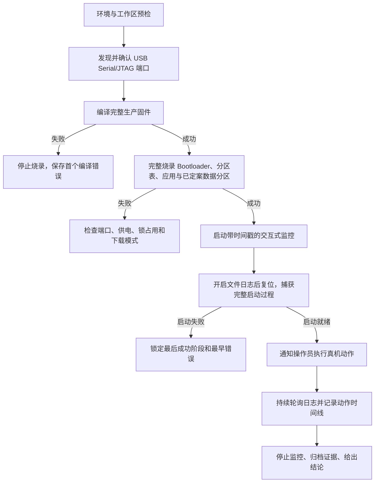

<!-- 来源: legbot_watch · 源文件: docs/guides/macos_esp_idf_hardware_test_runbook.md · legbot HEAD: 41a5ab8b9 · 迁移: 2026-09-08 · 判定: 适配(去手表专用, 命令按 EWF) · EWF 适配点: 同一 ESP32-S3 + USB-Serial-JTAG 流程适用 -->

# macOS 本机 ESP32-S3 真机闭环 runbook（EWF 适配）

> - 蓝本验证日期：2026-07-23（legbot_watch 真机）；EWF 迁移：2026-09-08
> - 验证设备：ESP32-S3，原生 USB Serial/JTAG（EWF：ESP32-S3-N16R8，IO19/20）
> - 验证框架：ESP-IDF v5.5.x（本机默认 `v5.5.4`）
> - 主要读者：后续在本机运行的、具备终端与交互式会话能力的模型（Codex / Claude 等）

> **板级待定提示**：EWF 的 `Embedded/` 骨架尚未落地（首 story = E1.1 工程骨架 + E1.2 USB-Serial-JTAG 通道）。因此**分区表、Flash 布局、启动里程碑文本、设备序列号、sdkconfig 具体值**均属「待定」，须在 **E1/E2 story** 冻结后才可作为承诺性参数写入。本文是流程模板：凡标注 `[E1.x 后回填]` 之处，首次真机执行时应按该次真实输出替换，**不得凭历史记忆填写**。

## 1. 文档目标

本手册让后续模型在当前 macOS 环境中独立完成以下闭环：

1. 核对代码、ESP-IDF 与真机连接状态。
2. 编译完整生产固件。
3. 将 Bootloader、分区表、应用（及后续 E1/E2 定案的数据分区）完整烧录到真机。
4. 开启可持续轮询的交互式串口监控，并保存带时间戳的原始日志。
5. 在监控不中断的情况下通知操作员执行真机动作。
6. 把操作员动作、主观现象和串口证据按时间关联。
7. 定位最早失败边界，验证修复，并把证据交付操作员。

Windows 环境与工具链细节不在本文范围（见 `docs/embedded/README.md` 索引）。

## 2. 当前本机事实锚点

以下机器级值在本机已核验，可作为默认值；但**串口设备名与设备序列号必须每次连接后重新发现，不能永久写死**。

| 项目 | 当前值 |
| --- | --- |
| 仓库根目录 | `/Users/hongchenke/Documents/Github/Electronic_Wooden_Fish` |
| ESP-IDF 工程目录 | `<仓库根>/Embedded`（spine seed：`components/BSP + platform + services + app_state + main`） |
| ESP-IDF 激活脚本（默认，需 `test -f` 复核） | `/Users/hongchenke/.espressif/tools/activate_idf_7355072.sh` |
| ESP-IDF | `v5.5.4`（EWF 约束：`≥5.5.4 且 <5.6.0`，见 ARCHITECTURE-SPINE §Stack；禁止回退 v5.1.x / v5.2.7） |
| 目标芯片 | `esp32s3` |
| 主控 | ESP32-S3-N16R8（16MB Flash / 8MB PSRAM，按封装手册采购）`[E1.x 冻结]` |
| Flash 模式/频率/分区表 | 待 E1/E2 story 冻结，本文不预设 |
| 监控波特率 | `115200` |
| 日志控制台 | ESP32-S3 原生 USB Serial/JTAG（IO19/20），**唯一调试通道**（AD-11） |
| USB 标识 | VID:PID `303A:1001`，描述 `USB JTAG/serial debug unit` |
| 设备序列号 | 待 E1.2 首次枚举后由操作员确认真机值（EWF 尚未登记） |
| 应用二进制名 | `<CMake project() 名>.bin`（E1.1 落地后回填，例：`build/<app_name>.bin`） |
| 测试记录目录 | `<仓库根>/docs/embedded/hardware_test_records/<运行编号>/` |

EWF 的应用日志不走 GPIO43/44：这两脚按 AD-11 让给 **Air780EGP UART**（4G 模组），不能把模组串口误当作应用日志端口。

## 3. 安全边界

- 不运行 `erase-flash` / `erase_flash`，除非操作员明确授权清除 NVS 与整片 Flash。
- 不因工作区有未提交改动就执行 `git reset`、`git checkout --`、`git clean` 或覆盖文件；先记录 `git status --short`，已有改动默认属于用户。
- 常规真机验证用 `idf.py flash`，不用 `app-flash` 代替完整烧录；`app-flash` 不更新分区表和已定案的数据分区，不能证明完整固件包有效。
- 编译失败立即停止烧录；烧录失败不假装进入真机验证。
- 一个串口同一时间只能有一个监控器；不并行启动第二个 `idf.py monitor`。
- 不在日志、测试记录或回复中写出设备共享 Token、CA 私钥或其他凭据。
- 操作员物理测试期间，不执行会复位设备的命令，除非步骤明确要求复位。
- 临时测试固件若改写分区表，测试结束后必须完整刷回生产固件（第 14 节）。

## 4. 标准执行流程



执行时把每个阶段当作门禁：只有当前阶段满足成功判据，才能进入下一阶段。

## 5. 创建本次测试记录

由 Shell 生成秒级运行编号，并把「目录必须不存在」作为唯一性门禁。以下整块应在**同一次工具调用**中执行：

```bash
EWF_PROJECT_ROOT=/Users/hongchenke/Documents/Github/Electronic_Wooden_Fish
EWF_RECORDS_ROOT="$EWF_PROJECT_ROOT/docs/embedded/hardware_test_records"
EWF_RUN_ID=$(date '+%Y%m%d-%H%M%S')
EWF_RUN_DIR="$EWF_RECORDS_ROOT/$EWF_RUN_ID"

mkdir -p "$EWF_RECORDS_ROOT"
if [ -e "$EWF_RUN_DIR" ]; then
    printf '运行目录已存在，拒绝覆盖：%s\n' "$EWF_RUN_DIR" >&2
    exit 1
fi
mkdir "$EWF_RUN_DIR"
printf '本次运行编号：%s\n' "$EWF_RUN_ID"
```

模型必须从输出中保存真实运行编号。若目录碰撞，重新生成编号；不得把新结果写入已有运行目录。

**标准命令前缀（每个独立 Shell 调用都要重新完整声明并重贴）**：多数终端工具每次执行都会创建新 Shell，上一条调用中的变量和 ESP-IDF 环境不一定保留。以下前缀统一贯穿全文，所有 `REPLACE_WITH_*` 必须替换为本次真实值，紧邻的 `test` 是防漏替换的门禁：

```bash
EWF_PROJECT_ROOT=/Users/hongchenke/Documents/Github/Electronic_Wooden_Fish
EWF_FW_DIR="$EWF_PROJECT_ROOT/Embedded"
EWF_RECORDS_ROOT="$EWF_PROJECT_ROOT/docs/embedded/hardware_test_records"
EWF_IDF_ACTIVATE=/Users/hongchenke/.espressif/tools/activate_idf_7355072.sh
EWF_APP_NAME=REPLACE_WITH_CMAKE_PROJECT_NAME   # E1.1 落地后回填
EWF_RUN_ID=REPLACE_WITH_RUN_ID
EWF_RUN_DIR="$EWF_RECORDS_ROOT/$EWF_RUN_ID"
EWF_PORT=REPLACE_WITH_CONFIRMED_PORT

test -d "$EWF_RUN_DIR" || exit 1
test -c "$EWF_PORT" || exit 1
test -f "$EWF_IDF_ACTIVATE" || exit 1
cd "$EWF_FW_DIR"
source "$EWF_IDF_ACTIVATE"
```

建议每次测试最终保留以下文件：

```text
docs/embedded/hardware_test_records/<运行编号>/
├── environment.txt    # IDF、Git、串口和工程配置
├── build-01.log       # 第一次完整编译输出，重试时递增编号
├── flash-01.log       # 第一次完整烧录输出，重试时递增编号
├── serial-01.log      # 第一次带时间戳的真机串口日志
└── session.md         # 操作员动作、现象、判断和结论
```

这些是测试产物：`build-*.log` / `flash-*.log` / `serial-*.log` 由对应工具直接生成，`session.md` 用文档编辑工具创建。提交 Git 前检查其中是否有凭据或无关隐私；默认不擅自提交测试记录。

## 6. 环境与工作区预检

### 6.1 激活唯一正确的 ESP-IDF 环境

每个新 Shell 会话都要重新激活，不假设上一条调用留下环境变量：

```bash
EWF_IDF_ACTIVATE=/Users/hongchenke/.espressif/tools/activate_idf_7355072.sh

test -f "$EWF_IDF_ACTIVATE" || exit 1
source "$EWF_IDF_ACTIVATE"
idf.py --version
```

成功判据：

```text
ESP-IDF v5.5.4
```

若版本不在 `≥5.5.4 且 <5.6.0`，停止编译；不要用 `latest`、`stable` 或其他本地安装继续尝试。

### 6.2 记录 Git 与工程配置

```bash
EWF_PROJECT_ROOT=/Users/hongchenke/Documents/Github/Electronic_Wooden_Fish
EWF_FW_DIR="$EWF_PROJECT_ROOT/Embedded"

cd "$EWF_FW_DIR"
git rev-parse --short HEAD
git status --short

rg -n 'CONFIG_IDF_TARGET=|CONFIG_ESPTOOLPY_FLASHSIZE=|CONFIG_ESPTOOLPY_FLASHMODE=|CONFIG_ESPTOOLPY_FLASHFREQ=|CONFIG_ESPTOOLPY_MONITOR_BAUD=|CONFIG_ESP_CONSOLE_' sdkconfig
```

首次 E1.1 真机前 sdkconfig 尚不存在；骨架落地并 `idf.py build` 生成后，至少确认以下项与当时设计一致（值以该次 `sdkconfig` 为准，不照抄蓝本历史值）：

```text
CONFIG_IDF_TARGET="esp32s3"
CONFIG_ESPTOOLPY_MONITOR_BAUD=115200
CONFIG_ESP_CONSOLE_USB_SERIAL_JTAG=y        # AD-11 唯一调试通道
CONFIG_ESP_CONSOLE_SECONDARY_NONE=y
# Flash 大小/模式/频率及分区偏移：E1/E2 冻结后回填，禁止默认写死
```

不要为了「保险」常规执行 `idf.py set-target esp32s3`：`set-target` 会重新生成配置，只有目标确实错误且任务授权时才使用。

把版本、Git 与配置结果写入本次 `environment.txt`；可用终端捕获保存，或在最后按真实输出用补丁工具生成，**禁止凭记忆填写**。

## 7. 发现并确认真机端口

### 7.1 列出端口

激活 ESP-IDF 后运行：

```bash
source /Users/hongchenke/.espressif/tools/activate_idf_7355072.sh
python -m serial.tools.list_ports -v
```

真机应出现类似输出：

```text
/dev/cu.usbmodemXXXXXX
    desc: USB JTAG/serial debug unit
    hwid: USB VID:PID=303A:1001 SER=XX:XX:XX:XX:XX:XX ...
```

端口尾号会因 USB 拓扑/重插/系统枚举而变。**必须依据描述、VID:PID 与设备序列号选择**，不能只依据历史端口名。

烧录前的硬门禁：

- 仅当**一个**端口同时匹配 `USB JTAG/serial debug unit`、VID:PID `303A:1001` 且设备序列号经操作员确认时，才可继续。
- EWF 设备序列号**尚未登记**：首次接线后把枚举到的序列号报操作员确认，再写入本次 `EWF_PORT` 对应的设备预期值。
- 零个匹配、多个匹配、序列号缺失或与预期不符时，列出全部候选并请求操作员确认；不得按端口排序、最近出现时间或历史端口名自行猜选。

### 7.2 固定本次端口并检查占用

把唯一匹配且确认的真实路径赋给任务变量。占位值未替换时，设备文件门禁必须失败：

```bash
EWF_PORT=REPLACE_WITH_CONFIRMED_PORT

test -c "$EWF_PORT" || exit 1
lsof "$EWF_PORT"
```

判断规则：

- `test -c` 成功且 `lsof` 无输出：端口存在且未占用，可继续。
- `lsof` 显示已有 `idf_monitor`：优先找回原会话或正常退出原会话，不要再启一个监控器。
- 显示其他进程：先确认归属，不未经判断直接 `kill`。
- 没有匹配端口：请操作员检查数据线、供电与 USB 连接后重新枚举。

## 8. 编译完整生产固件

在**标准前缀已初始化的同一 Shell**（第 5 节「标准命令前缀」，替换真实值）中执行，保存完整输出。用 `pipefail` 确保经 `tee` 留档后失败仍返回非零。每次尝试用新编号；目标日志已存在则拒绝覆盖：

```bash
EWF_RUN_ID=REPLACE_WITH_RUN_ID
EWF_RUN_DIR="$EWF_PROJECT_ROOT/docs/embedded/hardware_test_records/$EWF_RUN_ID"
EWF_BUILD_ATTEMPT=01
EWF_BUILD_LOG="$EWF_RUN_DIR/build-$EWF_BUILD_ATTEMPT.log"

test -d "$EWF_RUN_DIR" || exit 1
test ! -e "$EWF_BUILD_LOG" || exit 1
set -o pipefail

idf.py build 2>&1 | tee "$EWF_BUILD_LOG"
```

正常增量构建不需要预先 `fullclean`。修改过 CMake、`sdkconfig.defaults` 或分区配置而缓存未自动更新时，先执行 `idf.py reconfigure` 再 `build`（使用 `build-02.log` 等新编号）；只有确认缓存损坏才用 `idf.py fullclean`（会删整个 `build/`，显著增加重建时间）。

### 8.1 编译成功判据

输出必须包含：

```text
Project build complete. To flash, run:
 idf.py flash
```

并确认以下产物存在（数据分区随 E1/E2 分区表定案后追加）：

```bash
EWF_APP_NAME=REPLACE_WITH_CMAKE_PROJECT_NAME
EWF_MISSING=0

for EWF_ARTIFACT in \
    build/bootloader/bootloader.bin \
    build/partition_table/partition-table.bin \
    "build/${EWF_APP_NAME}.bin" \
    "build/${EWF_APP_NAME}.elf"
do
    if [ -f "$EWF_FW_DIR/$EWF_ARTIFACT" ]; then
        printf 'OK      %s\n' "$EWF_ARTIFACT"
    else
        printf 'MISSING %s\n' "$EWF_ARTIFACT" >&2
        EWF_MISSING=1
    fi
done

test "$EWF_MISSING" -eq 0 || exit 1
```

真正的门禁：

- `idf.py build` 返回 0。
- Bootloader 未超过其分区。
- `${EWF_APP_NAME}.bin` 未超过最小应用分区。
- 上述产物全部存在；后续如有 SPIFFS/音频/经文等数据分区产物，在对应 story 冻结后加入清单。

### 8.2 编译失败时怎么做

不要只看最后一行 `ninja failed`。从本次失败日志中找第一个真实编译/链接错误（替换真实编号）：

```bash
EWF_RUN_ID=REPLACE_WITH_RUN_ID
EWF_BUILD_ATTEMPT=REPLACE_WITH_ATTEMPT
EWF_BUILD_LOG="$EWF_PROJECT_ROOT/docs/embedded/hardware_test_records/$EWF_RUN_ID/build-$EWF_BUILD_ATTEMPT.log"

test -f "$EWF_BUILD_LOG" || exit 1
rg -n 'error:|fatal error:|undefined reference|FAILED:' "$EWF_BUILD_LOG"
```

记录最早错误、对应文件和行号。修复后用新尝试编号重新完整 `idf.py build`，不得截断或覆盖失败日志；**通过前不烧录**。

## 9. 完整烧录

### 9.1 执行烧录

```bash
EWF_RUN_ID=REPLACE_WITH_RUN_ID
EWF_RUN_DIR="$EWF_PROJECT_ROOT/docs/embedded/hardware_test_records/$EWF_RUN_ID"
EWF_PORT=REPLACE_WITH_CONFIRMED_PORT
EWF_FLASH_ATTEMPT=01
EWF_FLASH_LOG="$EWF_RUN_DIR/flash-$EWF_FLASH_ATTEMPT.log"

test -d "$EWF_RUN_DIR" || exit 1
test -c "$EWF_PORT" || exit 1
test ! -e "$EWF_FLASH_LOG" || exit 1
set -o pipefail

idf.py -p "$EWF_PORT" flash 2>&1 | tee "$EWF_FLASH_LOG"
```

`idf.py flash` 应写入的内容由**本次 `build/flasher_args.json`** 与 `flash-*.log` 为准。EWF 分区表待 E1/E2 冻结，此处只给模板（地址全部 `[待定]`，冻结后回填）：

| 地址 | 内容 |
| ---: | --- |
| `0x0` | `build/bootloader/bootloader.bin` |
| `0x8000` | `build/partition_table/partition-table.bin` |
| `[E1/E2 定]` | `build/${EWF_APP_NAME}.bin` |
| `[E1/E2 定]` | 数据分区（SPIFFS/音频/经文资源等，若定案） |

若工程把数据分区纳入完整烧录，则**不能用只更新应用的 `app-flash` 替代**。

完整构建后、烧录前，执行本工程定义的数据/资源校验门禁（若有；EWF 的具体校验脚本待对应 story 冻结）。EWF 尚未冻结前，此步暂以「无对应门禁」处理，但**不得因此改用 `app-flash` 缩短验证**。

### 9.2 烧录成功判据

必须同时满足：

- `idf.py flash` 返回 0。
- 每个镜像出现 `Hash of data verified.`。
- 输出以正常复位结束（例如 `Hard resetting via RTS pin...` 与 `Done`）。
- 写入地址包含 bootloader、分区表、应用（及已定案数据分区），不只是应用镜像。
- 后续启动日志确认分区表与数据分区按预期加载（见第 11 节；具体文本 E1/E2 冻结后回填）。

### 9.3 烧录常见问题

#### 端口被占用

典型错误：

```text
Could not exclusively lock port ... Resource temporarily unavailable
```

处理顺序：

1. 检查是否有本代理先前启动的交互式监控会话；若有，用 `Ctrl+]` 正常退出。
2. 运行 `lsof "$EWF_PORT"` 确认占用者。
3. 若 `lsof` 已无输出，用新尝试编号（如 `flash-02.log`）重试烧录或监控，不能覆盖第一次失败输出。烧录完成后端口锁可能短暂延迟释放，直接重试即可恢复。
4. 不盲目终止不属于本任务的串口、IDE 或调试进程。

#### 找不到端口

重新运行第 7.1 节枚举；设备复位或重插后端口名会变，须重做唯一设备匹配门禁并更新 `EWF_PORT`。

#### 无法连接或反复超时

请操作员确认：数据线可传输数据、供电稳定、选的是 USB Serial/JTAG 端口。自动复位连接持续失败时，请操作员按该板实测方式进入下载模式（EWF 门禁参考：下载要求 GPIO0=0、GPIO46=0，BOOT+RESET 可进下载；以样机实测为准，本文不预设按键时序）。随后重新执行唯一设备匹配门禁。

## 10. 开启可持续监控与原始日志记录

### 10.1 使用交互式 PTY

`idf.py monitor` 是持续运行的交互程序，不能当一次性命令等到超时，也不能启动后丢失会话句柄。正确做法：

1. 以 PTY/TTY 模式启动。
2. 首次等待较短（如 5 秒）。
3. 保存工具返回的 `session_id`。
4. 用同一会话反复无输入轮询新日志。
5. 最后向同一会话发 `Ctrl+]` 正常退出。

启动命令（在前缀已初始化的同一 Shell）：

```bash
EWF_RUN_ID=REPLACE_WITH_RUN_ID
EWF_RUN_DIR="$EWF_PROJECT_ROOT/docs/embedded/hardware_test_records/$EWF_RUN_ID"
EWF_PORT=REPLACE_WITH_CONFIRMED_PORT

test -d "$EWF_RUN_DIR" || exit 1
test -c "$EWF_PORT" || exit 1

idf.py -p "$EWF_PORT" monitor \
  --timestamps \
  --timestamp-format '%Y-%m-%d %H:%M:%S'
```

Codex 类终端工具等价参数：

```text
exec_command:
  cmd: 上述 monitor 命令
  workdir: /Users/hongchenke/Documents/Github/Electronic_Wooden_Fish/Embedded
  tty: true
  yield_time_ms: 5000
  max_output_tokens: 30000
```

若返回 `session_id`，说明监控器仍在运行；若只返回 `exit_code`，说明已结束，必须先读退出原因，不能声称正在实时监控。

### 10.2 开启监控器自带文件日志

ESP-IDF v5.5.x 监控器相关快捷键：

| 动作 | 键序列 | 控制字符 |
| --- | --- | --- |
| 打开菜单前缀 | `Ctrl+T` | `\u0014` |
| 开关保存日志 | `Ctrl+T` 再 `Ctrl+L` | `\u0014\u000c` |
| 复位目标板 | `Ctrl+T` 再 `Ctrl+R` | `\u0014\u0012` |
| 开关时间戳 | `Ctrl+T` 再 `Ctrl+I` | `\u0014\u0009` |
| 退出监控 | `Ctrl+]` | `\u001d` |

连接后立即向原会话发送 `Ctrl+T`、`Ctrl+L`。成功输出类似：

```text
Logging is enabled into file log.<app_name>.<YYYYMMDDHHMMSS>.txt
```

记录这个**精确文件名**。然后发 `Ctrl+T`、`Ctrl+R` 复位设备，使文件日志从 ROM 启动开始完整记录（而不只是连接后的半段）。

Codex 类工具等价操作：

```text
write_stdin(session_id=<监控会话>, chars="\u0014\u000c")  # 开启文件日志
write_stdin(session_id=<监控会话>, chars="\u0014\u0012")  # 复位并重新捕获完整启动
```

### 10.3 持续轮询

通过同一会话轮询：

```text
write_stdin:
  session_id: <监控会话>
  chars: ""
  yield_time_ms: 5000 到 30000
  max_output_tokens: 20000 或更高
```

规则：

- 不使用长时间 `sleep`。
- 单次等待不超过 30 秒，保证能及时处理操作员新消息。
- 持续工作期间至少每 60 秒给操作员一次有意义的状态更新；没有新日志时不重复粘贴相同内容。
- 保存每次工具返回的新输出（轮询通常只返回增量）。
- 日志量过大时提高输出预算或缩短轮询间隔，避免关键错误被截断。
- 不向会话发送普通字符，除非固件或测试菜单明确要求输入。

### 10.4 监控意外中断时保全证据

USB 断开、工具异常退出或会话句柄丢失都属于测试事件，不能直接启新监控覆盖现场。

处理顺序：

1. 记录中断时间、退出码与最后一段输出，在 `session.md` 标记「监控中断」。
2. 用当前确认端口运行 `lsof`。若原 `idf_monitor` 仍占用端口，优先找回原 `session_id`；端口仍占用时不得启第二个监控器。
3. 若 `session_id` 永久丢失但进程仍存在，立即请操作员暂停物理动作。用 `lsof` 得精确 PID，再用 `ps -p <PID> -o pid,ppid,command` 核对确是本任务为同一工程、同一端口创建的 `idf_monitor.py`；确认后对该 PID 发 `SIGINT` 让其正常清理，随后再 `lsof` 验证端口释放。归属无法确认则停止并请操作员决定，禁止猜 PID、宽泛匹配进程名或 `kill -9`。
4. 若原进程已退出，ESP-IDF 通常会在退出清理中关闭日志文件。用先前 `Logging is enabled into file ...` 报告的精确文件名保存残缺日志。
5. 归档用 `serial-interrupted-01.log` 等独立编号，目标已存在则拒绝覆盖。
6. 重新执行第 7 节端口枚举与唯一设备确认；USB 重连后不得假设端口名不变。
7. 用新监控会话重新开文件日志，新日志归档为 `serial-02.log`，不与中断日志拼接。
8. 若中断恰在操作员动作后，把「USB/监控断开」保留为潜在故障证据，不得先归因于工具偶发问题。

归档中断日志的安全示例（替换精确路径）：

```bash
EWF_RUN_ID=REPLACE_WITH_RUN_ID
EWF_RUN_DIR="$EWF_PROJECT_ROOT/docs/embedded/hardware_test_records/$EWF_RUN_ID"
EWF_MONITOR_LOG=REPLACE_WITH_EXACT_ABSOLUTE_LOG_PATH
EWF_INTERRUPTED_LOG="$EWF_RUN_DIR/serial-interrupted-01.log"

test -d "$EWF_RUN_DIR" || exit 1
test -f "$EWF_MONITOR_LOG" || exit 1
test ! -e "$EWF_INTERRUPTED_LOG" || exit 1
mv "$EWF_MONITOR_LOG" "$EWF_INTERRUPTED_LOG"
```

## 11. 启动基线判定

通知操作员开始物理测试前，先确认固件正常启动。

### 11.1 用里程碑方法确认启动

完整启动日志应从 ROM 引导开始依次包含各初始化里程碑。**EWF 的具体里程碑文本待 E1.1 main 骨架冻结后回填**；首次执行时从真实启动日志中提取「阶段标记行」（例如形如 `MAIN: ...` 的骨架起止/阶段行），再冻结为检查项。方法比文本更重要：

- 记录「最后成功阶段」。
- 若日志停在某阶段，最后成功阶段后的**第一个异常**就是首要搜索边界（例：已打印阶段 A、未打印阶段 B，优先查 A→B 之间，不要先改已通过的相邻模块）。
- 同时确认 ESP-IDF 版本行与 Flash/分区行与第 9.2 节烧录内容一致（分区布局文本以 E1/E2 冻结后的真实输出为准）。

### 11.2 不要把可恢复告警误判为启动失败

观察最终状态，而不是只看一个 `E` 或 `W` 就下结论。判断是否致命时检查：

- 后续是否出现同一模块的「初始化成功 / 已就绪」。
- 主流程是否越过下一个阶段。
- 是否发生 panic、复位或任务退出。
- 操作员可观察功能是否确实失败。

蓝本真机曾出现共享总线首次访问返回 BUS_BUSY、随后重试成功完成初始化的案例；EWF 共享 I²C（CW2015/CST9217/ES8311 等）存在同类重试语义，应沿用「看最终状态」的判断，不凭单条告警判失败。

## 12. 通知操作员进行真机实测

启动基线通过且文件日志已开启后，在**保持监控会话运行**的同时发送操作指令；不要退出监控再让操作员测试。

推荐消息模板：

```text
真机监控已开启，运行编号为 <运行编号>，设备已完成固件启动，串口日志正在带时间戳保存。

请保持 USB 连接，按以下顺序测试：
1. <动作一>
2. <动作二>
3. <动作三>

每一步开始前请回复「步骤 N 开始」，完成后回复「步骤 N 完成 + 肉眼/听觉现象」。若出现黑屏、卡死、重启、异常声音或无响应，请立即描述现象和当时动作，不要先复位设备。我会持续监控实时日志并关联时间点。
```

动作清单**按当次 story 验收门禁填入**，不是本文预设值。参考方向：

- **E1 平台底座**：上电/复位行为、充电/硬断、I²C 扫描、GPIO 冒烟、烧录→看日志→JTAG 通道可用、USB 连接时日志不因自动 light-sleep 失联。
- **E2 拿起就敲**：注入/真实敲击不漏记乱序、本地计数持久化、充电/故障门控忽略输入。
- **E3/E4 及软件层**：按各自 story 门禁（见 `_bmad-output/planning-artifacts/epics.md`）填入。

收到「步骤 N 开始」后应立即：

1. 记录本机时间。
2. 在会话记录写明操作员动作。
3. 继续轮询串口，而不是先改代码。
4. 观察动作前后至少一个合理窗口（普通 UI/输入操作 5～15 秒；涉及 4G/网络的动作按协议超时适当延长）。
5. 结合操作员反馈判断结果——没有错误日志 ≠ 屏幕、声音、计数一定正常。

收到异常反馈后**先保存现场**：

- 精确动作与时间。
- 动作前最后一条正常日志。
- 动作后第一条异常日志。
- 是否出现重复复位、看门狗、断言或任务退出。
- 操作员看到/听到/感觉到的现象。

未经必要取证，不要立即复位或重新烧录，否则丢失故障现场。

## 13. 实时问题定位方法

### 13.1 从最早错误而不是顶层错误开始

一个顶层稳定错误码可能只是多个初始化步骤的统一映射。定位顺序：

1. 找最后一个成功的阶段或服务。
2. 找该阶段之后**最早**出现的 `E`、断言、panic 或非预期返回值。
3. 追踪该错误从底层模块到顶层映射的调用链。
4. 若顶层只显示统一错误码，在各子步骤失败返回处增加精确的中文边界日志。
5. 复现原问题，再验证新增日志是否指出唯一失败边界。

蓝本案例：顶层只报统一错误码，增加服务边界诊断后才确认失败发生在某个内部初始化步骤。EWF 的 BSP/服务层应沿用此纪律。

### 13.2 快速搜索串口证据

监控结束归档为 `serial-01.log` 等文件后使用；必须指定本次真实运行编号与精确日志文件，不搜索错误的历史记录：

```bash
EWF_RUN_ID=REPLACE_WITH_RUN_ID
EWF_SERIAL_ATTEMPT=REPLACE_WITH_ATTEMPT
EWF_SERIAL_LOG="$EWF_PROJECT_ROOT/docs/embedded/hardware_test_records/$EWF_RUN_ID/serial-$EWF_SERIAL_ATTEMPT.log"

test -f "$EWF_SERIAL_LOG" || exit 1
rg -n 'E \(|ESP_ERR_|assert|abort|panic|Guru Meditation|Task watchdog|rst:' "$EWF_SERIAL_LOG"
rg -n '初始化阶段|已就绪|初始化成功|任务已启动|Returned from app_main' "$EWF_SERIAL_LOG"
```

若日志重复出现 ROM 启动行或 `rst:`，说明发生了复位：应比较每次复位原因与复位前最后几行，而不是只分析最后一次启动。

### 13.3 故障分类

| 现象 | 首要检查 | 不应立即做的事 |
| --- | --- | --- |
| 编译失败 | 对应 `build-*.log` 中第一个编译/链接错误 | 烧录旧产物 |
| 烧录连接失败 | 端口枚举、`lsof`、数据线、供电、下载模式 | 擅自擦除全片 |
| 监控无输出 | 是否选中 USB Serial/JTAG、端口是否被占用、设备是否复位 | 改 GPIO43/44（那是 Air780EGP UART） |
| 启动停在固定阶段 | 最后成功阶段后的第一个错误和返回边界 | 大范围重构相邻模块 |
| 操作后重启 | `rst:`、panic、看门狗、复位前日志 | 立即再次操作覆盖现场 |
| 操作无反应且无错误日志 | 操作时间、状态机输入、任务是否运行、是否缺诊断点 | 宣称功能正常 |
| 偶发告警后恢复 | 是否出现最终成功状态、是否持续影响功能 | 只凭单条告警判失败 |

### 13.4 修复后的验证闭环

修复不能只以「编译通过」为完成标准。至少执行：

1. 用相同动作复现原问题，证明修复前确实能失败。
2. 加最小回归测试或可重复的真机步骤。
3. 重新 `idf.py build`。
4. 完整 `idf.py flash`。
5. 重新开文件日志并复位，确认完整启动。
6. 请操作员重复同一真机动作。
7. 日志与操作员可观察结果两方面都确认通过。
8. 继续观察一个合理窗口，排除延迟崩溃/重启。

## 14. 临时测试固件与分区恢复

`unit-test-app` 或其它临时测试固件可能使用不同的 Flash 布局、应用偏移与分区表。EWF 生产分区表冻结前，此节作为**通用纪律**保留；分区/偏移以 E1/E2 冻结后的生产值为准。

临时测试完成后的生产恢复不是「两条命令跑完即可」，必须重走完整门禁：

1. 按第 7 节重新枚举并唯一确认目标设备。
2. 按第 8 节用新的 `build-*.log` 编号编译生产工程并确认产物。
3. 按第 9 节用新的 `flash-*.log` 编号完整烧录 bootloader、分区表、应用（及定案数据分区），确认所有 Hash。
4. 按第 10 节建立新监控会话，开文件日志后复位。
5. 按第 11 节确认生产 Flash、生产分区与完整启动里程碑。

恢复成功必须确认启动里程碑与第 9.2/11.1 节一致（生产分区布局文本以 E1/E2 冻结后真实输出为准）。任一步失败时立即通知操作员：「设备尚未恢复生产固件，当前不得继续生产功能验收。」保留临时固件与恢复尝试的全部日志，排除失败后从第 1 步重来；不得把仍运行测试分区的设备交付为生产状态。

若测试菜单需要从原生 USB 输入，而测试固件只把 USB 配成第二输出控制台，会出现「菜单可见但输入无响应」。测试配置应使用：

```text
CONFIG_ESP_CONSOLE_USB_SERIAL_JTAG=y
CONFIG_ESP_CONSOLE_SECONDARY_NONE=y
```

该配置只用于临时测试构建，不应为运行测试改变生产固件的硬件所有权；测试结束仍要完整刷回生产固件。

## 15. 正常停止监控与归档

### 15.1 停止日志并退出

向原监控会话依次发送：

```text
write_stdin(session_id=<监控会话>, chars="\u0014\u000c")  # 关闭并落盘日志
write_stdin(session_id=<监控会话>, chars="\u001d")        # Ctrl+] 退出
```

确认输出包含日志文件已关闭，且监控器返回 `exit_code: 0`。不把工具超时或连接失败当作正常退出。

退出后检查端口锁：

```bash
EWF_PORT=REPLACE_WITH_CONFIRMED_PORT

test -c "$EWF_PORT" || exit 1
lsof "$EWF_PORT"
```

正常情况无输出。

### 15.2 移动精确的日志文件

用监控器开启日志时报告的**精确文件名**，不用可能匹配旧文件的宽泛通配符：

```bash
EWF_RUN_ID=REPLACE_WITH_RUN_ID
EWF_RUN_DIR="$EWF_PROJECT_ROOT/docs/embedded/hardware_test_records/$EWF_RUN_ID"
EWF_MONITOR_LOG=REPLACE_WITH_EXACT_ABSOLUTE_LOG_PATH
EWF_SERIAL_ATTEMPT=01
EWF_SERIAL_LOG="$EWF_RUN_DIR/serial-$EWF_SERIAL_ATTEMPT.log"

test -d "$EWF_RUN_DIR" || exit 1
test -f "$EWF_MONITOR_LOG" || exit 1
test ! -e "$EWF_SERIAL_LOG" || exit 1
mv "$EWF_MONITOR_LOG" "$EWF_SERIAL_LOG"
```

### 15.3 会话记录模板

用真实证据生成 `$EWF_RUN_DIR/session.md`：

```markdown
# 真机实测记录：<运行编号>

## 环境

- Git 提交：`<短 SHA>`
- 工作区状态：`<clean 或保留的改动列表>`
- ESP-IDF：`v5.5.4`
- 设备端口：`<实际端口>`
- 设备序列号：`<实际序列号>`
- 应用 ELF SHA256：`<启动日志中的值，如有>`

## 自动化阶段

| 阶段 | 结果 | 证据 |
| --- | --- | --- |
| 编译 | 通过/失败 | `build-<尝试编号>.log:<行号或关键输出>` |
| 烧录 | 通过/失败 | `flash-<尝试编号>.log:<关键输出>` |
| 完整启动 | 通过/失败 | `serial-<尝试编号>.log:<关键输出>` |

## 操作时间线

| 本机时间 | 操作者 | 动作 | 可观察现象 | 串口证据 | 结论 |
| --- | --- | --- | --- | --- | --- |
| `<时间>` | 模型 | 开启日志并复位 | 完成启动 | `<日志行>` | 基线通过 |
| `<时间>` | 操作员 | `<真机动作>` | `<屏幕/声音/计数等>` | `<日志行或无对应日志>` | 通过/失败/待定 |

## 问题与定位

- 最后成功边界：`<阶段/函数/服务>`
- 最早异常：`<错误原文>`
- 稳定错误码：`<如有>`
- 复现条件：`<精确动作>`
- 根因：`<证据支持的根因；未知时明确写未知>`

## 最终结论

- 结果：通过/失败/部分通过
- 已验证：`<列表>`
- 未验证：`<列表>`
- 后续动作：`<列表>`
```

## 16. 面向后续模型的交互规范

### 16.1 必须发送的进度通知

至少在以下时点通知操作员：

1. 开始预检：说明将检查工作区、IDF 与端口。
2. 编译完成：报告通过或首个阻塞错误。
3. 烧录完成：说明完整生产镜像是否已写入。
4. 监控就绪：给运行编号并请操作员开始物理动作。
5. 发现异常：先报告具体证据与当前判断，不只说「有问题」。
6. 测试结束：给出结果、日志路径、未覆盖项与是否需要下一轮。

长时间监控期间不超过 60 秒无任何状态更新，但也不要在日志无变化时反复发送同一句话。

### 16.2 监控中的用户新消息

操作员可能在模型等待串口输出时发「步骤开始」「已完成」或异常描述。模型应：

- 用不超过 30 秒的轮询窗口及时接收消息。
- 把新消息视为当前测试时间线的一部分。
- 消息补充现有测试则保持监控并继续执行。
- 消息明确要求停止则先关日志、退出监控并归档，再回复。
- 不因等待操作员而丢弃仍在运行的 `session_id`。

### 16.3 最终报告应包含什么

最终回复优先给结论，至少包含：

- 编译、烧录、启动与物理测试各自是否通过。
- 生产固件是否已恢复在设备上。
- 最关键的成功/失败日志原文。
- 原始证据与会话记录的绝对路径。
- 根因是否已证实；若只是推断必须标明。
- 工作区是否有未提交改动，且未擅自提交或清理。

## 17. 一页式代理检查表

### 开始前

- [ ] 已进入 `Embedded/`（EWF ESP-IDF 工程目录）
- [ ] 已记录 `git status --short`
- [ ] 已激活 `/Users/hongchenke/.espressif/tools/activate_idf_7355072.sh`
- [ ] `idf.py --version` 为 `ESP-IDF v5.5.4`（在 ≥5.5.4 且 <5.6.0 内）
- [ ] 已通过 USB 描述和 VID:PID 发现真实端口，序列号经操作员确认
- [ ] 已确认端口未被其他进程占用
- [ ] 已创建唯一运行编号和测试记录目录

### 编译和烧录

- [ ] `idf.py build` 返回 0
- [ ] Bootloader、分区表、应用 ELF/BIN（及定案数据分区）均存在
- [ ] `idf.py flash` 返回 0
- [ ] 各镜像地址与本次 `flasher_args.json` 一致
- [ ] 每个写入镜像的 Hash 校验通过

### 监控和实测

- [ ] 监控器运行在 PTY 中并保存了 `session_id`
- [ ] 已启用 `--timestamps`
- [ ] 已用 `Ctrl+T`、`Ctrl+L` 开启文件日志
- [ ] 已在开启日志后复位，捕获完整启动
- [ ] 已按真实启动里程碑确认就绪（EWF 里程碑文本 E1.1 冻结后回填）
- [ ] 已通知操作员开始真机动作
- [ ] 每个动作都有时间、现象和串口证据
- [ ] 异常发生时先保存现场，没有立即复位覆盖证据

### 结束时

- [ ] 已关闭文件日志
- [ ] 已用 `Ctrl+]` 正常退出监控
- [ ] 已确认串口锁释放
- [ ] 已把精确日志文件归档为未被占用的 `serial-<尝试编号>.log`
- [ ] 已完成 `session.md`
- [ ] 临时测试分区已恢复为生产布局（分区表 E1/E2 冻结后）
- [ ] 已检查测试记录中没有凭据
- [ ] 已向操作员报告结论、证据路径与未覆盖项

## 18. 相关文档

- [docs/embedded/README.md](../README.md)：设备侧文档索引、迁移来源/排除表、固件规则引用。
- [ARCHITECTURE-SPINE.md](../../../_bmad-output/planning-artifacts/architecture/architecture-Electronic_Wooden_Fish-2026-09-08/ARCHITECTURE-SPINE.md)：AD-8/AD-11/AD-13/AD-14、板级 GPIO 合同与工程门禁；引脚冲突一律以 spine 为准。
- [_bmad-output/planning-artifacts/epics.md](../../../_bmad-output/planning-artifacts/epics.md)：E1.1（工程骨架）、E1.2（USB-Serial-JTAG 通道）等 story 门禁；分区表/NVS 冻结项见其附录说明。
- [docs/embedded/guides/低功耗策略与实测验收.md](./低功耗策略与实测验收.md)：全链路低功耗真机验收方法学（EWF 能耗验收配合本文流程执行）。
- Windows/其他环境工具链：不在本文范围。
