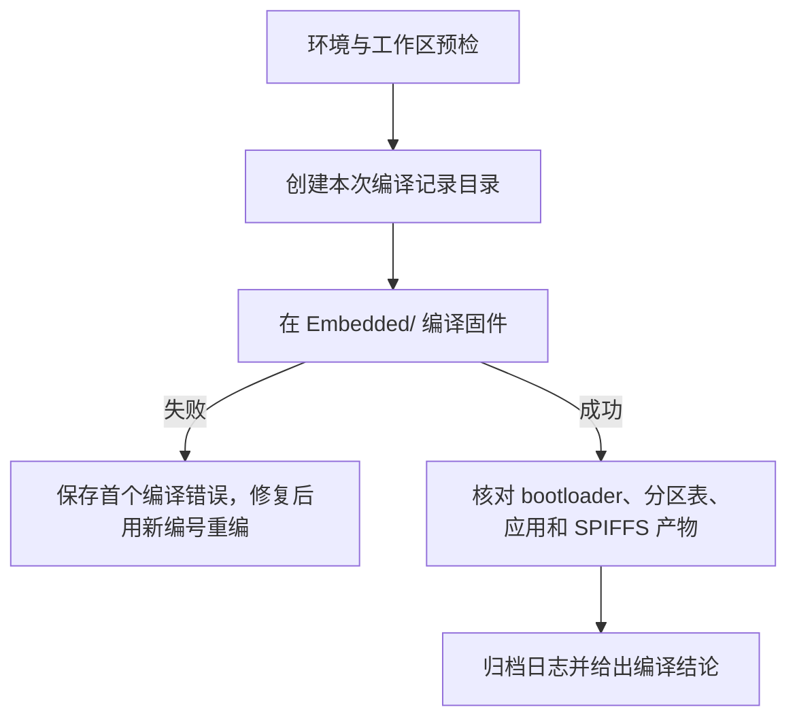

# macOS 本机 ESP32-S3 固件编译手册

> - 当前范围：只覆盖 macOS 上编译电子木鱼固件。本项目尚无样机，**不执行烧录、串口监控或真机动作**。
> - 工程：`/Users/hongchenke/Documents/Github/Electronic_Wooden_Fish/Embedded`
> - 框架：ESP-IDF `v5.5.4`（约束 `>=5.5.4,<5.6.0`）
> - 目标芯片：`esp32s3`
> - 主要读者：后续在本机运行、具备终端能力的模型或其他开发者

本文从 `legbot_watch` 的真机联调手册裁剪而来。烧录、监控、取证仍以日后样机到位后的 [`guides/真机闭环runbook-macos.md`](./guides/真机闭环runbook-macos.md) 为准，当前不得按那份文档对操作员下达接线或按键指令。

## 1. 文档目标

本手册用于在当前 macOS 环境中独立完成：

1. 核对仓库、ESP-IDF 版本和工程配置。
2. 在 `Embedded/` 编译完整固件。
3. 核对构建产物并保存编译日志。
4. 编译失败时定位最早错误，修复后重新完整构建。

成功标准是 `idf.py build` 返回 0，且第 7.1 节列出的产物存在。编译通过不等于样机验证通过，也不得据此宣称硬件已验收。

## 2. 当前本机事实锚点

| 项目 | 当前值 |
| --- | --- |
| 仓库根目录 | `/Users/hongchenke/Documents/Github/Electronic_Wooden_Fish` |
| ESP-IDF 工程目录 | `/Users/hongchenke/Documents/Github/Electronic_Wooden_Fish/Embedded` |
| ESP-IDF 激活脚本 | `/Users/hongchenke/.espressif/tools/activate_idf_7355072.sh` |
| ESP-IDF | `v5.5.4` |
| 目标芯片 | `esp32s3` |
| CMake 工程名 | `electronic_wooden_fish` |
| 应用产物 | `Embedded/build/electronic_wooden_fish.bin`、`Embedded/build/electronic_wooden_fish.elf` |
| Flash 配置（sdkconfig） | 16 MB、DIO、80 MHz |
| 分区表 | `Embedded/partitions.csv`：`factory @ 0x10000` 大小 `0x480000`，`spiffs @ 0x490000` 大小 `0x100000` |
| 编译记录目录 | `<仓库根>/docs/embedded/build_records/<运行编号>/` |

`idf.py` 必须在 `Embedded/` 执行，不能在仓库根目录执行。

当前 `Embedded/build/` 里若仍有 `legbot_watch.bin` / `legbot_watch.elf`，那是工程改名之前的旧产物，不能当作本次编译成功。重新配置并完整构建后，应以 `electronic_wooden_fish.*` 为准。

## 3. 安全边界

- 当前无样机：**禁止** `idf.py flash`、`app-flash`、`erase-flash`、`monitor`，也禁止猜测串口或要求操作员插线、按键、复位。
- 不因为工作区有未提交改动就执行 `git reset`、`git checkout --`、`git clean` 或覆盖文件。先记录 `git status --short`，已有改动默认属于用户。
- 不要为了“保险”常规执行 `idf.py set-target esp32s3`。`set-target` 会重新生成配置；只有目标确实错误且任务授权修改配置时才使用。
- 只有确认构建缓存损坏时才考虑 `idf.py fullclean`，因为它会删除整个 `Embedded/build/` 并显著增加重建时间。
- 不要在日志或回复中写出设备 Token、CA 私钥或其他凭据。
- 默认不要擅自提交编译记录。

## 4. 标准执行流程



每个阶段都是门禁：当前阶段未满足成功判据，不得进入下一阶段。

## 5. 创建本次编译记录

由 Shell 生成秒级运行编号，并把“目录必须不存在”作为唯一性门禁。以下整块应在同一次工具调用中执行：

```bash
EWF_PROJECT_ROOT=/Users/hongchenke/Documents/Github/Electronic_Wooden_Fish
EWF_FW_DIR="$EWF_PROJECT_ROOT/Embedded"
EWF_RECORDS_ROOT="$EWF_PROJECT_ROOT/docs/embedded/build_records"
EWF_RUN_ID=$(date '+%Y%m%d-%H%M%S')
EWF_RUN_DIR="$EWF_RECORDS_ROOT/$EWF_RUN_ID"

mkdir -p "$EWF_RECORDS_ROOT"
if [ -e "$EWF_RUN_DIR" ]; then
    printf '运行目录已存在，拒绝覆盖：%s\n' "$EWF_RUN_DIR" >&2
    exit 1
fi
mkdir "$EWF_RUN_DIR"
printf '本次运行编号：%s\n' "$EWF_RUN_ID"
cd "$EWF_FW_DIR"
```

必须从输出中保存真实运行编号。若目录碰撞，重新生成编号；不得把新结果写入已有运行目录。

多数终端工具的每次命令都会创建新的 Shell，上一条调用中的 `EWF_*` 变量和 ESP-IDF 环境不一定保留。每个独立调用都应在同一个 `cmd` 中重新声明所需变量并重新 `source` 激活脚本。不能因为上一条命令成功就假设下一条仍能读取这些变量。

建议每个独立调用使用以下前缀，并把 `REPLACE_WITH_RUN_ID` 换成本次真实值。紧随其后的 `test` 是防止漏替换的门禁：

```bash
EWF_PROJECT_ROOT=/Users/hongchenke/Documents/Github/Electronic_Wooden_Fish
EWF_FW_DIR="$EWF_PROJECT_ROOT/Embedded"
EWF_RECORDS_ROOT="$EWF_PROJECT_ROOT/docs/embedded/build_records"
EWF_IDF_ACTIVATE=/Users/hongchenke/.espressif/tools/activate_idf_7355072.sh
EWF_APP_NAME=electronic_wooden_fish
EWF_RUN_ID=REPLACE_WITH_RUN_ID
EWF_RUN_DIR="$EWF_RECORDS_ROOT/$EWF_RUN_ID"

test -d "$EWF_FW_DIR" || exit 1
test -d "$EWF_RUN_DIR" || exit 1
test -f "$EWF_IDF_ACTIVATE" || exit 1
cd "$EWF_FW_DIR"
source "$EWF_IDF_ACTIVATE"
```

建议每次编译最终保留：

```text
docs/embedded/build_records/<运行编号>/
├── environment.txt    # IDF、Git 和工程配置
├── build-01.log       # 第一次完整编译输出，重试时递增编号
└── session.md         # 编译结论与最早错误
```

`build-*.log` 由终端命令直接生成；`environment.txt` 和 `session.md` 根据真实输出编写，禁止凭记忆填写。提交 Git 前检查其中是否含有凭据或无关隐私。

## 6. 环境与工作区预检

### 6.1 激活唯一正确的 ESP-IDF 环境

每个新的 Shell 会话都要重新激活。不要假设上一条工具调用留下了环境变量。

```bash
EWF_IDF_ACTIVATE=/Users/hongchenke/.espressif/tools/activate_idf_7355072.sh

test -f "$EWF_IDF_ACTIVATE" || exit 1
source "$EWF_IDF_ACTIVATE"
idf.py --version
```

成功判据：

```text
ESP-IDF v5.5.4
```

如果版本不是 `v5.5.4`，停止编译。不要使用 `latest`、`stable` 或其他本地 IDF 安装继续尝试。

### 6.2 记录 Git 与工程配置

```bash
EWF_PROJECT_ROOT=/Users/hongchenke/Documents/Github/Electronic_Wooden_Fish
EWF_FW_DIR="$EWF_PROJECT_ROOT/Embedded"
EWF_RUN_ID=REPLACE_WITH_RUN_ID
EWF_RUN_DIR="$EWF_PROJECT_ROOT/docs/embedded/build_records/$EWF_RUN_ID"

test -d "$EWF_RUN_DIR" || exit 1
cd "$EWF_PROJECT_ROOT"

{
    printf 'git HEAD: '
    git rev-parse --short HEAD
    printf '\n'
    git status --short
    printf '\n--- sdkconfig ---\n'
    rg -n 'CONFIG_IDF_TARGET=|CONFIG_ESPTOOLPY_FLASHSIZE=|CONFIG_ESPTOOLPY_FLASHMODE=|CONFIG_ESPTOOLPY_FLASHFREQ=|CONFIG_ESPTOOLPY_MONITOR_BAUD=|CONFIG_ESP_CONSOLE_|CONFIG_USJ_' "$EWF_FW_DIR/sdkconfig"
} | tee "$EWF_RUN_DIR/environment.txt"
```

至少确认：

```text
CONFIG_IDF_TARGET="esp32s3"
CONFIG_ESPTOOLPY_FLASHSIZE="16MB"
CONFIG_ESPTOOLPY_FLASHMODE="dio"
CONFIG_ESPTOOLPY_FLASHFREQ="80m"
CONFIG_ESPTOOLPY_MONITOR_BAUD=115200
CONFIG_ESP_CONSOLE_USB_SERIAL_JTAG=y
CONFIG_ESP_CONSOLE_SECONDARY_NONE=y
CONFIG_USJ_NO_AUTO_LS_ON_CONNECTION=y
```

上述结果必须以本次 `environment.txt` 中的真实输出为准。

## 7. 编译固件

从 `Embedded/` 执行，并保存完整输出。使用 `pipefail` 确保即使通过 `tee` 留档，编译失败仍返回非零状态。每次尝试使用新编号；若目标日志已经存在则拒绝覆盖。

```bash
EWF_PROJECT_ROOT=/Users/hongchenke/Documents/Github/Electronic_Wooden_Fish
EWF_FW_DIR="$EWF_PROJECT_ROOT/Embedded"
EWF_IDF_ACTIVATE=/Users/hongchenke/.espressif/tools/activate_idf_7355072.sh
EWF_RUN_ID=REPLACE_WITH_RUN_ID
EWF_RUN_DIR="$EWF_PROJECT_ROOT/docs/embedded/build_records/$EWF_RUN_ID"
EWF_BUILD_ATTEMPT=01
EWF_BUILD_LOG="$EWF_RUN_DIR/build-$EWF_BUILD_ATTEMPT.log"

test -d "$EWF_FW_DIR" || exit 1
test -d "$EWF_RUN_DIR" || exit 1
test ! -e "$EWF_BUILD_LOG" || exit 1
cd "$EWF_FW_DIR"
source "$EWF_IDF_ACTIVATE"
set -o pipefail

idf.py build 2>&1 | tee "$EWF_BUILD_LOG"
```

正常增量构建不需要预先执行 `fullclean`。修改过 `CMakeLists.txt`、`sdkconfig.defaults`、`partitions.csv` 或 CMake `project()` 名称而缓存未自动更新时，可以先执行：

```bash
EWF_PROJECT_ROOT=/Users/hongchenke/Documents/Github/Electronic_Wooden_Fish
EWF_FW_DIR="$EWF_PROJECT_ROOT/Embedded"
EWF_IDF_ACTIVATE=/Users/hongchenke/.espressif/tools/activate_idf_7355072.sh
EWF_RUN_ID=REPLACE_WITH_RUN_ID
EWF_RUN_DIR="$EWF_PROJECT_ROOT/docs/embedded/build_records/$EWF_RUN_ID"
EWF_BUILD_ATTEMPT=02
EWF_BUILD_LOG="$EWF_RUN_DIR/build-$EWF_BUILD_ATTEMPT.log"

test -d "$EWF_FW_DIR" || exit 1
test -d "$EWF_RUN_DIR" || exit 1
test ! -e "$EWF_BUILD_LOG" || exit 1
cd "$EWF_FW_DIR"
source "$EWF_IDF_ACTIVATE"
set -o pipefail

{
    idf.py reconfigure || exit 1
    idf.py build
} 2>&1 | tee "$EWF_BUILD_LOG"
```

工程已从 `legbot_watch` 更名为 `electronic_wooden_fish`。若 `Embedded/build/` 仍只有旧名产物，必须走上述 `reconfigure` + `build`，不能把旧二进制当作本次成功。

### 7.1 编译成功判据

输出必须包含：

```text
Project build complete. To flash, run:
 idf.py flash
```

当前无样机，看到上述提示后**到此停止**，不要继续执行 `idf.py flash`。

同时确认以下文件存在：

```bash
EWF_PROJECT_ROOT=/Users/hongchenke/Documents/Github/Electronic_Wooden_Fish
EWF_FW_DIR="$EWF_PROJECT_ROOT/Embedded"
EWF_APP_NAME=electronic_wooden_fish
EWF_MISSING=0

for EWF_ARTIFACT in \
    build/bootloader/bootloader.bin \
    build/partition_table/partition-table.bin \
    "build/${EWF_APP_NAME}.bin" \
    "build/${EWF_APP_NAME}.elf" \
    build/spiffs.bin
do
    if [ -f "$EWF_FW_DIR/$EWF_ARTIFACT" ]; then
        printf 'OK      %s\n' "$EWF_ARTIFACT"
    else
        printf 'MISSING %s\n' "$EWF_ARTIFACT" >&2
        EWF_MISSING=1
    fi
done

test "$EWF_MISSING" -eq 0 || exit 1
```

`main/CMakeLists.txt` 会从 `Embedded/spiffs/` 生成 `build/spiffs.bin`，因此当前编译门禁包含该镜像。尺寸数字会随代码变化，不能用历史字节数做硬编码判断。真正的门禁是：

- `idf.py build` 返回 0。
- Bootloader 未超过其分区。
- `electronic_wooden_fish.bin` 未超过 `factory` 分区 `0x480000`。
- 上述五个产物全部存在，且应用产物使用新工程名。

### 7.2 编译失败时怎么做

不要只看最后一行 `ninja failed`。从本次失败尝试的日志中寻找第一个真实编译或链接错误；必须替换真实运行编号和尝试编号：

```bash
EWF_PROJECT_ROOT=/Users/hongchenke/Documents/Github/Electronic_Wooden_Fish
EWF_RUN_ID=REPLACE_WITH_RUN_ID
EWF_BUILD_ATTEMPT=REPLACE_WITH_ATTEMPT
EWF_BUILD_LOG="$EWF_PROJECT_ROOT/docs/embedded/build_records/$EWF_RUN_ID/build-$EWF_BUILD_ATTEMPT.log"

test -f "$EWF_BUILD_LOG" || exit 1
rg -n 'error:|fatal error:|undefined reference|FAILED:' "$EWF_BUILD_LOG"
```

记录最早错误、对应文件和行号。修复后使用新的尝试编号重新执行完整 `idf.py build`，不得截断或覆盖失败日志。

常见编译问题：

| 现象 | 首要检查 | 不应立即做的事 |
| --- | --- | --- |
| `idf.py: command not found` | 当前 Shell 是否重新 `source` 了激活脚本 | 改用其他 IDF 版本 |
| 版本不是 `v5.5.4` | 激活脚本路径是否为 `activate_idf_7355072.sh` | 使用 `latest` / `stable` |
| 在仓库根目录构建失败 | 工作目录是否为 `Embedded/` | 在根目录执行 `set-target` |
| 仍生成 `legbot_watch.bin` | `CMakeLists.txt` 的 `project()` 与是否已 `reconfigure` | 把旧产物改名冒充成功 |
| 缺 `spiffs.bin` | `Embedded/spiffs/` 是否存在，以及 `main/CMakeLists.txt` 的镜像规则 | 手工复制其他工程的镜像 |
| 中文乱码或 `□` | 源文件是否 UTF-8 无 BOM，以及字体合同 | 删字、改 ASCII 掩盖 |

## 8. 会话记录与结论

使用真实证据生成 `$EWF_RUN_DIR/session.md`：

```markdown
# 固件编译记录：<运行编号>

## 环境

- Git 提交：`<短 SHA>`
- 工作区状态：`<clean 或保留的改动列表>`
- ESP-IDF：`v5.5.4`
- 工程目录：`Embedded/`
- 应用产物：`electronic_wooden_fish.bin` / `.elf`

## 编译阶段

| 阶段 | 结果 | 证据 |
| --- | --- | --- |
| 预检 | 通过/失败 | `environment.txt` |
| 编译 | 通过/失败 | `build-<尝试编号>.log:<行号或关键输出>` |
| 产物核对 | 通过/失败 | bootloader / 分区表 / 应用 / SPIFFS |

## 问题与定位

- 最早异常：`<错误原文；无则写无>`
- 根因：`<证据支持的根因；未知时明确写未知>`

## 最终结论

- 结果：通过/失败
- 已验证：macOS 本机 `idf.py build`
- 未验证：烧录、启动、真机功能（当前无样机）
- 后续动作：`<列表>`
```

最终回复应优先给结论，并至少包含：

- 编译是否通过。
- 最关键的成功或失败日志原文。
- 编译记录的绝对路径。
- 工作区是否有未提交改动，且未擅自提交或清理。
- 明确写出：未做烧录和真机验证。

## 9. 一页式检查表

### 开始前

- [ ] 已进入 `/Users/hongchenke/Documents/Github/Electronic_Wooden_Fish/Embedded`
- [ ] 已记录仓库根的 `git status --short`
- [ ] 已激活 `/Users/hongchenke/.espressif/tools/activate_idf_7355072.sh`
- [ ] `idf.py --version` 为 `ESP-IDF v5.5.4`
- [ ] 已创建唯一运行编号和 `docs/embedded/build_records/<运行编号>/`

### 编译

- [ ] `idf.py build` 返回 0
- [ ] 输出包含 `Project build complete`
- [ ] `electronic_wooden_fish.bin` 与 `.elf` 存在
- [ ] `bootloader.bin`、`partition-table.bin`、`spiffs.bin` 存在
- [ ] 没有把旧的 `legbot_watch.*` 当作本次产物
- [ ] 没有执行 `flash` / `monitor`

### 结束时

- [ ] 已完成 `environment.txt` 和 `session.md`
- [ ] 已检查编译记录中没有凭据
- [ ] 已向操作员报告编译结论、日志路径和未覆盖项

## 10. 相关文档

- [AGENTS.md](../../AGENTS.md)：仓库级代理规则与 ESP-IDF v5.5.4 校验要求。
- [Embedded/AGENTS.md](../../Embedded/AGENTS.md)：固件目录内的编码、日志和 API 校验规则。
- [docs/embedded/README.md](./README.md)：设备侧文档索引。
- [guides/真机闭环runbook-macos.md](./guides/真机闭环runbook-macos.md)：样机到位后的烧录、监控与取证流程；**当前不要执行**。
