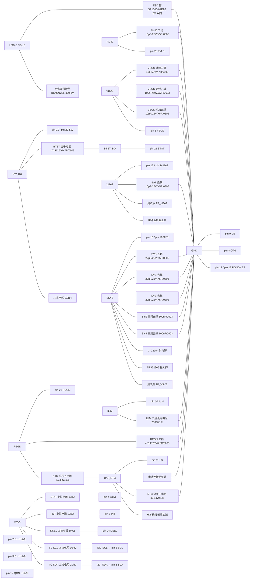

# BQ25895RTWR 外围电路设计与接线

> 最近核验：**通过**（覆盖 BQ25895 全部 25 个端点及其全部外围元件）
> 手册：`bq25895.pdf`，TI SLUSC88C Rev.C（2015-03，修订 2022-10，65 页），md5 `ecc4af97330af7bf2d7747a8502fac97`
> 收口日期：2026-09-17 ｜ 库存快照：`库存列表-20260913211039.xlsx`（2026-09-13 21:10:39）
> 事实源：[`电子木鱼-硬件原理图设计基线.md`](../电子木鱼-硬件原理图设计基线.md)、[`电子木鱼-硬件网络清单.json`](../电子木鱼-硬件网络清单.json)、[`电源网络命名规范.md`](../电源网络命名规范.md)
>
> 本版只覆盖**接线与手册核验**。ERC、PCB DRC、示波器、电子负载、热测试与样机测试均未执行。

本文档以**引脚号、网络名和功能位置**为索引。位号由嘉立创 EDA 在每次导出时生成，不写入本文档；查询「板上哪一颗是哪个」以 EDA 工程为准。

## 1. 依据与核验范围

### 1.1 依据

- **手册**：`docs/hardware/芯片手册/bq25895.pdf`，SLUSC88C Rev.C，65 页。本版用到第 4–5 页（脚表）、第 6 页（绝对最大额定值与推荐工作条件）、第 9–10 页（电气特性）、第 22–23 页（温度窗口与 Equation 2）、第 26 页（ILIM）、第 31–41 页（默认模式与 REG00–REG09）、第 49–50 页（典型应用与外围计算）、第 53 页（Figure 9-14）、第 55 页（布局）。
- **参考硬件**：TI《bq25890EVM, bq25892EVM, bq25895EVM, bq25896EVM and bq25895MEVM (PWR664)》SLUUBA2B（2015-03，修订 2015-11）。第 16–19 页原理图，第 21–29 页 BOM（Table 5–9）。
- **库存**：`库存列表-20260913211039.xlsx`，快照 2026-09-13 21:10:39。
- **嘉立创页面**：2026-09-17 实时核对（见第 4 节）。

### 1.2 核验范围

BQ25895（WQFN-24 + PowerPAD，25 个端点）的全部引脚，以及本板与之相连的全部外围元件：8 类陶瓷电容、7 个电阻、1 个功率电感、VBUS 输入保护（自恢复保险丝与 ESD 管）、电池连接器引脚。

### 未闭合事项

| 事项 | 类型 | 影响或阻塞 | 依据 / 方法 |
|---|---|---|---|
| 电池包内置 NTC 的 45°C 实测阻值或完整温阻曲线 | 外部确认 | TS 热端目前由 B=3435K 外推；补此点可把热端不确定度由约 ±0.35°C 压到约 ±0.1°C。不影响本版判定，见 §3.4 | 电池厂规格书，或万用表在 45°C 恒温下实测 |
| `REG00` 的 `EN_ILIM`（bit6）复位值 | 固件配合 | 手册第 32 页位图 bit6 = 0（禁用 ILIM 引脚），同页 Table 8-8 文字却写「1 – Enable (default: Enable ILIM pin (1))」，**手册自身矛盾**。该位决定 `ILIM` 引脚限流是否生效，固件必须显式写入并读回，不得依赖复位值 | 上电读取 `REG00` 并与写入值比对 |
| 上电阶段的实际充电参数 | 固件配合 | POR 阶段受芯片默认值支配（见 §3.6），主控目标值在主控未启动或掉电时不生效。电池允许值必须覆盖默认组合，或增加「默认禁止充电」的硬件控制 | 上电读回 `REG00`/`REG03`/`REG04`/`REG05`/`REG06` |
| `PMID` 去耦在工作电压下的有效容量 | 样机实测 | 手册口径为标称值（见 §3.3），标称 10µF 达标；实测有效值约 5.44µF，据此复算开关纹波与电容 RMS 纹波电流 | 示波器测 `PMID` 纹波；电容 RMS 按手册第 50 页式(7) |
| 功率电感温升 | 样机实测 | 最坏输入限流下峰值电流贴近原厂 MAX 列限值，需实测确认不超过 125°C | 热电偶或红外，满载充电 + 4G 发射 |
| 自恢复保险丝机内温升 | 样机实测 | 保持电流随温度降额，60°C 时与最坏输入限流无余量（见 §3.5） | 封闭外壳内满载充电实测温度 |
| 全部元件的耐压等级在本板中不可见 | 跨文档修改 | 本版按嘉立创页面实时核对的型号判定（见第 4 节）。更换料号时必须重新核对耐压与介质下限 | 嘉立创商品页，或 BOM 导出 |
| 布局要求 | 样机实测 | 手册第 55 页要求：`PMID` 电容贴近 pin 23 与 `PGND`；`SW` 双脚到电感输入走线最短；`VSYS` 电容贴近电感输出；模拟回流避开功率回流；PowerPAD 焊接并以导热过孔星形接地平面 | PCB 布线与实物检查 |
| ERC、PCB DRC 与样机级测试（示波器、电子负载、热测试、功能测试） | 样机实测 | 均未闭合 | EDA 工具与硬件基线 §6 |

## 2. 芯片逐脚接线和总接线图

### 2.1 逐脚表

| 脚号 | 名称 | 接法 | 状态 |
|---:|---|---|---|
| 1 | VBUS | 经自恢复保险丝接 USB-C VBUS；近端 1µF 去耦到 `GND`，另并 100nF 与 10µF 到 `GND` | 符合 |
| 2 | D+ | 不连接。本设计不接 USB 数据线，不使用 BC1.2 与 MaxCharge 检测 | NC |
| 3 | D− | 不连接，同 pin 2 | NC |
| 4 | STAT | 经 10kΩ 上拉到 `V3V3`；未接主控，也未接 LED | 符合 |
| 5 | SCL | 经 10kΩ 上拉到 `V3V3`，接 ESP32-S3 IO2；与 CW2015、CST9217、ES8311、QMI8658A 共享总线 | 符合 |
| 6 | SDA | 经 10kΩ 上拉到 `V3V3`，接 ESP32-S3 IO1；共享总线同上 | 符合 |
| 7 | INT | 经 10kΩ 上拉到 `V3V3`；未接主控 | 符合 |
| 8 | OTG | 接地。OTG 引脚为低电平，即使 `REG03.OTG_CONFIG` 复位值为 1 也不会进入升压模式（手册第 4 页与第 19 页均为「OTG pin HIGH **and** OTG_CONFIG = 1」的与条件） | 符合 |
| 9 | CE | 接地。手册第 4 页要求「CE pin must be pulled High or Low」，低电平即允许充电（需 `CHG_CONFIG = 1`） | 符合 |
| 10 | ILIM | 经 200Ω±1% 到 `GND`；`IINMAX = KILIM / RILIM`，见 §3.1 | 符合 |
| 11 | TS | 上臂 5.23kΩ±1% 接 `REGN`，下臂 30.1kΩ±1% 接 `GND`，电池包内置 NTC 与下臂并联；同时引出到电池连接器温敏端 | 符合 |
| 12 | QON | 不连接。引脚内部有上拉，未使用时允许留空；ship mode 与系统复位功能不使用 | NC |
| 13, 14 | BAT | 接电池正端与 10µF 到 `GND` | 符合 |
| 15, 16 | SYS | 接 22µF×3 与 100nF×2 到 `GND`；接 LTC2954 供电脚与 TPS22965 输入脚；接功率电感输出端 | 符合 |
| 17, 18 | PGND | 功率地 | 符合 |
| 19, 20 | SW | 双脚同网；接自举电容一端与功率电感输入端 | 符合 |
| 21 | BTST | 经 47nF 到 `SW_BQ`。**不接地** | 符合 |
| 22 | REGN | 4.7µF 到 `GND`；同时作为 TS 分压上臂的偏置源 | 符合 |
| 23 | PMID | 10µF 到 `GND` | 符合 |
| 24 | DSEL | 经 10kΩ 上拉到 `V3V3`。因 D+/D− 未使用，该引脚的复用切换功能实际无效 | 符合 |
| EP(25) | PowerPAD | 与 pin 17/18 同网 | 符合 |

### 2.2 总接线图



实线只表示电气连接，不表示电流方向；电容均为并联到 `GND` 的支路。`VBUS`、`VBAT`、`VSYS`、`PMID`、`SW_BQ` 五个节点不得在板级互相短接，电源路径由芯片内部 MOSFET 完成。

### 2.3 落图自查

- `PMID`、`REGN`、`SW_BQ`、`BTST_BQ` 是器件局部节点，不作为板级电源轨命名。
- 自举电容两端必须分别落在 `SW_BQ` 与 `BTST_BQ`；搜索「BTST 对 `GND` 有电容」应为 0 命中。
- `SW` 双脚必须同网；搜索「`SW` 单脚独立网络」应为 0 命中。
- `ILIM` 电阻另一端必须是 `GND`；搜索「`ILIM` 接 `V3V3`」应为 0 命中。
- EP 必须与 `PGND` 同网；搜索「EP 悬空」应为 0 命中。

## 3. 参数复算与选型

### 3.1 ILIM：输入限流而非充电电流

依据手册第 9 页 `KILIM` 与第 26 页式(3)：

```text
IINMAX = KILIM / RILIM
KILIM = 320 / 355 / 390 A·Ω（测试条件：ILIM 引脚限流 1.5A）
RILIM = 200Ω ±1% = 198…202Ω
典型 = 355 / 200 = 1.775A
含电阻偏差的范围 = 320/202 … 390/198 = 1.584 … 1.970A
电阻功耗 ≈ 0.8² / 200 = 3.2mW（100mW 额定）
```

手册第 4 页注明「输入限流低于 500mA 时不支持用该引脚设定」，1.775A 在允许区间内。`EN_ILIM` 被置 0 时该引脚限流与监测功能同时失效（第 26 页），此时限流完全由 `REG00.IINLIM` 寄存器决定——**固件不得关闭该位**。

### 3.2 功率电感

依据手册第 50 页式(5)、式(6)：

```text
D = VSYS / VBUS
ΔIL = VBUS × D × (1−D) / (fs × L)    fs = 1.5MHz，L = 2.2µH
D = 0.5 时 ΔIL = 5 × 0.25 / (1.5e6 × 2.2e-6) = 0.379A
峰值需求：IL_PEAK = I_SYS_FROM_BUCK + I_CHARGE + ΔIL/2
```

| 工况 | 平均电感电流 | 峰值 |
|---|---:|---:|
| 输入限流 1.5A（设计目标），系统负载 0 | 1.93A | 2.09A |
| 输入限流最坏 1.97A，系统负载 0 | 2.54A | 2.70A |

选型件 `FXLB252012-2R2-M`（2.2µH±20%，2.5×2.0×1.2mm，磁屏蔽）原厂参数：DCR 典型 68mΩ / 最大 82mΩ；温升电流典型 3.0A / 最大 2.7A（约 40°C 温升定义）；饱和电流典型 3.3A / 最大 3.0A（电感量下降约 30% 定义），全部以 25°C 为参考，器件总温不得超过 125°C。

按 MAX 列取判定：设计目标工况余量 28%（温升）/ 43%（饱和）；最坏输入限流工况峰值 2.70A 已贴到温升电流上限。DCR 铜损在 2.02A 时约 0.28…0.34W。**必须实测温升。**

2.2µH 的取值依据：手册 Figure 9-1（第 49 页）与 Figure 9-14（第 53 页）两张典型应用图均标注 2.2µH，bq25895EVM-664 的 BOM（SLUUBA2B Table 7）`L1` 也是 2.2µH。手册第 50 页 §9.2.2.3 正文出现的「1-µH」对应的是同系列其他型号——bq25890EVM / bq25892EVM / bq25896EVM 的 BOM（Table 5 / 6 / 9）`L1` 全部为 1µH。

### 3.3 电容

手册第 50 页明确要求介质为 X7R 或 X5R，并要求耐压高于输入电压（14V 以内输入建议 25V 以上）。

| 位置 | 手册要求 | 本设计 | 备注 |
|---|---|---|---|
| `VBUS` 近端 | 1µF 陶瓷，尽量贴近 IC | 1µF/50V/X7R/0805 | 另并 100nF 与 10µF 为附加支路，非强制组合 |
| `PMID` | 不用 OTG 时最小 8.2µF | 10µF/25V/X5R/0805 | 见下方口径说明 |
| `REGN` | 4.7µF，10V 耐压 | 4.7µF/25V/X5R/0603 | 兼作 TS 偏置源 |
| `BTST`–`SW` | 0.047µF 跨接 | 47nF/16V/X7R/0603 | 耐压针对两端差分电压 |
| `BAT` | 10µF 贴近引脚 | 10µF/25V/X5R/0805 | |
| `SYS` | 最小 20µF | 22µF×3 = 66µF 标称 | 另并 100nF×2 |

**「8.2µF」是标称值口径**，依据三条：

1. 手册第 49 页 Figure 9-1 把引脚表里 OTG 档的「40µF」直接画成原理图上的贴装容值；第 53 页 Figure 9-14 同样把「60µF」画上去。
2. 第 50 页 §9.2.2.3 的「最小 20µF」在 Figure 9-1 中由 10µF + 10µF 两颗实现。
3. TI 自家**非 OTG** 型号 EVM（bq25890EVM-664，SLUUBA2B Table 5 与第 16 页原理图）在 `PMID` 上把五颗电容全部 DNP，**实装只有一颗 10µF**。

SLUSC88C 全文没有 effective、derated、DC bias、voltage coefficient 任何字样。据此 `PMID` 的 10µF 标称值（±10% 最坏 9µF）满足 8.2µF，与 TI 的非 OTG 参考硬件一致。

三星官方直流偏压曲线显示该料在 5.0V、25°C 下有效容量约 5.44µF（0V 时 10.94µF 的 49.7%）。这不改变选型判定，但纹波与电容 RMS 纹波电流须按此复算：手册第 50 页式(7) `I_PMID = I_CHG × √(D(1−D))`，D≈0.75 时约 0.9A 量级；`SYS` 侧纹波 `ΔV ≈ ΔIL / (8 f Ceff)`，电容纹波电流 RMS 约 `ΔIL / (2√3)`。

### 3.4 TS 温度窗口

依据手册第 23 页 Equation 2 与 Figure 8-6、第 9 页阈值、第 22 页 §8.2.7.5.1。分压关系：

```text
VTS / VREGN = (NTC 分压下电阻 ∥ RNTC) / (NTC 分压上电阻 + NTC 分压下电阻 ∥ RNTC)
NTC 分压上电阻 = 5.23kΩ（REGN 臂），NTC 分压下电阻 = 30.1kΩ（GND 臂）
```

`NTC 分压上电阻 = 5.23kΩ` / `NTC 分压下电阻 = 30.1kΩ` 与手册第 23 页算出的 RT1 = 5.21kΩ / RT2 = 29.87kΩ 取同一组标准值，也与 bq25895EVM-664 的 BOM（SLUUAB2B Table 7，`R2` / `R3`）逐值相同。

代入手册给出的 103AT 参考阻值（0°C = 27.28kΩ、45°C = 4.91kΩ）：

| 温度 | V_TS / V_REGN | 阈值 |
|---|---:|---|
| 0°C | 73.235% | `V(LTF)` 73.25%（冷，上升沿封锁） |
| 25°C | 58.936% | — |
| 45°C | 44.664% | `V(TCO)` 44.75%（充电中热截止，下降沿） |

即本分压是对手册 0–45°C 参考设计的等值复刻，偏差不超过 0.09% V_REGN。

代入电池包内置 NTC（R25 = 10kΩ、B = 3435K，厂商表 0°C = 27.8kΩ 至 7°C = 20.55kΩ）：

| 边界 | 计算值 |
|---|---|
| 冷端（低于此禁止充电） | +0.4…+1.1°C（阈值带满打 0.0…+2.1°C） |
| 充电中热截止 | +44.5…+44.9°C（阈值带满打 +43.8…+45.2°C） |
| 热截止后允许重新启动 | +39.9°C（阈值带满打 +39.0…+40.4°C） |

热启动与热截止之间的约 5°C 回差来自手册 `V(HTF)` / `V(TCO)` 的分档，与分压取值无关。按手册第 22 页，电池温度高于 `V(HTF)`（约 40°C）时不会启动充电，这是芯片固有行为。

厂商表在 0–7°C 区间比两点式 β 公式系统性低 2.0…3.3%，用 0/7/25°C 三点拟合 Steinhart-Hart 后回代 8 个表值误差不超过 0.006°C，说明该表是自洽的真实曲线。热端（45°C）在用户提供的资料中没有实测点，上表热端数值为 β 模型外推。

### 3.5 VBUS 输入保护

`VBUS` 上限口径锁定为 **5V**。

| 器件 | 规格 | 对照 |
|---|---|---|
| 自恢复保险丝 BSMD1206-300-6V | 保持电流 3.00A、跳变电流 6.00A、额定电压 6V、初始电阻 10mΩ、跳变后 50mΩ、动作时间 4s@8A | 6V ≥ 5V，余量 20% |
| ESD 管 SP1005-01ETG | 双向、反向截止电压 6V、击穿电压 8.5V、钳位电压 15.6V、峰值脉冲电流 8A@8/20µs、结电容 30pF、SOD-882 | 截止电压 6V > 5V；钳位 15.6V 低于 BQ25895 的 `VBUS` 绝对最大额定值 22V（第 6 页） |

保险丝的温度降额（厂商承认书）：25°C 3.00A、40°C 2.50A、50°C 2.28A、60°C 2.00A、70°C 1.62A、85°C 1.38A。最坏输入限流 1.97A 在 50°C 尚余 16%，60°C 起归零。封闭木壳无风冷，须实测机内温升。

保险丝的跳变电流为 6.00A，高于 BQ25895 的输入上限 3.25A（第 6 页推荐工作条件），因此在合规 5V 电源下不会跳变，它是串联电阻与总故障兜底，不是过流保护器件。

### 3.6 I²C 上拉与上电配置

**I²C 上拉**：`I2C_SDA`、`I2C_SCL` 各 10kΩ 上拉到 `V3V3`，符合手册第 4 页对 SCL/SDA 的要求。总线由 ESP32-S3、BQ25895、CW2015、CST9217、ES8311、QMI8658A 六器共享，且经柔性排线引到面板。上升时间按 `tr ≈ 0.8473 × Rp × Cb` 估算，10kΩ 在 100kHz 标准模式（1µs）下允许总线电容约 118pF。首版按 100kHz 起步，总线电容与波形须实测；若需 400kHz，须先量测电容再决定是否减小上拉。

**上电（POR）阶段行为**（手册第 31–38 页）：

```text
REG00 = 0x08：EN_HIZ = 0（输入通路导通）；IINLIM = 500mA
REG03 = 0x3A：CHG_CONFIG = 1（允许充电）、OTG_CONFIG = 1、SYS_MIN = 3.5V
REG04 = 0x20：ICHG 目标 = 2048mA
REG05 = 0x13：IPRECHG = 128mA、ITERM = 256mA
REG06 = 0x5E：VREG = 4.208V、BATLOWV = 3.0V、VRECHG = 100mV
REG07 = 0x9D：EN_TERM = 1、EN_TIMER = 1、看门狗 40s
```

CE 接地使充电在 POR 阶段即被允许，因此**插上 USB 后、主控写寄存器之前，实际输入限流是 500mA**（系统轨低于 2.2V 时软启动阶段还会先降到 200mA），而 `ILIM` 引脚设定的 1.775A 在 `EN_ILIM` 被显式置 1 之前不生效。充电电流目标为 2048mA、终止电压 4.208V，实际受输入限流与 DPM 限制。

**固件必写清单**（写入后逐项读回）：

| 寄存器 | 字段 | 值 | 说明 |
|---|---|---|---|
| REG00 | `EN_HIZ` / `EN_ILIM` | 0 / 1 | 必须显式写入；`EN_ILIM` 复位值手册自相矛盾（见未闭合事项） |
| REG00 | `IINLIM` | 已确认输入源能力后设定 | 未识别输入源时不得盲设 1.5A 以上 |
| REG02 | `AUTO_DPDM_EN` / `FORCE_DPDM` | 0 / 0 | D+/D− 未接 USB |
| REG02 | `HVDCP_EN` / `MAXC_EN` | 0 / 0 | 不进行高压适配器握手 |
| REG03 | `CHG_CONFIG` | 按需 | 充电总开关 |
| REG03 | `OTG_CONFIG` | 0 | 硬件 OTG 引脚已接地，双保险 |
| REG04 | `ICHG` | 按电芯规格 | 64mA 步进 |
| REG05 | `IPRECHG` / `ITERM` | 按电芯规格 | 64mA 步进 |
| REG06 | `VREG` | 按电芯规格 | 3.840V + 16mV × 码；无精确 4.200V 档 |
| REG07 | `WATCHDOG` | 定期喂狗或显式关闭 | 手册第 31 页：看门狗超时会回到默认模式并复位除 `IINLIM`/`VINDPM`/`VINDPM_OS`/`BATFET_*` 之外的寄存器 |
| REG08 | `BAT_COMP` / `VCLAMP` | 保持 0 | 未测电池路径电阻前不启用 IR 补偿 |

`REG00` 的 `EN_ILIM` 与 `IINLIM` 复位值在手册第 32 页的位图与文字之间不一致，**不得依据复位值做设计**。

## 4. BOM 表

「用途」按功能位置填写；位号由嘉立创 EDA 生成，不在本文档固化。「可用库存快照」取自 `库存列表-20260913211039.xlsx`（2026-09-13 21:10:39），可用 = 在库 − 占用。嘉立创页面核对于 2026-09-17 完成，页面库存为时点数据。

| 用途 | 单板量 | 目标规格及型号 | 嘉立创编号 | 可用库存快照 | 嘉立创/库存 |
|---|---:|---|---|---|---|
| 充电主控 | 1 | BQ25895RTWR，WQFN-24-EP 4×4mm | [C80200](https://www.lcsc.com/product-detail/C80200.html) | 未检出 | 嘉立创采购 |
| 功率电感 | 1 | FXLB252012-2R2-M，2.2µH±20%，DCR≤82mΩ，2.5×2.0×1.2mm 磁屏蔽 | C3040393 | 可用 6（在库 8 − 占用 2） | 库存领用 |
| VBUS 输入保险丝 | 1 | BSMD1206-300-6V，6V/3A 保持 6A 跳变，1206 | C883136 | 未检出 | 嘉立创采购 |
| VBUS ESD 管 | 1 | SP1005-01ETG，双向 6V 截止，8A@8/20µs，SOD-882 | C126835 | 未检出 | 嘉立创采购 |
| VBUS 近端去耦 | 1 | CL21B105KBFNNNE，1µF±10%/50V/X7R/0805 | C28323 | 可用 44（在库 44 − 占用 0） | 库存领用 |
| VBUS 高频去耦 | 1 | 0603B104K500NT，100nF±10%/50V/X7R/0603 | C30926 | 可用 89（在库 94 − 占用 5） | 库存领用 |
| VBUS、PMID、BAT 去耦 | 3 | CL21A106KAYNNNE，10µF±10%/25V/X5R/0805 | C15850 | 可用 21（在库 26 − 占用 5） | 库存领用 |
| SYS 去耦 | 3 | CL21A226MAQNNNE，22µF±20%/25V/X5R/0805 | C45783 | 可用 2（在库 2 − 占用 0） | 嘉立创采购（缺口 1） |
| SYS 高频去耦 | 2 | 0603B104K500NT，100nF±10%/50V/X7R/0603 | C30926 | 见上行合计 | 库存领用 |
| REGN 去耦 | 1 | CL10A475KA8NQNC，4.7µF±10%/25V/X5R/0603 | C69335 | 可用 50（在库 50 − 占用 0） | 库存领用 |
| BTST 自举 | 1 | CC0603KRX7R7BB473，47nF±10%/16V/X7R/0603 | C115058 | 可用 50（在库 50 − 占用 0） | 库存领用 |
| ILIM 设定 | 1 | 0603WAF2000T5E，200Ω±1%/100mW/0603 | C8218 | 可用 50（在库 50 − 占用 0） | 库存领用 |
| STAT、INT、DSEL 上拉 | 3 | 0603WAF1002T5E，10kΩ±1%/100mW/0603 | C25804 | 可用 50（在库 50 − 占用 0） | 库存领用 |
| I²C 上拉 | 2 | 0603WAF1002T5E，10kΩ±1%/100mW/0603 | C25804 | 见上行合计 | 库存领用 |
| TS 上臂 | 1 | CRCW06035K23FKEA，5.23kΩ±1%/100mW/0603 | [C844180](https://www.lcsc.com/product-detail/C844180.html) | 未检出 | 嘉立创采购 |
| TS 下臂 | 1 | RC0603FR-0730K1L，30.1kΩ±1%/100mW/0603 | [C137745](https://www.lcsc.com/product-detail/C137745.html) | 未检出 | 嘉立创采购 |
| 电池内置 NTC | 主板 0 颗 | R25 = 10kΩ、B = 3435K，随电池包提供 | 不另购 | 用户确认电池内置 | 沿用电池接口 |

**逐行待办**

- 充电主控：下单前核对封装为 QFN-24-EP 4×4mm 与引脚/焊盘映射；采购编号 C80200 页面核于 2026-09-17，现货 146。
- 功率电感：EDA 属性中补写感值与型号，使原理图可自证；按 §3.2 实测温升。
- 保险丝、ESD 管、两颗 TS 电阻：库存表未检出，需采购；购买前复核封装与耐压。
- 各电容电阻：介质由型号命名规则判读（Samsung `CL21A`/`CL10A` 为 X5R、`CL21B` 为 X7R；风华 `0603B` 为 X7R；YAGEO `CC0603KX7R` 已在型号中标注），其中 10µF 与 22µF 两款已由嘉立创页面逐字核对为 X5R。更换料号时必须重新核对介质与耐压。
- 其余行：无。

**单板合计与全板同料合计**

BQ25895 单板用料：电流路径 2 件（主控、电感）＋输入保护 2 件＋电容 12 颗＋电阻 8 颗。

跨文档共用料号：

- `C45783`（22µF±20%/25V/X5R/0805）：本芯片需 **3 颗**（`SYS` 去耦），库存可用 **2 颗**，**缺 1 颗**。若再按 TLV62569 文档的计划给 `V3V3` 输出补两颗同料号，全板需 5 颗、缺 3 颗。
- `C15850`（10µF±10%/25V/X5R/0805）：全板 5 颗，可用 21 颗，满足。
- `C30926`（100nF±10%/50V/X7R/0603）：全板 11 颗，可用 89 颗，满足。
- `C25804`（10kΩ±1%/0603）：全板 9 颗，可用 50 颗，满足。
- `C3040393`（2.2µH）：全板 2 颗（本芯片与 TLV62569 各 1），可用 6 颗，满足。

**采购清单**

| 编号 | 型号 | 用途 |
|---|---|---|
| C80200 | BQ25895RTWR | 充电主控 |
| C883136 | BSMD1206-300-6V | VBUS 保险丝 |
| C126835 | SP1005-01ETG | VBUS ESD 管 |
| C844180 | CRCW06035K23FKEA | TS 上臂 |
| C137745 | RC0603FR-0730K1L | TS 下臂 |
| C45783 | CL21A226MAQNNNE | SYS 去耦，补 1 颗 |
