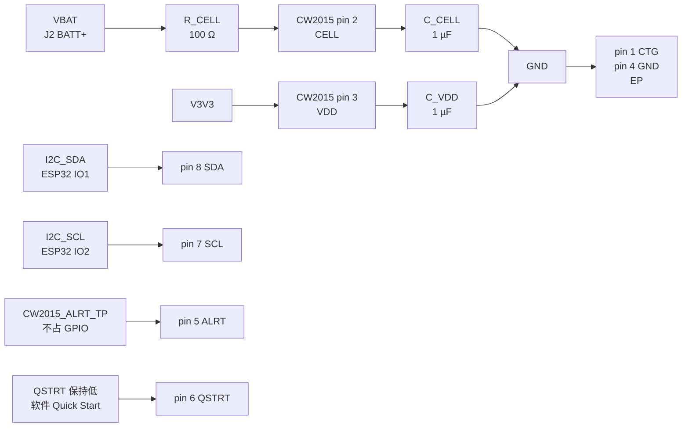

# CW2015CHBD 电量计外围电路设计与接线

> 文档状态：**设计已收口；ALRT 测试点已由用户确认加入 U7.5**。当前网表仍是修改前版本，ERC、PCB DRC 和样机验证未完成。\
> 数据手册：Cellwise `CW2015CHBD-DS V1.2/V1.3`，TDFN8（2 mm × 3 mm），工作温度 −20~70 °C。以随采购批次提供的最新版原厂 PDF 复核页码。\
> 项目事实源：[`电子木鱼-硬件原理图设计基线.md`](../电子木鱼-硬件原理图设计基线.md)、[`电子木鱼-硬件网络清单.json`](../电子木鱼-硬件网络清单.json)。

## 1. 设计边界

CW2015 采用**系统侧**接法，监测 `VBAT`，不串联采样电阻。两种电池作为替代候选，共用同一 3P 电池接口：

| 候选 | 容量 | 当前状态 |
|---|---:|---|
| 805080 | 4000 mAh | 候选，电芯曲线待确认 |
| 904260 | 3000 mAh | 候选，电芯曲线待确认 |

电池包资料显示：5 V CC/CV 输入、最大持续放电 3 A、过充检测约 4.275 V、过充恢复约 4.075 V、过放检测约 2.50 V、过放恢复约 2.90 V、过流检测约 2 A、保护 MOSFET 总导通电阻 ≤60 mΩ、工作温度 −40~+50 °C、储存温度 −40~+90 °C、尺寸约 12×3.6 mm。这些是**包级保护参数**，不等同于 CW2015 的电芯模型或 BQ25895 充电设定。

电池内置 NTC 记录为 `R25=10 kΩ`；β 值/温阻曲线未提供，BQ25895 TS 温度窗口仍待确认。

## 2. 芯片逐脚接线

| TDFN8 脚 | 名称 | 首版接法 | 状态 |
|---:|---|---|---|
| 1 | CTG | 接电池侧/系统模拟地；不得悬空 | 推荐初值 |
| 2 | CELL | 经 `R_CELL=100 Ω` 串联、`C_CELL=1 µF` 对地后接 `VBAT`；RC 靠近芯片 | 推荐初值，需按最新版 PDF 复核 |
| 3 | VDD | 接 `V3V3`，近端 `C_VDD=1 µF` 对地 | 推荐初值 |
| 4 | GND | 接地 | 已确认拓扑 |
| 5 | ALRT | `CW2015_ALRT_TP` 测试点；不接 ESP32 GPIO，软件轮询 SOC | **用户已确认加入；待重新导出网表核对** |
| 6 | QSTRT | 不新增 GPIO；保持低电平，软件通过 MODE 寄存器执行 Quick Start | 推荐初值 |
| 7 | SCL | `I2C_SCL` → ESP32 IO2 | 已冻结 |
| 8 | SDA | `I2C_SDA` → ESP32 IO1 | 已冻结 |
| EP | 裸露焊盘 | 按封装库连接 GND；若库定义无 EP 端点，需在 PCB/封装审查时确认 | 待封装核对 |

> 数据手册允许 CTG 接地，EP 可接 GND 或悬空；本项目优先接 GND，但必须确认嘉立创符号/封装的 EP 端点没有被网表遗漏。

## 3. 代码对应与软件建议

EWF 当前 `Embedded/` 仍为空，因此本节记录可迁移的真实代码接口，不宣称 EWF 已实现。代码蓝本来自 legbot_watch：

| 代码职责 | 蓝本文件/符号 | EWF 迁移要求 |
|---|---|---|
| 地址、寄存器常量 | `components/BSP/CW2015/cw2015_bsp.h/.c`：`CW2015_BSP_I2C_ADDRESS=0x62`、`CW2015_VCELL_REGISTER=0x02`、`CW2015_SOC_REGISTER=0x04`、`CW2015_MODE_REGISTER=0x0A` | 放入 EWF 自有 `Embedded/components/BSP/CW2015/`，由 BSP 持有 I²C 设备句柄 |
| 初始化 | `cw2015_bsp_init()`：探测 VERSION、退出休眠、Quick Start | 只能通过 EWF I2C0 manager 调用；不得让驱动独立创建总线 |
| SOC 读取 | `cw2015_bsp_read_soc(cw2015_bsp_soc_t *)`、`cw2015_bsp_decode_soc()` | 返回 `valid`、`percent`、`raw_soc`、稳定错误码；SOC 按 `1%/256` 解码并限制 0~100 |
| 连续自检 | `cw2015_bsp_read_continuous()`，固定 3 次样本 | 复用 power/self-test owner，不新增 battery task |
| 周期轮询 | `components/services/power_service/power_service.c`：`power_task` 内 CW2015 读取 | EWF 仅保留单一 power owner；失败保留最近有效值并记录错误 |
| Quick Start | `CW2015_MODE_REGISTER=0x0A`，唤醒 `0x00`，Quick Start `0x30`，等待约 1100 ms | 上电初始化软件触发；不占用 GPIO6/QSTRT |

这些路径是迁移参考，当前仓库没有对应实现文件；完成 E1 固件工程后再按 EWF C 编码规范重建并测试。

- 共享 `I2C0`，初始 100 kHz；7-bit 地址候选 `0x62`，必须上电扫描确认。
- 上拉电阻由共享 I²C 总线统一提供，不能为 CW2015 单独并联第二组上拉。
- 初始化顺序沿用 legbot_watch：探测版本寄存器 → 退出休眠 → 写 Quick Start → 等待约 1.1 s → 读取 SOC/电压。
- SOC 寄存器按数据手册的 16-bit MSB-first、`1%/256` 解码并限制到 0~100%。容量与电芯曲线配置必须在确定 805080 或 904260 实物后更新。
- `power_task` 以周期轮询为主；ALRT 不作为首版业务中断来源。

## 4. 首版 BOM（嘉立创代码与库存分列）

库存数据来源：`库存列表-20260913211039.xlsx`，查询快照时间为 2026-09-13 21:10:39。库存表中的“在库/占用/可用”只代表该快照，不代表后续库存保证。

| 项目 | 规格/MPN | **嘉立创代码（LCSC）** | 设计用量 | 库存状态 | 证据/动作 |
|---|---|---|---:|---|---|
| U13 | CW2015CHBD，TDFN8-EP 2×3 mm | **C881838** | 1 | **嘉立创采购** | 库存表无该型号；下单前核对封装、批次与数据手册 |
| R_CELL | `0603WAF1000T5E`，100 Ω ±1%，0603 | **C22775** | 1 | **库存可用** | 在库 100、占用 0、可用 100 |
| C_CELL | `CL10A105KP8NNNC`，1 µF ±10%，10 V，0603 | **C26413** | 1 | **库存可用** | 在库 241、占用 0、可用 241；需查 X5R/DC Bias |
| C_VDD | `CL10A105KP8NNNC`，1 µF ±10%，10 V，0603 | **C26413** | 1 | **库存可用** | 与 C_CELL 共用料号；总设计用量 2、可用 241 |
| I²C 上拉（共享） | `RC0603FR-074K7L`，4.7 kΩ ±1%，0603 | **C99782** | 0（本芯片新增） | **库存可用** | 在库 92、占用 1、可用 91；CW2015 不新增并联上拉 |
| 电池 | 805080/4000 mAh 或 904260/3000 mAh，单节受保护，内置 10 kΩ NTC | **无** | 1 | **外部采购/电池包候选** | 当前库存表无电池记录；需供应商规格书 |

### 4.1 嘉立创采购清单

本设计明确需要在嘉立创采购或核价的代码只有：

| 嘉立创代码 | 器件 | 采购原因 |
|---|---|---|
| **C881838** | CW2015CHBD | 库存表无该型号 |
| C22775 | 100 Ω 电阻 | 已有库存，可直接领用；此代码用于 BOM 归档 |
| C26413 | 1 µF 电容 | 已有库存，可直接领用；此代码用于 BOM 归档 |
| C99782 | 4.7 kΩ 上拉 | 已有库存，可直接领用；此代码用于 BOM 归档 |

## 5. 放置与验收顺序

1. 将 CW2015、`R_CELL`、`C_CELL` 靠近 `VBAT`/芯片放置，CELL 走线避开 TLV62569 SW、4G 和功放回流。
2. 确认 CTG、GND、EP 的地回流连续；ALRT 仅留测试点，不接未授权 GPIO。
3. 完成嘉立创原理图后导出同版本 PDF、BOM 和网表，核对实际位号、引脚与网络。
4. 通过 I²C 扫描、SOC/电压连续读取、充放电、低电量告警和温升测试关闭待验证项。

## 6. 收口结论与未闭合事项

### 已锁定设计

- 芯片：CW2015CHBD，TDFN8-EP，嘉立创代码 `C881838`。
- 实际原理图位号以网表为准；本次旧网表中为 `U7`。
- `VDD → V3V3`，`CELL → 100 Ω + 1 µF RC → VBAT`，`SCL/SDA → I2C_SCL/I2C_SDA`。
- `QSTRT → GND`，软件执行 Quick Start。
- `ALRT → CW2015_ALRT_TP`，不占用 ESP32 GPIO。
- 电池候选保留 805080/4000 mAh 与 904260/3000 mAh；均为单节受保护电池、内置 `R25=10 kΩ` NTC。

### 尚未形成证据闭环

- 两种电池的实际额定电压、放电曲线、保护板正式规格书和 NTC β 值。
- CW2015 容量/电芯曲线参数与目标 SOC 精度。
- `0x62` 地址、EP 网表端点、ALRT 测试点在**新网表**中的端点核对。
- ERC、PCB DRC、示波器、电子负载和样机验证均未完成。

完成嘉立创原理图后，可以提供清晰截图或原理图文件交给我审查。**强烈建议导出并提供网表文件**，同时附上同一版本的原理图 PDF/截图；若网表没有完整型号、耐压、封装或商品编号，请补充 BOM。我会逐项检查元件选型与接线是否符合设计预期，列出问题及具体修正，修改后可再导出文件复查。
