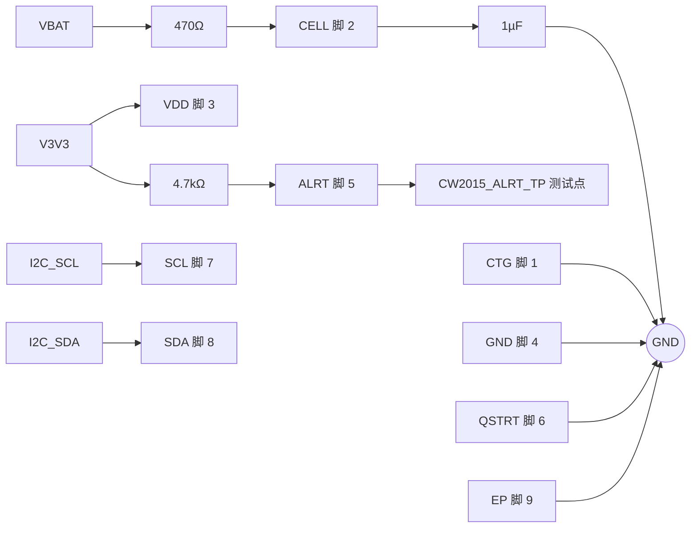

# CW2015CHBD 外围电路设计与接线

> 最近核验：通过
> 手册：`CW2015CHBD.pdf` CW2015CHBD-DS V1.2 md5 `0b62a7d0ff2d83f1a80e22032f7cab18`
> 收口日期：2026-09-17 ｜ 库存快照：`库存列表-20260913211039.xlsx`（2026-09-13）
> 事实源：[`电子木鱼-硬件原理图设计基线.md`](../电子木鱼-硬件原理图设计基线.md)、[`电子木鱼-硬件网络清单.json`](../电子木鱼-硬件网络清单.json)、[`电源网络命名规范.md`](../电源网络命名规范.md)

## 1. 依据与核验范围

**手册**（`CW2015CHBD.pdf`，CW2015CHBD-DS V1.2，md5 `0b62a7d0ff2d83f1a80e22032f7cab18`）用到以下页码：

- p.2 Figure 1（System Side）与 Figure 2（Pack Side）典型应用图：电池电压监测端经 470Ω 接电池正极并配 1.0µF 到地；电源端配 1.0µF；CTG 与 QSTRT 接地；ALRT 经 4.7kΩ 上拉。
- p.3 引脚配置与脚表：TDFN 2mm×3mm 顶视图（Pad Side Down），脚 1–8 加脚 9 裸露焊盘。
- p.4 绝对最大额定值；p.5 推荐工作条件与电气特性。
- p.7 首次 SOC 估算、Quick Start、Low SOC Alert、Sleep 模式。
- p.9 I²C 器件地址、CONFIG 与 MODE 寄存器。

**库存表**：`库存列表-20260913211039.xlsx`，快照 2026-09-13 21:10:39。

**本次核验范围**：CW2015CHBD 全部 9 个端点（脚 1–8 与脚 9 裸露焊盘），覆盖 9/9 脚。私有外围元件为电池电压监测端串联电阻、该端对地电容、ALRT 上拉电阻与 `CW2015_ALRT_TP` 测试点。`V3V3` 上的共享去耦与共享 I²C 总线上拉不属于本器件私有网络，按共享网络处理，不在本器件认领。

### 未闭合事项

| 事项 | 类型 | 影响或阻塞 | 依据 / 方法 |
|---|---|---|---|
| 电源端就近去耦归属 | 跨文档修改 | `V3V3` 为全板共享网络，共享网络无法区分每颗去耦电容的服务对象 | 布局阶段确认本器件电源脚旁有 1µF 量级去耦；手册 p.2 Figure 1 标 1.0µF |
| I²C 实际地址扫描 | 样机实测 | 手册地址固定 `0b1100010`，仍需上电扫描确认全板无冲突 | 手册 p.9；基线 HW-OI-007 |
| 电芯曲线与容量配置 | 外部确认 | 电池实物未定，容量与曲线参数无法写定，SOC 精度未闭环 | 电池供应商规格书 |
| 电池 NTC 温度窗口 | 外部确认 | 只有 R25=10kΩ，无 β 值，温度窗口无法判定 | 电池供应商规格书 |
| 低电量中断未接入主控 | 固件配合 | 本设计不使用 ALRT 中断，软件以周期轮询读取 SOC | 手册 p.7 Low SOC Alert |
| ERC | 样机实测 | 未跑 | 嘉立创 EDA |
| PCB DRC | 样机实测 | 未跑 | 嘉立创 EDA |
| 样机验证 | 样机实测 | SOC 精度、充放电、低电量告警、温升均未实测 | 示波器、电子负载、温升实测 |
| 热测试 | 样机实测 | 未做 | 实测 |

## 2. 芯片逐脚接线和总接线图

| 脚号 | 名称 | 接法 | 状态 |
|---:|---|---|---|
| 1 | CTG | GND | 符合 |
| 2 | CELL | 470Ω 串联至 `VBAT`；1µF 至 GND | 符合 |
| 3 | VDD | `V3V3` | 符合 |
| 4 | GND | GND | 符合 |
| 5 | ALRT | 4.7kΩ 上拉至 `V3V3`；`CW2015_ALRT_TP` 测试点 | 符合 |
| 6 | QSTRT | GND | 符合 |
| 7 | SCL | `I2C_SCL` | 符合 |
| 8 | SDA | `I2C_SDA` | 符合 |
| 9 | EP | GND | 符合 |

## 3. 参数复算与选型

| 项目 | 手册依据 | 代入与结果 | 选定标准值 |
|---|---|---|---|
| 电池电压监测端串联 | p.2 Figure 1 与 Figure 2 均标 470Ω；该端输入阻抗 RADIN≥10MΩ（p.5） | 470Ω 对 10MΩ 的分压误差约 0.005%，远小于手册 ±3% 总 SOC 误差（p.1） | 470Ω，0603 |
| 电池电压监测端对地电容 | p.2 Figure 1 标 1.0µF | 与 470Ω 构成低通，名义截止 1/(2π×470Ω×1µF)≈339Hz | 1µF，0603 |
| ALRT 上拉 | p.2 Figure 1 用 4.7kΩ 上拉；p.5 灌电流 4mA 时 VOL≤0.4V | 3.3V/4.7kΩ≈0.70mA，在 4mA 能力内 | 4.7kΩ，0603 |
| 电源端去耦 | p.2 Figure 1 标 1.0µF | 本设计电源端取自稳压后的 `V3V3`，去耦由共享网络承担，就近布置属布局门禁 | 共享网络承担 |

**工作点与边界**：电源端 3.3V 落在手册推荐 2.5~4.5V 内（p.5）；引脚绝对最大额定值 −0.3~6V（p.4），`VBAT` 最高 4.2V 未越界；ALRT 引脚耐压上限 +5.5V（p.5），上拉目标 3.3V 在范围内。I²C 7-bit 地址手册固定为 `0b1100010`（p.9），无地址配置脚。

**由选型决定的软件配置**：`MODE` 寄存器 0x0A 的 Quick Start 两位写 `11` 发起、唤醒写 `00`、POR 写 `1111`（p.9）。本设计 QSTRT 脚固定接 GND、不产生上升沿，因此 Quick Start 只能由 MODE 寄存器发起。`CONFIG` 寄存器 0x08 的 ATHD 为 5bit、LSB=1%、上电默认 3%（p.9）；本设计不接中断，该阈值不影响硬件。ALRT 标志只能由主机经 I²C 清零（p.7）。

**本设计的硬件边界**（非软件可改的默认行为）：电源端低于 2.5V 时芯片自动进入 Sleep（p.7），本设计电源端随 `V3V3` 掉电，掉电期间不计量；上电后芯片按「电池已静置 ≥0.5h」假定，用实测电压当开路电压反推首次 SOC，每次上电重新估算并在使用中校准（p.7）。

**固件接口对应**：地址与寄存器常量、初始化（探测版本寄存器→退出休眠→Quick Start→等待约 1.1s→读 SOC/电压）、SOC 按 16bit MSB-first 与 `1%/256` 解码并限制 0~100%、周期轮询读 SOC，均由设备侧 BSP 持有，共享 `I2C0` 单一仲裁，初始 100kHz。本仓库 `Embedded/` 尚无实现文件，完成固件工程后按 EWF C 编码规范重建。

## 4. BOM 表

| 用途 | 单板量 | 目标规格及型号 | 嘉立创编号 | 可用库存快照 | 嘉立创/库存 |
|---|---:|---|---|---|---|
| 电量计 | 1 | CW2015CHBD，TDFN8 2×3mm | C881838 | 未检出 | 嘉立创采购 |
| 电池电压监测端串联 | 1 | 0603WAF4700T5E，470Ω/0603 | C23179 | 可用 50（在库 50 − 占用 0，快照 2026-09-13） | 库存领用 |
| 电池电压监测端对地 | 1 | CL10A105KP8NNNC，1µF/0603 | C26413 | 可用 241（在库 241 − 占用 0，快照 2026-09-13） | 库存领用 |
| ALRT 上拉 | 1 | 0603WAF4701T5E，4.7kΩ/0603 | C23162 | 可用 41（在库 41 − 占用 0，快照 2026-09-13） | 库存领用 |
| I²C 上拉（共享） | 0（本芯片不新增） | 0603WAF1002T5E，10kΩ/0603 | C25804 | 见下方全板合计 | 库存领用 |
| 电池 | 1 | 805080/4000mAh 或 904260/3000mAh，单节受保护，内置 R25=10kΩ NTC | 未检出 | 未检出 | 外部采购 |

### 逐行待办

- 电量计：库存表未检出该料。编号 C881838 来自 [`电子木鱼-硬件网络清单.json`](../电子木鱼-硬件网络清单.json) 登记的嘉立创数据手册链接，下单前须在商品页复核封装与批次。
- 电池电压监测端串联、电池电压监测端对地、ALRT 上拉：无待办，电气核验已通过。
- I²C 上拉：本芯片不新增并联上拉；本行只登记全板共享总线的既有料号，用量不计入本器件。
- 电池：无供应商规格书，按外部采购处理。

### 单板合计与全板同料合计

- **C23179（470Ω/0603）**：本对象独用 1 颗，全板 1 颗，可用 50 颗，无缺口。
- **C23162（4.7kΩ/0603）**：本对象独用 1 颗，全板 1 颗，可用 41 颗，无缺口。本目录其他文档未登记该料号，不存在跨文档共料。
- **C26413（1µF/0603）**：本对象认领 1 颗。同料号其他认领为 ESP32-S3 文档 1 颗（EN 复位电容）与 WS2811 文档 1 颗（VDD 去耦）；最新本板中 0603 1µF 共 4 颗，第 4 颗落在共享 `V3V3` 网络，无法归属单一器件，不计入任何文档认领。全板合计 3 颗认领 + 1 颗共享，可用 241 颗，**无缺口**。
- **C25804（10kΩ/0603）**：本对象不新增。全板 9 颗（BQ25895 文档 5 颗、LTC2954 文档 1 颗、ESP32-S3 文档 2 颗、PVDF 前端文档 1 颗），可用 50 颗，无缺口。
- **C22775（100Ω/0603）**：本对象已不使用，不再认领。电池电压监测端串联电阻由前版 100Ω 改为手册推荐的 470Ω。

### 采购清单

- **C881838**（CW2015CHBD）：库存表未检出，嘉立创采购，下单前复核商品页。
- 电池：待选型，外部采购。
- 其余料号库存可直接领用，无需采购。
