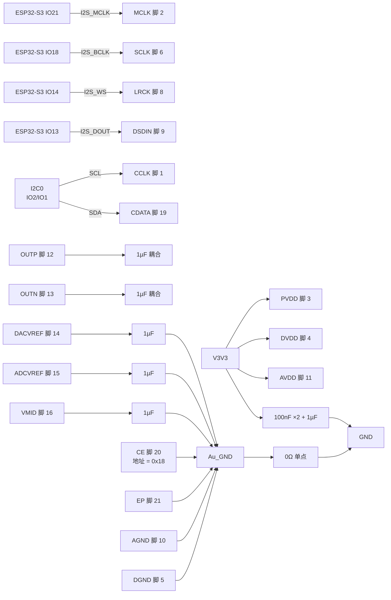

# ES8311 外围电路设计与接线

> 最近核验：**接线与手册核验通过**（2026-09-23）
> 手册：`ES8311.pdf`，Everest Semiconductor **ES8311 Rev 5.0**（2019-03，12 页）
> 收口日期：2026-09-23
> 事实源：嘉立创 EDA 工程实测（`Schematic1` 第 2 页「音频/传感模块」）、[`电子木鱼-硬件原理图设计基线.md`](../电子木鱼-硬件原理图设计基线.md) §5.3、[`电源网络命名规范.md`](../电源网络命名规范.md)、上述手册
>
> **ERC、PCB DRC、示波器、音频分析仪与样机测试仍未执行**；本文的「通过」指**接线与手册级参数核验通过**，不代表样机验证。
>
> **本版不写器件位号**，遵循 [`电子木鱼-硬件网络清单.json`](../电子木鱼-硬件网络清单.json) 的 `designator_policy`：位号由嘉立创 EDA 在每次导出时生成并在设计期持续重排，固化进文档即会过期。本文档以**引脚号、网络名和元件值**为索引；查询「板上哪一颗是哪个」以 EDA 工程为准。

## 1. 依据与核验范围

**手册**（`ES8311.pdf`，Everest ES8311 Rev 5.0，2019-03）用到以下页码：

- 第 1 页 FEATURES（低功耗 1.8–3.3 V、I²C 控制、I²S/PCM 主从、24-bit DAC/ADC）
- 第 2 页 §1 BLOCK DIAGRAM
- 第 3 页 §2 PIN OUT AND DESCRIPTION（20 脚定义与方向）
- 第 4 页 §3 TYPICAL APPLICATION CIRCUIT（去耦与耦合电容典型值，含「附加并联 0.1 µF / 加大 10 µF」注解）
- 第 5 页 **§5 MICRO-CONTROLLER CONFIGURATION INTERFACE**（**I²C 芯片地址构成**、最高 400 kbps）
- 第 6 页 Figure 1a / 1b（I²C 读写时序）
- 第 7 页 §6 DIGITAL AUDIO INTERFACE（I²S / 左对齐 / DSP-PCM 格式）
- 第 8 页 §7 ELECTRICAL CHARACTERISTICS —— ABSOLUTE MAXIMUM RATINGS、RECOMMENDED OPERATING CONDITIONS、ADC 特性
- 第 9 页 DAC 特性、**DC CHARACTERISTICS**（工作/掉电电流、数字电平）、SERIAL AUDIO PORT SWITCHING SPECIFICATIONS
- 第 10 页 串口时序图、I²C SWITCHING SPECIFICATIONS
- 第 11 页 §8 PACKAGE（QFN-20 3×3）

**本次核验范围**：ES8311（QFN-20-EP，3×3 mm，板上唯一 QFN-20 codec）的全部 21 个端点（脚 1–20 与脚 21 裸露焊盘），以及本板与之相连的全部外围元件 —— 三路供电去耦、`Au_GND` 模拟地、I²C 控制线、I²S 播放线、`OUTP`/`OUTN` AC 耦合与滤波网络、三路基准去耦。

**不在本文档范围**：I²S 四线在 ESP32-S3 侧的 GPIO 归属（属硬件基线 §2.1）；`V3V3` 网络本身的设计（属电源基线）；下游 `NS4150B` 的输入网络（属《NS4150B 外围电路设计与接线》）。

### 未闭合事项

| 事项 | 类型 | 影响或阻塞 | 依据 / 方法 |
|---|---|---|---|
| **AVDD 去耦少于手册典型** | 设计确认 | 手册第 4 页典型应用给 AVDD 配 `0.1 µF + 1 µF` 两颗；本设计在三路电源上共配 `100 nF ×2 + 1 µF ×1`，**AVDD 的 0.1 µF 并联位缺失**。手册注解允许「附加并联电容（典型 0.1 µF）」，且「更大容值（典型 10 µF）也有帮助」 | 见 §3；可在改板时于 AVDD 就近补 0.1 µF，并按注解评估是否加 10 µF |
| I²C 总线速率与总线电容 | 样机实测 | 手册第 5 页上限 400 kHz；全板共享 10 kΩ 上拉（本器件不新增），总线电容未实测 | 与《QMI8658A 外围电路设计与接线》同一未闭合项 |
| I²S 主从方向与时钟极性 | 样机实测 | 本设计 ESP32-S3 侧四线均为输出（主模式）；ES8311 侧须由固件寄存器设为从模式 | 示波器量 `MCLK`/`BCLK`/`LRCK` 相位 |
| I²S 线 22 pF 是否影响边沿 | 样机实测 | 手册典型应用**不含**该电容；`MCLK`/`BCLK`/`LRCK` 三线各装 22 pF 对地（基线原表述为「可预留 DNP」，实际**已装配**）。手册 MCLK 上限 51.2 MHz、SCLK 上限 26 MHz | 示波器量边沿与过冲 |
| 模拟地回流 | 样机实测 | `Au_GND` 经 0 Ω 单点回 `GND`，实际回流路径未验证 | 布局评审 + 底噪实测 |
| ERC / PCB DRC | 样机实测 | 未跑 | 嘉立创 EDA |
| 样机验证 | 样机实测 | 播放通路、底噪、增益、爆音、温升均未实测 | 示波器、音频分析仪、温升实测 |

## 2. 芯片逐脚接线和总接线图

引脚名与方向取自手册第 3 页 §2 PIN OUT AND DESCRIPTION。

| 脚号 | 名称 | 手册方向 | 接法 | 元件值 | 状态 |
|---:|---|---|---|---|---|
| 1 | CCLK | I, I/O, I（I²C 时钟） | `I2C_SCL`（共享 `I2C0`） | — | 符合 |
| 2 | MCLK | I（主时钟） | `I2S_MCLK` → ESP32-S3 IO21 | — | 符合 |
| 3 | PVDD | Analog（数字输入输出供电） | `V3V3` | 见脚 3/4/11 合计 | 符合 |
| 4 | DVDD | Analog（数字电源） | `V3V3` | 见脚 3/4/11 合计 | 符合 |
| 5 | DGND | Analog | `Au_GND` | — | 符合 |
| 6 | SCLK/DMIC_SCL | I/O（串行数据位时钟 / DMIC 位时钟） | `I2S_BCLK` → ESP32-S3 IO18 | — | 符合 |
| 7 | ASDOUT | O（ADC 串行数据输出） | 悬空（本设计不用录音） | — | NC |
| 8 | LRCK | I/O（帧时钟） | `I2S_WS` → ESP32-S3 IO14 | — | 符合 |
| 9 | DSDIN | I（DAC 串行数据输入） | `I2S_DOUT` → ESP32-S3 IO13 | — | 符合 |
| 10 | AGND | Analog | `Au_GND` | — | 符合 |
| 11 | AVDD | Analog（模拟电源） | `V3V3` | 三路合计：100 nF ×2 + 1 µF ×1 | 符合（AVDD 并联位见未闭合事项） |
| 12 | OUTP | O（差分模拟输出） | 经 1 µF AC 耦合至 `OUTP` 节点 | 1 µF | 符合 |
| 13 | OUTN | O（差分模拟输出） | 经 1 µF AC 耦合至 `OUTN` 节点 | 1 µF | 符合 |
| 14 | DACVREF | Analog（滤波电容连接） | 经 1 µF 至 `Au_GND` | 1 µF | 符合 |
| 15 | ADCVREF | Analog（滤波电容连接） | 经 1 µF 至 `Au_GND` | 1 µF | 符合 |
| 16 | VMID | Analog（滤波电容连接） | 经 1 µF 至 `Au_GND` | 1 µF | 符合 |
| 17 | MIC1N | I（麦克风输入） | 悬空（本设计不用麦克风） | — | NC |
| 18 | MIC1P/DMIC_SDA | I（麦克风输入） | 悬空（本设计不用麦克风） | — | NC |
| 19 | CDATA | I, I/O, I（I²C 数据） | `I2C_SDA`（共享 `I2C0`） | — | 符合 |
| 20 | CE | I（**地址选择**） | `Au_GND` → 芯片地址 `0x18` | — | **手册确认** |
| 21 | EP | — | `Au_GND` | — | 符合 |

`OUTP`/`OUTN` 节点上另有两颗 22 pF 对 `GND`，以及下游 `NS4150B` 的输入耦合网络。

`MIC1N`（17）、`MIC1P/DMIC_SDA`（18）、`ASDOUT`（7）三脚在本设计中无任何板上连接，为孤立节点，故图中不画连线。`Au_GND` 经一颗 0 Ω 电阻单点回 `GND`，使 ES8311 模拟地回流不经过 `NS4150B` 的扬声器功率回流。

## 3. 参数复算与选型

| 项目 | 手册依据 | 代入与结果 | 判定 |
|---|---|---|---|
| **I²C 芯片地址** | 第 5 页 §5：「The chip address must be **0011 00x**, where x equals CE」 | `CE`（脚 20）接 `Au_GND` → x = 0 → 7-bit 地址 = `0011 000` = **`0x18`**（8-bit 写 `0x30` / 读 `0x31`，由 7 位左移推导，非手册原文） | **符合，手册确认**（此前为推断值） |
| 模拟电源绝对最大 | 第 8 页 ABSOLUTE MAXIMUM：Analog Supply Voltage Level **-0.3 ~ +3.6 V** | `V3V3` = 3.3 V | **符合** |
| 数字电源绝对最大 | 同上：Digital Supply Voltage Level **-0.3 ~ +3.6 V** | `V3V3` = 3.3 V | **符合** |
| 推荐工作条件 | 第 8 页 RECOMMENDED：DVDD `1.6/3.3/3.6`、PVDD `1.6/3.3/3.6`、AVDD `1.7/3.3/3.6` V | 三路均 3.3 V | **符合**（三路都取推荐典型值） |
| 数字输入高电平 | 第 9 页 DC：Input High-level Voltage **0.7 × PVDD** | PVDD = 3.3 V → V_IH ≥ 2.31 V；ESP32-S3 输出 3.3 V | **符合** |
| I²C 速率 | 第 5 页：最高 **400 kbps**；第 10 页 I²C SWITCHING SPECIFICATIONS 同 | 全板初始 100 kHz（CW2015 文档 §3 记录） | **符合**，有余量 |
| MCLK 上限 | 第 9 页：MCLK frequency 最高 **51.2 MHz**；LRCK 最高 200 kHz；SCLK 最高 26 MHz | 由 ESP32-S3 I²S 主模式产生，须在范围内 | 固件配置项 |
| 工作/掉电电流 | 第 9 页 DC：Normal Operation `8 mA`（DVDD=1.8, PVDD=1.8, AVDD=3.3）；Power Down `0 µA` | 用于 SM-7 续航预算 | — |
| 供电去耦（PVDD/DVDD/AVDD） | 第 4 页典型应用：PVDD 与 DVDD 各 `0.1 µF`，AVDD `0.1 µF + 1 µF` | 本设计共 `100 nF ×2 + 1 µF ×1` | **基本符合，AVDD 缺一颗并联 0.1 µF** |
| VMID / ADCVREF / DACVREF | 第 4 页典型应用：各 `1 µF` | 各 1 µF 至 `Au_GND` | **符合**（手册明文值） |
| `OUTP`/`OUTN` AC 耦合 | 第 4 页典型应用：各 `1 µF` | 各 1 µF | **符合**（手册明文值） |
| 附加滤波电容 | 第 4 页注解：「Additional parallel capacitors (typically 0.1 µF) can be used. **Larger value capacitors (typically 10 µF) would also help.**」 | 本设计无 10 µF 级电容 | **建议项**：可为三路电源各加 10 µF |
| I²S 线 22 pF | 手册典型应用**不含**该电容 | `MCLK`/`BCLK`/`LRCK` 各 22 pF 对 `GND`（基线原写「可预留 DNP」，实际已装配） | **超出手册典型**，列为样机实测项 |
| 供电域 | 基线 §3.2.1：「ES8311 的 AVDD/DVDD/PVDD 接 V3V3，不得与功放共 V3V3_A」；手册绝对最大 3.6 V | 三路电源脚均接 `V3V3`；`V3V3_A` 网络上**无** ES8311 端点 | **符合**（`VMAIN`/`VSYS` 最高 4.2 V，会越绝对最大，本设计未接） |
| I²C 上拉 | 手册未规定外接上拉值 | 本器件**不新增**并联上拉；全板共享 **10 kΩ** | 全板取值见《QMI8658A 外围电路设计与接线》§3 |

**工作点与边界**：三路电源脚均为 `V3V3` = 3.3 V，落在手册推荐工作区间（DVDD/PVDD 1.6–3.6、AVDD 1.7–3.6）的中部。手册绝对最大 3.6 V 意味着 ES8311 **不得**接 `VMAIN`（3.5–4.2 V）或 `VSYS`；本设计未接。`V3V3_A` 网络上无 ES8311 端点，功放脉冲不污染 codec 供电。

**由选型决定的软件配置**：

- I²C 7-bit 地址 **`0x18`**（手册第 5 页由 `CE` 引脚电平决定，本设计 `CE` 接 `GND`）。若经中间层驱动（如 `esp_codec_dev` 一类内部做移位的封装），须按其约定确认传 7 位还是已左移的 8 位形式，避免地址被二次移位。I²C 时钟上限 400 kHz。
- I²S 方向上，ESP32-S3 侧 `MCLK`/`BCLK`/`LRCK`/`DOUT` 四线**全部为输出**，即主控为主模式；ES8311 须配置为 I²S 从模式（手册第 5 页：从模式下 LRCK 与 SCLK 须由系统时钟同步派生）。数据格式按手册第 7 页图 2a 的 I²S 标准格式，DAC 输入 `DSDIN` 在 `SCLK` 上升沿采样。
- `MIC1N`/`MIC1P`/`ASDOUT` 悬空，固件**不得**使能 ADC 与 DMIC 通路；基线 §0 已明确「ES8311 ADC 回传不连接，本项目只有木鱼音播放」。
- 无需配置地址相关寄存器 —— 地址由 `CE` 引脚电平硬决定，运行期不可改。
- 待机优化：手册第 9 页给出 Power Down 模式电流 `0 µA`，可配合 SM-7 续航策略使用。

## 4. BOM 表

| 用途 | 单板量 | 目标规格及型号 | 嘉立创编号 | 说明 |
|---|---:|---|---|---|
| 音频 codec | 1 | ES8311，QFN-20-EP 3×3 mm | C962342 | 手册第 11 页封装图核对一致 |
| 供电去耦（`V3V3`） | 3 | 100 nF ×2 + 1 µF ×1，0603 | 见下方合计 | 与全板共享 `V3V3` 网络，无法单一归属；AVDD 并联位见未闭合事项 |
| 基准去耦（VMID/ADCVREF/DACVREF） | 3 | 1 µF，0603 | C26413 | 与 CW2015／ESP32-S3／WS2811／M100 文档共料 |
| `OUTP`/`OUTN` AC 耦合 | 2 | 1 µF，0603 | C26413 | 同上 |
| 输出与 I²S 线 22 pF | 7 | 22 pF，0603 | 待核 | 手册典型应用不含；实际已装配 |
| I²C 上拉（共享） | 0 | 本器件不新增，全板共用一组 | C25804 | 10 kΩ；见《QMI8658A 外围电路设计与接线》§4 |
| `Au_GND` 单点接地 | 1 | 0 Ω，0603 | 待核 | 与全板 0 Ω 同料 |

### 逐行待办

- **ES8311（C962342）**：接线、地址、供电范围已按手册核验通过；下单前仍需复核商品页库存与封装。
- **AVDD 并联 0.1 µF 与 10 µF 级电容**：手册建议项，本板未设；是否为改板项由设计方决定（见未闭合事项）。
- **22 pF 七颗**：手册典型应用不含，实际全部装配，须复核是否与 I²S 边沿要求冲突（见未闭合事项）。
- **1 µF（C26413）**：本器件认领 5 颗。同料号其他认领为 CW2015 文档 1 颗、ESP32-S3 文档 1 颗、WS2811 文档 1 颗、M100EG-C2 文档 1 颗；本板 0603 1 µF 的其余实例落在共享 `V3V3` 网络，无法归属单一器件，不计入任何文档认领。库存可用 241 颗，**无缺口**。
- **100 nF**：与全板共享 `V3V3` 去耦同料，不单独认领。

### 采购清单

- **ES8311（C962342）**：下单前复核商品页库存与封装。
- 其余料号可从库存领用；22 pF 与 0 Ω 的嘉立创编号待核。

---

**维护提示**：本文件顶部「最近核验」为 **接线与手册核验通过**，**不是**样机「已验证」。原理图若对 ES8311 或其外围做出任何改动，须在顶部插入失效标记并重新核验。
