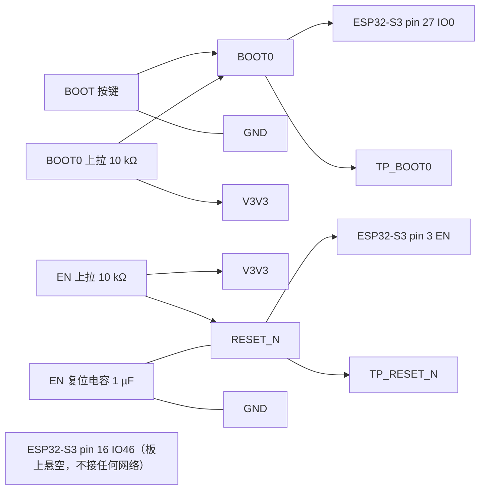

# ESP32-S3 复位与启动控制设计

> 最近核验：**通过**（覆盖 ESP32-S3 的复位脚 EN 与启动绑带 IO0、IO46 三脚，及其在 `RESET_N`、`BOOT0` 两个网络上的全部外围元件）
> 手册：`C2913201_WIFI模块_ESP32-S3-WROOM-1-N8R8_规格书_WIFI模块_ESP32-S3-WROOM-1U-N8R8_英文规格书.PDF`，ESP32-S3-WROOM-1 & WROOM-1U 技术规格书 v1.3，md5 `6704f2d0ea7e3cf8dbfed0cb05c72b15`
> 收口日期：2026-09-18 ｜ 库存快照：`库存列表-20260913211039.xlsx`（2026-09-13）
> 事实源：[`电子木鱼-硬件原理图设计基线.md`](../电子木鱼-硬件原理图设计基线.md)、[`电源网络命名规范.md`](../电源网络命名规范.md)、[`LTC2954ITS8-1外围电路设计与接线.md`](LTC2954ITS8-1外围电路设计与接线.md)

## 1. 依据与核验范围

**手册**（`C2913201_WIFI模块_ESP32-S3-WROOM-1-N8R8_规格书_WIFI模块_ESP32-S3-WROOM-1U-N8R8_英文规格书.PDF`，ESP32-S3-WROOM-1 & WROOM-1U 技术规格书 **v1.3**（2023-11-24），38 页，md5 `6704f2d0ea7e3cf8dbfed0cb05c72b15`）用到以下页码：

- p.10–11 表 3 管脚定义：pin 3 `EN`（高电平芯片使能、低电平关闭，**注意不能让 EN 管脚浮空**）、pin 16 `IO46`、pin 27 `IO0`、pin 1/40/41 GND
- p.13 §3.3 Strapping 管脚与表 4：GPIO0 默认上拉、值 1；GPIO46 默认下拉、值 0
- p.13 表 5 与图 4：Strapping 管脚时序参数（建立时间 `tSU` ≥ 0 ms、保持时间 `tH` ≥ 3 ms）
- p.13 表 6 与 §3.3.1：芯片启动模式控制与 Joint Download Boot 支持的下载通道
- p.16–17 表 11 直流电气特性：内部弱上拉/下拉典型 45 kΩ、`VIH_nRST` ≥ 0.75 × VDD、`VIL_nRST` ≤ 0.25 × VDD
- p.28 §6 外围设计原理图与图 7：**EN 管脚处需要增加 RC 延迟电路，RC 通常建议为 R = 10 kΩ、C = 1 µF**

**库存表**：`库存列表-20260913211039.xlsx`，快照 2026-09-13 21:10:39。

**本次核验范围**：本对象是 ESP32-S3-WROOM-1 模组的复位（EN）与启动绑带（IO0、IO46）及其外围，**不是模组的全部 41 个引脚**。核验覆盖：

- pin 3 `EN`（`RESET_N` 网络）
- pin 27 `IO0`（`BOOT0` 网络）
- pin 16 `IO46`（板上悬空）
- `RESET_N` 与 `BOOT0` 两个网络上的**全部外围元件**：EN 上拉电阻、EN 复位电容、`BOOT0` 上拉电阻、BOOT 按键、测试点 `TP_RESET_N` 与 `TP_BOOT0`
- 模组的电源、地及其余 IO 不属于本对象，见各自文档

**本文档不含按键控制器**：PWR 按键的检测、开关机与按键状态输出已随换型移交《[LTC2954ITS8-1外围电路设计与接线.md](LTC2954ITS8-1外围电路设计与接线.md)》。本文只讲 ESP32-S3 自身的复位与启动。复位与启动口径已于 2026-09-17 锁定；原理图 ERC、PCB DRC 与样机时序仍未完成，见下方未闭合事项。本版状态为**接线已核验**；须完成同版 BOM、ERC、PCB DRC 与样机测试后，才能标记为「已验证」。

### 未闭合事项

| 事项 | 类型 | 影响或阻塞 | 依据 / 方法 |
|---|---|---|---|
| 联合下载组合（GPIO0 = 0 且 GPIO46 = 0） | 样机实测 | 实测通过前不得宣称下载模式通过 | 手册 v1.3 p.13 表 6；按「先按住 BOOT 再上电」实测进入 Joint Download Boot |
| **BOOT 按键四脚分组方式（高优先级）** | 样机实测 | 本型号 `TS-1093B-A13B3-D2` 为 4 脚轻触开关，内部是**两组独立触点**：**松开**时组内常通、两组之间断开；**按下**时四脚全通。分组方式按封装而异，**插件式多为对角（1↔3、2↔4）**、贴片式多为相邻（1↔2、3↔4）。本设计取 **pin 1 接 `GND`、pin 2 接 `BOOT0`**，即**跨越两组**的接法 —— 在**对角分组**前提下正确；**若实物实为相邻分组（1↔2 常通），则 `BOOT0` 被永久拉低，主控无法进入正常启动**。⚠️ **绝不可按「pin 1 接 `BOOT0`、pin 3 接 `GND`」接线**：那会让常通的 1↔3 直接短接 `BOOT0` 与 `GND` | 断电用万用表通断档实测：**松开**时测 pin 1–3（对角分组应导通）与 pin 1–2（对角分组应断开）；**按下**时测四脚应两两导通。PWR 按键（同料号）须同样实测 |
| EN RC 与 `V3V3` 上电时序的配合 | 样机实测 | 手册把 R = 10 kΩ、C = 1 µF 列为「通常建议」，并明写具体数值需按模组电源上电时序与芯片上电复位时序调整；本板 `V3V3` 建立时间未测 | 手册 v1.3 p.28 §6；示波器同测 `V3V3` 与 `RESET_N`；必要时索取《ESP32-S3 系列芯片技术规格书》§电源的上电复位时序图 |
| 独立 EN 复位验证 | 样机实测 | 拉低 `TP_RESET_N` 后主控复位、松开后正常启动，且不依赖任何按键状态 | 手动拉低 `TP_RESET_N`，示波器测 `EN` 与启动日志 |
| 原理图 ERC、PCB DRC | 样机实测 | 下游门禁未闭合 | 嘉立创 EDA |
| ~~原理图网络名 `RESET` 与正式网络名 `RESET_N` 不一致~~ **（2026-09-23 已关闭）** | 已完成 | 测试点 `TP_RESET_N` 按《电源网络命名规范》§4「`TP_` + 正式网络名」反推正式网络名应为 `RESET_N`，当版原理图的网络名原为 `RESET`，落图/固件/PCB 会出现两个名字 | 已在嘉立创 EDA 把该网络的两根导线及其 `Name` 标签**一并**改名为 `RESET_N`；重新导出原理图与网表后本行可整行移除 |

## 2. 芯片逐脚接线和总接线图

脚号按手册 v1.3 p.10–11 表 3 的模组脚序。本对象只涉及下列三脚。

| 脚号 | 名称 | 接法 | 状态 |
|---:|---|---|---|
| 3 | EN | `RESET_N`：10 kΩ 上拉至 `V3V3`；1 µF 至 GND；测试点 `TP_RESET_N` | 符合 |
| 16 | IO46 | 悬空，不接任何网络（启动绑带默认值由模组内部弱下拉给出 0） | NC |
| 27 | IO0 | `BOOT0`：10 kΩ 上拉至 `V3V3`；BOOT 按键跨接至 GND（按键 **pin 1 接 `GND`、pin 2 接 `BOOT0`**，pin 3 与 pin 4 悬空）；测试点 `TP_BOOT0` | 符合 |

EN 与 `BOOT0` 之间没有直连：EN 只由自身的 RC 网络复位，BOOT 按键只作用于 IO0。两者是独立的输入，进下载模式靠「按住 BOOT 再上电」的时序组合，见第 3 节。

## 3. 参数复算与选型

### 3.1 EN 复位 RC

手册 v1.3 p.28 §6 要求 EN 管脚处增加 RC 延迟电路，并给出「通常建议 R = 10 kΩ、C = 1 µF」，同时说明具体数值需按模组电源的上电时序与芯片的上电复位时序调整。

| 项 | 手册依据 | 代入 | 结果 | 选定值 |
|---|---|---|---|---|
| EN 上拉电阻 | 10 kΩ（p.28 §6）；p.10 表 3 要求 EN 不得浮空 | — | 上电前把 `EN` 稳定拉到 `V3V3` | 0603WAF1002T5E，10kΩ/0603 |
| EN 复位电容 | 1 µF（p.28 §6） | τ = RC = 10 kΩ × 1 µF | τ = 10 ms | CL10A105KP8NNNC，1µF/0603 |
| EN 越过复位释放阈值的时间 | `VIH_nRST` ≥ 0.75 × VDD（p.16 表 11） | t = −RC × ln(1 − 0.75) = −10 ms × ln 0.25 | ≈ 13.9 ms | 同上 |

即上电后约 14 ms，`RESET_N` 才越过 0.75 × VDD 的复位释放阈值；这段时间内芯片保持复位，等 `V3V3` 建立。手册只给出典型建议值，与 `V3V3` 实际上电斜率的配合见第 1 节未闭合事项。

### 3.2 电平与边界

| 项 | 手册限制 | 本设计 | 判定 |
|---|---|---|---|
| EN 复位释放电平 | `VIH_nRST` 0.75 × VDD ~ VDD + 0.3 V（p.16 表 11） | `V3V3` 上拉 = 3.3 V（VDD = 3.3 V 域），区间 2.475 ~ 3.6 V，取值在区间中部 | 符合 |
| EN 复位有效电平 | `VIL_nRST` −0.3 ~ 0.25 × VDD V（p.17 表 11） | 上电瞬间电容未充电为 0 V；稳态不被拉低 | 符合 |
| EN 不得浮空 | p.10 表 3 | 10 kΩ 上拉常驻 | 符合 |
| `BOOT0`（IO0）高电平 | GPIO0 默认上拉、值 1（p.13 表 4） | 10 kΩ 上拉至 `V3V3` = 3.3 V，复位采样窗口取 1 | 符合 |
| `BOOT0`（IO0）低电平 | 联合下载要求 GPIO0 = 0（p.13 表 6） | BOOT 按键按下接 GND = 0 V | 符合 |
| `IO46` 复位电平 | 默认下拉、值 0（p.13 表 4）；内部弱下拉典型 45 kΩ（p.16 表 11） | 板上悬空，复位采样窗口取 0 | 符合 |

### 3.3 启动绑带与下载模式

ESP32-S3 的启动模式由 GPIO0 与 GPIO46 在复位释放时共同决定（手册 v1.3 p.13 表 6）：

| 启动模式 | GPIO0 | GPIO46 |
| --- | --- | --- |
| SPI Boot（默认） | 1 | 任意值 |
| Joint Download Boot | 0 | 0 |

两个绑带脚的取值来源：

- **GPIO0**：BOOT 按键按下时接地给 0；松开时由 10 kΩ 上拉电阻至 `V3V3` 给 1。
- **GPIO46**：**板上悬空**。手册 p.13 表 4 给出 GPIO46 的默认配置为下拉、值 0，复位采样窗口靠内部弱下拉给出 0。

**IO46 为什么必须悬空**：它是 strapping 引脚。旧设计在复位采样窗口把它固定为高，使要求 GPIO0=0 且 GPIO46=0 的联合下载模式不可达。按键感知改走 `PWR_INT` 之后，IO46 不再接任何网络，内部弱下拉恢复给出 0，联合下载组合才成立。**不得用测试点在复位采样窗口硬拉该脚。**

**时序要求**：手册 p.13 表 5 给出 strapping 保持时间 `tH` 最小 3 ms（`CHIP_PU` 已拉高、strapping 管脚变为普通 IO 管脚开始工作前，可读取其值的时间），建立时间 `tSU` 最小 0 ms。因此 BOOT 键必须在 EN 释放之后继续按住 ≥ 3 ms。

**下载入口的操作序列**：**先**按住 BOOT 键（GPIO0=0）不放，**再**长按 PWR 键使系统上电；BOOT 键必须持续按到 `V3V3` 建立、EN 释放并完成 strapping 采样（≥ 3 ms）之后。顺序颠倒则 GPIO0 已被采样为 1，下载模式不可达。PWR 键的长按阈值由 LTC2954 的 ONT 电容决定。Joint Download Boot 模式下支持 USB-Serial-JTAG、USB-OTG 与 UART0 三种下载通道（手册 p.13）。

**GPIO0=0、GPIO46=0 的联合下载组合仍需样机验证**（见第 1 节未闭合事项）。

### 3.4 由选型决定的软件配置

- 启动模式选择由 GPIO0 与 GPIO46 的复位电平决定，**固件不参与**；`IO46` 板上悬空，不得被复用为任何需要驱动的功能，也不得在复位采样窗口由板上外设推错 `BOOT0` 电平（基线约束）。
- 复位只由 `RESET_N` 的 RC 与测试点决定；BOOT 键在复位采样窗口之外按普通输入处理。

## 4. BOM 表

| 用途 | 单板量 | 目标规格及型号 | 嘉立创编号 | 可用库存快照 | 嘉立创/库存 |
|---|---:|---|---|---|---|
| 启动绑带与复位上拉 | 2 | 0603WAF1002T5E，10kΩ/0603 | C25804 | 可用 50（在库 50 − 占用 0，快照 2026-09-13） | 库存领用 |
| EN 复位电容 | 1 | CL10A105KP8NNNC，1µF/0603 | C26413 | 可用 241（在库 241 − 占用 0，快照 2026-09-13） | 库存领用 |
| BOOT 按键 | 1 | TS-1093B-A13B3-D2，直插四脚轻触（封装 `SW-TH_4P-L7.5-W10.0-P4.50`） | C730313 | 库存待核 | 库存领用 |

### 逐行待办

- **启动绑带与复位上拉（C25804，`BOOT0` 与 EN 两处）**：无待办，阻值与位置已按手册 p.13、p.28 核验通过，库存可直接领用。
- **EN 复位电容（C26413）**：无电气待办；RC 与 `V3V3` 上电时序的配合属未闭合事项。
- **BOOT 按键（C730313）**：编号以定稿 BOM（2026-09-21）为准；本行原登记的 TSW063G43-250K / C722964 为旧料号，实际装配为 TS-1093B-A13B3-D2，**封装由贴片改为直插**，库存数量待核；按键通断与四脚内部连接属样机实测项。

### 单板合计与全板同料合计

- **本对象单板用量**：上拉电阻 2 颗（`BOOT0` 1、EN 1）、复位电容 1 颗、按键 1 颗，合计 4 件。
- **C25804（10kΩ/0603）**：本对象认领 2 颗。全板 9 颗（BQ25895 文档 5 颗、LTC2954 文档 1 颗、本对象 2 颗、PVDF 前端文档 1 颗），与原理图 10 kΩ/0603 的 9 只实例一致；可用 50 颗，**无缺口**。
- **C26413（1µF/0603）**：本对象认领 1 颗（EN 复位电容）。同料号其他认领为 [`CW2015CHBD外围电路设计与接线.md`](CW2015CHBD外围电路设计与接线.md) §4 的 1 颗、[`WS2811外围电路设计与接线.md`](WS2811外围电路设计与接线.md) §4 的 1 颗与 [`M100EG-C2外围电路设计与接线.md`](M100EG-C2外围电路设计与接线.md) §4 的 1 颗；本板中 0603 1µF 共 5 颗，其余 1 颗落在共享 `V3V3` 网络、无法归属单一器件，不计入任何文档认领。全板合计 4 颗认领 + 1 颗共享，可用 241 颗，**无缺口**。
- **C730313（BOOT 按键）**：与 PWR 按键同料号（TS-1093B-A13B3-D2 / C730313），**全板需 2 件**，本表只计 BOOT 侧 1 件；**库存数量待核**（原 C722964 的库存快照不适用于新料号）。

### 采购清单

- 本对象全部料号均可从库存领用，**无需采购**。
- 未查证的编号：无。
