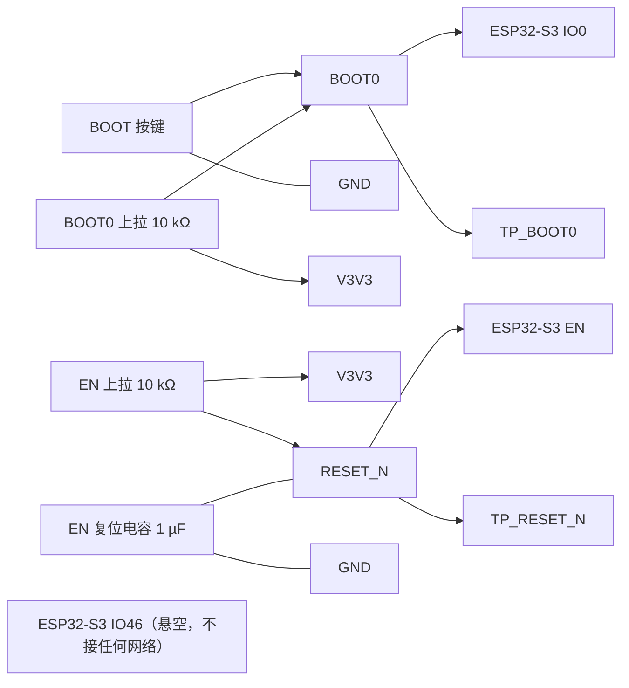

# ESP32-S3 复位与启动控制设计

> 文档状态：复位与启动口径已锁定（2026-09-17）。原理图 ERC、PCB DRC 和样机时序仍未完成。
> 实际网表：`Netlist_Schematic1_2026-09-17 (1).tel`，导出 2026-09-17 18:29:29，SHA-256 `8263eec0053c01079ff74147a0819b3abac4086f9af236c2947cf170c589e132`。
> **本文档不含按键控制器**：PWR 按键的检测、开关机与按键状态输出已随换型移交《[LTC2954ITS8-1外围电路设计与接线.md](LTC2954ITS8-1外围电路设计与接线.md)》。本文只讲 ESP32-S3 自身的复位与启动。

## 1. 复位与启动接线

| 功能 | 实际器件/引脚 | 接法 |
| --- | --- | --- |
| BOOT | BOOT 按键、ESP32-S3 IO0 | BOOT 按键 pin 1→`BOOT0`，pin 3→`GND`；BOOT0 上拉电阻 10 kΩ 上拉至 `V3V3`；TP_BOOT0 同网 |
| 主控复位 | ESP32-S3 EN | 独立 `RESET_N` 网；EN 上拉电阻 10 kΩ 上拉至 `V3V3`、EN 复位电容 1 µF 至 GND、TP_RESET_N |
| 启动绑带 | ESP32-S3 IO46 | **悬空，不接任何网络**；复位采样窗口靠模组内部弱下拉给出 0 |

EN 与 `BOOT0` 之间没有直连：EN 只由自身的 RC 网络复位，BOOT 按键只作用于 IO0。两者是独立的输入，进下载模式靠「按住 BOOT 再上电」的时序组合，见 §2。

## 2. 启动绑带与下载模式

ESP32-S3 的启动模式由 GPIO0 与 GPIO46 在复位释放时共同决定（模组规格书 v1.3 p.13 表 6）：

| 启动模式 | GPIO0 | GPIO46 |
| --- | --- | --- |
| SPI Boot（默认） | 1 | 任意值 |
| Joint Download Boot | 0 | 0 |

两个绑带脚的取值来源：

- **GPIO0**：BOOT 按键按下时接地给 0；松开时由 10 kΩ 上拉电阻至 `V3V3` 给 1。
- **GPIO46**：**板上悬空**。模组规格书 v1.3 p.13 表 4 给出 GPIO46 的默认配置为下拉、值 0，复位采样窗口靠内部弱下拉给出 0。

**IO46 为什么必须悬空**：它是 strapping 引脚。旧设计在复位采样窗口把它固定为高，使要求 GPIO0=0 且 GPIO46=0 的联合下载模式不可达。按键感知改走 `PWR_INT` 之后，IO46 不再接任何网络，内部弱下拉恢复给出 0，联合下载组合才成立。**不得用测试点在复位采样窗口硬拉该脚。**

**下载入口的操作序列**：**先**按住 BOOT 键（GPIO0=0）不放，**再**长按 PWR 键使系统上电；BOOT 键必须持续按到 `V3V3` 建立、EN 释放并完成 strapping 采样之后。顺序颠倒则 GPIO0 已被采样为 1，下载模式不可达。PWR 键的长按阈值由 LTC2954 的 ONT 电容决定。

**GPIO0=0、GPIO46=0 的联合下载组合仍需样机验证。**

## 3. BOM

| 用途 | 单板量 | 目标规格及型号 | 嘉立创编号 | 可用库存快照 | 嘉立创/库存 |
| --- | ---: | --- | --- | --- | --- |
| BOOT 按键 | 1 | TSW063G43-250K，6.1×6.1×4.3 mm 立贴四脚轻触 | C722964 | 可用 16（在库 16 − 占用 0，快照 2026-09-13） | 库存领用 |
| BOOT0 上拉电阻 | 1 | 10 kΩ，0603 | C25804 | 可用 50（在库 50 − 占用 0，快照 2026-09-13） | 库存领用 |
| EN 上拉电阻 | 1 | 10 kΩ，0603 | C25804 | 同上，与本表上一行同料号 | 库存领用 |
| EN 复位电容 | 1 | CL10A105KP8NNNC，1µF/0603 | C26413 | 可用 241（在库 241 − 占用 0，快照 2026-09-13） | 库存领用 |

**同料号提示**：BOOT 按键与 PWR 按键同料号（TSW063G43-250K / C722964），**全板需 2 件**，本表只计 BOOT 侧 1 件；10 kΩ/0603 在整板多处使用，全板总需求须在整板 BOM 汇总时按同一编号合并计算。

## 4. 验收门禁

1. 断电测 BOOT 按键 pin 1–pin 3：松开开路、按下近 0 Ω；确认四脚按键两侧内部连接。
2. 单独验证「先按住 BOOT 再上电」的下载序列；GPIO0=0 且 GPIO46=0 的联合下载组合实测通过前，不宣称下载模式通过。
3. 验证独立 EN 复位：拉低 TP_RESET_N 后主控复位、松开后正常启动，且不依赖任何按键状态。
4. 完成同版 BOM、ERC、PCB DRC 和样机测试后，才能标记为「已验证」。

依据：ESP32-S3-WROOM-1 & WROOM-1U 技术规格书 v1.3（管脚定义、Strapping 管脚、芯片启动模式控制）、项目硬件基线 `电子木鱼-硬件原理图设计基线.md` 和本次网表。
