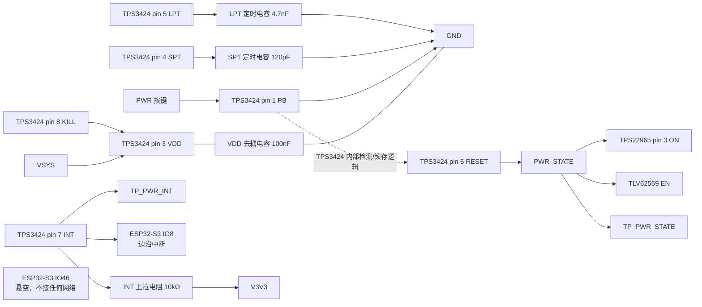

# ESP32-S3 按键、复位与启动控制设计

> 文档状态：最终设计口径已锁定（2026-09-14）。原理图 ERC、PCB DRC、按键实测和样机时序仍未完成。
> 实际网表：`Netlist_Schematic1_2026-09-17.tel`，导出 2026-09-17 15:22，SHA-256 `e235e8a8e84d8f07727ae4f8d0051533ef5a849268e9b981ad207bac17fd8c10`。

## 1. 最终连接关系

本页使用 `PWR_STATE` 作为唯一物理网络名（旧称 `SYS_EN` 只是「该网络驱动 TPS22965」的功能称呼，不是独立网络名，已停用）。按键输入是另一条物理网 `PWR_INT`，不并入 `PWR_STATE`。

| 功能         | 实际器件/引脚                 | 最终接法                                                                                  |
| ---------- | ----------------------- | ------------------------------------------------------------------------------------- |
| BOOT       | BOOT 按键、ESP32-S3 IO0    | BOOT 按键 pin 1→`BOOT0`，BOOT 按键 pin 3→`GND`；BOOT0 上拉电阻 10 kΩ 上拉至 `V3V3`；TP_BOOT0 同网     |
| PWR 输入     | PW 按键、TPS3424 pin 1（PB） | PWR 按键 pin 1→PB，PWR 按键 pin 3→`GND`；按下为低电平                                             |
| TPS3424 供电 | TPS3424 pin 3、pin 8     | 接 `VSYS`；VDD 去耦电容 100 nF 从 `VSYS` 至 `GND`                                             |
| 电源锁存输出     | TPS3424 pin 6（RESET）    | 输出至唯一物理网 `PWR_STATE`，连接 TPS22965 pin 3（ON）、TLV62569 的 EN 和 TP_PWR_STATE；不接任何 ESP32 引脚 |
| PWR 按键输入   | ESP32-S3 IO8            | 读 `PWR_INT`，用 GPIO 边沿中断捕获 50 ms（短按）/100 ms（长按）脉冲，固件不驱动该脚                              |
| 主控复位       | ESP32-S3 EN             | 独立 `RESET_N` 网；EN 上拉电阻 10 kΩ 上拉至 `V3V3`、EN 复位电容 1 µF 至 GND、TP_RESET_N                 |
| TPS3424 中断 | TPS3424 pin 7（INT）      | 开漏低有效，输出物理网 `PWR_INT`；INT 上拉电阻 10 kΩ 上拉至 `V3V3`；接 ESP32-S3 IO8 和 TP_PWR_INT           |

PB 到 RESET 没有外部 PCB 直连。PB 下降沿由 TPS3424 内部按键检测、计时和锁存逻辑处理，pin 6 RESET 是该内部逻辑的输出。

## 2. 按键行为

- PWR 按键松开：TPS3424 pin 1 PB 由芯片内部约 1 MΩ 上拉为高，不是悬空。
- PWR 按键按下：PB 接地，形成 active-low 触发。
- SPT 定时电容 120 pF：`tSP=0.422×0.120≈50.64 ms`。
- LPT 定时电容 4.7 nF：`tLP=0.422×4.7≈1.983 s`。
- 有效短按后，TPS3424 pin 6 RESET 置高，`PWR_STATE` 置高，TPS22965 打开。
- 长按达到约 1.98 s 后，TPS3424 pin 6 RESET 释放为低，`PWR_STATE` 置低，TPS22965 关闭。
- 短按（> 50.64 ms）：TPS3424 pin 7 INT 输出一个 50 ms 脉冲；长按（> 1.983 s）：INT 输出 50 ms + 100 ms 双脉冲。
- `PWR_INT` 是脉冲而非电平，50 ms 短于常规轮询周期，固件必须用 GPIO 边沿中断捕获。上电那一次的短按脉冲在 ESP32 启动完成前已经结束，固件收不到，也不需要。

## 3. ESP32 引脚与启动

| 引脚            | 网络        | 连接与行为                                                                    |
| ------------- | --------- | ------------------------------------------------------------------------ |
| ESP32-S3 IO0  | `BOOT0`   | BOOT0 上拉电阻 10 kΩ 上拉；BOOT 按键按下接地；用于下载绑带                                   |
| ESP32-S3 IO8  | `PWR_INT` | 接 TPS3424 pin 7 INT；开漏输出由 10 kΩ 上拉至 `V3V3`，电平恒在 0~3.3 V；只以 GPIO 边沿中断捕获脉冲 |
| ESP32-S3 IO46 | 悬空        | 不接任何网络，不再读 `PWR_STATE`；复位采样窗口由模组内部弱下拉给出 0                                |
| ESP32-S3 EN   | `RESET_N` | EN 上拉电阻与 EN 复位电容构成 RC 复位；TP_RESET_N 是该网测试点                               |

GPIO0=0、GPIO46=0 的联合下载组合仍需样机验证。IO46 已悬空、不接任何网络，不再存在与 TPS3424 推挽 RESET 对冲的约束，也不得用测试点在复位采样窗口硬拉该脚。

按键输入从 IO46 改到 IO8 有两项原因。其一，TPS3424 的 VDD 接 `VSYS`，其推挽 RESET 的高电平即 `VSYS`（最高 4.2 V），超出 ESP32-S3 的 IO 输入上限（VDD+0.3 = 3.6 V）。其二，IO46 是 strapping 引脚，旧设计在复位采样窗口把它固定为高，使要求 GPIO0=0 且 GPIO46=0 的联合下载模式不可达。改走 `PWR_INT` 后，TPS3424 的 INT 是开漏输出、由 10 kΩ 上拉至 `V3V3`，电平恒在 0~3.3 V，天然合规；IO46 悬空后靠内部弱下拉给 0，符合启动绑带要求。

## 4. 最终 BOM 状态

| 用途                                          | 最终器件/规格                              | 状态                             |
| ------------------------------------------- | ------------------------------------ | ------------------------------ |
| ESP32-S3 主控模组                               | ESP32-S3-WROOM-1-N16R8               | 项目已确认                          |
| TPS3424 按键控制器                               | TPS3424A11C13ADRLR，SOT-5X3/DRL，8-pin | 用户已确认                          |
| TPS22965 负载开关                               | TPS22965DSGR，UDFN-8，pin 3=ON         | 用户已确认                          |
| BOOT 按键、PWR 按键                              | 四脚常开轻触按键，分别用于 BOOT/PWR               | 拓扑已锁定；精确 MPN/封装方向待 BOM 或通断测试确认 |
| BOOT0 上拉、EN 上拉、INT 上拉电阻                     | 10 kΩ，0603                           | 网表连接符合设计                       |
| EN 复位电容                                     | 1 µF，0603                            | EN 复位 RC                       |
| SPT 定时电容                                    | 120 pF，0603                          | 库存 `C1643`，短按计时                |
| LPT 定时电容                                    | 4.7 nF，0603                          | 库存 `C53987`，长按计时               |
| VDD 去耦电容                                    | 100 nF，0603                          | VDD 去耦                         |
| TP_BOOT0、TP_PWR_STATE、TP_RESET_N、TP_PWR_INT | 测试点                                  | 网表端点已确认                        |

## 5. 验收门禁

1. 断电测 PWR 按键 pin 1–pin 3：松开开路、按下近 0 Ω；确认四脚按键两侧内部连接。
2. 示波器同时记录 PB、RESET/PWR_STATE、PWR_INT、TPS22965 ON、VMAIN、IO8，验证短按和长按时序。
3. 验证 USB-only、电池-only、PWR 短按上电、PWR 长按关断和独立 EN 复位。
4. 单独验证 BOOT+RESET 下载序列；IO46 已悬空，下载绑带不再受 PWR 网络约束；GPIO0=0 且 GPIO46=0 的联合下载组合实测通过前，不宣称下载模式通过。
5. 完成同版 BOM、ERC、网表复核、PCB DRC 和样机测试后，才能标记为“已验证”。

依据：TI [TPS3423/TPS3424 Rev.C 数据手册](https://www.ti.com/lit/ds/symlink/tps3424.pdf)、项目硬件基线、`电子木鱼-硬件网络清单.json` 和本次网表。