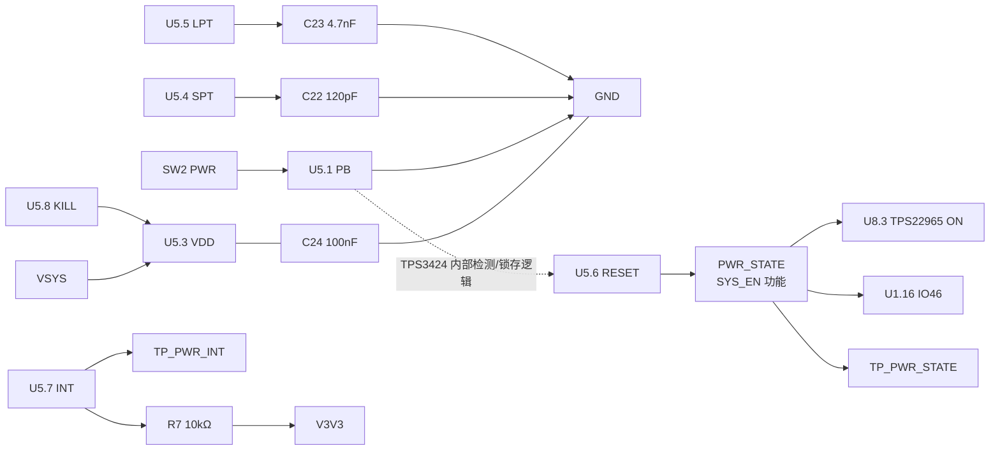

# ESP32-S3 按键、复位与启动控制设计

> 文档状态：最终设计口径已锁定（2026-09-14）。原理图 ERC、PCB DRC、按键实测和样机时序仍未完成。
> 实际网表：`Netlist_Schematic1_2026-09-14.tel`，SHA-256 `f47d5e6d70d058a42df133c5b72f82880e1b50db14556dc5a735530b9d28f43b`。

## 1. 最终连接关系

本页使用 `PWR_STATE` 作为唯一物理网络名。`SYS_EN` 只描述该网络控制 TPS22965 的功能，不是第二条线。

| 功能 | 实际器件/引脚 | 最终接法 |
| --- | --- | --- |
| BOOT | SW1、U1.27（ESP32 IO0） | SW1.1→`BOOT0`，SW1.3→`GND`；R3=10 kΩ 上拉至 `V3V3`；TP_BOOT0 同网 |
| PWR 输入 | SW2、U5.1（TPS3424 PB） | SW2.1→PB，SW2.3→`GND`；按下为低电平 |
| TPS3424 供电 | U5.3、U5.8 | 接 `VSYS`；C24=100 nF 从 `VSYS` 至 `GND` |
| 电源锁存输出 | U5.6（RESET） | 输出至唯一物理网 `PWR_STATE`，连接 U8.3（TPS22965 ON）、U1.16（IO46）和 TP_PWR_STATE |
| PWR 状态读取 | U1.16（IO46） | 只读 `PWR_STATE`，固件不驱动该脚 |
| 主控复位 | U1.3（EN） | 独立 `RESET_N` 网；R9=10 kΩ 上拉至 `V3V3`、C7=1 µF 至 GND、TP_RESET_N |
| TPS3424 中断 | U5.7（INT） | 开漏低有效；R7=10 kΩ 上拉至 `V3V3`；TP_PWR_INT |

PB 到 RESET 没有外部 PCB 直连。PB 下降沿由 TPS3424 内部按键检测、计时和锁存逻辑处理，pin 6 RESET 是该内部逻辑的输出。

## 2. 按键行为

- SW2 松开：U5.1 PB 由芯片内部约 1 MΩ 上拉为高，不是悬空。
- SW2 按下：PB 接地，形成 active-low 触发。
- C22=120 pF：`tSP=0.422×0.120≈50.64 ms`。
- C23=4.7 nF：`tLP=0.422×4.7≈1.983 s`。
- 有效短按后，U5.6 RESET 置高，`PWR_STATE` 置高，TPS22965 打开。
- 长按达到约 1.98 s 后，U5.6 RESET 释放为低，`PWR_STATE` 置低，TPS22965 关闭。

## 3. ESP32 引脚与启动

| 引脚 | 网络 | 连接与行为 |
| --- | --- | --- |
| IO0（U1.27） | `BOOT0` | R3=10 kΩ 上拉；SW1 按下接地；用于下载绑带 |
| IO46（U1.16） | `PWR_STATE` | 接 U5.6/U8.3 同一物理网，只读电源锁存状态 |
| EN（U1.3） | `RESET_N` | R9/C7 RC 复位；TP_RESET_N 是该网测试点 |

GPIO0=0、GPIO46=0 的联合下载组合仍需样机验证。由于当前 IO46 与 TPS3424 推挽 RESET 同网，不得用测试点直接硬拉低该网而与 RESET 输出对冲。

## 4. 最终 BOM 状态

| 位号 | 最终器件/规格 | 状态 |
| --- | --- | --- |
| U1 | ESP32-S3-WROOM-1-N16R8 | 项目已确认 |
| U5 | TPS3424A11C13ADRLR，SOT-5X3/DRL，8-pin | 用户已确认 |
| U8 | TPS22965DSGR，UDFN-8，pin 3=ON | 用户已确认 |
| SW1、SW2 | 四脚常开轻触按键，分别用于 BOOT/PWR | 拓扑已锁定；精确 MPN/封装方向待 BOM 或通断测试确认 |
| R3、R9、R7 | 10 kΩ，0603 | 网表连接符合设计 |
| C7 | 1 µF，0603 | EN 复位 RC |
| C22 | 120 pF，0603 | 库存 `C1643`，短按计时 |
| C23 | 4.7 nF，0603 | 库存 `C53987`，长按计时 |
| C24 | 100 nF，0603 | VDD 去耦 |
| TP_BOOT0、TP_PWR_STATE、TP_RESET_N、TP_PWR_INT | 测试点 | 网表端点已确认 |

## 5. 验收门禁

1. 断电测 SW2.1–SW2.3：松开开路、按下近 0 Ω；确认四脚按键两侧内部连接。
2. 示波器同时记录 PB、RESET/PWR_STATE、TPS22965 ON、VMAIN、IO46，验证短按和长按时序。
3. 验证 USB-only、电池-only、PWR 短按上电、PWR 长按关断和独立 EN 复位。
4. 单独验证 BOOT+RESET 下载序列；在 GPIO46 同网约束未关闭前，不宣称下载模式通过。
5. 完成同版 BOM、ERC、网表复核、PCB DRC 和样机测试后，才能标记为“已验证”。

依据：TI [TPS3423/TPS3424 Rev.C 数据手册](https://www.ti.com/lit/ds/symlink/tps3424.pdf)、项目硬件基线、`电子木鱼-硬件网络清单.json` 和本次网表。
