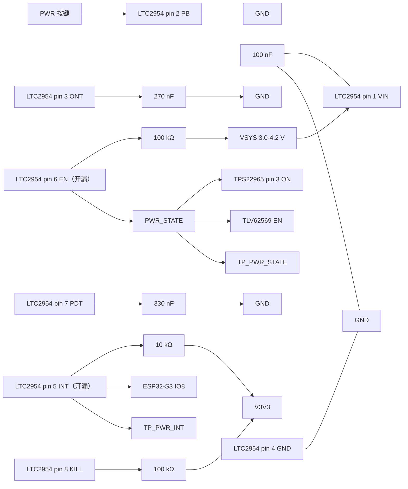

# LTC2954ITS8-1 外围电路设计与接线

> 最近核验：**通过**（覆盖 LTC2954 全部 8 个引脚及其全部外围元件）
> 手册：`LTC2954-RevFB.pdf`，2954fb（Linear Technology，2011-02-03），md5 `46a13f77247a35ade6495534190c7bb8`
> 收口日期：2026-09-17 ｜ 库存快照：`库存列表-20260913211039.xlsx`（2026-09-13）
> 事实源：[电子木鱼-硬件原理图设计基线.md](../电子木鱼-硬件原理图设计基线.md)、[电源网络命名规范.md](../电源网络命名规范.md)、[电子木鱼-硬件网络清单.json](../电子木鱼-硬件网络清单.json)

## 1. 依据与核验范围

### 手册

- `docs/hardware/芯片手册/LTC2954-RevFB.pdf`，修订 **2954fb**，16 页，md5 `46a13f77247a35ade6495534190c7bb8`
- 来源：ADI 官网 `/media/en/technical-documentation/data-sheets/2954fb.pdf`
- 用到的页码：p.1（特性与描述）、p.2（订购信息）、p.3（电气特性）、p.5（绝对最大额定值）、p.6（引脚功能）、p.7（框图）、p.8（时序图）、p.9–10（应用信息、开关机时序、定时公式）、p.12（典型应用、无 µP 应用 Figure 6）、p.13（Figure 7/8）

### 库存表

- `docs/hardware/外围电路设计/库存列表-20260913211039.xlsx`，快照 2026-09-13

### 本次核验范围

- LTC2954 的**全部 8 个引脚**（TSOT-23-8，封装名 `TSOT-23-8_L2.9-W1.6-P0.65-LS2.8-BL`）
- 外围元件：VIN 去耦电容、ONT 定时电容、PDT 定时电容、EN 上拉电阻、INT 上拉电阻、KILL 上拉电阻、PWR 按键、TP_PWR_STATE、TP_PWR_INT
- 覆盖 8/8 脚及全部外围元件，无未覆盖部分

### 未闭合事项

| 事项 | 类型 | 影响或阻塞 | 依据 / 方法 |
|---|---|---|---|
| KILL 上拉源建立时序 | 样机实测 | 手册要求 `EN` 拉高后 **512 ms 内 KILL 必须为高**，否则中止开机。本设计 KILL 上拉到 `V3V3`，须确认 `V3V3` 在 512 ms 内建立 | 手册 p.9 Note 3、p.10 Figure 2；示波器测 EN、VMAIN、V3V3、KILL |
| 长按开机后的保持窗口 | 样机实测 | 开机后 512 ms 内 PB 被忽略；之后若继续按住达 `tPD,MIN + tPDT` 会再次关机。须实测确认用户按 2 s 松手不会落入关机窗口 | 手册 p.9、p.10 Figure 1；示波器测 PB、EN、INT |
| PB 网络噪声与走线 | 样机实测 | PB 内部仅 100 kΩ 上拉至 1.9 V 偏置、阈值 0.6~1.0 V，抗扰余量小。按键走线长时手册建议串 5.1 kΩ + 0.1 µF | 手册 p.12、p.13 Figure 8；必要时加 RC |
| 上电初态 | 样机实测 | 手册 p.9 明写首次上电时 `EN` 输出被初始化、DC/DC 保持关断，但未给出可写入文档的量化规格 | 手册 p.9；示波器记录首次上电的 EN |
| 定时电容贴装位置 | 样机实测 | 手册要求 VIN 去耦 0.1 µF 紧靠 VIN，ONT/PDT 电容紧靠对应引脚 | 手册 p.12；PCB 布局复核 |
| 原型验证全时序 | 样机实测 | — | 示波器同时测 PB、EN/`PWR_STATE`、INT/`PWR_INT`、TPS22965 ON、VMAIN、V3V3 |
| ERC / PCB DRC | 样机实测 | — | EDA |

## 2. 芯片逐脚接线和总接线图

引脚号按手册 p.6「PIN FUNCTIONS (TSOT-23/DFN)」的 **TSOT-23 列**，排列为 1=VIN、2=PB、3=ONT、4=GND、5=INT、6=EN、7=PDT、8=KILL，与 TPS3424 的脚序不同，符号不得沿用旧器件。

| 脚号 | 名称 | 接法 | 状态 |
| --- | --- | --- | --- |
| 1 | VIN | `VSYS`（3.0–4.2 V）+ 100 nF 去耦至 GND | 符合 |
| 2 | PB | PWR 按键跨接至 GND，按下拉低；芯片内部 100 kΩ 上拉至内部 1.9 V 偏置，不需外部上拉 | 符合 |
| 3 | ONT | 270 nF 至 GND（决定附加开通时间 1.73 s） | 符合 |
| 4 | GND | GND | 符合 |
| 5 | INT | `PWR_INT`：10 kΩ 上拉至 `V3V3`、ESP32-S3 的 IO8、TP_PWR_INT | 符合 |
| 6 | EN | `PWR_STATE`：**100 kΩ 上拉至 `VSYS`**、TPS22965 的 ON、TLV62569 的 EN、TP_PWR_STATE | 符合 |
| 7 | PDT | 330 nF 至 GND（决定附加关机去抖时间 2.12 s） | 符合 |
| 8 | KILL | 100 kΩ 上拉至 `V3V3`（无主控应用的接法） | 符合 |

三条与 TPS3424 方案的本质差异，落图时最容易错：

1. **`EN` 是开漏输出**（不是推挽）。asserted 时为高阻，靠外部 100 kΩ 上拉到 `VSYS` 得到高电平；released 时主动拉低。`PWR_STATE` 上**必须恰好一组**上拉。
2. **`KILL` 是比较器输入**（0.6 V 阈值），不是 TPS3424 那种逻辑输入。无主控时须上拉到低电压输出电源；**不得接 GND，也不得悬空**。
3. **`PB` 内部上拉很弱**（100 kΩ 到 1.9 V 偏置，开路电压仅 1.6 V），阈值 0.6~1.0 V，与 TPS3424 的 1 MΩ 上拉不是一回事。



### 布局要求

- 本器件、VIN 去耦电容、ONT/PDT 定时电容紧凑放置；ONT/PDT 走线尽量短，远离 BQ25895 的开关节点、4G 与扬声器功率回路
- `PWR_STATE` 是开漏节点，100 kΩ 上拉已在位，**不得再加第二组上拉或下拉**
- `PWR_INT` 是开漏节点，10 kΩ 上拉已在位，**不得再加第二组上拉**
- `KILL` 上拉至 `V3V3`，走线远离开关节点（0.6 V 阈值比较器输入，抗扰余量小）

### 落图自查

本版核验结论是**原理图已正确、无需改动接线**。下列自查项在本次本板中均已确认：

- 工程内不存在 `TPS3424` 及 `SPT`／`LPT` 这两个旧定时脚网络名
- `KILL`（pin 8）经 100 kΩ 上拉至 `V3V3`，未悬空、未接 GND，且未接 `VSYS`
- `IO46` 不出现在任何网络中，保持悬空
- `PWR_STATE` 上只有一组 100 kΩ 上拉至 `VSYS`，无第二组上拉或下拉
- `PWR_INT` 上只有一组 10 kΩ 上拉至 `V3V3`

## 3. 参数复算与选型

### 3.1 定时电容

手册 p.9 给出的两条公式（`CONT`、`CPDT` 单位 µF）：

```text
CONT = 1.56 × 10⁻⁴ [µF/ms] × (tONT − 1 ms)
CPDT = 1.56 × 10⁻⁴ [µF/ms] × (tPDT − 1 ms)
```

总开通时间 = `tDB,ON` + `tONT`；总关机时间 = `tPD,MIN` + `tPDT`（手册 p.3 电气特性、p.9）。

**设计目标**：用户长按约 2 秒完成动作。因总时间含固定的内部去抖（开通 32 ms、关机 64 ms），可调部分要留出余量，使「按 2 秒」可靠成立。

| 项 | 目标总时间 | 固定项 | 代入 | 结果 | 选定值 |
| --- | --- | --- | --- | --- | --- |
| 开通 | 约 1.76 s | `tDB,ON` = 32 ms | C = 1.56×10⁻⁴ × (1732 − 1) | **tONT = 1.732 s** | **270 nF/0603** |
| 关机 | 约 2.18 s | `tPD,MIN` = 64 ms | C = 1.56×10⁻⁴ × (2116 − 1) | **tPDT = 2.116 s** | **330 nF/0603** |

开机比关机短约 0.4 s，是有意为之：避免用户按 2 秒却因固定去抖吃掉余量而开不了机；关机侧略长，降低误关机概率。

### 3.2 上拉电阻

| 网络 | 上拉到 | 阻值 | 依据与校核 |
| --- | --- | --- | --- |
| `PWR_STATE` | `VSYS` | **100 kΩ** | `EN` 开漏，手册 p.6「Otherwise a pull-up resistor to an external supply is required」。拉低时电流 = 4.2 V ÷ 100 kΩ = 42 µA，远低于手册 p.3 的 `VEN(VOL)` 测试条件 500 µA（VOL ≤ 0.4 V）；漏电 ±0.1 µA 造成的压降可忽略。下游 TPS22965 的 `VIH` 最小 1.1 V、TLV62569 的 `VIH` 最小 0.95 V，`VSYS` 最低 3.0 V 远超 |
| `PWR_INT` | `V3V3` | 10 kΩ（沿用） | `INT` 开漏，手册 p.6。VOL ≤ 0.4 V @ 3 mA，10 kΩ 时电流 330 µA，裕量充足 |
| `KILL` | `V3V3` | **100 kΩ** | 手册 p.6「If unused, connect to a low voltage output supply」；p.12 Figure 6 用 100 kΩ 上拉至系统 3.3 V 输出。`V3V3` = 3.3 V 远高于 `VKILL(TH)` 0.6 V |

### 3.3 边界校验

| 项 | 手册限制 | 本设计 | 判定 |
| --- | --- | --- | --- |
| VIN 工作范围 | 2.7–26.4 V（p.3、p.5） | `VSYS` 3.0–4.2 V | 符合 |
| UVLO（VIN 下降） | 2.2 / 2.3 / 2.5 V，迟滞 50 / 400 / 700 mV（p.3） | `VSYS` 最低 3.0 V，高于 UVLO 上限 2.5 V，裕量 0.5 V | 符合 |
| IIN | 6 µA typ / 12 µA max（p.3） | `VSYS` 常供电，计入关机态漏电账 | 符合 |
| PB 电压 | −1 ~ 26.4 V（p.3） | 0（接地）~ 1.6 V（内部开路） | 符合 |
| PB 阈值 | 0.6 / 0.8 / 1.0 V，下降沿（p.3） | 按下 = 0 V < 0.6 V；松开 = 1.6 V > 1.0 V | 符合 |
| KILL 电压 | 0 ~ 26.4 V 工作范围 | `V3V3` = 3.3 V | 符合 |
| EN/INT 电压 | 0 ~ 26.4 V（开漏） | ≤ `VSYS` / `V3V3` | 符合 |
| EN 输出电流 | `VEN(VOL)` 测试于 500 µA（p.3） | 42 µA | 符合 |
| INT 输出电流 | `VINT(VOL)` 测试于 3 mA（p.3） | 330 µA | 符合 |

### 3.4 料号解码与器件行为

料号 **`LTC2954ITS8-1#TRPBF`**（手册 p.2 订购信息）：

| 字段 | 值 | 含义 |
| --- | --- | --- |
| 温度档 | `I` | **−40 ~ 85 ℃**。选 I 不选 C 的理由：`电子木鱼-硬件网络清单.json` 记载电池包工作下限 −40 ℃，而 **C 档仅 0 ~ 70 ℃**，下限不满足 |
| 封装 | `TS8` | 8-Lead Plastic TSOT-23。选 TS8 不选 `DDB`（DFN-8）的理由：功耗 6 µA × 4.2 V ≈ 25 µW，热不是约束，无 EP 反而少一个热焊盘风险点，且可目视返修 |
| 版本 | `-1` | **high true EN，低漏电开漏输出**（手册 p.12）。选 -1 不选 -2 的理由：`PWR_STATE` 必须高电平 = 开机（驱动 TPS22965 的 ON 与 TLV62569 的 EN，两者均高有效）；-2 是 low true |
| 封装/包装 | `#TRPBF` | 无铅、卷带 |

器件行为（手册 p.9–10、p.12）：

| PB 状态 | INT（`PWR_INT`） | EN（`PWR_STATE`） | 系统 |
| --- | --- | --- | --- |
| 松开 | 高（外部上拉） | 保持当前状态 | 保持 |
| 按下 > 32 ms | **拉低，并在按住期间持续为低** | 保持 | 保持 |
| 按下 > 1.76 s（关机态） | 同上 | **释放为高** | 开机 |
| 按下 > 2.18 s（开机态） | 同上 | **释放为低** | 关机 |

上电后 `EN` 拉高的 512 ms 内，`PB` 与 `KILL` 输入被忽略（手册 p.9 Note 3、p.10 Figure 1）；此窗口结束时若 `KILL` 仍为低，`EN` 会被释放、开机中止（p.10 Figure 2）。本设计靠 `KILL` 上拉至 `V3V3` 满足，**建立时序是必须实测的项**。

### 3.5 对固件的约束

- **`PWR_INT` 不是脉冲，而是按键状态**。手册 p.6：*"The INT pulse width is a minimum of 32ms and **stays low as long as PB is asserted**"*。这与 TPS3424 的 50 ms / 100 ms 脉冲语义完全不同——固件不能再靠「数脉冲个数/宽度」区分短按与长按，必须**用边沿中断捕获，并自行测量低电平持续时长**。
- **长按开关机由板级独立完成**，固件不参与、也不得试图接管。固件读到的最长按压（超过 PDT 计时）会直接导致硬件断电，固件来不及收尾；需要有序关机的场景应另行设计，不得指望这条路径。
- **不得用任何 GPIO 驱动 `KILL` 实现软件关机**。本设计的 `KILL` 只做无主控端接；引入 GPIO 会与「固件不接管硬件关机」的板级约束冲突。
- **低功耗唤醒语义随之改变**：旧文档以「脉冲宽度 50 ms」论证唤醒可靠性，该论证已失效；长按会让唤醒源持续有效约 1.8 s，需重新评估唤醒风暴。

## 4. BOM 表

| 用途 | 单板量 | 目标规格及型号 | 嘉立创编号 | 可用库存快照 | 嘉立创/库存 |
| --- | ---: | --- | --- | --- | --- |
| 按键控制器 | 1 | LTC2954ITS8-1#TRPBF，TSOT-23-8 | [C580654](https://www.lcsc.com/product-detail/C580654.html) | 未检出（快照 2026-09-13）；嘉立创页面 2026-09-17 核对在售 | 嘉立创采购 |
| ONT 定时电容 | 1 | 0603B274K500NT，270nF/0603 | [C2971756](https://item.szlcsc.com/3364457.html) | 未检出（快照 2026-09-13）；嘉立创页面 2026-09-17 核对在售 | 嘉立创采购 |
| PDT 定时电容 | 1 | 0603B334K500NT，330nF/0603 | [C188679](https://www.lcsc.com/product-detail/C188679.html) | 未检出（快照 2026-09-13）；嘉立创页面 2026-09-17 核对在售 | 嘉立创采购 |
| VIN 去耦电容 | 1 | 0603B104K500NT，100nF/0603 | C30926 | 可用 89（在库 94 − 占用 5，快照 2026-09-13） | 库存领用 |
| EN 上拉电阻 | 1 | 0603WAF1003T5E，100kΩ/0603 | C25803 | 可用 83（在库 86 − 占用 3，快照 2026-09-13） | 库存领用 |
| INT 上拉电阻 | 1 | 0603WAF1002T5E，10kΩ/0603 | C25804 | 可用 50（在库 50 − 占用 0，快照 2026-09-13） | 库存领用 |
| KILL 上拉电阻 | 1 | 0603WAF1003T5E，100kΩ/0603 | C25803 | 同上，与本表 EN 上拉同料号 | 库存领用 |
| PWR 按键 | 1 | TSW063G43-250K，6.1×6.1×4.3 mm 立贴四脚轻触 | C722964 | 可用 16（在库 16 − 占用 0，快照 2026-09-13） | 库存领用 |

### 逐行待办

- **按键控制器**：嘉立创库存需复核（2026-09-17 页面显示 217 片，快照未覆盖，下单前确认）；单价 $7 量级，是本次换型的主要成本增量
- **ONT 270nF、PDT 330nF**：库存快照中未检出该容量，编号取自 2026-09-17 嘉立创商品页核对，属**嘉立创采购**。两者容差直接影响长按时长精度；且手册的可调版计时精度特征化条件是 `SPT=330pF, LPT=4.7nF`，本设计的 nF 级取值不在该条件下，**精度无手册保证，实际时长须样机实测**
- **VIN 去耦、EN 上拉、INT 上拉、KILL 上拉、PWR 按键**：编号取自 2026-09-13 库存快照且均在可用状态，本行无待办

### 单板合计与全板同料合计

1. 本对象 8 个料号，单板各 1 件
2. **PWR 按键与 BOOT 按键同料号（TSW063G43-250K / C722964）**：全板需 **2 件**，本表只计本对象的 1 件；库存可用 16 件，满足全板需求
3. **100 nF/0603（C30926）与 10 kΩ/0603（C25804）在整板多处使用**：本表只计本对象各 1 件，全板总需求须在整板 BOM 汇总时按同一编号合并计算
4. **100 kΩ/0603 在本对象内用了 2 处**（EN 上拉、KILL 上拉），须按同料号合并为一行计 2 件——本表暂分行列出用途，BOM 汇总时合并
5. 其余各项在本对象内唯一使用

### 采购清单

- **嘉立创采购**：LTC2954ITS8-1#TRPBF（C580654）、0603B274K500NT（C2971756，ONT）、0603B334K500NT（C188679，PDT）
- **库存领用**：C30926（100nF）、C25803（100kΩ，2 处）、C25804（10kΩ）、C722964（PWR 按键）
- 无需其他外购物料
