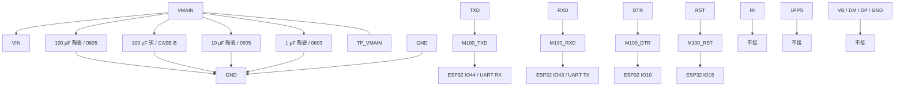

# M100EG-C2 外围电路设计与接线

> 最近核验：通过
> 手册：`M100EG-C2-银尔达产品文档.pdf`（银尔达官方产品文档，文档最后更新 2026-08-13），md5 `282426c12cbde2949969d8d49ec0e8f1`
> 收口日期：2026-09-18 ｜ 库存快照：`库存列表-20260913211039.xlsx`（2026-09-13）
> 事实源：[`../电子木鱼-硬件原理图设计基线.md`](../电子木鱼-硬件原理图设计基线.md) §5.5、[`../电源网络命名规范.md`](../电源网络命名规范.md)、[`../电子木鱼-硬件网络清单.json`](../电子木鱼-硬件网络清单.json)

## 1. 依据与核验范围

**核验对象**：银尔达 `M100EG-C2`，4G+GPS 二合一 DTU 核心板，内嵌合宙 `Air780EGP` 模组（实物丝印 `Air780E`＋`GP`）。本版为 **AT 固件、3.3~4.2 V 供电** 版本。外形 25.00 × 25.50 mm，2.54 mm 排针。

**手册**：`M100EG-C2-银尔达产品文档.pdf`，md5 `282426c12cbde2949969d8d49ec0e8f1`，共 17 页。用到的页码：

| 内容 | 页码 |
| --- | --- |
| 供电范围 3.3~4.2 V（10 W）、工作温度、TTL 串口电平与波特率、RST 电平范围 | p.3 |
| 硬件资源表：顶部排针 `VIN GND RXD TXD DTR RST RI 1PPS`、底部 USB 四脚、天线与按键 | p.4 |
| 串口交叉接法与各控制脚电平范围 | p.6 |
| 供电注意事项（不得用 3.3 V、推荐 3.8 V/2 A 供电、锂亚电池需加电容） | p.10 |

**库存表**：`库存列表-20260913211039.xlsx`，快照 2026-09-13（距收口日 5 天，在有效期内）。

**核验范围**：本模组全部 12 个引脚，及其 `VMAIN` 供电网络上的全部去耦与储能元件。

**引脚编号说明**：逐脚表沿用原理图符号编号。实物顶部排针自左至右为 `VIN`、`GND`、`RXD`、`TXD`、`DTR`、`RST`、`RI`、`1PPS`，对应符号编号 12→5；底部四脚为 USB 的 `VB`、`DM`、`DP`、`GND`，对应符号编号 1–4。

### 未闭合事项

| 事项 | 类型 | 影响或阻塞 | 依据 / 方法 |
| --- | --- | --- | --- |
| 排针逐脚序号未随手册给出 | 外部确认 | 符号编号与实物焊盘的映射目前依赖实物核对，无书面依据 | 手册 p.4 只列信号名与实物照片，无序号表；已按实物确认，如需书面依据向银尔达索取 |
| `DTR` 唤醒有效极性 | 外部确认 | 固件唤醒/休眠时序无法定稿 | 手册 p.3、p.6 只写「范围 3.3~5 V」，未给极性；可样机实测波形替代 |
| `RST` 有效电平与方向 | 外部确认 | 固件异常恢复流程无法定稿 | 手册 p.3、p.6 只写「范围 3.3~5 V」「建议 MCU 使用」，未给有效电平；可样机实测替代 |
| `VIN` 去耦容值无手册推荐值 | 外部确认 | 现有取值来自工程核算而非原厂规格 | 手册全文未给去耦公式或推荐值，仅 p.10 提示「3.6 V 锂亚电池供电要加电容」 |
| 低频储能电容的降额复核 | 外部确认 | 若实装为 MnO₂ 钽电容，工作电压对额定为 65%，超出常规 ≤50% 降额线 | 见 §3.3；确认实装型号，或换聚合物型（80% 降额线） |
| `BQ25895` 的 `SYS_MIN` 必须保持 ≥3.5 V | 固件配合 | 配到 3.0 V 时 `VMAIN` 下限降至 2.93 V，低于本模组 3.3 V 下限，会欠压重启 | 见 §3.2；写入 BQ25895 驱动配置约束 |
| 发射瞬间 `VMAIN` 凹陷深度 | 样机实测 | 下限余量仅 125 mV，需实测确认 | 弱网满功率发射时用示波器测 `TP_VMAIN` |
| `VMAIN` 载流口径 | 跨文档修改 | 本手册标 10 W（3.3 V 折算约 3.0 A），基线 §5.5 写「持续 >1 A、瞬时约 1.5–2 A」，两者不一致 | 按 10 W 重新核算 TPS22965 → `VMAIN` 的铜宽与载流，见 §3.1 |
| 原理图符号名拼写 | 跨文档修改 | 符号名作 `Air80EGP`，实物与手册为 `Air780EGP` | 统一为 `Air780EGP` |
| ERC、PCB DRC | 样机实测 | 属下游未闭合门禁，不阻塞本文件 | 原理图冻结前跑 ERC，PCB 送审前跑 DRC |

## 2. 芯片逐脚接线和总接线图

| 脚号 | 名称 | 接法 | 状态 |
| ---: | --- | --- | --- |
| 1 | （符号未命名，实物 USB `VB`） | 不接 | NC |
| 2 | （符号未命名，实物 USB `DM`） | 不接 | NC |
| 3 | （符号未命名，实物 USB `DP`） | 不接 | NC |
| 4 | （符号未命名，实物 USB `GND`） | 不接 | NC |
| 5 | `1PPS` | 不接 | NC |
| 6 | `RI` | 不接 | NC |
| 7 | `RST` | `M100_RST`，至 ESP32 `IO15` | 符合 |
| 8 | `DTR` | `M100_DTR`，至 ESP32 `IO10` | 符合 |
| 9 | `TXD` | `M100_TXD`，至 ESP32 `IO44`（UART RX） | 符合 |
| 10 | `RXD` | `M100_RXD`，至 ESP32 `IO43`（UART TX） | 符合 |
| 11 | `GND` | `GND` | 符合 |
| 12 | `VIN` | `VMAIN` | 符合 |

脚 1–4 为载板 USB 下载/调试口，本项目经 ESP32 侧 USB-Serial-JTAG 下载与看日志，载板 USB 不使用，四脚全部不接。脚 5、6 在实物排针上为 `1PPS`（GPS 定位成功输出秒脉冲，3.3 V）与 `RI`（主串口振铃提示输出）；原理图符号对这两脚的标注与实物名不同，已确认不影响功能，本版不修改符号。GPS 非 MVP，两脚均为纯输出，悬空不构成电流回路。

`VIN` 的供电网络 `VMAIN` 只供本模组与 TLV62569 输入，不直供功放或 codec。

### 落图操作

已落图，无需追加操作。后续如需复核，按以下特征自查：

- `VMAIN` 网络应恰好含 4 条去耦支路（100 µF 陶瓷、100 µF 钽、10 µF 陶瓷、1 µF 陶瓷）加 `TP_VMAIN` 测试点，不应出现第 5 条并联支路
- 100 µF 钽支路的两端应为 `VMAIN` 与 `GND`，正端朝 `VMAIN`
- 搜索 `M100_VIN`、`4G_VCC`、`M100_3V3` 应均为 0 命中（命名规范禁止派生别名）

## 3. 参数复算与选型

银尔达文档**未给任何外围元件公式或推荐值**，本章的取值来自两条途径：供电链路按链路器件原厂手册核算，去耦网络按工程惯例选型。两处都不属于手册依据，已在 §1 未闭合事项登记。

### 3.1 供电链路载流与压降

**需求**：手册 p.3 标「电源参数 3.3~4.2 V（10 W）」。10 W 是电源设计余量口径（覆盖发射尖峰），不是持续功耗——同页给出的待机电流为 5.7~8 mA。按最坏工作点（电压最低、电流最大）折算：`I = 10 W ÷ 3.43 V ≈ 2.92 A`。

**链路压降**（`VBAT` → BQ25895 BATFET → `VSYS` → TPS22965 → `VMAIN`）：

| 环节 | 导通电阻 | 3 A 时压降 | 依据 |
| --- | --- | --- | --- |
| BQ25895 BATFET | 11 mΩ 典型 / 19 mΩ 最大 | 57 mV | `bq25895.pdf` SLUSC88C p.6–7 |
| TPS22965 | 23 mΩ 最大（`VBIAS`=5 V）/ 27 mΩ 最大（`VBIAS`=2.5 V） | 75 mV | `TPS22965-RevF.pdf` p.6–7 |
| 串联合计 | 44 mΩ | 132 mV | — |

TPS22965 的 `VBIAS` 接 `VSYS`（3.43~4.07 V），不在手册标定的 5 V 上。手册给了 `VBIAS`=5 V 与 2.5 V 两组数据，`RON` 由 23 mΩ 升至 27 mΩ；本设计按其间的 25 mΩ 上限取值，落在手册推荐的 2.5~5.7 V 工作范围内。

**余量**：TPS22965 连续电流能力 6 A、BQ25895 `ISYS` 5 A，对 `VMAIN` 峰值 3.52 A（模组 2.92 A ＋ TLV62569 折算 0.54 A ＋ WS2811 与指示灯 0.06 A）分别有 1.7× 与 1.4× 余量。

### 3.2 电压窗口

BQ25895 的 `SYS_MIN`（REG03[3:1]）范围 3.0~3.7 V，**默认 3.5 V**。

| 工况 | `VMAIN` |
| --- | --- |
| 电池满充 4.2 V（BATFET 全导通） | 4.07 V |
| 电池耗尽（`SYS` 被调节在 `SYS_MIN`=3.5 V） | 3.43 V |

`VMAIN` 实际范围 **3.43~4.07 V**，落在本模组 3.3~4.2 V 之内，**下限余量 125 mV**。

手册 p.10 明确警告「**不要用 3.3 V 防止纹波导致电源跌了**」。因此 **`SYS_MIN` 必须保持 ≥3.5 V**：若配到 3.0 V，`VMAIN` 下限降至 2.93 V，低于模组下限，发射时必然欠压重启。这条约束需写入 BQ25895 驱动配置，不能依赖默认值兜底。

### 3.3 去耦与储能网络

手册未给推荐值。本网络按三级频率分工选型：

| 支路 | 取值 | 选型依据 |
| --- | --- | --- |
| 低频储能 | 100 µF 钽 / CASE-B | 容量不随偏压衰减，提供中低频储能 |
| 低 ESR 储能 | 100 µF 陶瓷 / 0805 | 陶瓷 ESR 极低，承担发射瞬态的低阻抗通路 |
| 中频去耦 | 10 µF 陶瓷 / 0805 | 25 V 额定在 4 V 工作点下容量保持率优于小封装同容值件 |
| 高频去耦 | 1 µF 陶瓷 / 0603 | 靠近 `VIN` 脚抑制高频噪声 |

**钽电容降额复核（未闭合）**：若低频储能实装为 MnO₂ 钽电容，工作电压 4.07 V 对额定 6.3 V 为 **65%**，超出常规 MnO₂ 钽 ≤50% 的降额线，超线后失效模式为热失控。聚合物钽的降额线为 80%（对应 5.04 V），在本工作电压下安全。**需确认实装型号；若为 MnO₂ 型，应换聚合物型同规格件**。

### 3.4 串口电平与交叉

手册 p.3 标 TTL 串口「兼容 3.3 V、5 V 电平」，p.6 给交叉接法为「串口工具 TXD → DTU RXD，串口工具 RXD → DTU TXD」。ESP32-S3 侧为 3.3 V 电平，落在兼容范围内，四路信号（`TXD`/`RXD`/`DTR`/`RST`）均按手册 p.6 的交叉方向落图：载板 `TXD` → `IO44`（UART RX），载板 `RXD` ← `IO43`（UART TX）。

### 3.5 由选型决定的软件配置

| 配置项 | 取值 | 约束来源 |
| --- | --- | --- |
| BQ25895 `SYS_MIN`（REG03[3:1]） | **不得低于 3.5 V** | §3.2；低于此值 `VMAIN` 跌破模组 3.3 V 下限 |
| UART 实例与引脚 | UART1，TX=`IO43`、RX=`IO44` | 单一 AT 事务所有权 |
| `DTR` 极性 | 待确认，确认后写入驱动 | §1 未闭合事项 |

### 3.6 手册未覆盖的默认行为

模组上电后的默认串口波特率、`DTR` 悬空时的默认状态、`RST` 悬空时的默认电平，手册均未说明。这些属硬件边界，需在样机阶段实测确认后再固化固件初值。

## 4. BOM 表

| 用途 | 单板量 | 目标规格及型号 | 嘉立创编号 | 可用库存快照 | 嘉立创/库存 |
|---|---:|---|---|---|---|
| 4G+GPS 主控模组 | 1 | M100EG-C2，银尔达，内嵌 Air780EGP，AT 固件 / 3.3~4.2 V 版本 | 未检出 | 未检出 | 外部采购 |
| `VIN` 低频储能 | 1 | CA45-B-6.3V-100uF-M，100µF/6.3V/CASE-B-3528 | C140373 | 可用 3（在库 3 − 占用 0，快照 2026-09-13） | 库存领用 |
| `VIN` 低 ESR 储能 | 1 | GRM21BR60J107ME15L，100µF/6.3V/X5R/0805 | C141660 | 可用 3（在库 3 − 占用 0，快照 2026-09-13） | 库存领用 |
| `VIN` 中频去耦 | 1 | CL21A106KAYNNNE，10µF/25V/X5R/0805 | C15850 | 可用 21（在库 26 − 占用 5，快照 2026-09-13） | 库存领用 |
| `VIN` 高频去耦 | 1 | CL10A105KP8NNNC，1µF/10V/X5R/0603 | C26413 | 可用 241（在库 241 − 占用 0，快照 2026-09-13） | 库存领用 |

**1. 逐行待办**

| 行 | 还需做什么 |
| --- | --- |
| 主控模组 | 属外部采购件，非嘉立创现货；采购时需指明「AT 固件、3.3~4.2 V 供电」版本，AT 版与 DTU 版硬件不同且固件不可互刷 |
| `VIN` 低频储能 | **确认实装为聚合物型还是 MnO₂ 型**（见 §3.3）；若为 MnO₂ 型需换料 |
| `VIN` 低 ESR 储能 | 无。`C141660` 为 0805 封装，落图时需确认与相邻元件的净空 |
| `VIN` 中频去耦 | 无 |
| `VIN` 高频去耦 | 无 |

**2. 单板合计与全板同料合计**

- `C15850`（10µF/25V/0805）：本对象 1 颗；全板另有 BQ25895 文档 3 颗（`VBUS`、`PMID`、`BAT` 去耦）→ **全板 4 颗**，可用 21 颗，**无缺口**
- `C26413`（1µF/10V/0603）：本对象 1 颗；全板另有 ESP32-S3 文档 1 颗、CW2015 文档 1 颗、WS2811 文档 1 颗，及落在共享 `V3V3` 网络无法归属单一器件的 1 颗 → **全板 5 颗**，可用 241 颗，**无缺口**
- `C140373`（100µF/CASE-B）、`C141660`（100µF/0805）：各仅本对象 1 颗，可用各 3 颗，**无缺口**
- 已知既有缺口（非本对象引入）：`C45783`（22µF/25V/0805）在 BQ25895 文档认领 3 颗而可用仅 2 颗，**缺 1 颗**。本对象未使用该料号

**3. 采购清单**

| 编号 | 型号 | 数量 | 说明 |
|---|---|---:|---|
| 未检出 | M100EG-C2（银尔达，AT 固件 / 3.3~4.2 V 版） | 1 | 外部采购 |
| `C45783` | CL21A226MAQNNNE | 1 | 既有缺口，非本对象引入，建议同批采购 |
