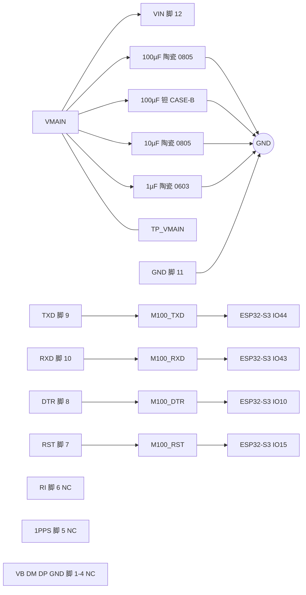

# M100EG-C2 外围电路设计与接线

> 最近核验：**通过**（覆盖 M100EG-C2 全部 12 个引脚及其全部外围元件）
> 手册：`M100EG-C2-银尔达产品文档.pdf`，银尔达（yinerda）官方产品文档，**无修订号**（文档最后更新 2026-08-13，17 页）md5 `282426c12cbde2949969d8d49ec0e8f1`
> 收口日期：2026-09-18 ｜ 库存快照：`库存列表-20260913211039.xlsx`（2026-09-13 21:10:39）
> 事实源：[`电子木鱼-硬件原理图设计基线.md`](../电子木鱼-硬件原理图设计基线.md)、[`电子木鱼-硬件网络清单.json`](../电子木鱼-硬件网络清单.json)、[`电源网络命名规范.md`](../电源网络命名规范.md)
>
> 本版只覆盖**电路设计与手册核验**。ERC、PCB DRC、示波器、电子负载、热测试与样机测试均未执行。

本文档以**引脚号、网络名和功能位置**为索引。位号由嘉立创 EDA 在每次导出时生成并在设计期持续重排，不写入本文档；查询「板上哪一颗是哪个」以 EDA 工程为准。

## 1. 依据与核验范围

### 1.1 依据

- **手册**：`docs/hardware/芯片手册/M100EG-C2-银尔达产品文档.pdf`，银尔达（yinerda）官方产品文档，**无修订号**，页脚标注 17 页，md5 `282426c12cbde2949969d8d49ec0e8f1`。本版用到第 3 页（特性、硬件参数表：供电 3.3~4.2 V／10 W、工作温度、TTL 串口电平与波特率、`RST` 电平范围）、第 4 页（硬件资源表：顶部排针 `VIN`／`GND`／`RXD`／`TXD`／`DTR`／`RST`／`RI`／`1PPS`，底部 USB 四脚，天线、按键与卡槽）、第 6 页（串口交叉接法、各控制脚电平范围、`RI` 与 `1PPS` 功能定义）、第 10 页（供电注意事项：不得用 3.3 V、推荐 3.8 V／2 A、锂亚电池需加电容）。
- **库存**：`库存列表-20260913211039.xlsx`，快照 2026-09-13 21:10:39，可用 = 在库 − 占用。
- **嘉立创页面**：2026-09-18 核对（见第 4 节）。

### 1.2 核验范围

银尔达 `M100EG-C2` 的全部 12 个引脚（脚 1~12），覆盖 12/12 脚。外围元件为 `VMAIN` 供电网络上的 4 条去耦与储能支路。`VMAIN` 同时供 TLV62569 输入，网内其余电容属该器件认领，不在本文档范围。

**对象识别**：`M100EG-C2` 是银尔达推出的 4G+GPS 二合一 DTU 核心板，内嵌合宙 `Air780EGP` 模组（实物丝印 `Air780E` 与 `GP` 分行印刷）。外形 25.00 × 25.50 mm，2.54 mm 排针。本版为 **AT 固件、3.3~4.2 V 供电** 版本；同系列另有 DTU 固件版本，两者硬件不同且固件不可互刷（手册第 3 页）。

**引脚编号与实物对应**：本文档逐脚表沿用原理图符号编号。实物顶部排针自左至右为 `VIN`、`GND`、`RXD`、`TXD`、`DTR`、`RST`、`RI`、`1PPS`，对应符号编号 12→5；底部四脚为 USB 的 `VB`、`DM`、`DP`、`GND`，对应符号编号 1~4。

### 未闭合事项

| 事项 | 类型 | 影响或阻塞 | 依据 / 方法 |
|---|---|---|---|
| 排针逐脚序号未随手册给出 | 外部确认 | 符号编号与实物焊盘的映射目前依赖实物核对，无书面依据 | 手册第 4 页只列信号名与实物照片，无序号表；已按实物确认，如需书面依据向银尔达索取 |
| `DTR` 唤醒有效极性 | 外部确认 | 固件唤醒／休眠时序无法定稿 | 手册第 3、6 页只写「范围 3.3~5 V」，未给极性；可样机实测波形替代 |
| `RST` 有效电平与方向 | 外部确认 | 固件异常恢复流程无法定稿 | 手册第 3、6 页只写「范围 3.3~5 V」「有条件建议 MCU 使用」，未给有效电平；可样机实测波形替代 |
| `VIN` 去耦容值无手册推荐值 | 外部确认 | 现有取值来自工程核算而非原厂规格 | 手册全文未给去耦公式或推荐值，仅第 10 页提示「3.6 V 锂亚电池供电要加电容」 |
| 低频储能电容的降额复核 | 外部确认 | 若实装为 MnO₂ 钽电容，工作电压对额定为 65%，超出常规 ≤50% 降额线 | 见 §3.3；确认实装型号，或换聚合物型（降额线 80%） |
| `BQ25895` 的 `SYS_MIN` 必须保持 ≥3.5 V | 固件配合 | 配到 3.0 V 时 `VMAIN` 下限降至 2.93 V，低于本模组 3.3 V 下限，会欠压重启 | 见 §3.2；写入 BQ25895 驱动配置约束 |
| 发射瞬间 `VMAIN` 凹陷深度 | 样机实测 | 下限余量 125 mV，需实测确认 | 弱网满功率发射时用示波器测 `TP_VMAIN` |
| `VMAIN` 载流口径 | 跨文档修改 | 手册标 10 W（3.3 V 折算约 3.0 A），基线 §5.5 写「持续 >1 A、瞬时约 1.5–2 A」，两者不一致 | 按 10 W 重新核算 TPS22965 → `VMAIN` 的铜宽与载流，见 §3.1 |
| 原理图符号名拼写 | 跨文档修改 | 符号名作 `Air80EGP`，实物与手册为 `Air780EGP` | 统一为 `Air780EGP` |
| ERC | 样机实测 | 未跑 | 嘉立创 EDA |
| PCB DRC | 样机实测 | 未跑 | 嘉立创 EDA |
| 样机验证 | 样机实测 | 联网、发射峰值、天线与散热均未实测 | 弱网满功率发射配合示波器与电子负载 |

## 2. 芯片逐脚接线和总接线图

| 脚号 | 名称 | 接法 | 状态 |
|---:|---|---|---|
| 1 | （符号未命名，实物 USB `VB`） | 不接 | NC |
| 2 | （符号未命名，实物 USB `DM`） | 不接 | NC |
| 3 | （符号未命名，实物 USB `DP`） | 不接 | NC |
| 4 | （符号未命名，实物 USB `GND`） | 不接 | NC |
| 5 | `1PPS` | 不接 | NC |
| 6 | `RI` | 不接 | NC |
| 7 | `RST` | `M100_RST`，接主控 IO15 | 符合 |
| 8 | `DTR` | `M100_DTR`，接主控 IO10 | 符合 |
| 9 | `TXD` | `M100_TXD`，接主控 IO44（UART RX） | 符合 |
| 10 | `RXD` | `M100_RXD`，接主控 IO43（UART TX） | 符合 |
| 11 | `GND` | `GND` | 符合 |
| 12 | `VIN` | `VMAIN` | 符合 |

脚 1~4 为载板 USB 下载／调试口。本项目经主控侧 USB-Serial-JTAG 下载与看日志，载板 USB 不使用，四脚全部不接。脚 5、6 在实物排针上为 `1PPS`（GPS 定位成功输出秒脉冲，3.3 V）与 `RI`（主串口振铃提示输出）；原理图符号对这两脚的标注与实物名不同，已确认不影响功能，本版不修改符号。GPS 非 MVP，两脚均为纯输出，悬空不构成电流回路。

图中 4 条电容支路并联在 `VMAIN` 与 `GND` 之间，`VMAIN --- TP_VMAIN` 为无方向的测试点连接。`RI`、`1PPS` 与底部 USB 四脚在板上无连接，图中不画连线。

## 3. 参数复算与选型

银尔达文档**未给任何外围元件公式或推荐值**。本章取值来自两条途径：供电链路按链路器件原厂手册核算，去耦网络按工程惯例选型。两处都不属手册依据，已在 §1 未闭合事项登记。

### 3.1 供电链路载流与压降

**需求**：手册第 3 页标「电源参数 3.3~4.2 V（10 W）」。10 W 是电源设计余量口径（覆盖发射尖峰），不是持续功耗——同页给出的待机电流为 5.7~8 mA。按最坏工作点（电压最低、电流最大）折算：`I = 10 W ÷ 3.43 V ≈ 2.92 A`。

**链路压降**（`VBAT` → BQ25895 BATFET → `VSYS` → TPS22965 → `VMAIN`）：

| 环节 | 导通电阻 | 3 A 时压降 | 依据 |
|---|---|---:|---|
| BQ25895 BATFET | 11 mΩ 典型／19 mΩ 最大 | 57 mV | `bq25895.pdf` SLUSC88C p.6–7 |
| TPS22965 | 23 mΩ 最大（`VBIAS`=5 V）／27 mΩ 最大（`VBIAS`=2.5 V） | 75 mV | `TPS22965-RevF.pdf` p.6–7 |
| 串联合计 | 44 mΩ | 132 mV | — |

TPS22965 的 `VBIAS` 接 `VSYS`（3.43~4.07 V），不在手册标定的 5 V 上。手册给了 `VBIAS`=5 V 与 2.5 V 两组数据，`RON` 由 23 mΩ 升至 27 mΩ；本设计按其间的 25 mΩ 上限取值，落在手册推荐的 2.5~5.7 V 工作范围内。

**余量**：TPS22965 连续电流能力 6 A、BQ25895 `ISYS` 5 A，对 `VMAIN` 峰值 3.52 A（本模组 2.92 A ＋ TLV62569 输入折算 0.54 A ＋ WS2811 与指示灯 0.06 A）分别有 1.7× 与 1.4× 余量。

### 3.2 电压窗口

BQ25895 的 `SYS_MIN`（REG03[3:1]）范围 3.0~3.7 V，**默认 3.5 V**。

| 工况 | `VMAIN` |
|---|---|
| 电池满充 4.2 V（BATFET 全导通） | 4.07 V |
| 电池耗尽（`SYS` 被调节在 `SYS_MIN`=3.5 V） | 3.43 V |

`VMAIN` 实际范围 **3.43~4.07 V**，落在本模组 3.3~4.2 V 之内，**下限余量 125 mV**。

手册第 10 页明确警告「**不要用 3.3 V 防止纹波导致电源跌了**」。因此 **`SYS_MIN` 必须保持 ≥3.5 V**：若配到 3.0 V，`VMAIN` 下限降至 2.93 V，低于模组下限，发射时必然欠压重启。该约束需写入 BQ25895 驱动配置，不能依赖默认值兜底。

### 3.3 去耦与储能网络

手册未给推荐值。本网络按三级频率分工选型：

| 支路 | 取值 | 选型依据 |
|---|---|---|
| 低频储能 | 100 µF 钽／CASE-B | 容量不随偏压衰减，提供中低频储能 |
| 低 ESR 储能 | 100 µF 陶瓷／0805 | 陶瓷 ESR 极低，承担发射瞬态的低阻抗通路 |
| 中频去耦 | 10 µF 陶瓷／0805 | 25 V 额定在 4 V 工作点下的容量保持率优于小封装同容值件 |
| 高频去耦 | 1 µF 陶瓷／0603 | 靠近 `VIN` 脚抑制高频噪声 |

**钽电容降额复核（未闭合）**：若低频储能实装为 MnO₂ 钽电容，工作电压 4.07 V 对额定 6.3 V 为 **65%**，超出常规 MnO₂ 钽 ≤50% 的降额线，超线后失效模式为热失控。聚合物钽的降额线为 80%（对应 5.04 V），在本工作电压下安全。**需确认实装型号；若为 MnO₂ 型，应换聚合物型同规格件**。

### 3.4 串口电平与交叉

手册第 3 页标 TTL 串口「兼容 3.3 V、5 V 电平」，第 6 页给交叉接法为「串口工具 TXD → DTU RXD，串口工具 RXD → DTU TXD」。主控侧为 ESP32-S3，3.3 V 电平落在兼容范围内。四路信号按手册第 6 页的交叉方向落图：载板 `TXD`（脚 9）→ `M100_TXD` → 主控 IO44（UART RX）；载板 `RXD`（脚 10）→ `M100_RXD` → 主控 IO43（UART TX）。`DTR`（脚 8）与 `RST`（脚 7）为控制输入，同侧直连主控 IO10 与 IO15。

### 3.5 由选型决定的软件配置

| 配置项 | 取值 | 约束来源 |
|---|---|---|
| BQ25895 `SYS_MIN`（REG03[3:1]） | **不得低于 3.5 V** | §3.2；低于此值 `VMAIN` 跌破模组 3.3 V 下限 |
| UART 实例与引脚 | UART1，TX=IO43、RX=IO44 | 单一 AT 事务所有权；不与 UART0 混用 |
| `DTR` 极性 | 待确认，确认后写入驱动 | §1 未闭合事项 |

### 3.6 本设计的硬件边界（非软件可改的默认行为）

- 模组上电后的默认串口波特率手册未给（只给可配置范围 1200~460800，第 3 页），固件侧需按实际握手结果适配。
- `DTR` 悬空时的模组默认状态、`RST` 悬空时的默认电平，手册均未说明（第 3、6 页只给电平范围）。本设计中 `DTR` 由主控 IO10 驱动、`RST` 由主控 IO15 驱动，均非悬空，但两者的有效极性需实测后才能确定上电初值。
- 载板 USB 四脚不接，模组无法经载板 USB 口下载或读日志；下载与调试一律走主控侧 USB-Serial-JTAG。

## 4. BOM 表

| 用途 | 单板量 | 目标规格及型号 | 嘉立创编号 | 可用库存快照 | 嘉立创/库存 |
|---|---:|---|---|---|---|
| 4G+GPS 主控模组 | 1 | M100EG-C2，银尔达，内嵌 Air780EGP，AT 固件／3.3~4.2 V 版本 | 未检出 | 未检出 | 外部采购 |
| `VIN` 低频储能 | 1 | CA45-B-6.3V-100uF-M，100µF/6.3V/CASE-B-3528 | C140373 | 可用 3（在库 3 − 占用 0，快照 2026-09-13） | 库存领用 |
| `VIN` 低 ESR 储能 | 1 | GRM21BR60J107ME15L，100µF/6.3V/X5R/0805 | C141660 | 可用 3（在库 3 − 占用 0，快照 2026-09-13） | 库存领用 |
| `VIN` 中频去耦 | 1 | CL21A106KAYNNNE，10µF/25V/X5R/0805 | C15850 | 可用 21（在库 26 − 占用 5，快照 2026-09-13） | 库存领用 |
| `VIN` 高频去耦 | 1 | CL10A105KP8NNNC，1µF/10V/X5R/0603 | C26413 | 可用 241（在库 241 − 占用 0，快照 2026-09-13） | 库存领用 |

**1. 逐行待办**

| 行 | 还需做什么 |
|---|---|
| 主控模组 | 属外部采购件，非嘉立创现货；采购时需指明「AT 固件、3.3~4.2 V 供电」版本，AT 版与 DTU 版硬件不同且固件不可互刷（手册第 3 页） |
| `VIN` 低频储能 | **确认实装为聚合物型还是 MnO₂ 型**（见 §3.3）；若为 MnO₂ 型需换料 |
| `VIN` 低 ESR 储能 | 无。0805 封装落图时需确认与相邻元件的净空 |
| `VIN` 中频去耦 | 无 |
| `VIN` 高频去耦 | 无 |

**2. 单板合计与全板同料合计**

- `C15850`（10µF/25V/0805）：本对象 1 颗（`VMAIN` 去耦）；全板 `C0805/10uF` 共 6 只，其余 5 只分布在 `PMID`、`VBUS`、`VBAT`、`VLCD` 各 1 与 `VMAIN` 另 1 只 → **全板 6 颗**，可用 21 颗，**无缺口**。
- `C26413`（1µF/10V/0603）：本对象 1 颗；全板另有 ESP32-S3 文档 1 颗、CW2015 文档 1 颗、WS2811 文档 1 颗，及落在共享 `V3V3` 网络无法归属单一器件的 1 颗 → **全板 5 颗**，可用 241 颗，**无缺口**。
- `C140373`（100µF/CASE-B）、`C141660`（100µF/0805）：各仅本对象 1 颗，可用各 3 颗，**无缺口**。
- 已知既有缺口（非本对象引入）：`C45783`（22µF/25V/0805）在 BQ25895 文档认领 3 颗而可用仅 2 颗，**缺 1 颗**。本对象未使用该料号。

**3. 采购清单**

| 编号 | 型号 | 数量 | 说明 |
|---|---|---:|---|
| 未检出 | M100EG-C2（银尔达，AT 固件／3.3~4.2 V 版） | 1 | 外部采购 |
| `C45783` | CL21A226MAQNNNE | 1 | 既有缺口，非本对象引入，建议同批采购 |
