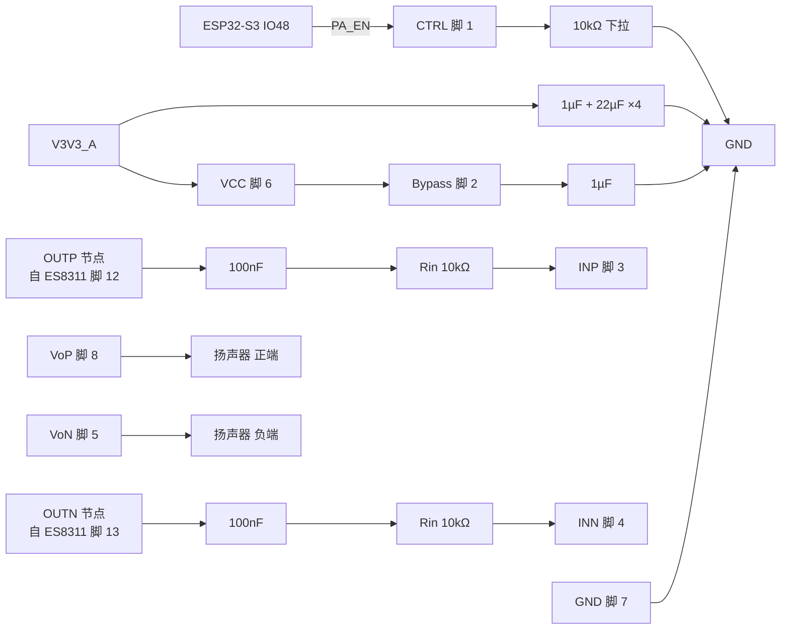

# NS4150B 外围电路设计与接线

> 最近核验：**接线与手册核验通过**（2026-09-23）
> 手册：`NS4150B.pdf`，深圳市纳芯威科技有限公司（Nsiway）**NS4150B Mar.2021 V1.1**（8 页）
> 收口日期：2026-09-23
> 事实源：嘉立创 EDA 工程实测（`Schematic1` 第 2 页「音频/传感模块」）、[`电子木鱼-硬件原理图设计基线.md`](../电子木鱼-硬件原理图设计基线.md) §5.3、[`电源网络命名规范.md`](../电源网络命名规范.md)、上述手册
>
> **ERC、PCB DRC、示波器、声学与热测试仍未执行**；本文的「通过」指**接线与手册级参数核验通过**，不代表样机验证。
>
> **本版不写器件位号**，遵循 [`电子木鱼-硬件网络清单.json`](../电子木鱼-硬件网络清单.json) 的 `designator_policy`：位号由嘉立创 EDA 在每次导出时生成并在设计期持续重排，固化进文档即会过期。本文档以**引脚号、网络名和元件值**为索引；查询「板上哪一颗是哪个」以 EDA 工程为准。

## 1. 依据与核验范围

**手册**（`NS4150B.pdf`，Nsiway NS4150B Mar.2021 V1.1，8 页）用到以下章节：

- 第 1 页 §1 特性、§4 典型应用电路（`0.1 µF + 30 K` 输入网络、`1 µF + 1 nF` VDD 去耦、`1 µF` Bypass）
- 第 2 页 §5 管脚配置与管脚描述、§6 极限工作参数
- 第 3 页 §7 电气特性（VDD 范围、I_DD、V_OS、THD+N、PSRR/CMRR、V_IH/V_IL、启动/关断时间）
- 第 6 页 §9.1 芯片基本结构、§9.2–§9.4 无滤波输出与 EMI 抑制
- 第 7 页 §9.5 CTRL 电平设置、§9.7 保护电路、**§9.8 电源去耦电容**、**§9.9 增益设置和输入电阻**、§9.10 输入滤波器（起）
- 第 8 页 §9.10 输入滤波器（续，含**截止频率公式**）、§9.11 磁珠与电容

**本次核验范围**：NS4150B（MSOP-8，板上唯一 MSOP-8 器件）的全部 8 个引脚，以及本板与之相连的全部外围元件 —— `V3V3_A` 供电去耦、`CTRL` 下拉、`Bypass` 去耦、差分输入耦合与串联网络、BTL 输出至扬声器连接器。

**不在本文档范围**：上游 `ES8311` 的 `OUTP`/`OUTN` 输出网络（属《ES8311 外围电路设计与接线》）；`V3V3_A` 网络本身的设计与磁珠（属电源基线 §3.2.1）；扬声器的阻抗、腔体与声学（属结构/声学验收）。

### 未闭合事项

| 事项 | 类型 | 影响或阻塞 | 依据 / 方法 |
|---|---|---|---|
| **输入电阻 10 kΩ 使增益高于手册典型值** | 设计确认 | 手册 §9.9 给出 `A_VD = 240 kΩ / Rin`，增益完全由外接输入电阻决定。本设计 Rin = 10 kΩ → **A = 24 倍（27.6 dB）**；手册典型应用为 30 kΩ → 8 倍（18.06 dB），基线 §5.3.2 曾推荐 100 kΩ → 2.4 倍（7.6 dB）。**本设计比手册典型高 9.5 dB**，响度约为手册典型方案的 3 倍，会把 ES8311 的可用音量范围向低端压缩，并放大系统本底噪声。功能上可用（软件可将 ES8311 数字音量下调补偿），**但须实测确认不削顶** | 见 §3；示波器测满音量输出波形与 THD |
| **输入高通截止频率 175 Hz** | 设计确认 | 手册 §9.10 给出 `fc = 1/(2π·Rin·Cin)`。本设计 Rin = 10 kΩ，Cin 为 1 µF 与 100 nF 串联 ≈ 90.9 nF → **fc ≈ 175 Hz**；手册典型（30 kΩ + 100 nF）为 53 Hz。手册判据为「扬声器不能够再现低于 100Hz–150Hz 的低频语音」，本设计下限略高于该边界 | 见 §3；扫频测频响 |
| 扬声器阻抗与腔体 | 结构确认 | 手册 §7 的输出功率/THD 标定条件是 RL = 4 Ω 与 8 Ω；本设计扬声器未定 | 腔体与扬声器选型确认 |
| 扬声器连接器规格 | 结构确认 | 基线 §5.6 写「2.0 mm/2.54 mm 连接器料号待腔体确认」，实测为 **P1.25 卧贴 2P**（`CONN-TH_2P-P1.25_XUNPU_WAFER-GH1.25-2PLB`） | 腔体与线材选型确认 |
| `PA_EN` 上电时序 | 样机实测 | 手册 §9.6 给出启动时间 Tst 典型 120 ms；基线要求「`PA_EN` 只有在 `V3V3_A` 稳定后才可拉高」，本设计 `PA_EN` = ESP32-S3 IO48，时序由固件保证 | 示波器同测 `V3V3_A` 与 `PA_EN` |
| 爆音、温升、削顶 | 样机实测 | 未测 | 目标腔体声学标定 |
| ERC | 样机实测 | 未跑 | 嘉立创 EDA |
| PCB DRC | 样机实测 | 未跑 | 嘉立创 EDA |
| 样机验证 | 样机实测 | 播放通路、输出功率、底噪、失真均未实测 | 示波器、音频分析仪、电子负载 |

## 2. 芯片逐脚接线和总接线图

引脚名与描述取自手册 §5 管脚配置表。

| 脚号 | 名称 | 手册描述 | 接法 | 元件值 | 状态 |
|---:|---|---|---|---|---|
| 1 | CTRL | 工作模式控制，低电平 Shutdown | `PA_EN` → ESP32-S3 IO48；另经下拉电阻至 `GND` | 10 kΩ 下拉 | 符合（§9.5：H=Open / L=Shutdown） |
| 2 | Bypass | 内部共模电压旁路电容脚，接 1 µF 电容至 GND | 经电容至 `GND` | 1 µF | 符合（手册明文 1 µF） |
| 3 | INP | 音频输入正极 | 经串联电阻，接 100 nF 耦合自 `OUTP` 节点 | 10 kΩ 串联 + 100 nF | **核验通过，增益见 §3** |
| 4 | INN | 音频输入负极 | 经串联电阻，接 100 nF 耦合自 `OUTN` 节点 | 10 kΩ 串联 + 100 nF | **核验通过，增益见 §3** |
| 5 | VoN | 音频输出负极 | 扬声器连接器脚 2 | — | 符合 |
| 6 | VCC | 电源输入及音频功率管供电脚 | `V3V3_A`；另经去耦至 `GND` | 1 µF ×1 + 22 µF ×4 | 符合（§9.8） |
| 7 | GND | 地 | `GND` | — | 符合 |
| 8 | VoP | 音频输出正极 | 扬声器连接器脚 1 | — | 符合 |

`VCC` 的去耦电容组（1 µF + 四颗 22 µF）就近布置于功放入口，只挂在 `V3V3_A` 上，不与 ES8311 共网。输出为 BTL 差分，直接驱动单声道扬声器。

**输出端不设磁珠与 1 nF**：手册 §9.11 明确「NS4150B 在没有磁珠和电容的情况下，对 60cm 的音频线，仍可满足 FCC 标准要求。在输出音频线过长或器件布局靠近 EMI 敏感设备时，建议使用磁珠、电容」。基线 §5.3.2 曾把「输出端 0 Ω 料位与 1 nF EMI 预留」列为建议项 —— 手册判据下**本设计省去该网络属合规**，非缺陷。若后续 EMI 测试不过或音频线加长，再按手册 §9.11 补磁珠 + 1 nF。

## 3. 参数复算与选型

| 项目 | 手册依据 | 代入与结果 | 判定 |
|---|---|---|---|
| **增益** | §9.9：`A_VD = 240 kΩ / Rin`，Rin 为**外接**输入电阻 | Rin = 10 kΩ → **A = 24 倍（27.6 dB）**。手册典型应用 Rin = 30 kΩ → 8 倍（18.06 dB） | **高于手册典型 9.5 dB** |
| **输入高通截止** | §9.10：`fc = 1/(2π·Rin·Cin)` | Rin = 10 kΩ；Cin = 1 µF（ES8311 侧）与 100 nF（功放侧）串联 ≈ 90.9 nF → **fc ≈ 175 Hz**。手册典型（30 kΩ + 100 nF）→ 53 Hz | 略高于手册所述 100–150 Hz 边界 |
| VCC 工作范围 | §6 极限：-0.3 ~ 5.25 V；§7 推荐：2.2 ~ 5.0 V（标准值 3.0 V，测试条件 VDD = 4.8 V） | `V3V3_A` = 3.3 V | **符合** |
| CTRL 电平 | §9.5：H = Open，L = Shutdown；§7：V_IH ≥ 1.2 V，V_IL ≤ 0.2 V | `PA_EN` = 3.3 V 高电平使能；下拉时 0 V 关断 | **符合** |
| Bypass 电容 | §5 管脚描述：「接 1 uF 电容至 GND」 | 1 µF 至 `GND` | **符合**（手册明文值） |
| VDD 去耦 | §9.8：「一般使用 1uF 的陶瓷电容…如果希望更好地滤除低频噪声，则需要根据具体应用添加一个 10uF 或更大的去耦电容」 | 1 µF ×1 + 22 µF ×4 | **符合且超出**（22 µF 远大于手册建议的 10 µF） |
| 供电域 | 基线 §3.2.1：「功放不得直挂 `VMAIN`」「`V3V3_A` 只隔离 Class-D 脉冲」 | `V3V3_A` 网络端点仅为功放 `VCC` + 去耦 + 磁珠 + 测试点 | **符合** |
| 静态电流 | §7：`I_DD` 标准值 3.0 mA（VIN=0V，VDD=3.6V，No Load）；`I_SD` 关断漏电 ≤ 10 µA | 详见下方 `CTRL` 下拉功耗说明 | — |

**`CTRL` 下拉阻值的功耗核算**：以下拉电阻把工作态 `CTRL` 拉低会增加静态功耗。3.3 V 域下，10 kΩ 下拉耗流约 330 µA、100 kΩ 约 33 µA。相对芯片自身 `I_DD` 标准值 3.0 mA，**330 µA 占约 11%**，在 SM-7 一天续航指标下可忽略；而更低阻值带来更强的抗干扰与更快关断边沿，**本设计取 10 kΩ 是可接受的工程取舍**。

**增益与频响的实测建议**：本设计增益 27.6 dB 与 fc 175 Hz 均**不违反手册任何强制条款**（手册只给典型应用值，未规定 Rin 必须 30 kΩ），但两项都偏离手册典型。落地前建议：

1. **响度与削顶**：在 ES8311 满幅输出条件下测量功放输出波形。3.3 V BTL 供电的理论最大输出约 2.3 Vrms（4 Ω）、约 2.0 Vrms（8 Ω），而 24 倍增益意味着 ES8311 输出超过约 0.1 Vrms 即可能削顶 —— **固件必须对 ES8311 数字音量设上限**，并实测满音量下的 THD。
2. **低频响应**：木鱼音的频谱重心在数百 Hz 以上，175 Hz 的 −3 dB 点通常可接受；若主观听感偏"薄"，改 Rin 至 30 kΩ 可同时把 fc 降到 58 Hz 并让增益回到手册典型 18 dB。
3. **若维持 10 kΩ**，请在 BOM 与装配说明中保留本节的增益偏离记录，避免后续被误当作手册典型值使用。

**由选型决定的软件配置**（供固件参照）：

- `PA_EN` = ESP32-S3 IO48，**高电平使能**功放；下拉电阻保证主控复位或 IO48 高阻期间功放关断。
- 手册 §9.6：启动时间 Tst 典型 120 ms，关断时间 Tsd 典型 80 ms。固件在 `V3V3_A` 稳定后拉高 `PA_EN`，并在静音、故障、完成锁定等状态拉低。
- **音量控制只能在 ES8311 的数字域完成** —— NS4150B 的增益由外接 Rin 硬决定，运行期不可调；本设计固定为 27.6 dB（见上）。
- 关断态（`CTRL` = 0）下 `I_SD` ≤ 10 µA，适合低功耗待机。

## 4. BOM 表

| 用途 | 单板量 | 目标规格及型号 | 嘉立创编号 | 说明 |
|---|---:|---|---|---|
| 扬声器功放 | 1 | NS4150B，MSOP-8 | C189961 | EDA 符号名为 `NS4150B_C189961`；基线 §5.7 记为「已确认功能」 |
| VCC 去耦 | 5 | 1 µF ×1 + 22 µF ×4，0603/0805 | C26413 / C45783 | 22 µF 为采购缺口项（见《BOM 封装统一与库存排查》） |
| Bypass 去耦 | 1 | 1 µF，0603 | C26413 | 手册 §5 明文值；与 ES8311／CW2015／ESP32-S3／WS2811／M100 文档共料 |
| 输入耦合 | 2 | 100 nF，0603 | 见全板同料合计 | 手册典型应用同为 0.1 µF |
| **输入电阻（决定增益）** | 2 | **10 kΩ，0603** | C25804 | 手册典型为 30 kΩ；本设计 10 kΩ → 增益 27.6 dB，见 §3 |
| `PA_EN` 下拉 | 1 | 10 kΩ，0603 | C25804 | 同上料号 |
| 扬声器连接器 | 1 | `CONN-TH_2P-P1.25_XUNPU_WAFER-GH1.25-2PLB`，2P 1.25 mm | 待核 | 与基线 §5.6「2.0/2.54 mm 待腔体确认」不一致 |

### 逐行待办

- **输入电阻两处（10 kΩ）**：本行是**决定增益**的元件，不是普通偏置电阻。若后续决定改用 30 kΩ，须同时更新本节 §3 的增益与 fc 记录；与全板 10 kΩ 同料（C25804，可用 50 颗），改值不影响库存结论。
- **`PA_EN` 下拉（10 kΩ）**：可接受，见 §3 功耗核算；无需改动。
- **输出端磁珠/1 nF**：本板未设，手册 §9.11 判据下合规；仅在 EMI 实测不过或音频线加长时按手册补设。
- **22 µF（C45783）**：全板需 9 颗而库存仅 2 颗，是已登记的采购缺口；本器件认领 4 颗。
- **扬声器连接器**：嘉立创编号待核，须与腔体/线材一并确认。

### 采购清单

- **NS4150B（C189961）**：下单前复核商品页库存与封装。
- **22 µF（C45783）**：本器件认领 4 颗，须并入全板采购缺口。
- **扬声器连接器**：嘉立创编号待核。
- 其余料号可从库存领用。

---

**维护提示**：本文件顶部「最近核验」为 **接线与手册核验通过**，**不是**样机「已验证」。原理图若对 NS4150B 或输入网络做出任何改动（尤其改动 Rin），须在顶部插入失效标记并重新核验。
