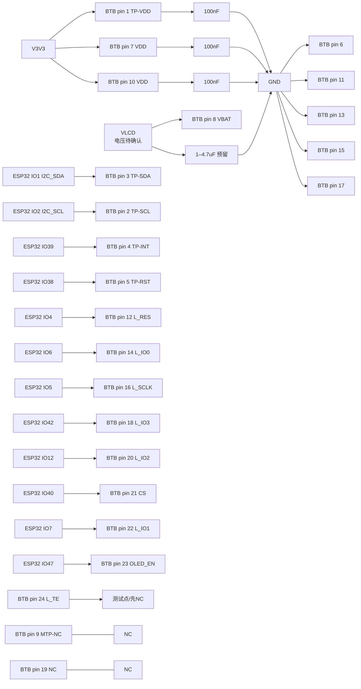

# PY206-W38-V2 24-pin 与 OK-14F024-04 接线分析

> 状态：开发分析稿；未锁定 TE 用法、FPC 接触面与样机时序。
> 日期：2026-09-16（电源侧 2026-09-17 更新）
>
> 电源侧结论（2026-09-17 更新）：pin 8 的电压依据已补齐（模组内 OCP21351 的 VIN 推荐 2.9–4.6 V），`VLCD` 来源确定为「`V3V3` 经默认装配的 0 Ω 源选择位」，并以 DNP 的备选 0 Ω 预留 `VMAIN`。第 1 节第 3 条、第 2 节 pin 8 行与第 3.1 节已按此更新。
> 目标器件：屏幕模组 `PY206-W38-V2`，主板 BTB 母座 `OK-14F024-04`；屏幕排线配对端应为 `OK-14GM024-04`。
> 主要依据：`docs/hardware/芯片手册/3593896291PY206-W38-V2.pdf`，Rev A，2025-06-28；第 3 页 24-pin 表、第 4 页接口示意、第 8 页电气特性、第 9 页外形/针脚方向。
> 项目事实源：`电子木鱼-硬件原理图设计基线.md`、`电子木鱼-硬件网络清单.json`、根 `AGENTS.md`。

## 1. 先给结论

1. `OK-14F024-04` 是主板端 24-pin BTB 母座；它的 1–24 号网络必须与屏幕排线的同号端子一一对应。不要按图片左右排布猜测脚号，先以连接器 pin 1 标记和屏幕接触面确认方向。
2. 你截图中的 QSPI/触摸控制映射（`LCD_D0/D1/D2/D3`、`LCD_SCLK`、`LCD_CS`、`LCD_RST`、`LCD_EN`、I²C、TP_INT/TP_RST）与项目 GPIO 合同一致；但电源、地和 NC 脚不能悬空，必须按下表落图。
3. PDF pin 8 是 `VBAT`，第 4 页示意标为 `VBAT_3.5V`。它不是 pin 7/10 的 `VDD 3V`，而是模组内 **OCP21351 电源 IC 的 VIN**（推荐 2.9–4.6 V，typ 3.7 V）。**电源侧结论已更新**：`VLCD` 由 `V3V3` 经默认装配的 0 Ω 源选择位取得，并以 DNP 的备选 0 Ω 预留 `VMAIN` 备选位。
4. pin 24 `L TE` 是撕裂同步输出。项目当前没有专用 `LCD_TE` GPIO 合同，MVP 可先 NC，但应保留测试点；若固件启用 TE，再把它作为屏幕输入脚接入，并确认电平和中断策略。
5. `CO5300`、`CST9217`、`OCP21351` 已集成在 PY206 模组内，主板不要重复放置这些芯片；主板只放 BTB、去耦/滤波、可选 ESD 与测试点。

## 2. 24-pin 逐脚接线表

| pin | PDF 符号/功能 | 主板网络建议 | ESP32/处理 | 落图结论 |
|---:|---|---|---|---|
| 1 | `TP-VDD 3V`，触摸供电 | `V3V3` | — | 接 V3V3；连接器近端 100 nF，电压/时序待样机 |
| 2 | `TP SCL 3V`，触摸 I²C 时钟 | `I2C_SCL` | IO2 | 接共享 I²C；全板只保留一组上拉 |
| 3 | `TP-SDA 3V`，触摸 I²C 数据 | `I2C_SDA` | IO1 | 接共享 I²C；全板只保留一组上拉 |
| 4 | `TP INT 3V`，触摸中断 | `TP_INT` | IO39 | 接入；极性、是否开漏待实测 |
| 5 | `TPRST 3V`，触摸复位 | `TP_RST` | IO38 | 接入；复位有效电平待实测 |
| 6 | `TP-GND` | `GND` | — | 必须接地 |
| 7 | `VDD 3V`，显示逻辑/模组供电 | `V3V3` | — | 接 V3V3；近端去耦 |
| 8 | `VBAT`，示意图 `VBAT_3.5V` | `VLCD` | — | 独立命名；经默认装配的 0 Ω 源选择位从 `V3V3` 取，DNP 的备选 0 Ω 预留 `VMAIN` 备选位 |
| 9 | `MTP/NC` | `NC` | — | No Connect，禁止接地或接电源 |
| 10 | `VDD 3V`，显示逻辑/模组供电 | `V3V3` | — | 接 V3V3；与 pin 7 同源 |
| 11 | `GND` | `GND` | — | 必须接地 |
| 12 | `L RES`，CO5300 外部复位 | `LCD_RST` | IO4 | 接入；复位时序待实测 |
| 13 | `GND` | `GND` | — | 必须接地 |
| 14 | `L IO0`，QSPI 数据 0 | `LCD_D0` | IO6 | 接入 |
| 15 | `GND` | `GND` | — | 必须接地 |
| 16 | `L SCLK`，QSPI 时钟 | `LCD_SCLK` | IO5 | 接入；优先靠近 ESP32 预留串阻位 |
| 17 | `GND` | `GND` | — | 必须接地 |
| 18 | `L IO3`，QSPI 数据 3 | `LCD_D3` | IO42 | 接入 |
| 19 | `NC` | `NC` | — | No Connect |
| 20 | `L IO2`，QSPI 数据 2 | `LCD_D2` | IO12 | 接入 |
| 21 | `CS`，芯片选择 | `LCD_CS` | IO40 | 接入；低有效性按 CO5300 初始化确认 |
| 22 | `L IO1`，QSPI 数据 1 | `LCD_D1` | IO7 | 接入 |
| 23 | `OLE EN`/`OLED_EN`，面板电源 IC 使能 | `LCD_EN` | IO47 | 接入；极性和上电顺序待实测 |
| 24 | `L TE`，撕裂同步输出 | `LCD_TE`（测试点/预留） | 当前无专用 GPIO | MVP 先 NC 并留 TP；启用 TE 前重新分配 GPIO |

### 2.1 与你截图的逐项对照

- 已对上的信号：pin 2/3/4/5、12、14、16、18、20、21、22、23。
- 需要补齐为明确网络的信号：pin 1/6/7/8/9/10/11/13/15/17/19/24。
- 截图中 pin 24 顶部右侧没有网络名，这可以作为 `LCD_TE` 预留/测试点，但不能把它误当 `LCD_EN`。
- 截图中的 `LCD_D0`→pin14、`LCD_D1`→pin22、`LCD_D2`→pin20、`LCD_D3`→pin18、`LCD_SCLK`→pin16、`LCD_CS`→pin21 的编号与 PDF 一致。
- 连接器符号左右排列不等于实物接触面的左右排列。BTB 连接器封装导入后，必须核对 pin 1 三角/圆点、接触面朝向、丝印和 OK-14GM024-04 配合方向。

## 3. 推荐外围电路

### 3.1 电源与去耦

PDF 第 8 页给出的模组电气边界是：模拟 `VDD` 最小 2.7 V、典型 3.3 V、最大 3.6 V；输入高电平为 `0.7×VDDI` 至 `VDDI`，低电平不高于 `0.3×VDDI`。因此 pin 1/7/10 使用项目 `V3V3` 是合理的首版候选，但仍需确认 VDDI 的定义和模组实际上电时序。

建议在 BTB 主板侧放置：

- `C_TP_VDD`：100 nF，X7R，0603，`V3V3` 到 GND，靠近 pin 1。
- `C_LCD_VDD1`、`C_LCD_VDD2`：各 100 nF，X7R，0603，分别靠近 pin 7、pin 10；另在连接器电源入口放 1 µF。
- `VLCD`：先放测试点、串联 0 Ω（可替换磁珠）和 1–4.7 µF 到 GND 的预留位；具体电压、纹波、容值以 OCP21351/模组厂要求为准。
- `GND`：pin 6/11/13/15/17 五个回流脚全部接完整地平面，连接器下方不要切断回流路径。

`VLCD` 是 pin 8 的正式网络名，但在样机实测闭合前只能标为候选（`recommended_initial`），不得升级为已确认。若后续实测改选 `VMAIN` 直取（DNP 的备选 0 Ω 位），仍要检查 TPS22965 关闭时序、4G 压降、OLED 电源纹波、OCP21351 的输入上限余量（最坏只剩约 180–210 mV），以及 CO5300 的 VCI/VDDI 上限与上电顺序——判定 `VMAIN` 暂不作默认的依据见新文档 §2.3。

### 3.2 I²C 触摸

`I2C_SDA/SCL` 是全板共享总线，触摸端只保留一组总线上拉。上拉可按总线总电容和速度从 4.7 kΩ 起步；如果已有 BQ/CW2015/ES8311/QMI8658A 上拉，不要在 BTB 连接器旁重复并联一组。`TP_INT` 若为开漏，需要单独上拉；不要根据符号名推断为推挽输出。`TP_RST` 预留 0 Ω/串联位便于观察复位波形。

### 3.3 QSPI 显示

从 ESP32 到 BTB 连接器的 `LCD_SCLK/CS/D0–D3` 应成组、短线、连续参考地，远离 4G 天线、功放输出和开关节点。建议在 ESP32 端预留每根信号 22–33 Ω 串联电阻 DNP 位，首板用示波器按首帧波形决定是否装配；这些值不是 PDF 已规定的终值。

`LCD_RST`、`LCD_EN` 各预留测试点。上电顺序至少应满足：`V3V3` 与 `VLCD` 稳定 → `LCD_EN` 进入有效状态 → `LCD_RST` 按 CO5300 要求执行复位 → 再启动 QSPI。实际有效极性不能仅凭网络名称确认。

### 3.4 ESD 与连接器保护

BTB 很短时优先保证地回流和机械可靠性；若排线外露或整机有用户可触接口，可在主板连接器侧为 I²C/QSPI/控制线预留低电容 ESD 阵列位置。ESD 器件的结电容必须按 QSPI 边沿和 I²C 速度核对，不能把普通高电容 TVS 直接并到高速数据线上。ESD 是否装配取决于结构、线长和整机测试，不是本 PDF 的硬性要求。

## 4. 可直接落图的 Mermaid 接线



## 5. 当前设计状态与必须关闭的证据

### 已由 PDF/项目合同核对

- PY206-W38-V2 为 2.06 inch、410RGB(H)×502(V)、QSPI、CO5300AF-51、CST9217。
- 24-pin 号、符号和功能已按 PDF 第 3 页逐项抄录。
- ESP32 项目 GPIO 映射与现有硬件基线一致。
- 你截图中的 QSPI/触摸控制信号编号与 PDF 号位一致。

### 仍待确认

- `OK-14F024-04` 与屏幕端 `OK-14GM024-04` 的接触面、pin 1 方向、封装高度和焊盘编号。
- pin 8 `VBAT` 的允许电压、最大纹波、上电/掉电时序，以及它应接 `VSYS`、`VMAIN` 还是独立偏压轨。
- pin 1/7/10 的 VDD 与 VDDI 具体关系；PDF 第 8 页的 `VDDI` 数值未给出。
- `OLED_EN`、`L RES` 的有效极性和最小脉宽；`TP_RST`/`TP_INT` 的极性、电气类型和 I²C 地址。
- `L TE` 是否被 CO5300 初始化流程要求；若不使用，确认模块内部允许悬空。
- 首帧 QSPI 波形、显示复位、触摸响应、4G 发射时的 `VLCD` 压降和纹波。

当前不能把原理图截图中的“线画出来”、连接器符号保存或导入成功写成 ERC、网表、PCB DRC 或样机通过。

## 6. 厂商目录三份原理图的选择

本次核对目录：

| 文件 | 资料中对应的对象 | 连接器/接口形态 | 与本项目匹配度 | 结论 |
|---|---|---|---|---|
| `SCH_浦洋液晶2.06_AMOLED小面板转接板V1.0_2025-07-14.pdf` | `PY206W38B-V2`、2.06 inch、410×502 AMOLED，小面板适配板 | 屏幕侧 `OK-14F024-04` 24P BTB；另引出 14P 2.54 mm 调试/主控排针 | **最高** | 作为本项目参考原理图首选，但只迁移 pin 映射和去耦思路；不要直接复制它的 VCC/TE 处理 |
| `SCH_浦洋液晶2.06_AMOLED大面板转接板V1.0_2025-07-14.pdf` | `PY206W38B-V1`、2.06 inch、410×502 AMOLED，大面板适配板 | 同为 `OK-14F024-04` 24P BTB + 14P 2.54 mm 排针 | 中 | 只有在你实际拿到 V1 大面板时才选；机械板形和屏幕版本不对应当前 `PY206-W38-V2` |
| `SCH_浦洋液晶AMOLED转接板转思澈开发板V1.0_2025-07-14.pdf` | AMOLED 到思澈开发板的转接 | 使用另一侧 FPC/开发板连接器和 2.54 mm 排针；只引出部分信号 | **不适合作为 EWF 主板 BTB 连接器** | 只能用于思澈开发板联调，不能作为 `OK-14F024-04` 的直接落图依据 |

### 6.1 推荐采用方式

对你的 EWF 主板，推荐采用“小面板转接板”原理图作为 **V2 屏幕的信号命名和接口核对参考**，但在 EDA 中重新画一个主板 BTB 连接器：

```text
BTB 连接器 = OK-14F024-04（24P、0.4 mm、主板母座）
屏幕端 = OK-14GM024-04（配对排线公座）
BTB pin 1–24 = PY206 PDF pin 1–24，一号脚方向按实物确认
```

小面板图中的 14P 排针不是屏幕原生接口，而是转接板给外部控制板使用的信号排针。它的可用信号顺序为：

| 排针脚位 | 厂商网络 | 对 EWF 的对应 |
|---:|---|---|
| 14 | `GND` | GND |
| 13 | `VCC` | 不直接照搬；按 EWF 电源合同分成 `V3V3` 与待确认的 `VLCD` |
| 12 | `QSPI_CLK` | `LCD_SCLK` → IO5 |
| 11 | `QSPI_SIO0` | `LCD_D0` → IO6 |
| 10 | `QSPI_SIO1` | `LCD_D1` → IO7 |
| 9 | `QSPI_SIO2` | `LCD_D2` → IO12 |
| 8 | `QSPI_SIO3` | `LCD_D3` → IO42 |
| 7 | `QSPI_CS` | `LCD_CS` → IO40 |
| 6 | `QSPI_RST` | `LCD_RST` → IO4 |
| 5 | `AMOLED_TE` | `LCD_TE`；当前无专用 GPIO，先测试点/NC |
| 4 | `TP_SCL` | `I2C_SCL` → IO2 |
| 3 | `TP_SDA` | `I2C_SDA` → IO1 |
| 2 | `TP_INT` | `TP_INT` → IO39 |
| 1 | `TP_RST` | `TP_RST` → IO38 |

### 6.2 厂商图中必须修正或保留为待确认的地方

- 小面板图的 `VCC`、0.1 µF 与 10 µF 电容和指示灯的 4.7 kΩ 限流电阻可作为转接板参考，但它没有把 EWF 的 pin 8 单独表达为 `VLCD`。这部分不能直接复制；应按 PDF pin 8 `VBAT/VBAT_3.5V` 和 OCP21351/模组厂电源资料确认。
- 小面板图把 `AMOLED_TE` 引到 VCC 的画法与 PY206 PDF 第 3 页“TE tearing effect output”定义不一致。EWF 中 pin 24 先保留 `LCD_TE` 测试点/NC，不能默认上拉到电源。
- 厂商转接板只输出一个 `VCC`，不能证明 pin 1/7/10 与 pin 8 允许共用同一电源轨；EWF 仍需分别标注 `V3V3` 和 `VLCD`。
- 大面板图标题是 `PY206W38B-V1`，不能因连接器型号相同就替代 V2 的屏幕规格；至少要重新核对 FPC 针脚、机械方向和模组电源。
- 思澈开发板图的连接器标注为 `C46595978/PM254V-11-14-H85` 和 `FPC-05F-22PH20` 相关封装，属于开发板转接链路，不是本项目的 24P BTB 连接器；其中多个脚被 NC，不能从该图反推 PY206 的完整 24-pin 网络。

因此，当前选择是：**选“小面板转接板”作为 V2 的参考图；EWF 主板仍按 PY206 PDF 的 24-pin 表重新落 BTB 连接器，不直接复制任何一张转接板的电源和 TE 接法。**

## 7. 3 个 100 nF 与 1 个 4.7 µF 的库存选型

库存来源：`docs/hardware/外围电路设计/库存列表-20260913211039.xlsx`，快照时间 2026-09-13 21:10:39。可用库存按“在库库存 − 占用库存”计算；库存表未修改。以下用量对应 pin 1、7、10 的三路 V3V3 去耦和 pin 8 `VLCD` 的预留电容。

| 需求 | 推荐库存件 | LCSC 商品编号 | 封装/介质/耐压 | 在库 / 占用 / 可用 | 本次用量 | 结论 |
|---|---|---|---|---:|---:|---|
| 100 nF ×3 | `0603B104K500NT`（风华） | `C30926` | 0603，±10%，50 V；按现有项目记录为 X7R | 94 / 5 / 89 | 3 | **满足**；余 86。需在采购/封装资料中再次确认 X7R 与工作电压下有效电容 |
| 4.7 µF ×1 | `CL10A475KA8NQNC`（三星） | `C69335` | 0603，±10%，25 V，X5R | 50 / 0 / 50 | 1 | **满足**；余 49。需核对 3.3 V 或目标 `VLCD` 下 DC Bias 后的有效容量 |

### 7.1 落图位置

- `C_TP_VDD`：BTB pin 1（TP-VDD 3V）到 GND，使用 `C30926`，100 nF。
- `C_LCD_VDD1`：BTB pin 7（VDD 3V）到 GND，使用 `C30926`，100 nF。
- `C_LCD_VDD2`：BTB pin 10（VDD 3V）到 GND，使用 `C30926`，100 nF。
- `C_VLCD`：`VLCD` 到 GND，使用 `C69335`，4.7 µF；这是 pin 8 的预留电容，不能据此把 pin 8 的电压轨当成已确认。

### 7.2 选型边界

当前库存中 `C1525`（0402、100 nF、16 V）和 `C2846678`（0603、100 nF、16 V）也满足“容值/耐压”表面条件，但本接口首版已经有 0603/50 V 的 `C30926`，且三颗同料更便于 BOM 和装配管理，因此不作为本次首选。若后续确认空间或高速信号附近必须缩小封装，再单独评估 0402 的焊接和有效电容。

本次库存已找到合适器件，因此不需要为这 4 个电容追加嘉立创采购候选；`C30926`、`C69335` 本身就是库存表中的 LCSC 商品编号。库存数量是快照数据，下单或领料前仍需重新核对实物库存、MPN、封装和批次。MLCC 的 X5R/X7R、DC Bias、温升与实际纹波尚未通过样机测试。

完成嘉立创原理图后，可以提供清晰截图或原理图文件交给我审查。**强烈建议导出并提供网表文件**，同时附上同一版本的原理图 PDF/截图；若网表没有完整型号、耐压、封装或商品编号，请补充 BOM。我会逐项检查元件选型与接线是否符合设计预期，列出问题及具体修正，修改后可再导出文件复查。
