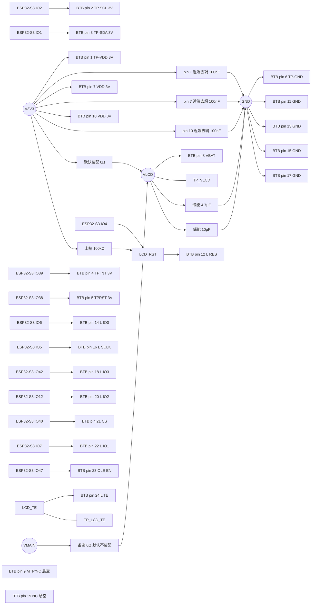

# PY206-W38-V2 与 OK-14F024-04 外围电路设计与接线

> 最近核验：通过（24/24 脚端点与接线逐条相符）
> 核验依据网表：`Netlist_Schematic1_2026-09-18.tel` SHA-256 `bfcf84f5c2edbe057b8a08cbaec9964c6e188f6df00ab0f4b16ff2b177b63b59`
> 手册：`3593896291PY206-W38-V2.pdf` Rev A（2025-06-28）md5 `ca7d8b4ca9f77af9493fa5525a809484`
> 厂商参考设计：`SCH_浦洋液晶2.06_AMOLED小面板转接板V1.0_2025-07-14.pdf` V1.0 md5 `a453126bfd1d2f9e8550e91d95a1f14d`
> 收口日期：2026-09-18 ｜ 库存快照：`库存列表-20260913211039.xlsx`（2026-09-13）
> 事实源：[硬件原理图设计基线](../电子木鱼-硬件原理图设计基线.md)｜[硬件网络清单](../电子木鱼-硬件网络清单.json)｜[电源网络命名规范](../电源网络命名规范.md)

## 1. 依据与核验范围

### 依据

| 类型 | 文件 | 版本 / 修订号 | md5 | 引用页码 |
|---|---|---|---|---|
| 屏模组手册 | `3593896291PY206-W38-V2.pdf` | Rev A（2025-06-28） | `ca7d8b4ca9f77af9493fa5525a809484` | 2（规格与器件表）、3（24-pin 输入接口脚表）、4（接口示意）、5（光学测试条件）、8（电气特性）、9（外形与 FPC 脚位） |
| 厂商参考设计（原理图） | `SCH_浦洋液晶2.06_AMOLED小面板转接板V1.0_2025-07-14.pdf` | V1.0，图内更新日期 2025-07-05 | `a453126bfd1d2f9e8550e91d95a1f14d` | P1（接口脚位与接口外围电路） |

- **两类依据强度不同，本文逐条标注**：屏模组手册是原厂数据手册，24 脚脚表、电气特性与边界以其为准；厂商参考设计由 POLCD 浦洋液晶冠名发布（同族 PCB 丝印含 `POLCD浦洋液晶` 与型号 `PY206W38B-V2`），属**典型应用级参考而非数据手册**，本文中以它为据的条目（见第 3.2、3.6 节）均单独标注，不写成手册依据。
- 同族文件 `PCB_浦洋液晶2.06_AMOLED小面板转接板V1.0_2025-07-14.pdf` 提供排针侧信号丝印，用于交叉核对，不单列依据行。
- 模组内含 `CO5300AF-51`（显示驱动）与 `CST9217`（触摸），模组手册第 2 页规格表已具名；偏压电源 `OCP21351` 未在该手册中具名。三者的原厂手册已归档在 `docs/hardware/芯片手册/`（`CO5300_Datasheet_V0.00_20230328(1).pdf` V0.00 md5 `18b7ddcf9e4a1d6c8fa613ee8c2aa375`；`CST9217_数据手册_V1.3(1).pdf` V1.3 md5 `fc12ee3833e39fa3432b3b750f6110ca`；`OCP21351 datasheet ver 0.4.pdf` Ver 0.4 md5 `eb4f6521f427a5d1f90e795c39e42792`）。**三颗芯片在模组内部，不是本板器件，主板不放置它们**，本文的判定不建立在其内部参数之上。
- 同一 24 脚在手册内有三处命名，取用口径如下：第 3 页脚表与第 9 页 FPC 图一致（脚 10 为 `VDD_3V`、脚 21 为 `L_CS`、脚 23 为 `VCI_EN`），第 4 页接口示意图在脚 9 与脚 10 上同时标 `NC`，与前述两处矛盾。本项目按第 3 页脚表＋第 9 页 FPC 图取脚 10 为 `VDD 3V`；实际连接为 `V3V3`。脚 21 与脚 23 的第 3 页符号为 `CS`、`OLE EN`，第 9 页符号为 `L_CS`、`VCI_EN`，指同一脚。

### 库存表

- 文件：`库存列表-20260913211039.xlsx`，快照日期 2026-09-13（距收口 5 天，未超过 14 天）。可用库存按「在库 − 占用」计算，库存表未修改。

### 本次核验范围

被核验的引脚：主板端 24-pin BTB 母座（原理图封装 `CONN-SMD_24P-P0.40_OK-14F024-04`）全部 24 脚，覆盖 24/24，含 2 个悬空脚。

被核验的外围元件与端点：

- `VLCD` 网络上的全部端点：默认源选 0Ω（`V3V3` 侧）、备选源选 0Ω（`VMAIN` 侧，默认不装配）、储能 4.7µF、储能 10µF、测试点 `TP_VLCD`
- `LCD_RST` 网络上的上拉 100kΩ
- `LCD_TE` 网络上的测试点 `TP_LCD_TE`
- 其余全部已连脚各自的落网：`V3V3`（脚 1/7/10）、`GND`（脚 6/11/13/15/17）、`I2C_SCL`／`I2C_SDA`（脚 2/3）、`TP_INT`（脚 4）、`TP_RST`（脚 5）

未覆盖部分：

- 共享 I²C 总线的一组 10kΩ 总线上拉与总线其余负载属共享总线域，按共享网络处理，本对象不认领（见第 4 节）。
- 屏模组内部器件（`CO5300AF-51`、`CST9217`、`OCP21351`）及其内部连接不在主板范围，主板不重复放置这些芯片。
- 连接器与配对排线公座 `OK-14GM024-04` 的接触面、pin 1 方向、封装高度属实物核对，非原理图可证。

### 对象与接口要点

1. `OK-14F024-04` 是主板端 24-pin BTB 母座，其 1–24 号端子必须与屏幕排线的同号端子一一对应。脚号方向不能按图片左右排布推断，须以连接器 pin 1 标记与屏幕接触面确认。
2. 原理图的 QSPI/触摸映射与项目 GPIO 合同一致：`LCD_D0`–`LCD_D3`、`LCD_SCLK`、`LCD_CS`、`LCD_EN`、`LCD_RST`、`I2C_SCL`/`I2C_SDA`、`TP_INT`、`TP_RST` 逐条对上；电源、地与 NC 脚不得悬空。
3. 脚 8 `VBAT`（第 4 页示意标 `VBAT_3.5V`）是面板偏压输入，与脚 7/10 的 `VDD 3V` 在手册中分列。`VLCD` 由 `V3V3` 经默认装配的 0Ω 源选取得，并以备选 0Ω 预留 `VMAIN`；两个 0Ω **硬性互斥**，绝不可同时装配。**`VMAIN` 侧备选位默认不焊接已锁定为事实**，装配文件须显式标注该位不装配。取 3.3V 的依据见第 3.2 节。
4. 脚 24 `L TE` 是撕裂同步输出，项目已定义网络名 `LCD_TE` 与测试点 `TP_LCD_TE`；原理图把该脚只引到测试点，不接任何 GPIO。MVP 不使用，启用前须重新分配 GPIO 并确认电平与中断策略。
5. 模组手册第 8 页只给出模拟 `VDD` 的 2.7/3.3/3.6V 与 `VIH=0.7VDDI`、`VIL=0.3VDDI` 两条门限式，未规定任何脚的外围元件数值；本对象的板级阻容取值以厂商参考设计的接口外围电路为据（见第 3.1、3.2、3.6 节），实际有效性由样机实测关闭。

### 厂商参考设计的取舍

厂商提供了三份转接板图纸，逐一核对后的取舍如下：

1. **大面板图（`PY206W38B-V1`）与小面板图的电路完全相同。** 逐页文本比对后，两者只有图纸标题的型号名与创建/更新日期不同，元件、网络与连接零差异。本项目实物为 `PY206-W38-V2`，取小面板图作为参考设计。
2. **转思澈开发板图是另一条链路。** 它是「14P 排针 → 思澈开发板 FPC 座」，其排针侧定义与小面板图的排针侧逐脚相同，但 FPC 侧是第三套编号体系，与本项目主板无关，不作依据。
3. **厂商图的接口符号脚号与模组手册脚表是同一物理连接的两种编号，不是接错。** 映射关系为：脚号 1–12 段按 `13 − n` 互换，脚号 13–24 段按 `37 − n` 互换。按此逐脚核对，QSPI 六线、显示复位、TE、触摸四线与电源/地的功能全部一一对应，24 脚中只有两个 NC 脚的接法不同（见下）。
4. **落图口径**：主板 BTB 按模组手册第 3 页的 24-pin 脚表落图，不使用厂商图的符号脚号；厂商图只用于交叉核对信号集合与命名。

厂商图三处不可照搬：

- **电源脚共用一个 `VCC`。** 厂商图只引出一个 `VCC` 轨，脚 7/10 `VDD 3V` 与脚 8 `VBAT` 都落在其上；本项目仍把脚 7/10 标注为 `V3V3`、脚 8 标注为 `VLCD`，两条轨分开。厂商把两者同轨接法本身支持脚 8 可由 3.3V 供电，见第 3.2 节。
- **`OLE EN`（脚 23）常接 `VCC`。** 厂商在该脚对应的物理位置直接接 `VCC`，即面板电源常使能；本项目该脚接 `LCD_EN`，由 IO 控制使能时机。厂商这一接法反证 `OLE EN` 为高有效。
- **两个 NC 脚接了 GND。** 厂商把脚 9 `MTP/NC` 与脚 19 `NC` 对应的物理位置接 GND；本项目按手册悬空，更严格。

### 未闭合事项

| 事项 | 类型 | 影响或阻塞 | 依据 / 方法 |
|---|---|---|---|
| 模组 `VDDI` 未给代入值 | 外部确认 | 手册第 8 页 `VDDI` 三档均为空，`VIH=0.7VDDI`、`VIL=0.3VDDI` 无代入值，数字脚门限的绝对值无法从手册读出；第 5 页光学测试条件记 `VDDIO=1.8V`。本板与厂商参考设计同以 3.3V 逻辑驱动，功能上无阻塞 | 向模组厂索取 `VDDI` 数值；样机以 3.3V 逻辑实测 QSPI 首帧 |
| `L TE` 是否被 `CO5300` 初始化流程要求；不启用时的允许状态 | 固件配合 | 该脚只到 `TP_LCD_TE`，若固件启用 TE 需重新分配 GPIO 并定中断策略；不使用须确认模组内部允许悬空 | `CO5300` 初始化流程与固件端口分配 |
| `LCD_TE` 网络在本板中未命名 | 跨文档修改 | 该脚所在网络在本板中为自动编号 `$5N57`，未取 `电源网络命名规范.md` §4（由测试点 `TP_LCD_TE` 反推的正式网络名）与网络清单定义的 `LCD_TE`，影响 ERC 与 PCB 网名可读性 | 原理图 `$5N57` 仅含该脚与 `TP_LCD_TE`；须在原理图中补网络标签后重新导出 |
| 网络清单声明的 `TP_LCD_EN` 未落在原理图 | 跨文档修改 | 网络清单含 `TP_LCD_EN`，测试点全集无此项；`LCD_RST`、`LCD_EN` 上也都无测试点件 | 测试点全集为 `CW2015_ALRT_TP`、`GND`、`TP_BOOT0`、`TP_I2C_SCL`、`TP_I2C_SDA`、`TP_LCD_TE`、`TP_PVDF_ADC`、`TP_PVDF_CMP`、`TP_PVDF_RAW`、`TP_PWR_INT`、`TP_PWR_STATE`、`TP_RESET_N`、`TP_V3V3`、`TP_V3V3_A`、`TP_VBAT`、`TP_VBUS`、`TP_VLCD`、`TP_VMAIN`、`TP_VSYS`；须先对齐板级合同与网络清单，再决定是否补测试点 |
| QSPI 六条信号线的串联电阻位 | 样机实测 | 本设计为 ESP32-S3 与连接器直连，无 22–33Ω 串联位；首帧波形若需要，须先增设 DNP 串联位 | 首板示波器按首帧波形判定 |
| `VLCD` 储能容量的实际有效性 | 样机实测 | 模组 PDF 未规定该脚容量，4.7µF／10µF 的取值与面板电源纹波、4G 发射压降未闭合 | 样机在 4G 发射时实测 `VLCD` 纹波与压降，见第 3.2 节 |
| I²C 总线上升时间与总线电容 | 样机实测 | 上拉为 10kΩ 一组，100kHz 下允许总线电容约 118pF；须实测确认 | 样机实测总线波形，估算式与结论沿 [BQ25895RTWR外围电路设计与接线.md](BQ25895RTWR外围电路设计与接线.md) |
| ESD 阵列是否装配 | 样机实测 | 取决于结构、排线外露长度与整机测试；当前本板在该接口上无 ESD 器件 | 整机 ESD 测试与结构评审，见第 3.5 节 |
| 连接器接触面、pin 1 方向与封装高度 | 样机实测 | 插合方向错误会反接全部 24 脚 | 实物插合与针脚连续性核对 |
| `VMAIN` 侧备选装配位不得装配 | 跨文档修改 | 备选位与默认位同时装配会把 `V3V3` 抬到 `VMAIN`，超 ESP32-S3／ES8311 的 3.6V 绝对最大。备选位**默认不焊接已锁定为事实**，本条只保留装配文件的标注要求；认领方为 [TPS22965DSGR外围电路设计与接线.md](TPS22965DSGR外围电路设计与接线.md) | `电源网络命名规范.md` §2；装配文件须显式标注备选位不装配 |
| ERC、PCB DRC 与样机级测试（示波器、电子负载、热测试、功能测试） | 样机实测 | 均未闭合 | EDA 工具与[硬件原理图设计基线](../电子木鱼-硬件原理图设计基线.md) §6 |

## 2. 逐脚接线和总接线图

### 主板端 24-pin BTB 母座（`OK-14F024-04`，0.4mm 间距）

| 脚号 | 名称 | 接法 | 状态 |
|---:|---|---|---|
| 1 | `TP-VDD 3V`（触摸供电） | `V3V3`；近端去耦 100nF 至 GND | 符合 |
| 2 | `TP SCL 3V`（触摸 I²C 时钟） | `I2C_SCL`，至 ESP32-S3 IO2；共享总线全板只保留一组上拉，本脚不再并接 | 符合 |
| 3 | `TP-SDA 3V`（触摸 I²C 数据） | `I2C_SDA`，至 ESP32-S3 IO1；同上 | 符合 |
| 4 | `TP INT 3V`（触摸中断） | `TP_INT`，至 ESP32-S3 IO39；板上无上拉件，极性待实测 | 符合 |
| 5 | `TPRST 3V`（触摸复位） | `TP_RST`，至 ESP32-S3 IO38；板上无串联电阻、无上拉、无测试点 | 符合 |
| 6 | `TP-GND` | GND | 符合 |
| 7 | `VDD 3V`（显示逻辑与模组供电） | `V3V3`；近端去耦 100nF 至 GND | 符合 |
| 8 | `VBAT`（第 4 页示意 `VBAT_3.5V`） | `VLCD`：由 `V3V3` 经默认装配的 0Ω 取得；同料号另有一只备选位通向 `VMAIN`，**默认不焊接已锁定为事实**，两位硬性互斥 | 符合 |
| 9 | `MTP/NC` | 悬空，无任何连接 | NC |
| 10 | `VDD 3V`（显示逻辑与模组供电） | `V3V3`；近端去耦 100nF 至 GND；与脚 7 同源。第 4 页示意图把本脚误标 `NC`，按第 3 页脚表与第 9 页 FPC 图取 `VDD 3V` | 符合 |
| 11 | `GND` | GND | 符合 |
| 12 | `L RES`（`CO5300` 外部复位） | `LCD_RST`，至 ESP32-S3 IO4，并经 100kΩ 上拉至 `V3V3` | 符合 |
| 13 | `GND` | GND | 符合 |
| 14 | `L IO0`（QSPI 数据 0） | `LCD_D0`，至 ESP32-S3 IO6 | 符合 |
| 15 | `GND` | GND | 符合 |
| 16 | `L SCLK`（QSPI 时钟） | `LCD_SCLK`，至 ESP32-S3 IO5 | 符合 |
| 17 | `GND` | GND | 符合 |
| 18 | `L IO3`（QSPI 数据 3） | `LCD_D3`，至 ESP32-S3 IO42 | 符合 |
| 19 | `NC` | 悬空，无任何连接 | NC |
| 20 | `L IO2`（QSPI 数据 2） | `LCD_D2`，至 ESP32-S3 IO12 | 符合 |
| 21 | `CS`（第 9 页作 `L_CS`） | `LCD_CS`，至 ESP32-S3 IO40；低有效性按 `CO5300` 初始化确认 | 符合 |
| 22 | `L IO1`（QSPI 数据 1） | `LCD_D1`，至 ESP32-S3 IO7 | 符合 |
| 23 | `OLE EN`（第 9 页作 `VCI_EN`，面板电源 IC 使能） | `LCD_EN`，至 ESP32-S3 IO47；板上无串联电阻、无上拉、无测试点 | 符合 |
| 24 | `L TE`（撕裂同步输出） | `LCD_TE`：该脚只引到测试点 `TP_LCD_TE`，不接任何 GPIO；该网络在本板中尚未命名（自动编号 `$5N57`） | 测试点 |

### 相关网络的落网说明

- `V3V3`（脚 1、7、10）：共享 3.3V 轨。共享网络无法把轨上并接的多只 100nF 指认到具体脚，去耦数量按本对象的落图意图计（见第 3.1 节与第 4 节）。
- `GND`（脚 6、11、13、15、17）：五个回流脚全部落完整地平面，连接器下方不切断回流路径。
- `I2C_SCL`／`I2C_SDA`（脚 2、3）：共享总线，全板一组 10kΩ 上拉落在 `V3V3`（由 [BQ25895RTWR外围电路设计与接线.md](BQ25895RTWR外围电路设计与接线.md) 认领），本对象不新增第二组。总线其余负载为 ESP32-S3、BQ25895、CW2015、CST9217、ES8311、QMI8658A 六器，其中 CST9217 在模组内部。
- `LCD_CS`、`LCD_SCLK`、`LCD_D0`–`LCD_D3`、`LCD_EN`、`TP_INT`、`TP_RST` 九条网络在该网络上的端点各只有 ESP32-S3 一侧与连接器一侧，无任何中间件。
- `LCD_TE` 与 `VLCD` 两个网络的端点清单见第 1 节核验范围，`TP_LCD_TE` 与 `TP_VLCD` 均为项目定义的测试点网络名。

### 总接线图

## 3. 参数复算与选型

### 3.1 面板逻辑供电（脚 1、7、10）

手册第 8 页：模拟 `VDD` 最小 2.7V、典型 3.3V、最大 3.6V。本板 `V3V3`＝3.3V，取典型值，无偏差，落在推荐工作条件内。

每只 `VDD` 脚就近一只 100nF 至 GND。厂商参考设计在接口电源入口放 0.1µF 与 10µF 各一只；本板把 0.1µF 级去耦拆到脚 1/7/10 三处就近放置，**依据是厂商参考设计的接口外围电路，不是屏厂手册**（手册未规定该脚的去耦容量）。

数字 `VDDI` 与 `VIH`／`VIL` 在手册第 8 页为空值，见第 1 节未闭合事项。

### 3.2 面板偏压输入（脚 8，`VLCD`）

- **取 3.3V 的依据**：手册第 3 页只写 `VBAT Power Supply`、第 4 页只标名义 `VBAT_3.5V`，未给范围。厂商参考设计在该脚对应的物理位置直接接 `VCC`、与脚 7/10 的 `VDD 3V` 同轨，即 3.3V 是厂商的实际用法。本项目沿用该口径取 `V3V3`＝3.3V，相对名义值偏差 −0.2V（−5.7%）。**本条依据是厂商参考设计，不是屏厂手册。**
- **拓扑**：一只 0Ω 从 `V3V3` 到 `VLCD`（默认装配）；一只 0Ω 从 `VMAIN` 到 `VLCD`（备选位，**默认不焊接已锁定为事实**）。两者**硬性互斥**——同时装配会把 `V3V3` 抬到 `VMAIN`，超出 ESP32-S3 与 ES8311 的 3.6V 绝对最大。约束依据见 `电源网络命名规范.md` §2。
- **取 `V3V3` 而不取 `VMAIN` 的理由**：`VMAIN` 直取更接近名义 3.5V，但要额外承担 TPS22965 的关断时序、4G 发射压降与面板电源纹波，且上端余量更小。因此 `VMAIN` 只作备选位，不作默认。
- **储能**：本板在 `VLCD` 上并接 4.7µF（0603）与 10µF（0805）各一只，并设测试点 `TP_VLCD`。厂商参考设计在接口电源上放了 0.1µF 与 10µF 各一只，本项目 10µF 与之同值，4.7µF 为额外的一只；**该组取值依据厂商参考设计的接口外围电路，屏厂手册未规定该脚容量**，实际有效性由样机纹波与 4G 发射压降实测关闭。
- `VLCD` 是与电池 `VBAT` 严格区分的独立网络名：它只表示面板偏压功能，不等同于 `VBAT`。

### 3.3 触摸接口（脚 2–5）

- **上拉**：`I2C_SDA`／`I2C_SCL` 是全板共享总线，全板只保留一组 10kΩ 上拉落在 `V3V3`，本对象不再并接第二组。上升时间按 `tr ≈ 0.8473 × Rp × Cb` 估算，10kΩ 在 100kHz 标准模式下允许总线电容约 118pF；首版按 100kHz 起步，若需 400kHz 须先量测总线电容再决定是否减小上拉。该估算与结论沿 [BQ25895RTWR外围电路设计与接线.md](BQ25895RTWR外围电路设计与接线.md)。
- **`TP_INT`（脚 4）**：该网络上无上拉。若 `CST9217` 的 `INT` 为开漏，须独立上拉；不得由符号名推断为推挽输出。见未闭合事项。
- **`TP_RST`（脚 5）**：ESP32-S3 IO38 与连接器直连，板上无串联电阻、无上拉、无测试点。若需观察复位波形，须先在网络上增设 DNP 串联位。

### 3.4 QSPI 显示（脚 14、16、18、20、21、22）

- **拓扑**：六条信号均为 ESP32-S3 与连接器之间的直连，本板无串联电阻、无上拉、无测试点。首板若需按首帧波形加 22–33Ω 串联电阻，须先增设 DNP 位（见未闭合事项）；这些值不是 PDF 已规定的终值。
- **布局**：六条信号应成组、短线、连续参考地，远离 4G 天线、功放输出与开关节点。
- **上电顺序**：`V3V3` 与 `VLCD` 稳定 → `LCD_EN` 进入有效状态 → `LCD_RST` 按 `CO5300` 要求执行复位 → 再启动 QSPI。`LCD_EN`、`L RES` 的有效极性不能仅凭网络名称确认，见未闭合事项。

### 3.5 ESD 与连接器保护

当前本板在该接口上无 ESD 器件。BTB 很短时优先保证地回流和机械可靠性；若排线外露或整机有用户可触接口，可在主板连接器侧为 I²C／QSPI／控制线预留低电容 ESD 阵列位置。ESD 器件的结电容必须按 QSPI 边沿和 I²C 速度核对，不能把普通高电容 TVS 直接并到高速数据线上。ESD 是否装配取决于结构、线长和整机测试，不是模组 PDF 的硬性要求。

### 3.6 本对象板级无源器件的依据说明

`LCD_RST` 上拉 100kΩ、`VLCD` 储能 4.7µF／10µF、以及脚 1/7/10 的 100nF 去耦，屏厂手册均未规定其数值——第 8 页只给出 `VDD` 的 2.7–3.6V 范围与两条电平门限式。这组器件的依据分两类：

- **有模组内芯片手册支撑的是「必要性」而非「数值」**：`LCD_RST` 上拉——`CO5300` 第 4.4 节明写 `RESX` 脚**无内部上拉**，外部上拉为必需，本板的 100kΩ 落在复位脚至电源之间，拓扑符合；阻值本身手册未规定，属项目选型。
- **依据为厂商参考设计的是「数值与位置」**：脚 1/7/10 的 100nF 就近去耦、`VLCD` 的 4.7µF 与 10µF 储能。厂商参考设计在接口电源上放 0.1µF 与 10µF 各一只，本板取其同量级，并把 0.1µF 级拆到三处就近放置。**这一组没有屏厂手册页码**，实际有效性由样机实测关闭。

两类依据的性质已在第 4 节 BOM 的逐行待办中逐行标注。

## 4. BOM 表

| 用途 | 单板量 | 目标规格及型号 | 嘉立创编号 | 可用库存快照 | 嘉立创/库存 |
|---|---:|---|---|---|---|
| 面板 24-pin BTB 母座 | 1 | OK-14F024-04，24P/0.40mm | C9900019201 | 未检出 | 嘉立创采购 |
| 面板 VDD 近端去耦（脚 1、7、10） | 3 | CL05B104KO5NNNC，100nF/0402 | C1525 | 可用 168（在库 168 − 占用 0，快照 2026-09-13） | 库存领用 |
| `VLCD` 储能 | 1 | CL10A475KA8NQNC，4.7µF/0603 | C69335 | 可用 50（在库 50 − 占用 0，快照 2026-09-13） | 库存领用 |
| `VLCD` 储能 | 1 | CL21A106KAYNNNE，10µF/0805 | C15850 | 可用 21（在库 26 − 占用 5，快照 2026-09-13） | 库存领用 |
| `LCD_RST` 上拉 | 1 | 0603WAF1003T5E，100kΩ/0603 | C25803 | 可用 83（在库 86 − 占用 3，快照 2026-09-13） | 库存领用 |
| `VLCD` 源选（`V3V3` 侧默认装配位） | 1 | 0603WAF0000T5E，0Ω/0603 | C21189 | 可用 50（在库 50 − 占用 0，快照 2026-09-13） | 库存领用 |
| I²C 总线上拉（共享） | 0（本对象不新增） | 0603WAF1002T5E，10kΩ/0603 | C25804 | 见下方全板合计 | 库存领用 |
| 面板侧测试点（`TP_VLCD`、`TP_LCD_TE`） | 2 | Test-Point-0.5mm | 未检出 | 未检出 | 库存未检出，待查 |

### 逐行待办

| 行 | 待办 |
|---|---|
| 面板 24-pin BTB 母座 | 库存表无该料号，须嘉立创采购；基线记录的 C9900019201 须在嘉立创页面按封装与针数（24P、0.40mm）复核后再下单，并确认配对排线公座 `OK-14GM024-04` 的供货 |
| 面板 VDD 近端去耦 | 共享网络无法把 `V3V3` 轨上并接的多只 100nF 指认到具体脚，3 只按本对象的落图意图计入。本行 3 只须在 EDA 中按连接器就近实例确认封装；若实际为 0603 则改用 C30926。落图时逐脚就近放置，靠近连接器 |
| `VLCD` 储能（4.7µF） | 取值依据为厂商参考设计的接口外围电路（该图只有 0.1µF 与 10µF，无 4.7µF）；屏厂手册未规定该脚容量 |
| `VLCD` 储能（10µF） | 取值与厂商参考设计的接口电源 10µF 同值；屏厂手册未规定该脚容量 |
| `LCD_RST` 上拉 | 拓扑有模组内芯片手册依据（`CO5300` §4.4：`RESX` 无内部上拉，外部必需）；100kΩ 阻值手册未规定，属项目选型 |
| `VLCD` 源选（`V3V3` 侧默认装配位） | 同料号另有一只 `VMAIN` 侧备选位，默认不装配，认领方为 [TPS22965DSGR外围电路设计与接线.md](TPS22965DSGR外围电路设计与接线.md)；装配文件须显式标注备选位不装配，且不得与默认位同时装配。本行为 `V3V3` 侧 1 只，备选位单板量记 0 |
| I²C 总线上拉（共享） | 本对象不新增，只作口径对齐；认领方为 [BQ25895RTWR外围电路设计与接线.md](BQ25895RTWR外围电路设计与接线.md) |
| 面板侧测试点 | 确认采用实体测试点还是裸露焊盘；若为实体件需补采购。`TP_LCD_TE` 所在网络在本板中尚未命名 |

### 单板合计与全板同料合计

| 嘉立创编号 | 用途 | 单板量 | 全板总需求 | 可用库存 | 缺口 |
|---|---|---:|---:|---:|---|
| C9900019201 | 面板 24-pin BTB 母座 | 1 | 1 | 未检出 | 1（需采购） |
| C1525 | 面板 VDD 近端去耦 | 3 | 9 | 168 | 无缺口 |
| C69335 | `VLCD` 储能 | 1 | 2 | 50 | 无缺口 |
| C15850 | `VLCD` 储能 | 1 | 6 | 21 | 无缺口 |
| C25803 | `LCD_RST` 上拉 | 1 | 4 | 83 | 无缺口 |
| C21189 | `VLCD` 源选 | 1 | 2（装配 1） | 50 | 无缺口 |
| C25804 | I²C 总线上拉（共享，本对象不新增） | 0 | 9 | 50 | 无缺口 |

全板总需求按嘉立创编号＋用途跨本目录全部文档合并计算，数值以核验依据网表（2026-09-18 导出）中的实际实例数为准：C1525 取自 0402/100nF 的 9 只，C69335 取自 0603/4.7µF 的 2 只，C15850 取自 0805/10µF 的 6 只，C25803 取自 0603/100kΩ 的 4 只，C21189 取自 0603/0Ω 的 2 只（其中 `VMAIN` 侧为备选装配位、默认不焊接，故装配需求记 1），C25804 取自 0603/10kΩ 的 9 只。本文件认领的去耦电容中有 3 只落在共享 `V3V3` 网络，共享网络无法把该网络上并接的多只 100nF 指认到具体脚。

### 采购清单

| 嘉立创编号 | 料号 | 状态 |
|---|---|---|
| C9900019201 | OK-14F024-04 | 嘉立创采购（须先复核封装与针数） |
| 未检出 | Test-Point-0.5mm（`TP_VLCD`、`TP_LCD_TE`） | 待查 |
