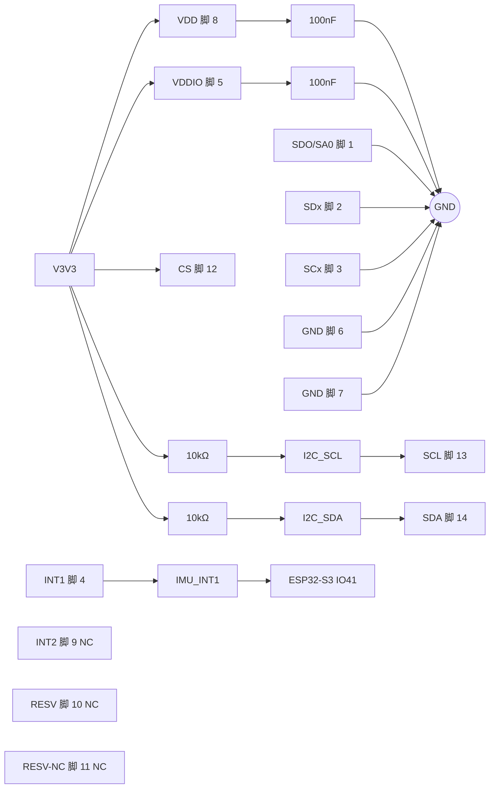

# QMI8658A 外围电路设计与接线

> 最近核验：通过
> 手册：`QMI8658A-RevD.pdf` QST-PD-B002-22 Rev D md5 `5ff0f69c22f6956a59dea104859fc7ee`
> 收口日期：2026-09-18 ｜ 库存快照：`库存列表-20260913211039.xlsx`（2026-09-13）
> 事实源：[`电子木鱼-硬件原理图设计基线.md`](../电子木鱼-硬件原理图设计基线.md)、[`电子木鱼-硬件网络清单.json`](../电子木鱼-硬件网络清单.json)、[`电源网络命名规范.md`](../电源网络命名规范.md)

## 1. 依据与核验范围

**手册**：主用 `QMI8658A-RevD.pdf`（QST-PD-B002-22，Rev D，2025-12-18，78 页，md5 `5ff0f69c22f6956a59dea104859fc7ee`）。同目录另存早期 `QMI8658A.pdf`（Document# 13-52-25，Rev A，2022-06-20，88 页，md5 `5a0fef65a358430d6499944a75d22e19`）。两版在本器件全部判定项上一致；仅第 11 脚端接表述与悬空规则有差异（Rev A 为「Connect to VDDIO or Logic High, GND or Logic Low」，Rev D 改为「Float is preferred」），本文按 Rev D 采用。

用到以下页码：

- p.8 §1.5 Application Diagrams 与 Figure 6（I3C/I2C-UI mode）：`SDO/SA0` 电平—地址映射、内部 200 kΩ 上拉的使能与关闭时机、`RESV` 与 `RESV-NC` 端接要求
- p.10 Table 3 Pin Definitions：14 脚定义、`CS` 模式选择、各脚端接明文与角标
- p.11 §1.8 与 Table 4 Recommended External Components：Cp1／Cp2 各 100 nF，Rpu 2 kΩ~10 kΩ
- p.12 Figure 9 Typical Electrical Connections：Cp1 接 `VDDIO`—GND、Cp2 接 `VDD`—GND、Rpu 接 SCL／SDA
- p.14 Table 5 绝对最大额定值与 Table 6 推荐工作条件
- p.15 §3.3.1 Power-On Reset 与 §3.3.2 单电源上电斜率
- p.16 §3.3.3 分路供电时序
- p.30 CTRL1 寄存器复位默认值
- p.42 §5.10.6 CTRL_CMD_SET_RPU 与 Table 31
- p.44 §6 Interrupts：`INT1`／`INT2` 默认 High-Z
- p.75 §16.3.1 I2C Slave Address Selection 与 §16.3.2 I2C Interface Characteristics

**库存表**：`库存列表-20260913211039.xlsx`，快照 2026-09-13 21:10:39，距收口 5 天，在有效期内。

**本次核验范围**：QMI8658A 全部 14 个引脚（脚 1–14），覆盖 14/14 脚。私有外围元件为 `VDD`／`VDDIO` 去耦与 `INT1` 引出网络；`V3V3` 为全板共享网络，其去耦电容与共享 I²C 总线上拉不属于本器件私有网络，按共享网络处理，不在本器件认领。

### 未闭合事项

| 事项 | 类型 | 影响或阻塞 | 依据 / 方法 |
|---|---|---|---|
| 电源脚就近去耦归属 | 跨文档修改 | `V3V3` 为全板共享网络，共享网络无法区分每颗去耦电容的服务对象 | 布局阶段确认本器件 `VDD`／`VDDIO` 脚旁有 100 nF 去耦；手册 p.11 Table 4 与 p.12 Figure 9 |
| I²C 实际地址扫描 | 样机实测 | 地址由 `SDO/SA0` 电平决定，本设计已接低取 `0x6B`，仍需上电扫描确认全板无冲突 | 手册 p.8、p.10、p.75；基线 HW-OI-007 |
| `V3V3` 上电斜率 | 样机实测 | 手册要求 1.1 V 升至 1.71 V 一段斜率大于 40 V/s，未实测 | 手册 p.15 §3.3.2；示波器量 `V3V3` 上电波形 |
| `INT1` 推挽配置 | 固件配合 | 手册默认 High-Z，须由固件置 `CTRL1.bit3 = 1` 才会驱动主控引脚 | 手册 p.30、p.44 |
| `INT2` 保持高阻 | 固件配合 | 本设计 `INT2` 不接，须由固件保持 `CTRL1.bit4 = 0`，并把默认指向 `INT2` 的数据就绪与 FIFO 中断改道 | 手册 p.30、p.44 |
| I²C 总线速率与总线电容 | 样机实测 | 10 kΩ 上拉下的上升时间取决于总线电容，未实测 | 手册 p.75 §16.3.2；示波器量波形 |
| ERC | 样机实测 | 未跑 | 嘉立创 EDA |
| PCB DRC | 样机实测 | 未跑 | 嘉立创 EDA |
| 样机验证 | 样机实测 | 上电识别、器件 ID 读取、`INT1` 电平、待机电流均未实测 | 示波器、电子负载 |
| 热测试 | 样机实测 | 未做 | 实测 |

## 2. 芯片逐脚接线和总接线图

| 脚号 | 名称 | 接法 | 状态 |
|---:|---|---|---|
| 1 | SDO/SA0 | `GND`（低电平，7-bit 地址取 `0x6B`） | 符合 |
| 2 | SDx | `GND` | 符合 |
| 3 | SCx | `GND` | 符合 |
| 4 | INT1 | `IMU_INT1`，接主控 IO41 | 符合 |
| 5 | VDDIO | `V3V3` | 符合 |
| 6 | GND | `GND` | 符合 |
| 7 | GND | `GND` | 符合 |
| 8 | VDD | `V3V3` | 符合 |
| 9 | INT2 | 不接（NC） | NC |
| 10 | RESV | 不接（NC） | 符合 |
| 11 | RESV-NC | 不接（NC） | 符合 |
| 12 | CS | `V3V3`（高电平，进入 I²C-UI 模式） | 符合 |
| 13 | SCL | `I2C_SCL` | 符合 |
| 14 | SDA | `I2C_SDA` | 符合 |

图中贯穿 `VDD`／`VDDIO` 的 100 nF 支路取自手册 p.12 Figure 9；本设计实际由共享 `V3V3` 网络上的去耦承担，就近布置见第 1 节未闭合事项。`INT2`、`RESV`、`RESV-NC` 三个引脚在板上无连接，图中不画连线。

## 3. 参数复算与选型

| 项目 | 手册依据 | 代入与结果 | 选定标准值 |
|---|---|---|---|
| `VDDIO` 去耦（Cp1） | p.11 Table 4 标 100 nF；p.12 Figure 9 接 `VDDIO`—GND | 与 Cp2 各 100 nF，无容差或介质要求 | 100 nF/0402 |
| `VDD` 去耦（Cp2） | p.11 Table 4 标 100 nF；p.12 Figure 9 接 `VDD`—GND | 同上 | 100 nF/0402 |
| I²C 上拉（Rpu） | p.11 Table 4 标 2 kΩ~10 kΩ，仅 I²C 模式需要 | 3.3 V/10 kΩ = 0.33 mA 静态电流；本设计取范围上限 | 10 kΩ/0603 |
| `SDO/SA0` 下拉 | p.8 §1.5 与 p.75 §16.3.1 均要求外部拉低才取 `0x6B` | 直接接 `GND`，无需串阻；内部 200 kΩ 上拉不足以对抗硬接地 | 直接接 `GND` |

**地址与引脚电平**：`SDO/SA0` 接 `GND` → 7-bit 从机地址 `0x6B`（`0b1101011`），8 位写形式 `0xD6`、读形式 `0xD7`（8 位形式由 7 位左移推导，非手册原文）。`CS` 接 `V3V3` → 进入 I²C-UI 模式（p.10 Table 3）。`SDx`／`SCx` 接 `GND` 属手册明文允许的三种端接之一（p.10 Table 3）。

**内部上拉的边界**：`SCL`、`SDA`、`CS`、`SDx`、`SCx`、`RESV` 六个脚各有 200 kΩ 内部上拉，上电默认启用，可由 CTRL9 命令 `CTRL_CMD_SET_RPU` 关闭（p.42 Table 31）。`SDO/SA0` 的内部上拉**不在**该命令覆盖范围内——其角标为 `(1)(3)`，缺 `(2)`，而只有角标 `(2)` 对应「可由 CTRL9 关闭」（p.10 Table 3 表下 Notes 与角标对照）。`SDO/SA0` 的内部上拉在 POR 或软复位期间使能，检测到 I²C 从机地址后自动关闭，因此地址只在复位流程中被锁存一次（p.8 §1.5、p.75 §16.3.1）。

**保留脚处理**：`RESV`（脚 10）手册禁止接 `GND` 或低电平，允许接 `VDDIO`／高电平，或悬空并由默认启用的内部上拉维持。本设计取悬空，属手册允许项；手册同处写明接 `VDDIO` 更佳，可提供稳定高电平（p.8 §1.5、p.10 Table 3）。`RESV-NC`（脚 11）默认为输出脚，Rev D 明文「Float is preferred」，本设计悬空与首选做法一致（p.10 Table 3）。`INT2`（脚 9）手册未规定未使用时的端接，本设计不接（详见下文边界说明）。

**工作点与边界**：`VDD` 与 `VDDIO` 均为 3.3 V，落在手册推荐工作范围 1.71~3.6 V 内，未越绝对最大额定值 3.6 V（p.14 Table 5、Table 6）。`VDD`／`VDDIO` 同源接 `V3V3`，走上电时序的单电源路径（p.15 §3.3.2），天然规避了分路供电时「`VDDIO` 不得晚于 `VDD`」的约束（p.16 §3.3.3）。`INT1` 输出电平域由 `VDDIO`（3.3 V）决定，与主控 IO41 同域。

**由选型决定的软件配置**：

- 器件地址按 `0x6B` 下发。若调用路径是 ESP-IDF 的 `i2c_master_bus_add_device` 且地址长度设为 7 位，直接传 `0x6B`；若经中间层驱动（如 `esp_codec_dev` 一类内部做右移的封装），须按其约定确认传 7 位还是已左移的 8 位形式，避免地址被二次移位。
- `CTRL1`（0x02）复位默认值为 `0x20`，其中 `bit3 INT1_EN = 0`、`bit4 INT2_EN = 0`，即 **INT1 与 INT2 上电默认均为 High-Z**（p.30、p.44）。本设计以 `INT1` 作未来扩展入口，固件须置 `CTRL1.bit3 = 1` 切到推挽模式，否则 `IMU_INT1` 永不驱动。`INT2` 保持 `bit4 = 0`。
- 数据就绪与 FIFO 中断默认指向 `INT2`，固件须改道：`CTRL7.bit5 DRDY_DIS = 1`、`CTRL1.bit2 FIFO_INT_SEL = 1`（p.30、p.44）。

**本设计的硬件边界**（非软件可改的默认行为）：

- `SDO/SA0` 的内部上拉在地址检测完成后自动关闭，此后该脚由外部 `GND` 保持低电平，地址不会在运行期改变。
- `INT2` 手册未覆盖其未使用时的端接要求（p.10 Table 3 只给功能定义，全文无该脚的端接条文）。Rev D 新增了一条通用规则，要求「Table 31 列出的信号应给稳定电平而非悬空，悬空会经信号端口内部 MOSFET 产生大漏电流」（p.42）。但该表只列 `SDx`、`SCx`、`RESV`、`CS`、`SCL`、`SDA`，**不含 `INT1`／`INT2`**。本设计保持 `INT2` 不接，与手册典型应用图在「不使用 `INT2` 时不连接」这一做法上一致（p.7 Figure 4／Figure 5、p.8 Figure 6 均只在使用 `INT2` 时才画到主控）。该脚的具体电气后果手册未给规格，因此不作定量判定。

**固件接口对应**：器件地址常量、`CTRL1` 推挽配置、`INT2` 相关中断源改道均由设备侧 BSP 持有，共享 `I2C0` 单一仲裁。本仓库 `Embedded/` 尚无实现文件，完成固件工程后按 EWF C 编码规范重建。

## 4. BOM 表

| 用途 | 单板量 | 目标规格及型号 | 嘉立创编号 | 可用库存快照 | 嘉立创/库存 |
|---|---:|---|---|---|---|
| 六轴 IMU | 1 | QMI8658A，LGA-14 3.0×2.5 mm | C3021082 | 可用 0（在库 0 − 占用 0，快照 2026-09-13） | 嘉立创采购 |
| `VDD`／`VDDIO` 去耦（共享 `V3V3` 承担） | 0（本芯片不新增） | CL05B104KO5NNNC，100nF/0402 | C1525 | 见下方全板合计 | 库存领用 |
| I²C 上拉（共享） | 0（本芯片不新增） | 0603WAF1002T5E，10kΩ/0603 | C25804 | 见下方全板合计 | 库存领用 |

### 逐行待办

- 六轴 IMU：库存表在库 0，可领用量为 0，须嘉立创采购。编号 C3021082 取自库存表商品编号；下单前须在商品页复核封装为 LGA-14 3.0×2.5 mm、并确认批次与丝印。
- `VDD`／`VDDIO` 去耦：本芯片不认领专属用量。`V3V3` 为全板共享网络，共享网络无法区分每颗 100 nF 的服务对象；本行只登记该共享网络的既有料号。本器件电源脚旁的就近去耦须在布局阶段确认，见第 1 节未闭合事项。
- I²C 上拉：本芯片不新增并联上拉，全板 `I2C_SCL`／`I2C_SDA` 共用一组。本行只登记该共享网络的既有料号，用量不计入本器件。

### 单板合计与全板同料合计

- **C3021082（QMI8658A）**：本对象独用 1 颗，全板 1 颗，可用 0 颗，**缺口 1 颗，须采购**。本目录其他文档未登记该料号，不存在跨文档共料。
- **C1525（100nF/0402）**：本对象不认领专属用量。最新本板中 0402 封装 100 nF 共 9 颗，其中 2 颗落在音频输出耦合网络（`OUTP`／`OUTN`），其余分布在共享 `V3V3` 与模拟地网络上，无法归属单一器件，不计入任何文档认领。库存表可用 168 颗，**无缺口**。
- **C25804（10kΩ/0603）**：本对象不新增。全板最新原理图共 9 颗 0603 封装 10 kΩ（BQ25895 文档 5 颗、LTC2954 文档 1 颗、ESP32-S3 文档 2 颗、PVDF 前端文档 1 颗，合计 9 颗与本器件无关的认领；共享 I²C 上拉的 2 颗由 BQ25895 文档登记）。库存表可用 50 颗，**无缺口**。
- **C30926（100nF/0603）**：本对象不认领。该料号的全板口径已由 TLV62569 与 BQ25895 两份文档之间的跨文档修正项持有，本文不另立口径。

### 采购清单

- **C3021082**（QMI8658A）：库存表在库 0，嘉立创采购，下单前复核封装与批次。
- 其余料号可直接领用，无需采购。
