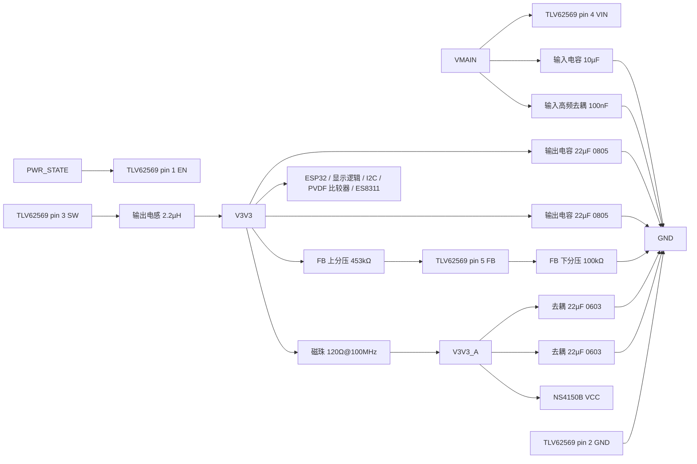

# TLV62569DBVR 外围电路设计与接线

> 最近核验：**通过**（覆盖 TLV62569 全部 5 个引脚及其全部外围元件）
> 手册：`TLV62569-RevC.pdf`，TI SLVSDG1C Rev. C（2016-12，修订 2017-10，30 页），md5 `a7436bcb4b27d1459f15fbc898bd2198`
> 收口日期：2026-09-17 ｜ 库存快照：`库存列表-20260913211039.xlsx`（2026-09-13 21:10:39）
> 事实源：[`电子木鱼-硬件原理图设计基线.md`](../电子木鱼-硬件原理图设计基线.md)、[`电子木鱼-硬件网络清单.json`](../电子木鱼-硬件网络清单.json)、[`电源网络命名规范.md`](../电源网络命名规范.md)
>
> 本版只覆盖**电路设计与手册核验**。ERC、PCB DRC、示波器、电子负载、热测试与样机测试均未执行。

本文档以**引脚号、网络名和功能位置**为索引。位号由嘉立创 EDA 在每次导出时生成，不写入本文档；查询「板上哪一颗是哪个」以 EDA 工程为准。

## 1. 依据与核验范围

### 1.1 依据

- **手册**：`docs/hardware/芯片手册/TLV62569-RevC.pdf`，SLVSDG1C Rev. C，30 页。本版用到第 3 页（脚表、绝对最大额定值）、第 4 页（推荐工作条件、电气特性、软启动时间）、第 5 页（RDS(on)、限流、开关频率）、第 6 页（掉压公式 Equation 1）、第 8 页（典型应用与 Table 3 元件表）、第 9 页（Table 4 稳定性矩阵、分压公式 Equation 2、前馈电容）、第 10 页（电感选型与输入输出电容要求）、第 12 页（Figure 18/19 负载瞬态）、第 13 页（布局指南与 Figure 20）。同目录另有中文版 `tlv62569.pdf`（同为 Rev. C，md5 `454823363df645987e89686779f82c6b`），作为对照，不作为独立依据。
- **库存**：`库存列表-20260913211039.xlsx`，快照 2026-09-13 21:10:39，可用 = 在库 − 占用。
- **嘉立创页面**：2026-09-17 核对（见第 4 节）。

### 1.2 核验范围

TLV62569DBVR（SOT-23-5，全板唯一 SOT-23-5 器件）的全部 5 个引脚，以及与之相连的全部外围元件：1 个输出电感、输入侧去耦、输出电容、2 颗反馈分压电阻，外加从 `V3V3` 分出的 `V3V3_A` 磁珠支路及其去耦。

**不在本文档范围**：`PWR_STATE` 的 100kΩ 上拉电阻（该网络的上拉归 LTC2954 文档，本网恰好一组上拉，不得重复累计）；`VMAIN` 网络上同时服务 4G 模组与其他负载的电容（数值与拓扑已核，归属由各负载的文档界定）。

**已确认的器件事实（无需重复核对）**：

- 输出电感感值为 **2.2µH**，型号 `FXLB252012-2R2-M`（2.5×2.0×1.2mm 磁屏蔽）。EDA 库封装名 `VLS252012CX-150M` 只是借用封装，与感值无关；同封装名的另一处电感（BQ25895 的开关电感）同样是 2.2µH。
- `V3V3_A` 磁珠为 **BLM21PG121SN1D**，120Ω@100MHz、3A、30mΩ、0805，嘉立创 C79382。
- 输出电容为 **2 颗 0805**；`V3V3_A` 去耦为 **2 颗 0603**。

### 未闭合事项

| 事项 | 类型 | 影响或阻塞 | 依据 / 方法 |
|---|---|---|---|
| ERC | 样机实测 | 原理图电气规则未跑 | 嘉立创 EDA ERC |
| PCB DRC | 样机实测 | 布局未验证；SW 铜区、FB 走线远离 SW、输入/输出电容贴近器件 | 布局指南见第 2 节；嘉立创 EDA DRC |
| 2 A 负载、纹波、效率、启动/关闭时序 | 样机实测 | 系统实际电流与热裕量未确认 | 电子负载 + 示波器 |
| 最低输入电压与掉压边界 | 样机实测 | 电池低电时 `V3V3` 可能失去调节，见 §3.6 | 可调电源扫描 `VMAIN` + 示波器 |
| 前馈电容是否需要装配 | 样机实测 | 手册列为可选项，见 §3.5 | 负载阶跃波形对比 Figure 19 |

`VMAIN` 最高 4.2 V（`VSYS` 域），落在本器件 VIN 推荐工作范围 2.5–5.5 V 内（手册第 4 页 §6.3），无需额外钳位。

## 2. 芯片逐脚接线和总接线图

### 2.1 逐脚接线

| 脚号 | 名称 | 接法 | 状态 |
|---:|---|---|---|
| 1 | `EN` | `PWR_STATE`（LTC2954 开漏输出，经 100kΩ 上拉至 `VSYS`） | 符合 |
| 2 | `GND` | `GND` | 符合 |
| 3 | `SW` | 2.2µH 输出电感输入端（板上无其他连接） | 符合 |
| 4 | `VIN` | `VMAIN`，近端 10µF + 100nF 去耦 | 符合 |
| 5 | `FB` | 453kΩ 上分压（接 `V3V3`）与 100kΩ 下分压（接 `GND`）的中点 | 符合 |

本器件为 **DBV（SOT23-5）** 版本，**无 PG 脚**：手册第 3 页脚表列明 `PG` 只在 SOT23-6 与 SOT563-6 上存在，且第 7 页 §7.4.2 写明「The TLV62569P has a power good output」。**不得把 `FB` 当作 PGOOD 使用**，也不得照搬首页简化图中 499 kΩ 的 PG 上拉——那是 TLV62569P 的元件。

`EN` 电平边界：`PWR_STATE` 高电平等于 `VSYS`（最高 4.2 V）。手册第 3 页 §6.1 给出 `VIN, EN, PG` 绝对最大 –0.3～6 V，第 4 页 §6.5 给出 `V_IH` 0.95～1.2 V，**4.2 V 同时满足两项**，且远端高于 `V_IH` 上限，不存在欠驱动风险。手册第 3 页与第 7 页 §7.4.1 均明确 `EN` 不得悬空。

### 2.2 总接线图

### 2.3 落图操作

- **改哪个网络名**：无。端点已全部落在正式板级网络名上（`VMAIN`、`V3V3`、`V3V3_A`、`PWR_STATE`、`GND`），符合 `电源网络命名规范.md` §3 的 `TLV62569 VIN → VMAIN` 映射。
- **加哪个元件**：前馈电容位置尚未落图，是否装配见 §3.5。若决定预留，在 `V3V3` 与 `FB` 之间并入一只 6.8pF 电容。其余元件无新增。
- **布局要求**（手册第 13 页 §10.1）：输入/输出电容与电感尽量贴近器件，功率走线短而宽；输入与输出电容的低边必须良好接到功率地，避免地电位偏移；`FB` 是信号走线，**必须远离 SW 节点**；SW 铜区保持短小。`VIN` 电容、`GND`、`SW` 与电感构成最小高 di/dt 回路，此回路面积应最小化。

## 3. 参数复算与选型

### 3.1 反馈分压与输出电压

手册第 9 页 §8.2.2.2 公式（Equation 2）：

`VOUT = VFB × (1 + R1/R2) = 0.6 V × (1 + R1/R2)`

代入 453 kΩ 上分压、100 kΩ 下分压：

`VOUT = 0.6 × (1 + 453/100) = 0.6 × 5.53 = 3.318 V`

相对 3.300 V 目标偏高 **0.018 V（+0.55%）**，在 `VFB` 容差（0.588–0.612 V，手册第 4 页 §6.5）与电阻容差叠加范围内，功能允许。

手册同一节给出下分压上限：**「use a maximum of 200 kΩ for R2」**。本设计 R2 = 100 kΩ，满足，同时兼顾了轻载电流消耗（流经分压的电流约 `0.6 V / 100 kΩ = 6 µA`）。

### 3.2 输出电感

手册第 10 页 §8.2.2.4 公式（Equation 3）：

`ΔIL = VOUT × (1 − VOUT/VIN) / (L × fSW)`

代入 `VOUT = 3.318 V`、`VIN = 4.2 V`（`VMAIN` 上限）、`L = 2.2 µH`、`fSW = 1.5 MHz`（手册第 5 页 §6.5）：

`ΔIL = 3.318 × (1 − 3.318/4.2) / (2.2 µH × 1.5 MHz) = 3.318 × 0.2100 / 3.3 = 0.211 A`

`IL,MAX = IOUT,MAX + ΔIL/2 = 2 + 0.1055 = 2.106 A`

手册同节要求饱和电流取 `IL,MAX` 的 **1.2–1.3 倍**，即 `Isat ≥ 2.53–2.74 A`。选型 `FXLB252012-2R2-M` 的 `Isat` 典型 3.3 A／最大 3.0 A（原厂参数，见 BQ25895 文档 §3.2），满足。

手册第 9 页 Table 4 脚注 (1) 说明有效电感可在 +20%／−30% 内变化，即 1.54–2.64 µH，该离散已包含在矩阵的认可范围内。

### 3.3 输入电容

手册第 10 页 §8.2.2.5：「For most applications, **4.7-µF input capacitance is sufficient**; a larger value reduces input voltage ripple.」

选用 **10µF + 100nF**，高于最小建议值，并额外覆盖高频段。手册同节要求使用 X7R 或 X5R 介质以获得高频率下的低阻抗与窄温度漂移。

### 3.4 输出电容

手册第 10 页 §8.2.2.5：「The TLV62569 is designed to operate with an **output capacitor of 10 µF to 47 µF**」；第 9 页 Table 4 在 `1.8 V ≤ VOUT` 行、`L = 2.2 µH` 列，对 `10 µF`（标 ++(3)，标准值）与 `2 × 22 µF`、`22 µF`（标 +）均给出认可标记。

选用 **2 × 22 µF = 44 µF**（2 颗 0805），在 10–47 µF 内，且 Table 4 认可。手册第 9 页 Table 4 脚注 (2) 说明有效容量可在 +20%／−50% 内变化，即有效容量最低约 22 µF，仍落在手册允许区间内。

另据手册第 6 页 §7.3.1，器件在轻载进入 Power Save Mode 时输出电压会略高于标称，**「This effect is minimized by increasing the output capacitor」**——本设计取靠近上限的 44 µF，对该效应有利。

### 3.5 前馈电容（手册列为可选项）

手册第 9 页 §8.2.2.2：

> A feed forward capacitor, C3 improves the loop bandwidth to make a fast transient response (shown in Figure 19). **6.8-pF capacitance is recommended for R2 of 100-kΩ resistance.**

三处证据的完整口径：

| 出处 | 口径 |
|---|---|
| 第 8 页 Table 3 | `C3` 列为 **Optional, 6.8 pF if it is needed** |
| 第 9 页 §8.2.2.2 | 推荐 R2 = 100 kΩ 时用 **6.8 pF** |
| 第 12 页 Figure 18/19 | 同为 0.8 A→2 A、1 A/µs 负载阶跃，**Figure 19 标注 `C3 = 6.8 pF`**，与 Figure 18 形成对比 |
| 第 13 页 Figure 20 | **TLV62569DBV 官方布局图的外部元件只有 L1、C1、C2、R1、R2，不含 C3** |

**结论：手册不强制要求该电容，不装配不构成违反手册。** 本设计下分压为 100 kΩ，正落在手册给出 6.8 pF 定值的那一档，且 `V3V3` 的负载包含 ESP32-S3 与显示、射频协同工作带来的负载跳变，瞬态需求不低。**建议在 `V3V3` 与 `FB` 之间预留该电容位置**（按 6.8 pF 装配或留 DNP），使样机阶段可用 Figure 18/19 的对比方法直接判定是否需要，而不必改板。

### 3.6 掉压与最低输入电压

手册第 6 页 §7.3.2 公式（Equation 1）：

`VIN(MIN) = VOUT + IOUT × (RDS(ON) + RL)`

其中高侧 FET 导通电阻 `RDS(ON)` 典型 **100 mΩ**（手册第 5 页 §6.5 电气特性续表），电感直流电阻 `RL` 取 `FXLB252012-2R2-M` 的最大值 82 mΩ 计：

| 输出电流 | `VIN(MIN)` |
|---:|---:|
| 0.5 A | 3.318 + 0.5 × 0.182 = **3.409 V** |
| 1 A | 3.318 + 1 × 0.182 = **3.500 V** |
| 2 A | 3.318 + 2 × 0.182 = **3.682 V** |

`VMAIN` 与 `VSYS` 同域，最低可到约 3.0 V（`BQ25895` 的 `SYS_MIN` 默认 3.5 V，电池可放至更低）。**因此电池电压偏低时 `V3V3` 必然进入 100% 占空比掉压区**，输出跟随输入下降。这是电池供电系统的固有边界，不是接线问题；具体掉压点取决于 `V3V3` 的实际系统电流，必须实测，并据此设定固件的低电告警与关机阈值。

### 3.7 限流、软启动与开关频率

- **限流**：手册第 5 页 §6.5 给出 `TLV62569DBV, TLV62569PDDC` 的高侧 FET 限流典型 **3 A**（`TLV62569DRL, TLV62569PDRL` 为 2.5 A）。本器件为 DBV，限流 3 A，高于 `IL,MAX` 2.106 A，余量充足。
- **软启动**：手册第 4 页 §6.5 给出 `TLV62569DBV` 软启动时间典型 **800 µs**，内部实现，无需外部电容（第 6 页 §7.3.3）。上电时序按此估算。
- **开关频率**：典型 **1.5 MHz**（手册第 5 页 §6.5），已用于 §3.2 纹波计算。

### 3.8 外部元件完备性核对

以手册第 8 页 Table 3（典型应用元件表）与第 13 页 Figure 20（DBV 官方布局）为准，逐项比对：

| 手册元件 | 作用 | 本设计 | 判定 |
|---|---|---|---|
| `L1` | 输出滤波电感 | 2.2µH，`FXLB252012-2R2-M` | 已具备 |
| `C1` | 输入电容 | 10µF + 100nF | 已具备 |
| `C2` | 输出电容 | 2 × 22µF（0805） | 已具备 |
| `R1` / `R2` | 反馈分压 | 453kΩ / 100kΩ | 已具备 |
| `R3`（499k） | PG 上拉 | 本器件为 DBV，**无 PG 脚** | 不需要 |
| `C3`（6.8pF） | 前馈电容 | 未落图 | 手册标可选项，见 §3.5 |
| `EN` 端接 | 禁止悬空 | 由 `PWR_STATE` 驱动，上拉在 LTC2954 文档 | 已具备 |

**结论：本器件不存在缺失的必需外部元件。** DBV 封装内部已集成高侧与低侧 MOSFET、栅极驱动、软启动、峰值电流检测、UVLO、过流保护与热关断（手册第 6 页 Figure 4 与 §7.3），外部只需上表的无源件。唯一超出「必需」范围的是前馈电容，手册自身定为可选项。

## 4. BOM 表

「用途」按功能位置填写；位号由嘉立创 EDA 生成，不在本文档固化。「可用库存快照」取自 `库存列表-20260913211039.xlsx`（2026-09-13 21:10:39），可用 = 在库 − 占用。嘉立创页面核对于 2026-09-17 完成，页面库存为时点数据。

| 用途 | 单板量 | 目标规格及型号 | 嘉立创编号 | 可用库存快照 | 嘉立创/库存 |
|---|---:|---|---|---|---|
| 降压稳压器 | 1 | TLV62569DBVR，SOT-23-5 | C141836 | 未检出 | 嘉立创采购 |
| 输出电感 | 1 | FXLB252012-2R2-M，2.2µH±20%，DCR≤82mΩ，2.5×2.0×1.2mm 磁屏蔽 | C3040393 | 可用 6（在库 8 − 占用 2） | 库存领用 |
| 输入电容 | 1 | CL21A106KAYNNNE，10µF±10%/25V/X5R/0805 | C15850 | 可用 21（在库 26 − 占用 5） | 库存领用 |
| 输入高频去耦 | 1 | 0603B104K500NT，100nF±10%/50V/X7R/0603 | C30926 | 可用 89（在库 94 − 占用 5） | 库存领用 |
| 输出电容 | 2 | CL21A226MAQNNNE，22µF±20%/25V/X5R/0805 | C45783 | 可用 2（在库 2 − 占用 0） | 嘉立创采购 |
| FB 上分压 | 1 | RS-03K4533FT，453kΩ±1%/0603 | C321917 | 未检出 | 嘉立创采购 |
| FB 下分压 | 1 | 0603WAF1003T5E，100kΩ±1%/0603 | C25803 | 可用 83（在库 86 − 占用 3） | 库存领用 |
| `V3V3_A` 磁珠 | 1 | BLM21PG121SN1D，120Ω@100MHz/3A/30mΩ/0805 | [C79382](https://item.szlcsc.com/80520.html) | 未检出 | 嘉立创采购 |
| `V3V3_A` 去耦 | 2 | CL10A226MO7JZNC，22µF±20%/16V/X5R/0603 | C2762594 | 可用 3（在库 8 − 占用 5） | 库存领用 |

`PWR_STATE` 的 100kΩ 上拉不计入本表：该电阻属 `PWR_STATE` 网络，已在 LTC2954 文档登记，本网不得再并第二组。

**逐行待办**

- 降压稳压器：下单前核对封装为 SOT-23-5（DBV）而非 SOT23-6（DDC）；两者引脚数与功能不同，本设计依赖 DBV 无 PG。采购编号 C141836。
- 输出电感：样机阶段按 §3.2 复核温升。
- 输入电容、输入高频去耦、FB 下分压：无。
- 输出电容：全板缺口见下方合计，下单前复核 C45783 在售与封装为 0805。
- FB 上分压：库存表未检出，需按 C321917 采购；453kΩ 为非常用阻值，下单前复核在售状态。
- `V3V3_A` 磁珠：库存表未检出，按 C79382 采购。
- `V3V3_A` 去耦：无。

**单板合计与全板同料合计**

TLV62569 单板用料：稳压器 1 件 + 电感 1 件 + 电容 4 颗 + 电阻 2 颗 + 磁珠 1 件。

跨文档共用料号（按嘉立创编号 + 用途合并，跨本目录全部文档）：

- `C3040393`（2.2µH 电感）：**全板 2 颗**（BQ25895 与 TLV62569 各 1），可用 6 颗，满足。
- `C15850`（10µF/0805）：全板 5 颗，可用 21 颗，满足。
- `C30926`（100nF/0603）：全板 12 颗，可用 89 颗，满足。
- `C25803`（100kΩ/0603）：全板 3 颗（LTC2954 两处 + 本器件 FB 下分压），可用 83 颗，满足。
- `C45783`（22µF/25V/0805）：**全板 5 颗**（`VSYS` 去耦 3 颗 + `V3V3` 输出 2 颗），**可用仅 2 颗，缺口 3 颗**。该料号在 BQ25895 与 TPS22965 两份文档中各记 3 颗，实为 `VSYS` 上同一组电容，不得重复累计；连同本器件输出侧 2 颗，全板需求以 5 颗计。
- `C2762594`（22µF/16V/0603）：全板 2 颗，可用 3 颗，满足。

**采购清单**

| 编号 | 型号 | 用途 |
|---|---|---|
| C141836 | TLV62569DBVR | 降压稳压器 |
| C321917 | RS-03K4533FT | FB 上分压 453kΩ |
| C79382 | BLM21PG121SN1D | `V3V3_A` 磁珠 |
| C45783 | CL21A226MAQNNNE | 输出电容，与全板合并后缺 3 颗 |

C141836、C321917、C79382 三项在库存表内未检出，页面状态待下单前复核。
