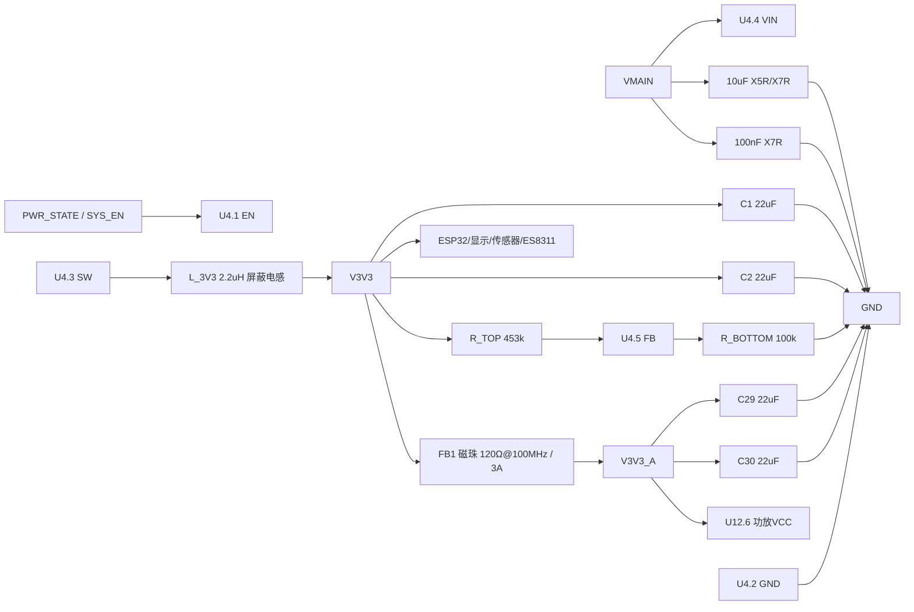

# TLV62569DBVR 外围电路设计与接线

> 状态：已锁定当前设计基线；网表连线已核对，ERC/PCB/样机仍待验证（2026-09-15）。
> 数据手册：TI TLV62569 Rev.C，SLVSDG1C，重点页 3、8–9、13。
> 项目事实源：`电子木鱼-硬件原理图设计基线.md`、`电子木鱼-硬件网络清单.json`、`电源网络命名规范.md`、`库存列表-20260913211039.xlsx`。
> 嘉立创核对：TLV62569DBVR [C141836](https://www.lcsc.com/zh-CN/product-detail/C141836.html)，查询日 2026-09-15；页面库存需下单前实时确认。
> 网表证据：`Netlist_Schematic1_2026-09-15.tel`，SHA-256 `8ee4531a8710c33235594bfff747f1d81c2b4ca30eae7372632921eef2fe2989`；仅用于连线核对。审查报告见 [`2026-09-15-3-Netlist-TPS22965-TLV62569原理图审查.md`](2026-09-15-3-Netlist-TPS22965-TLV62569原理图审查.md)。

## 1. 设计目标与边界

TLV62569DBVR 将 `VMAIN` 降为 `V3V3`，为 ESP32、显示逻辑、传感器、PVDF 和 ES8311 供电；NS4150B 只能接后级 `V3V3_A`。当前设计目标按最大输出 2 A，实际系统电流和热裕量需样机确认。DBVR 五脚版本没有 PGOOD，不得把 FB 当 PGOOD。

## 2. 逐脚落图

| 脚 | 原生功能 | 板级接法 | 说明 |
|---:|---|---|---|
| 1 | EN | `PWR_STATE/SYS_EN` | 高电平使能，不能悬空；需确认掉电默认状态 |
| 2 | GND | `GND` | 直接回流到输入/芯片地 |
| 3 | SW | `L_3V3=2.2 µH` | SW 到电感输入最短，禁止并接 FB |
| 4 | VIN | `VMAIN` | 近端 10 µF+100 nF |
| 5 | FB | 分压中点 | 仅接 R_TOP/R_BOTTOM 和可选补偿，不作 PGOOD |

## 3. 关键计算

### 3.1 反馈分压

数据手册公式：`VOUT = VFB×(1+R_TOP/R_BOTTOM)`，取 `VFB=0.6 V`、`R_TOP=453 kΩ`、`R_BOTTOM=100 kΩ`：

`VOUT = 0.6×(1+453/100) = 3.318 V`。

因此 453 kΩ/100 kΩ 是 3.3 V 当前锁定值，实际输出还受 VFB 容差、阻值容差和布局影响；若需更接近 3.300 V，应在 EDA 库存允许时重新选标准阻值并以实测校准。

### 3.2 电感纹波与峰值

取 `VIN=4.2 V`、`VOUT=3.3 V`、`fSW=1.5 MHz`、`L=2.2 µH`：

`ΔIL = VOUT×(1−VOUT/VIN)/(L×fSW) ≈ 0.213 A`。

按 `IOUT=2 A`：`IL,PEAK = 2 + ΔIL/2 ≈ 2.11 A`。按数据手册建议，电感饱和电流至少取峰值的 1.2–1.3 倍，即 `Isat ≥2.54–2.75 A`；采购还需核对额定电流、DCR、屏蔽和 DC Bias。

### 3.3 电容

输入：`10 µF + 100 nF`，电容额定电压建议 ≥10 V；输出：`2×22 µF`，按 X5R/X7R、DC Bias 后有效容量和数据手册 10–47 µF 稳定性范围核对。实际有效输出电容、ESR、负载阶跃和纹波必须在 PCB 上验证。

## 4. 接线图

## 5. 最终设计 BOM（当前锁定）

| 项目 | 规格/MPN | LCSC | 数量 | 状态 |
|---|---|---:|---:|---|
| U4 | TLV62569DBVR，SOT-23-5 | C141836 | 1 | 嘉立创购买；页面库存需下单前复核 |
| L_3V3 | 2.2 µH，Isat≥2.75 A，屏蔽，低 DCR | C3040393（FXLB252012-2R2-M） | 1 | 库存 8、占用 2、可用 6（2026-09-13 快照）；额定 3.3 A，仍需查 Isat/DCR/屏蔽与 DC Bias |
| C_IN1 | 10 µF ±10%，25 V，X5R，0805，CL21A106KAYNNNE | C15850 | 1 | 库存 26、占用 5、可用 21；库存快照 2026-09-13；需查 DC Bias |
| C_IN2 | 100 nF ±10%，50 V，X7R，0603，0603B104K500NT | C30926 | 1 | 库存 94、占用 5、可用 89；库存快照 2026-09-13 |
| C_OUT1/2 | 22 µF ±20%，25 V，X5R，0805，CL21A226MAQNNNE | C45783 | 2 | 库存 2、占用 0、可用 2；库存快照 2026-09-13；需查 DC Bias |
| FB1 | BLM21PG121SN1D，120 Ω@100 MHz，3 A，30 mΩ，0805，磁珠 | C79382 | 1 | 嘉立创购买；页面库存约 181,860（查询 2026-09-15），需下单复核 |
| C_A1/C_A2 | 22 µF ±20%，16 V，X5R/X7R，0603，CL10A226MO7JZNC | C2762594 | 2 | 库存 8、占用 5、可用 3；库存快照 2026-09-13；需查 DC Bias |
| R_TOP | 453 kΩ ±1%，100 mW，0603，RS-03K4533FT | C321917 | 1 | 嘉立创购买；页面库存 8,000、起订 100（2026-09-15 页面），需下单时复核 |
| R_BOTTOM | 100 kΩ ±1%，0603WAF1003T5E | C25803 | 1 | 库存 86、占用 3、可用 83；库存快照 2026-09-13 |

## 6. 库存与采购决策

**库存表领用：** L_3V3 使用 C3040393（可用 6）、C15850（可用 21）、C30926（可用 89）、C45783（可用 2，设计用量 2）和 C25803（可用 83）；V3V3_A 侧 C_A1/C_A2 使用 C2762594（可用 3，设计用量 2）。均按“库存−占用”核算。C3040393 额定 3.3 A 满足峰值电流初筛，但 Isat、DCR、屏蔽结构和 DC Bias 仍需规格书确认。

**嘉立创购买：** U4 TLV62569DBVR（C141836）、R_TOP 453 kΩ（C321917）和 FB1 磁珠（C79382）。C321917 页面确认 453 kΩ/±1%/100 mW/0603；C79382 页面确认 120 Ω@100 MHz、3 A、30 mΩ、0805，页面库存均为时点数据，需下单前复核。

## 7. 布局与验收

### 当前网表差异

最新网表已确认 `U9.3 SW→U16.2→U16.1=V3V3→L1.1→L1.2=V3V3_A`，但网表中 L1 仍导出为通用 `L0805/{Value}`，且 V3V3 输出侧当前只看到 `C31` 一颗 22 µF。本文最终 BOM 规定 `L_3V3=C3040393` 和 `C_OUT1/C_OUT2=C45783` 两颗；在 EDA 中补齐精确属性并重新导出 BOM/网表后，才能关闭该版本差异。

VIN 电容、GND、SW 和电感构成最小高 di/dt 回路；SW 铜区保持短小，电感和输出电容靠近芯片。FB 走线远离 SW，直接从 V3V3 输出电容安静端取样。验收需完成 ERC、PCB DRC、2 A 电子负载、负载阶跃、V3V3 纹波、效率、启动/关闭时序和热测试。

完成嘉立创原理图后，可以提供清晰截图或原理图文件交给我审查。**强烈建议导出并提供网表文件**，同时附上同一版本的原理图 PDF/截图；若网表没有完整型号、耐压、封装或商品编号，请补充 BOM。我会逐项检查元件选型与接线是否符合设计预期，列出问题及具体修正，修改后可再导出文件复查。
