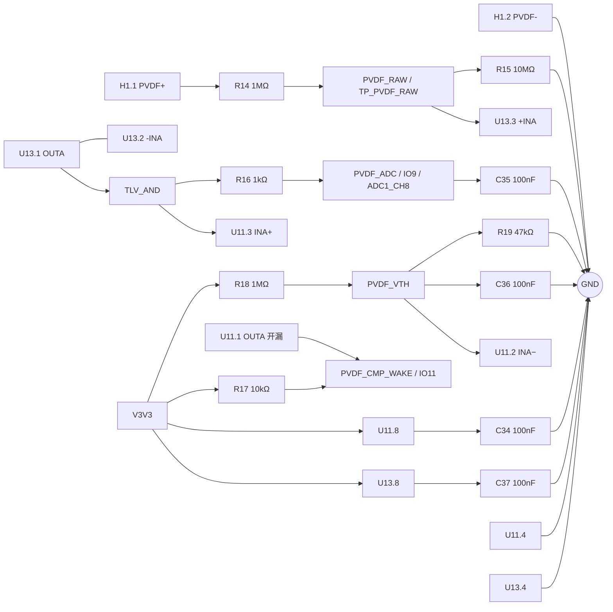

# TLV7042DGKR 与 TLV2369IDGKR PVDF 前端设计与接线

## 1. 最终版状态

- **版本**：EWF-PVDF-FINAL-2026-09-16
- **状态**：设计参数已收口；A 通道、阈值分压、ADC RC、供电和开漏输出已由最新网表核对。B 通道处理、输入钳位和样机参数仍是验收门禁，不能标为已通过。
- **最新网表**：`Netlist_Schematic1_2026-09-15 (3).tel`
- **网表 SHA-256**：`c7e341a765f722af1a4e65e0f2cdf66a99585d824c3a4ffb9ab8208ab54b4130`
- **项目网络**：`PVDF_RAW`、`TLV_AND`、`PVDF_ADC`、`PVDF_CMP_WAKE`、`IO9/ADC1_CH8`、`IO11`。
- **过程证据**：[原理图审查记录](TLV7042DGKR与TLV2369IDGKR原理图审查.md)。

## 2. 最终设计参数

| 项目 | 已收口值 | 证据/状态 |
|---|---|---|
| 电源 | U11/U13 VCC/V+→`V3V3`；VEE/V−→`GND` | 最新网表已核对 |
| PVDF 接口 | H1.1→R14；H1.2→GND | 最新网表已核对；连接器精确 MPN 需 BOM 核对 |
| 输入限流 | R14=`1 MΩ`, 0603, 1% | 网表已核对；库存 C22935 |
| 输入泄放 | R15=`10 MΩ`, 0603 | 网表已核对；传感器负摆幅仍需验证 |
| 运放 A | U13.3=`PVDF_RAW`；U13.1 与 U13.2 同网=`TLV_AND` | 最新网表已核对 |
| ADC 隔离/滤波 | R16=`1 kΩ`；C35=`100 nF` 到 GND；`PVDF_ADC`→ESP32 U1.17 | 最新网表已核对；名义截止约 1.59 kHz |
| 比较器阈值 | R18=`1 MΩ` 从 V3V3；R19=`47 kΩ` 到 GND；C36=`100 nF` 到 GND；节点→U11.2 | 最新网表已核对；V3V3=3.3 V 时 VTH≈0.148 V |
| 比较器 A | U11.3=`TLV_AND`；U11.1→`PVDF_CMP_WAKE` | 最新网表已核对 |
| 开漏上拉 | R17=`10 kΩ`，`PVDF_CMP_WAKE`→V3V3 | 最新网表已核对；静态低电平约 0.33 mA |
| 去耦 | C34、C37=`100 nF`，各自电源脚到 GND | 网表已核对；介质/DC bias 需 BOM/规格书确认 |

## 3. 接线图

## 4. 逐脚接线

### U13：TLV2369IDGKR，VSSOP-8

| 脚 | 最终连接 | 状态 |
|---:|---|---|
| 1 OUTA | `TLV_AND`；与脚 2 同网 | 网表已核对 |
| 2 −INA | 回接脚 1，不能接 R16 后 ADC 节点 | 网表已核对 |
| 3 +INA | `PVDF_RAW` | 网表已核对 |
| 4 V− | GND | 网表已核对 |
| 5 +INB | **待补固定电平** | 最新网表未出现 |
| 6 −INB | **待补** | 最新网表未出现 |
| 7 OUTB | **待补；建议与脚 6 同网形成跟随器** | 最新网表未出现 |
| 8 V+ | V3V3，C37 去耦 | 网表已核对 |

### U11：TLV7042DGKR，VSSOP-8

| 脚 | 最终连接 | 状态 |
|---:|---|---|
| 1 OUTA | `PVDF_CMP_WAKE`，R17 上拉至 V3V3 | 网表已核对 |
| 2 INA− | `PVDF_VTH`，R18/R19/C36 分压滤波点 | 网表已核对 |
| 3 INA+ | `TLV_AND` | 网表已核对 |
| 4 VEE | GND | 网表已核对 |
| 5 INB+ | **待补确定固定电平** | 最新网表未出现 |
| 6 INB− | **待补确定固定电平** | 最新网表未出现 |
| 7 OUTB | **NC** | 最新网表未出现 |
| 8 VCC | V3V3，C34 去耦 | 网表已核对 |

## 5. 最终 BOM 与来源

库存快照：`库存列表-20260913211039.xlsx`，2026-09-13 21:10:39；可用量按在库减占用计算。嘉立创库存为 2026-09-15 页面检索时点。

| 位号 | 精确 MPN/规格 | 数量 | LCSC | 来源/状态 |
|---|---|---:|---|---|
| U11 | TLV7042DGKR，VSSOP-8 | 1 | C2760466 | 库存文件无精确料，嘉立创采购候选 |
| U13 | TLV2369IDGKR，VSSOP-8 | 1 | C2057867 | 库存文件无精确料，嘉立创采购候选 |
| R14 | 0603WAF1004T5E，1 MΩ ±1% | 1 | C22935 | 库存可用 50 |
| R15 | 0603WAF1005T5E，10 MΩ ±1% | 1 | C7250 | 库存可用 50 |
| R16 | 0603WAF1001T5E，1 kΩ ±1% | 1 | C21190 | 库存可用 50 |
| R17 | 0603WAF1002T5E，10 kΩ ±1% | 1 | C25804 | 库存可用 50 |
| R18 | 0603WAF1004T5E，1 MΩ ±1% | 1 | C22935 | 与 R14 共用库存，可用量足够 |
| R19 | 0603WAF4702T5E，47 kΩ ±1% | 1 | C25819 | 库存可用 87 |
| C34/C35/C36/C37 | 0603B104K500NT，100 nF ±10%，50 V | 4 | C30926 | 库存可用 89；介质/DC bias 需规格书确认 |
| H1 | 2P，2.54 mm 通孔接口 | 1 | 需按实际 BOM 核对 | 最新网表为 2.54 mm HDR 封装；前版 1.25 mm 候选不适用 |

## 6. 未关闭的最终验收门禁

1. 补齐 U11 B 通道和 U13 B 通道，重新导出网表；当前不能将悬空写成通过。
2. 为 PVDF_RAW/U13.3 选择并核对低漏钳位，验证正负摆幅、ESD 和 ADC 安全范围。
3. 通过 ERC、PCB DRC；检查高阻节点、模拟地回流和 4G/音频噪声隔离。
4. 实测 PVDF_VTH 上下翻转电压、单次敲击、1 秒 20 次敲击、环境振动误触发和 ADC 不越界。
5. 复核 BOM 中 U11/U13 精确 MPN、H1 连接器型号、电容介质及额定电压。

当前文档已作为设计参数收口版保存；上述门禁关闭前，不宣称 PCB 或样机验证通过。

完成嘉立创原理图后，请提供同版本原理图 PDF/截图、BOM，并强烈建议提供包含元件、引脚和网络端点的网表，以便继续关闭剩余问题。
