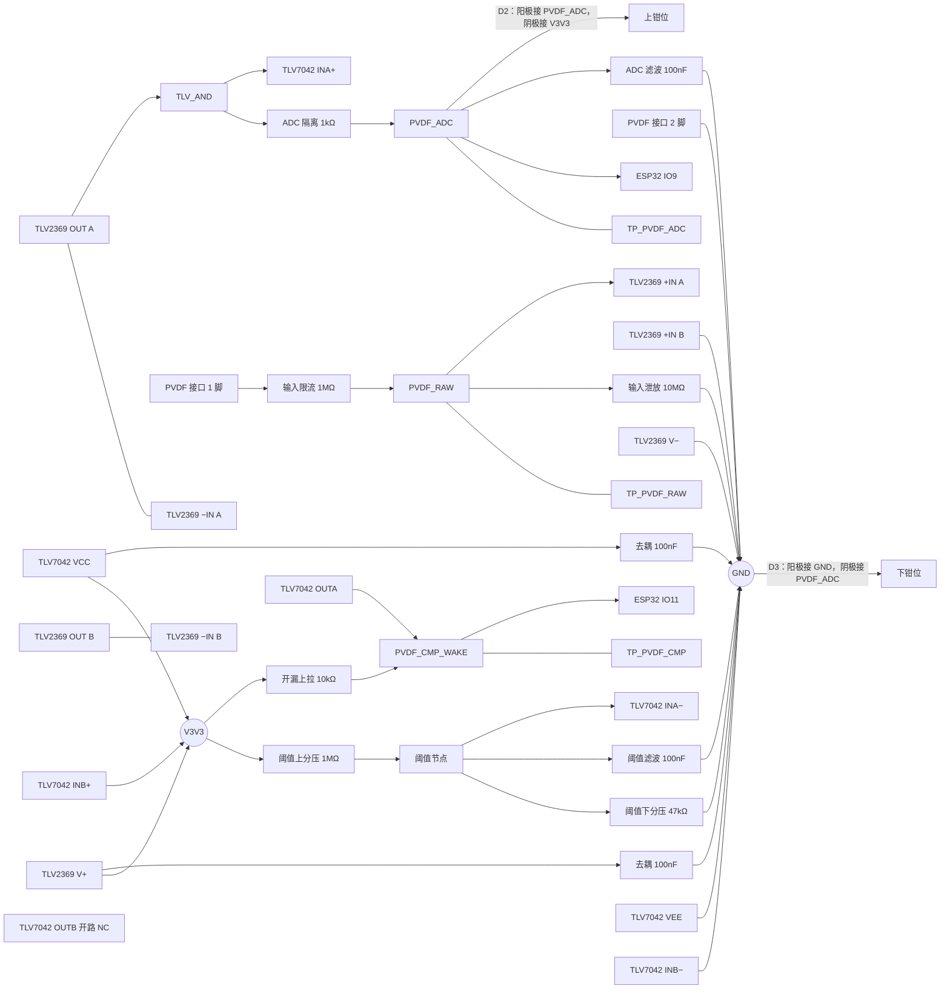

# TLV7042DGKR 与 TLV2369IDGKR PVDF 前端设计与接线

> 最近核验：**未通过（拓扑已由最新网表核验，D2/D3 精确型号待补证）**
> **本版仍未最终收敛。** 新网表已确认 D2/D3 的网络端点和极性关系；但网表对 D2/D3 的 Value 仍为 `{Value}`，实际 MPN、厂商和器件本体极性标识需由 BOM/EDA 属性或供应商资料补证。
> 核验依据网表：`Netlist_Schematic1_2026-09-21.tel`，SHA-256 `f3bed2ad0777101085931c1c1fa7d7aa095330a25181f7261a2607aff69becc9`
> 手册：`tlv2369.pdf` ZHCSF19（2016-05）md5 `4eb12675d6dba8fd4d76926a481ad725`；`tlv7042.pdf` ZHCSGV4J（Rev. J，2024-11）md5 `d68d39c27393bd7fd2c2a489564dc5fa`
> 收口日期：2026-09-21 ｜ 库存快照：`库存列表-20260918103458.xlsx`（2026-09-18）
> 事实源：[硬件原理图设计基线](../电子木鱼-硬件原理图设计基线.md)｜[硬件网络清单](../电子木鱼-硬件网络清单.json)｜[电源网络命名规范](../电源网络命名规范.md)

## 1. 依据与核验范围

### 手册

| 器件 | 手册文件 | 修订号 | md5 | 引用页码 |
|---|---|---|---|---|
| TLV2369IDGKR | `tlv2369.pdf` | ZHCSF19（2016-05） | `4eb12675d6dba8fd4d76926a481ad725` | 3（引脚功能表）、4（绝对最大额定值、推荐工作条件）、6（电气特性，含容性负载条目）、8（容性负载与小信号阶跃特性曲线）、11（输入超轨限流）、12（稳定性提示）、16（布局指南） |
| TLV7042DGKR | `tlv7042.pdf` | ZHCSGV4J（Rev. J，2024-11） | `d68d39c27393bd7fd2c2a489564dc5fa` | 4（双通道引脚功能表）、6（绝对最大额定值与表注、推荐工作条件）、8（单通道电气特性）、9（双通道电气特性与开关特性）、17–18（功能模式：上电复位、输入、内部迟滞、输出）、19–28（应用）、30（布局指南） |

### 库存表

- 文件：`库存列表-20260918103458.xlsx`，快照日期 2026-09-18（距收口 3 天，未超过 14 天）

### 本次核验范围

被核验的引脚：

- TLV2369IDGKR 全部 8 脚：OUT A、−IN A、+IN A、V−、+IN B、−IN B、OUT B、V+
- TLV7042DGKR 全部 8 脚：OUTA、INA−、INA+、VEE、INB+、INB−、OUTB、VCC

被核验的外围元件与端点：PVDF 传感器接口、输入限流、输入泄放、ADC 隔离、ADC 滤波、**ADC 低漏钳位（最新网表中的 D2/D3）**、开漏上拉、阈值上分压、阈值下分压、阈值滤波、V3V3 去耦（两支各一）、以及 `TP_PVDF_RAW`、`TP_PVDF_ADC`、`TP_PVDF_CMP` 三个测试点。

未覆盖部分：D2/D3 的精确 MPN、厂商、数据手册参数和器件本体极性标识尚未由最新网表证明；其网络端点已覆盖。两支运算器件均为 VSSOP-8 封装，无裸露焊盘（PowerPAD/EP）引脚，不存在被原理图遗漏的散热焊盘。

### 未闭合事项

| 事项 | 类型 | 影响或阻塞 | 依据 / 方法 |
|---|---|---|---|
| 空闲态比较器输出恒低，上拉持续灌约 330µA | 样机实测 | 静态电流占空比 100%，对电池续航有实质影响 | 静态时 `PVDF_RAW` 经泄放电阻趋近 0V，缓冲输出低于阈值 148.1mV，开漏输出恒低；样机整机静态电流实测 |
| 两路未使用通道的静态电流 | 样机实测 | 两支器件的 B 通道常驻耗电且无功能收益 | 手册第 9 页双通道静态电流（每通道典型 315nA、最大 750nA）；样机实测 |
| 内部迟滞典型 10mV（最小 3 / 最大 25） | 样机实测 | 噪声裕度不足时误翻转；本设计未加外部正反馈迟滞 | 手册第 9 页双通道电气特性；手册第 19 页与第 21 页给出外部增迟滞手段 |
| 唤醒信号消抖与比较器输出极性 | 样机实测 | 唤醒误触发，以及固件唤醒极性配置须与硬件一致 | 硬件基线 §5.4.1；样机敲击与环境振动测试 |
| 单电源缓冲无法传递负半周 | 样机实测 | 负向压电信号被钳在 0V，ADC 与比较器只见正半周 | 手册第 6 页共模输入范围下限为 V−=0V；`TP_PVDF_RAW` 实测（注意探头负载对高阻节点的影响） |
| 缓冲器驱动 100nF 容性负载的稳定性 | 样机实测 | 手册容性负载数据范围不含该量级 | 手册第 6 页容性负载条目指向第 8 页特性曲线，该曲线横轴仅覆盖 10–100pF；本设计经 1kΩ 隔离接 100nF |
| 阈值节点上电建立约 22ms | 样机实测 | 上电后阈值稳定时间远长于器件开通时间 | 时间常数 44.89kΩ×100nF=4.49ms，5 倍时间常数约 22.4ms；对照手册第 9 页开关特性 |
| ADC 低漏钳位（D2/D3） | 外部确认 | 最新网表已确认 D2/D3 位于 `R16` 后的 `PVDF_ADC` 节点，`R16=1kΩ` 限制瞬态电流；网表 Value 仍为 `{Value}`，需补证实际 MPN、厂商、封装引脚极性与漏电/钳位参数 | 最新网表 `PVDF_ADC`、`V3V3`、`GND` 网络；候选 `JSCJ BAS70WS / C77312`，商品页和实际采购资料需再核对 |
| `PVDF_RAW` 与 `PVDF_ADC` 的端点定义跨文档冲突 | 跨文档修改 | 网络清单与硬件基线把限流电阻置于两网络之间，且不含缓冲输出节点；按该旧拓扑补钳位会落在缓冲器之后而失效 | 实际设计为「连接器 → 限流 → `PVDF_RAW`，缓冲输出经 1kΩ → `PVDF_ADC`」；先以硬件主基线与网络清单收敛，再同步本外围文档 |
| 去耦电容的物理就近性 | 样机实测 | 接线只证明电源—地拓扑，不证明器件就近 | 手册第 16 页与第 30 页布局指南；PCB 布局评审 |
| ERC、PCB DRC 与样机级测试（示波器、电子负载、热测试、功能测试） | 样机实测 | 最新网表已重新导出，但 ERC/PCB DRC、布局回流和样机测量仍未闭合 | EDA 工具与硬件基线 §6 |

## 2. 芯片逐脚接线和总接线图

### TLV2369IDGKR（PVDF 缓冲运放）：VSSOP-8

| 脚号 | 名称 | 接法 | 状态 |
|---:|---|---|---|
| 1 | OUT A | `TLV_AND`，与脚 2 同网构成单位增益跟随器 | 符合 |
| 2 | −IN A | 回接脚 1，不接 ADC 隔离电阻之后 | 符合 |
| 3 | +IN A | `PVDF_RAW`（该网络含测试点 `TP_PVDF_RAW`） | 符合 |
| 4 | V− | GND | 符合 |
| 5 | +IN B | GND（未使用通道，工作点 0V） | 符合 |
| 6 | −IN B | 与脚 7 同网 | 符合 |
| 7 | OUT B | 与脚 6 同网，不接其他负载 | 符合 |
| 8 | V+ | V3V3，去耦 100nF 至 GND | 符合 |

### TLV7042DGKR（PVDF 唤醒比较器）：VSSOP-8

| 脚号 | 名称 | 接法 | 状态 |
|---:|---|---|---|
| 1 | OUTA | `PVDF_CMP_WAKE`（含测试点 `TP_PVDF_CMP`），10kΩ 上拉至 V3V3 | 符合 |
| 2 | INA− | 阈值节点：1MΩ 至 V3V3、47kΩ 至 GND、100nF 至 GND | 符合 |
| 3 | INA+ | `TLV_AND`（该网络经 1kΩ 后到 `PVDF_ADC`，含测试点 `TP_PVDF_ADC`） | 符合 |
| 4 | VEE | GND | 符合 |
| 5 | INB+ | V3V3（未使用通道） | 符合 |
| 6 | INB− | GND（未使用通道） | 符合 |
| 7 | OUTB | 开路，不接上拉（开漏输出，未使用通道） | NC |
| 8 | VCC | V3V3，去耦 100nF 至 GND | 符合 |

未使用通道的端接电平落在手册规定的共模输入范围内（TLV2369 第 6 页共模范围为 V− 至 V+；TLV7042 第 18 页共模范围为 VEE 至 VCC+100mV），不违反绝对最大额定值。手册对未使用通道的端接方式无专条规定，该端接方式属工程惯例，其静态电流影响见第 1 节未闭合事项。

### 总接线图

### 落图操作（D2/D3）

1. 在 `PVDF_ADC` 节点放置 D2、D3、C35、`TP_PVDF_ADC` 和 ESP32 `IO9`；D2、D3 均放在 `R16` 的 ADC 侧，不能接到 `TLV_AND` 或 `PVDF_RAW`。
2. D2：SOD-323 pin 1（K、阴极标识端）接 `V3V3`，pin 2（A、阳极）接 `PVDF_ADC`。
3. D3：SOD-323 pin 1（K、阴极标识端）接 `PVDF_ADC`，pin 2（A、阳极）接 `GND`。
4. 重新导出网表后，逐项确认 `PVDF_ADC` 命中 `C35.2/D2.2/D3.1/R16.2/TP_PVDF_ADC.1/U1.17`，`V3V3` 命中 `D2.1`，`GND` 命中 `D3.2`；并确认 IO9 未被钳位支路旁路。
5. PCB 布局时让 D2、D3、C35、IO9 入口和 `TP_PVDF_ADC` 尽量靠近，钳位回路和地回流短而宽；此项仍需 PCB DRC 与实物布局评审闭合。

## 3. 参数复算与选型

### 比较器阈值

- 分压结构：上分压 1MΩ 自 V3V3，下分压 47kΩ 至 GND，节点送 INA−（手册第 22 页分压设阈拓扑）
- 代入：VTH = 3.3V × 47kΩ ÷ (1MΩ + 47kΩ)
- 结果：**148.1mV**
- 选定标准值：1MΩ 与 47kΩ，均为库存件
- 分压支路静态电流 3.152µA，等效源阻抗 1MΩ∥47kΩ = 44.89kΩ

### 阈值节点滤波

- 时间常数：τ = 44.89kΩ × 100nF = 4.49ms
- 截止频率：fc = 1 ÷ (2π × 4.49ms) = **35.45Hz**
- 上电建立时间：5τ ≈ 22.4ms
- 选定标准值：100nF
- 手册第 23 页给出同类参考节点并 0.01µF 的输入 RC 示例，仅要求 RC 常数支持目标数据速率以维持有效翻转阈值；本设计未规定上限

### 内部迟滞

- 手册第 9 页双通道电气特性：VHYS 最小 3mV、典型 10mV、最大 25mV
- 相对阈值占比：典型 6.75%，最坏（含失调）127.6–168.6mV 窗口
- 手册第 18 页正文笼统写 7mV 并注明适用于 TLV703x 与 TLV704x 两个系列，与第 8 页单通道表（2/7/17mV）的典型值一致；本设计为双通道器件，取第 9 页双通道表
- 手册第 19 页与第 21 页提供外部正反馈增迟滞的手段，本设计未采用，列入未闭合事项

### 开漏上拉

- 手册第 9 页开关特性脚注规定上拉电阻下限为 650Ω
- 选定 10kΩ，为下限的 15.4 倍
- 上拉目标 3.3V，低于手册第 18 页规定的开漏输出可上拉上限 6.5V
- 输出为低时灌电流：3.3V ÷ 10kΩ ≈ **330µA**（该值构成空闲态静态电流的主要项）

### 输入限流与泄放

- 手册第 4 页规定输入电流绝对最大 ±10mA，第 11 页要求输入超出供电轨 0.5V 以上时须把电流限制在 10mA 以下，并说明串接输入电阻即可实现
- 代入：I = V ÷ 1MΩ；即使传感器输出达 100V，电流亦仅 100µA，低于上限两个数量级
- 输入泄放 10MΩ 把同相输入直流工作点钉在 0V，落在手册第 6 页共模范围（V− 至 V+）内
- 输入衰减比：1MΩ 与 10MΩ 串联分压为 0.909；传感器端等效对地阻抗 11MΩ

### ADC 隔离与滤波

- 时间常数：τ = 1kΩ × 100nF = 100µs
- 截止频率：fc = **1591.5Hz**
- 隔离电阻把 100nF 置于缓冲输出端之后，使输出不直接呈现为纯容性负载
- 手册第 6 页列有容性负载条目并指向第 8 页特性曲线，但该曲线横轴仅覆盖 10–100pF，不含本设计经 1kΩ 隔离后的 100nF 量级，稳定性列入未闭合事项
- 手册未规定驱动 ADC 的阻容取值，ADC 侧采样保持要求不在本手册范围

### ADC 低漏钳位（最新网表 D2/D3）

最新网表已将两颗单二极管接入 `PVDF_ADC`。网表逐引脚关系为：`PVDF_ADC` 包含 `C35.2、D2.2、D3.1、R16.2、TP_PVDF_ADC.1、U1.17`；`V3V3` 包含 `D2.1`；`GND` 包含 `D3.2`。按 BAS70WS 的标准引脚定义（1=阴极 K，2=阳极 A），两颗钳位的接线如下：

| 器件 | 连接 | 作用 |
|---|---|---|
| D2 | pin 2（A）接 `PVDF_ADC`，pin 1（K）接 `V3V3` | 正向过压时把 ADC 节点钳到 V3V3 上方一个 Vf |
| D3 | pin 1（K）接 `PVDF_ADC`，pin 2（A）接 `GND` | 负摆幅时把 ADC 节点钳到 GND 下方一个 Vf |

两颗器件必须位于 `R16` 与 IO9/C35 同侧的 `PVDF_ADC` 节点，不能移到 `PVDF_RAW` 或 `TLV_AND`。`R16=1kΩ` 保留为传感器瞬态限流与缓冲器隔离电阻。封装焊接时，D2 的阴极标识端接 V3V3，D3 的阴极标识端接 PVDF_ADC；不能仅凭原理图符号方向判断，须同时核对封装 pin 1 和器件本体标识。

库存表未检出 BAS70 或同类低漏钳位件；当前采购候选仍为嘉立创 `JSCJ BAS70WS`：SOD-323、70V、70mA、Vf 1V@15mA、反向漏电 100nA@50V，LCSC `C77312`，商品页：[C77312](https://www.lcsc.com/product-detail/C77312.html)。该候选不是最新网表的已证实 Value；下单前必须把 BOM/EDA 属性补为实际 MPN，并以供应商资料确认 pin 1=K、pin 2=A。页面库存属于时点数据，下单前需再次回读。

注意：D2 的实际上钳位电压约为 `V3V3 + Vf`，D3 的下钳位约为 `−Vf`，都不是理想电源轨钳位；在目标瞬态电流下必须实测/计算 `PVDF_ADC` 是否仍低于 ESP32 ADC 输入允许范围。若余量不足，需改为有明确 rail-to-rail 钳位电压的器件后再收敛 BOM。

### 电源边界

| 器件 | 本设计供电 | 手册推荐工作范围 | 依据 |
|---|---|---|---|
| TLV2369IDGKR | 3.3V | 1.8–5.5V | 手册第 4 页 |
| TLV7042DGKR | 3.3V | 1.6–6.5V | 手册第 6 页 |

两支的绝对最大供电均为 7V（TLV2369 第 4 页、TLV7042 第 6 页），本设计余量充足。TLV7042 在上电复位期间输出保持高阻，被上拉电阻拉至逻辑高，该行为与固件唤醒极性配置相关。

### 由选型决定的软件配置

两支器件均无寄存器或可配置引脚，不存在由选型决定的软件配置项。比较器输出极性由硬件接法固定（INA+ 接信号、INA− 接阈值），固件侧的低功耗唤醒极性配置须与之一致。

## 4. BOM 表

| 用途 | 单板量 | 目标规格及型号 | 嘉立创编号 | 可用库存快照 | 嘉立创/库存 |
|---|---:|---|---|---|---|
| PVDF 缓冲运放 | 1 | TLV2369IDGKR，VSSOP-8 | C2057867 | 未检出 | 嘉立创采购 |
| PVDF 唤醒比较器 | 1 | TLV7042DGKR，VSSOP-8 | C2760466 | 未检出 | 嘉立创采购 |
| ADC 上/下钳位 | 2（D2、D3） | JSCJ BAS70WS（候选，网表 Value=`{Value}`），70V/70mA，Vf 1V@15mA/Ir 100nA@50V/SOD-323 | [C77312](https://www.lcsc.com/product-detail/C77312.html) | 库存表未检出；嘉立创页面库存为时点数据，下单前回读 | 嘉立创采购 |
| 输入限流＋阈值上分压 | 2 | 0603WAF1004T5E，1MΩ/0603 | C22935 | 可用 50（在库 50 − 占用 0，快照 2026-09-18） | 库存领用 |
| 输入泄放 | 1 | 0603WAF1005T5E，10MΩ/0603 | C7250 | 可用 50（在库 50 − 占用 0，快照 2026-09-18） | 库存领用 |
| ADC 隔离 | 1 | 0603WAF1001T5E，1kΩ/0603 | C21190 | 可用 50（在库 50 − 占用 0，快照 2026-09-18） | 库存领用 |
| 开漏上拉 | 1 | 0603WAF1002T5E，10kΩ/0603 | C25804 | 可用 50（在库 50 − 占用 0，快照 2026-09-18） | 库存领用 |
| 阈值下分压 | 1 | 0603WAF4702T5E，47kΩ/0603 | C25819 | 可用 87（在库 87 − 占用 0，快照 2026-09-18） | 库存领用 |
| V3V3 去耦 2、ADC 滤波 1、阈值滤波 1 | 4 | 0603B104K500NT，100nF/0603 | C30926 | 可用 84（在库 84 − 占用 0，快照 2026-09-18） | 库存领用 |
| PVDF 传感器接口 | 1 | 2P，2.54mm 通孔排针 | 未检出 | 未检出 | 库存未检出，待查 |
| PVDF 压电薄膜传感器 | 1 | 薄膜尺寸、等效电容、谐振频率待定 | 未检出 | 未检出 | 外部采购 |
| PVDF 测试点（`TP_PVDF_RAW`、`TP_PVDF_ADC`、`TP_PVDF_CMP`） | 3 | Test-Point-0.5mm | 未检出 | 未检出 | 库存未检出，待查 |

### 逐行待办

| 行 | 待办 |
|---|---|
| PVDF 缓冲运放 | 库存表未检出，需嘉立创采购；下单时确认封装为 VSSOP-8（DGK，本体 3.00mm×3.00mm） |
| PVDF 唤醒比较器 | 同上 |
| ADC 上/下钳位 | D2/D3 共用候选 `C77312`；D2 pin 2（A）接 `PVDF_ADC`、pin 1（K）接 `V3V3`；D3 pin 1（K）接 `PVDF_ADC`、pin 2（A）接 GND；待补 BOM/EDA Value 和实际本体标识，布局时必须靠近 IO9/`C35` |
| 输入限流＋阈值上分压 | 无 |
| 输入泄放 | 无 |
| ADC 隔离 | 无 |
| 开漏上拉 | 无 |
| 阈值下分压 | 无 |
| 去耦与滤波 | 无 |
| PVDF 传感器接口 | 库存表无 1×2P 2.54mm 条目（现存 2.54mm 条目为 1×20P、2×4P、1×3P、1×4P 与方针，间距或位数不符，不可直接替代），需选定并采购；同时核对封装串中的引脚长度项与板面装配方向 |
| PVDF 压电薄膜传感器 | 外部采购；须先确定薄膜尺寸、等效电容、谐振频率与引线形式 |
| PVDF 测试点 | 确认板上采用实体测试点还是裸露焊盘；若为实体件需补采购 |

### 单板合计与全板同料合计

| 嘉立创编号 | 用途 | 单板量 | 全板总需求 | 可用库存 | 缺口 |
|---|---|---:|---:|---:|---|
| C2057867 | PVDF 缓冲运放 | 1 | 1 | 未检出 | 1（需采购） |
| C2760466 | PVDF 唤醒比较器 | 1 | 1 | 未检出 | 1（需采购） |
| C77312 | D2、D3：PVDF_ADC 上/下钳位 | 2 | 2 | 库存表未检出；嘉立创页面为时点库存，需下单前回读 | 2（需采购） |
| C22935 | 输入限流＋阈值上分压 | 2 | 2 | 50 | 无缺口 |
| C7250 | 输入泄放 | 1 | 1 | 50 | 无缺口 |
| C21190 | ADC 隔离 | 1 | 1 | 50 | 无缺口 |
| C25804 | 开漏上拉 | 1 | 10 | 50 | 无缺口 |
| C25819 | 阈值下分压 | 1 | 1 | 87 | 无缺口 |
| C30926 | 去耦与滤波 | 4 | 19 | 84 | 无缺口 |

全板总需求按嘉立创编号＋用途跨本目录全部文档合并计算。C25804 与 C30926 在多份文档中均有使用，合并后仍有余量。

本表数值以 `Netlist_Schematic1_2026-09-21.tel` 的最新导出总数为准：C30926 的全板总数取自本板中 0603/100nF 的 19 只实例，C22935 取自 1MΩ/0603 的 2 只，C25804 取自 10kΩ/0603 的 10 只。本文件认领的去耦电容中有两只落在共享 `V3V3` 网络，共享网络无法把该网络上并接的多只 100nF 指认到具体器件，单板量 4 系按「两支器件各 1 只去耦＋ADC 滤波 1 只＋阈值滤波 1 只」计入。

**跨文档口径（本次按 2026-09-21 网表更新，其他对象文档需随后同步）**：

- `C30926`（100nF/0603）：最新网表 `C0603/100nF` 共 19 只；库存快照可用 84 只。本文件按当前网表更新，其他外围文档若仍引用 2026-09-18 之前的网表，需在各自复核时同步。
- `C45783`（22µF/0805）：最新网表列出 `C0805/22uF` 共 9 只，且跨 `VSYS`、`V3V3` 等网络；该料号不属本前端，本文件不认领其用量。BQ25895/TPS22965 等电源侧文档需依据同一最新网表重新核对全板需求与缺口，旧的「3 只、缺 1 只」口径暂不作为本文件结论。

### 采购清单

| 嘉立创编号 | 料号 | 状态 |
|---|---|---|
| C2760466 | TLV7042DGKR | 嘉立创采购 |
| C2057867 | TLV2369IDGKR | 嘉立创采购 |
| C77312 | D2、D3：PVDF_ADC 上/下钳位 | 嘉立创采购候选；补录 BOM/EDA Value，并复核 BAS70WS、SOD-323、pin 1=K/pin 2=A 和漏电参数 |
| 待查 | 2P 2.54mm 通孔排针（PVDF 传感器接口） | 待查 |
| 待查 | Test-Point-0.5mm 测试点 | 待查 |
| 外部采购 | PVDF 压电薄膜传感器 | 外部采购 |
