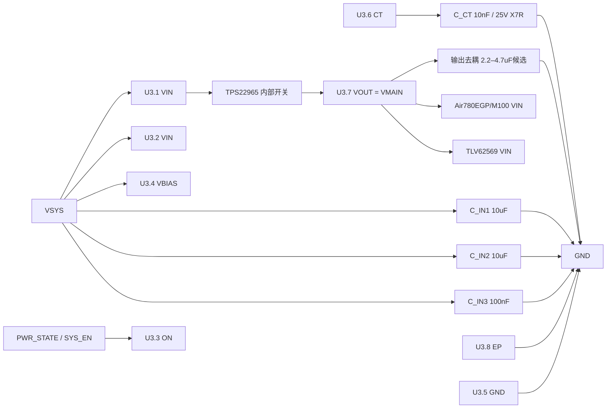

# TPS22965DSGR 外围电路设计与接线

> 状态：已锁定当前设计基线；网表连线已核对，ERC/PCB/样机仍待验证（2026-09-15）。
> 数据手册：TI TPS22965 Rev.F，SLVSBJ0F，重点页 2、7、16、21–22。
> 项目事实源：`电子木鱼-硬件原理图设计基线.md`、`电子木鱼-硬件网络清单.json`、`电源网络命名规范.md`、`库存列表-20260913211039.xlsx`。
> 嘉立创核对：TPS22965DSGR [C122837](https://www.lcsc.com/zh-CN/product-detail/Power-Distribution-Switches_Texas-Instruments_C122837.html)，查询日 2026-09-15；页面库存需下单前实时确认。
> 网表证据：`Netlist_Schematic1_2026-09-15.tel`，SHA-256 `8ee4531a8710c33235594bfff747f1d81c2b4ca30eae7372632921eef2fe2989`；仅用于连线核对。审查报告见 [`2026-09-15-3-Netlist-TPS22965-TLV62569原理图审查.md`](2026-09-15-3-Netlist-TPS22965-TLV62569原理图审查.md)。

## 1. 设计目标与边界

TPS22965DSGR 是 VSYS 到 VMAIN 的单路高侧负载开关。VMAIN 只供 Air780EGP/M100 和 TLV62569 VIN；不得直供 ES8311 或 NS4150B。项目目标为连续电流大于 1 A、峰值大于 2 A，最终峰值和压降须实测。

## 2. 逐脚落图

| 脚 | 原生功能 | 板级接法 | 说明 |
|---:|---|---|---|
| 1 | VIN | `VSYS` | 与 pin 2 同网，输入陶瓷电容靠近两脚 |
| 2 | VIN | `VSYS` | 不得悬空或接 VMAIN |
| 3 | ON | `PWR_STATE/SYS_EN` | TPS3424 RESET 输出；不得悬空，默认低电平应明确 |
| 4 | VBIAS | `VSYS` | 推荐与 VIN 同源，满足 VIN≤VBIAS |
| 5 | GND | `GND` | 功率回流短路径 |
| 6 | CT | `C_CT` 至 GND | 采用 25 V X7R；当前锁定值 10 nF |
| 7 | VOUT | `VMAIN` | 连接 4G VIN 与 TLV62569 VIN |
| 8 | EP | `GND` | 裸露焊盘整面接地并布热过孔 |

## 3. CT 与损耗计算

数据手册在 VBIAS=5 V 时给出近似式：`SR = 34 + 0.38×CT(pF)` µs/V，`tR≈VIN×SR`；10 nF 时典型表值约为 VIN=3.3 V 对应 11.8 ms、VIN=5 V 对应 17.7 ms。该值只适用于 VIN/VBIAS 已稳定后再拉高 ON 的启动序列，需用 4G 负载实测确认浪涌与启动时间。

导通损耗按 `P≈I²×RON` 估算。取 RON=16 mΩ：1 A 时约 16 mW，2 A 时约 64 mW；实际值随 VIN、VBIAS、温度和铜箔热阻变化，不能替代温升测试。

## 4. 接线图

## 5. 最终设计 BOM（当前锁定）

| 项目 | 规格/MPN | LCSC | 数量 | 状态 |
|---|---|---:|---:|---|
| U3 | TPS22965DSGR，WSON/DSG-8，2×2 mm，QOD | C122837 | 1 | 嘉立创购买；页面库存需下单前复核 |
| C_IN1/C_IN2 | 10 µF ±10%，25 V，X5R，0805，CL21A106KAYNNNE | C15850 | 2 | 库存 26、占用 5、可用 21；库存快照 2026-09-13；两颗并联，需查 DC Bias |
| C_IN3 | 100 nF ±10%，50 V，X7R，0603，0603B104K500NT | C30926 | 1 | 库存 94、占用 5、可用 89；库存快照 2026-09-13 |
| C_CT | 10 nF ±10%，25 V，X7R，0603，0603B103K250NT | C285099 | 1 | 库存 46、占用 0、可用 46；库存快照 2026-09-13；需核 CT 实际耐压 |
| C_OUT | 4.7 µF ±10%，50 V，X5R，0805，TCC0805X5R475K500FT | C2903668 | 1 | 嘉立创购买；页面库存 23,480、起订 10（2026-09-15 页面），需下单时复核 |

## 6. 库存与采购决策

**库存表领用：** C15850（10 µF，2 件）、C30926（100 nF，1 件）、C285099（10 nF，1 件），扣除占用后可用数量分别为 21、89、46。

**嘉立创购买：** U3 TPS22965DSGR（C122837）和 C_OUT 4.7 µF（C2903668）。C2903668 页面显示 4.7 µF/50 V/X5R/0805，库存为页面时点数据；两项均需下单前复核。

## 7. 布局与验收

VIN 双脚、输入电容、VBIAS 和 GND 形成最小回路；VOUT 铜宽按 2 A 以上峰值规划。CT 远离 SW/VOUT 功率铜。EP 必须可靠焊接，底部热过孔按封装建议处理。验收需完成 ERC、PCB DRC、VMAIN 启动/关闭波形、4G 发射峰值压降和温升测试。

完成嘉立创原理图后，可以提供清晰截图或原理图文件交给我审查。**强烈建议导出并提供网表文件**，同时附上同一版本的原理图 PDF/截图；若网表没有完整型号、耐压、封装或商品编号，请补充 BOM。我会逐项检查元件选型与接线是否符合设计预期，列出问题及具体修正，修改后可再导出文件复查。
