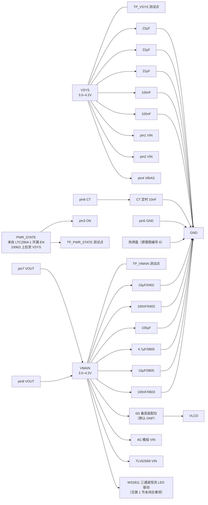

# TPS22965DSGR 外围电路设计与接线

> 最近核验：**通过**（覆盖 TPS22965 全部 9 个端点，以及两个输出网络上属本器件的全部外围元件）
> 手册：`TPS22965-RevF.pdf`，TI SLVSBJ0F Rev.F（2012-08，修订 2016-08，32 页），md5 `5f56d7279f9af8127efb51c840bac667`
> 驱动源手册：`LTC2954-RevFB.pdf`，Linear Technology 2954fb（2011-02-03，18 页），md5 `46a13f77247a35ade6495534190c7bb8`
> 收口日期：2026-09-17 ｜ 库存快照：`库存列表-20260913211039.xlsx`（2026-09-13 21:10:39）
> 事实源：[`电子木鱼-硬件原理图设计基线.md`](../电子木鱼-硬件原理图设计基线.md)、[`电子木鱼-硬件网络清单.json`](../电子木鱼-硬件网络清单.json)、[`电源网络命名规范.md`](../电源网络命名规范.md)、[`ARCHITECTURE-SPINE.md`](../../../_bmad-output/planning-artifacts/architecture/architecture-Electronic_Wooden_Fish-2026-09-08/ARCHITECTURE-SPINE.md) §板级合同
>
> 本版只覆盖**接线与手册核验**。ERC、PCB DRC、示波器、电子负载、热测试与样机测试均未执行。

本文档以**引脚号、网络名和功能位置**为索引。位号由嘉立创 EDA 在每次导出时生成，不写入本文档；查询「板上哪一颗是哪一个」以 EDA 工程为准。

## 1. 依据与核验范围

### 1.1 依据

- **主手册**：`docs/hardware/芯片手册/TPS22965-RevF.pdf`，SLVSBJ0F Rev.F，32 页，md5 `5f56d7279f9af8127efb51c840bac667`。本版用到第 4 页（§6 引脚配置与引脚表、§5 器件对比表）、第 5 页（§7.1 绝对最大额定值、§7.3 推荐工作条件）、第 6 页（§7.4 热信息、§7.5 VBIAS=5V 电气特性）、第 7 页（§7.6 VBIAS=2.5V 电气特性）、第 8 页（§7.7 开关特性）、第 9–11 页（§7.8 典型直流特性曲线）、第 17 页（§9.3.1 可调压摆率、§9.3.2 快速输出放电、§9.4 功能模式）、第 18 页（§10.1 应用信息）、第 19–20 页（§10.2 典型应用与设计流程）、第 21 页（§11 电源建议）、第 22 页（§12 布局）。同目录另有 `tps22965.pdf`（Rev.B，md5 `afa27b3f4fc857466782010eda09d491`），按修订号取 Rev.F，Rev.B 未采用。
- **驱动源手册**：`docs/hardware/芯片手册/LTC2954-RevFB.pdf`，修订 2954fb，18 页，md5 `46a13f77247a35ade6495534190c7bb8`。本版用到第 2 页（绝对最大额定值、TS8 引脚配置）、第 3 页（电气特性：`V_EN(VOL)`、`I_EN(LKG)`）、第 4 页（电气特性注释）、第 5 页（典型特性：EN/EN VOL vs Current Load、EN (LTC2954-1) Voltage vs VIN）、第 6 页（引脚功能：`EN` 为开漏、须外部上拉）、第 9 页（应用信息：首次上电的输出初态）。该手册只用于本器件 pin 3 的**驱动端电平判定**；该器件自身的核验见 [`LTC2954ITS8-1外围电路设计与接线.md`](LTC2954ITS8-1外围电路设计与接线.md)。
- **下游参考手册**：`docs/hardware/芯片手册/WS2812.pdf`，Worldsemi WS2811 修订 V2.2，8 页，md5 `55a7e2bfc25efdc18247de0b998e4324`（文件名与器件名不一致，按内容识别）。本版用到第 2 页（引脚排列与最大额定值）、第 3 页（电气参数测试条件）、第 5 页（典型应用电路）。该手册只用于第 1 节未闭合事项的判定，该器件不属本器件的外围元件。
- **下游参考手册**：`docs/hardware/芯片手册/TLV62569-RevC.pdf`，TI SLVSDG1C Rev.C（2016-12，修订 2017-10）。本版用到第 3 页（§6.1 绝对最大额定值）。同样只用于未闭合事项的边界说明。
- **库存**：`库存列表-20260913211039.xlsx`，快照 2026-09-13 21:10:39（距今 4 天，未过期）。
- **嘉立创页面**：2026-09-17 核对（见第 4 节）。页面数据是时点信息，且**无法从原理图或手册验证**，与手册核验结论不同源。

### 1.2 核验范围

TPS22965（WSON/DSG-8，2.00mm × 2.00mm，带裸露热焊盘；封装名 `UDFN-8_L2.0-W2.0-P0.50-TL-EP`）的**全部 9 个端点**，以及本板与之相连的全部外围元件：

- 端点在本板中的编号为 1–9：1–8 为手册编号引脚，9 为 EDA 把**无编号热焊盘**顺延而成的编号。
- **外围元件**：CT 压摆率定时电容 1 颗；`VSYS` 侧去耦电容 5 颗；`VMAIN` 侧电容 6 颗；`VMAIN` 上经 0Ω 电阻通向 `VLCD` 的备选装配位 1 只。分列于第 3 节与第 4 节。
- **网络测试点**：`TP_VSYS`、`TP_VMAIN`、`TP_PWR_STATE` 三个测试点分别落在本器件的输入、输出与控制网络上，见第 2.2 节。
- **未覆盖**：本器件之外的任何对象。`VMAIN` 上的下游器件（4G 模组、`TLV62569`、WS2811）与 `VLCD` 备选位属各自对象，仅在影响本器件负载清单或泄放回路时于未闭合事项中如实记录，不作判定。

### 未闭合事项

| 事项 | 类型 | 影响或阻塞 | 依据 / 方法 |
|---|---|---|---|
| 实际启动时间与浪涌 | 样机实测 | 主手册式(1) 与 Table 1 的测量条件都是 VBIAS=5V、CL=0.1µF；本设计 VBIAS=`VSYS`=3.0–4.2V、CL≈124.9µF，两侧前提均不成立，第 3.1 节的毫秒数只是外推值，不是保证值 | 示波器测 `PWR_STATE` 上升沿到 `VMAIN` 达 90% 的间隔，同时测输入电流峰值 |
| `PWR_STATE` 高电平的最坏情况实测 | 样机实测 | 第 2.1 节的高电平核算中，`TLV62569` 的 `EN` 脚输入漏电流在其手册 §6.5 中**没有规格项**，只能按未规定处理并取估值；该估值参与 100kΩ 上拉的压降计算 | 在 `VSYS`=3.0V（最低工作点）下实测 `TP_PWR_STATE` 高电平，与主手册 `VIH` 最小值 1.1V 比对 |
| 上电过程的逻辑未定窗口 | 样机实测 | 驱动源手册第 5 页曲线（G13，条件为 100kΩ 上拉至 VIN，与本设计一致）显示，`VSYS` 升到约 1.05V 之前 `PWR_STATE` 最高约 0.72V，落在本器件 `VIL` 最大值 0.5V 与 `VIH` 最小值 1.1V 之间；该期间 `VBIAS`=`VSYS`<2.5V，器件不在 §7.3 推荐工作范围内，判为无功能后果，但属手册未表征条件 | 示波器单次捕获首次上电的 `TP_VSYS` 与 `TP_PWR_STATE`，确认窗口内 `VMAIN` 无输出 |
| `VSYS` 被移除时的体二极管倒灌 | 样机实测 | 主手册第 18 页 §10.1.3 明写「a CIN greater than CL is highly recommended」，机理是 NMOS 体二极管在系统供电被移除时可能使 VOUT 高于 VIN 而倒灌；本设计 CIN:CL≈0.53:1（序关系倒置约 1.9 倍），手册对该形态只给出定性警告、未给量化限值也未给可接受性结论 | 开关 `ON` 期间突然移除 `VSYS`（拔电池／断开或跳开保护板／触发 BATFET 关断），示波器单次同时捕获 `TP_VSYS` 与 `TP_VMAIN`；判据为是否出现 `VMAIN`−`VSYS` 大于约 0.6V 的差压并伴随由 `VMAIN` 流向 `VSYS` 的电流。注意 **USB 拔出不移除 `VSYS`**（BQ25895 的 NVDC power-path 由电池接管），不能拿它当该场景 |
| `VBIAS`=3.0–4.2V 工作点的导通电阻与压降 | 样机实测 | 主手册只给 VBIAS=5V（第 6 页）与 VBIAS=2.5V（第 7 页）两张规格表，本工作点落在两表之间，手册无该点规格 | 4G 发射峰值时测 `VSYS` 与 `VMAIN` 差压；满载温升 |
| `VMAIN` 上的计划外消费者 | 跨文档修改 | 最新本板在 `VMAIN` 上除 4G 模组 VIN 与 `TLV62569` VIN 外，还有一颗 SOP-8 器件的 4 个端点并在该网；该器件按封装与引脚功能判定为 **WS2811 三通道恒流 LED 驱动**（其 8 个端点中 pin 5 DO 与 pin 7 NC 在本板不出现，属悬空处置）。该器件的 VDD 手册最大额定值为 +3.5~+5.7V（第 2 页），电气参数测试条件为 VDD=4.5~5.5V（第 3 页），而 `VMAIN` 为 3.0–4.2V——**电池低压段低于其 VDD 额定下限**；其 OUTR/OUTG/OUTB 是恒流吸收输出，手册典型应用要求各接一颗 LED 阴极（第 5 页），直接接电源正端不在手册定义范围内。该器件不属本器件的外围元件，需单独建立对象文档闭环；在它闭环前，`VMAIN` 的负载清单按「4G 模组 VIN、`TLV62569` VIN、WS2811」记录，且本器件第 3.1 节的斜率设计与第 3.3 节的负载预算均须在它修正后复核 | `WS2812.pdf` 第 2／3／5 页；原理图逐脚复核该器件实际接法 |
| `VMAIN` 上通向 `VLCD` 的 0Ω 备选装配位 | 跨文档修改 | 原理图 `VMAIN` 含一只 0603 的 0Ω 电阻，另一端在 `VLCD`。它是面板供电的**备选源**，按 [`电源网络命名规范.md`](../电源网络命名规范.md) §2 默认不装配（DNP），同侧默认装配的是 `V3V3` 到 `VLCD` 的另一只 0Ω，两者**硬性互斥**。本器件关断时，若该备选位被误装，`VMAIN` 的泄放回路会带上 `VLCD` 负载，且 `V3V3` 会被抬到 `VMAIN`（超 ESP32-S3／ES8311 的 3.6V 绝对最大） | 在装配文件中显式标注该位不装配；上电前核对实物 |
| 料号歧义：TPS22965 与 TPS22965N | 外部确认 | 两者封装相同，导出信息只含封装名，无法区分。主手册第 4 页 §5 与第 17 页 §9.4 Table 2：TPS22965 带快速输出放电，`ON`=L 时 VOUT=GND；TPS22965N 不带，`ON`=L 时 VOUT 开路。本设计第 3.4 节的关断行为依赖前者 | 下单料号书面确认，或核对丝印 |
| CT 定时电容的耐压等级 | 外部确认 | 主手册第 17 页 §9.3.1 明文要求该电容最小额定 25V（CT 脚电压可高达 12V）。按本技能规则，无源元件耐压不属核验范围，但这是手册硬要求，须在选型时确认 | 核对 BOM 与实物丝印。库存表该料号标称 25V，属库存表字段、非电气依据 |
| ERC / PCB DRC / 布局复核 | 样机实测 | 主手册第 22 页 §12.1 要求输入输出电容贴近器件、CT 走线尽量短以减小寄生电容；同页 Figure 38 给出 VIN/VOUT/GND 宽走线与热焊盘过孔布局 | EDA 与 PCB 复核 |
| 热焊盘焊接与热过孔 | 样机实测 | 主手册第 4 页要求热焊盘接 `GND` 并依第 22 页布局示例处理 | 实物检查 |

类型取 `外部确认`（供应商或实物书面答复）｜`固件配合`｜`样机实测`｜`跨文档修改`。以上均为下游未闭合门禁或跨对象事项，不阻塞本文档成立。

## 2. 芯片逐脚接线和总接线图

### 2.1 逐脚表

| 脚号 | 名称 | 接法 | 状态 |
|---:|---|---|---|
| 1 | VIN | `VSYS` | 符合 |
| 2 | VIN | `VSYS` | 符合 |
| 3 | ON | `PWR_STATE` | 符合 |
| 4 | VBIAS | `VSYS` | 符合 |
| 5 | GND | `GND` | 符合 |
| 6 | CT | `10nF` 至 `GND` | 符合 |
| 7 | VOUT | `VMAIN` | 符合 |
| 8 | VOUT | `VMAIN` | 符合 |
| 热焊盘（顺延编号 9） | Thermal Pad | `GND` | 符合 |

**逐脚依据**

- **脚 1、脚 2 = VIN**（主手册第 4 页 §6）：两脚都是开关输入且**必须互连**，两脚同在 `VSYS`，满足。手册要求配输入旁路电容以减小 VIN 跌落，见第 3.2 节。
- **脚 3 = ON**（主手册第 4 页 §6、第 5 页 §7.3；驱动源手册第 2／3／5／6／9 页）：高有效开关控制输入，**不得悬空**。原理图接 `PWR_STATE`，该网络由 LTC2954-1 的 `EN` 驱动——驱动源手册第 6 页明写该脚是 **Open Drain Enable Output**、高有效，并写「This pin can connect directly to a DC/DC converter shutdown pin that provides an internal pull-up. **Otherwise a pull-up resistor to an external supply is required.**」本设计用 100kΩ 上拉至 `VSYS` 满足该要求。该网上还挂 `TLV62569` 的 `EN` 与 `TP_PWR_STATE`，全网上拉**恰好一组**（驱动源手册与命名规范同此口径）。三个边界逐条核对：
  - **高电平**：`EN` 释放后为高阻，由 100kΩ 上拉至 `VSYS`（3.0–4.2V）。可查规格的漏电流是驱动源手册第 3 页 `I_EN(LKG)`（`V_EN`=1V 时 ±0.1µA、26.4V 时 ±1µA，取覆盖 4.2V 的上界 ±1µA）与主手册第 6 页 §7.5 的 ON 脚输入漏电流（最大 0.5µA），合计 1.5µA，在 100kΩ 上产生 150mV 压降。第三个负载 `TLV62569` 的 `EN` 脚输入漏电流在其手册 §6.5 中**无规格项**，按未规定处理并取 1µA 估算，总压降 250mV。最坏情况下 `VSYS`=3.0V 时高电平仍 ≥2.75V，远高于主手册第 5 页 §7.3 的 `VIH` 最小值 1.1V。要跌破 1.1V 需要总漏电流超过 19µA，是可查规格之和的 12 倍以上。该项已列入未闭合事项由台架确认。
  - **低电平**：`EN` 主动拉低，灌电流 = `VSYS` / 100kΩ ≈ 42µA（`VSYS`=4.2V 时最坏），**仅为驱动源手册第 3 页 `V_EN(VOL)` 规格测试条件 500µA 的约 1/12**；按该手册第 5 页曲线 G12（EN/EN VOL vs Current Load，过原点、斜率约 200mV/mA，与表中 0.11V@500µA 自洽）外推，该电流下 VOL≈9mV。即使保守沿用规格上界 0.4V，仍低于主手册第 5 页 §7.3 的 `VIL` 最大值 0.5V。**本网只允许这一组 100kΩ 上拉，不得并联第二组**；若要改小上拉阻值，不得小于约 10kΩ——低于该值后 500µA 规格点对应的 0.4V 上界不再覆盖实际灌电流。
  - **耐压**：`VON` 推荐 0–5.7V、绝对最大 −0.3…6V（主手册第 5 页 §7.1／§7.3）；驱动侧 `EN/EN` 输出绝对最大 −0.3…33V、工作范围 0–26.4V（驱动源手册第 2 页、第 6 页），双方均未越界。
  - **上电初态**：驱动源手册第 9 页写明「When power is first applied to the LTC2954, the part initializes the output pins. Any DC/DC converters connected to the EN/EN pin will therefore be held off.」，即首次上电时 `EN` 被初始化、下游被强制关断；同手册第 5 页曲线 G13 给出定量证据——在 100kΩ 上拉至 VIN（与本设计同条件）下，`EN` 全程不高于约 0.72V，`VIN`≥1.05V 后稳定在 0V 直到 4V。故上电过程中本器件不会被 100kΩ 上拉误开通。曲线 G14 显示若改用 LTC2954-2，其输出在 `VIN` 爬升期为高阻，才存在自开机隐患——本设计用 **-1** 版本规避。该窗口已列入未闭合事项。
- **脚 4 = VBIAS**（主手册第 4 页 §6、第 5 页 §7.3）：器件偏置电源，推荐 2.5–5.7V，绝对最大 6V。原理图接 `VSYS`（3.0–4.2V），满足。主手册第 18 页 §10.1.4 要求 **VIN ≤ VBIAS**，本设计两脚同网取等号，为最优导通电阻形态。
- **脚 5 = GND**：器件地，接 `GND`。
- **脚 6 = CT**（主手册第 4 页 §6、第 17 页 §9.3.1）：接一颗电容到 `GND` 设定输出压摆率；该脚可悬空，本设计装 10nF 以抑制浪涌。电容选型与手册的耐压要求见第 3.1 节。手册未限制该脚并联其他元件，原理图该网络上只有这一颗电容到地，没有第二个元件。
- **脚 7、脚 8 = VOUT**（主手册第 4 页 §6）：**两脚都是开关输出**，两脚同在 `VMAIN`，满足。
- **热焊盘**（主手册第 4 页 §6、第 22 页 Figure 38）：手册引脚表中该行**无编号**，描述为「Thermal pad (exposed center pad) to alleviate thermal stress. Tie to GND.」；原理图按 EDA 惯例把它顺延编为 9，接 `GND`，满足。它与脚 5 是两个各自独立的端点，未与任何信号脚合并。

**网络测试点**（不在芯片引脚上，按网络列出）：`TP_VSYS` 落于 `VSYS`、`TP_VMAIN` 落于 `VMAIN`、`TP_PWR_STATE` 落于 `PWR_STATE`。三者均为《电源网络命名规范》§4 在用的正式测试点名。

### 2.2 总接线图

图中 `VSYS` 与 `VMAIN` 上的器件全集按最新原理图列出。`VSYS` 同时是 BQ25895 的 `SYS` 输出，`VMAIN` 同时是 4G 模组与 `TLV62569` 的输入；两侧电容的归属与合并口径见第 3.2 节与第 4 节。

### 2.3 落图自查

本版核验结论是**器件自身接线正确、无需改动**。落图后自查以下五条，前四条应为 0 命中：

- 搜索 `pin 8`：应为 `VOUT` 接 `VMAIN`，**不得**接 `GND`。
- 搜索热焊盘：应单独成端点接 `GND`，不得与任何信号脚合并。
- 搜索 `VSYS` 到 4G 模组 VIN 的直连：应为 0 命中（必须经过本器件，不得绕过）。
- 搜索 `PWR_STATE` 上的上拉与下拉：应**恰好一组** 100kΩ，不得出现第二组。
- 搜索 `VMAIN` 的直连端点：应为以下 15 个，**多一个或少一个都要复核**——6 颗电容、1 只 0Ω 备选位、`TP_VMAIN`、`VSYS` 侧的数条上游连接、4G 模组 VIN、`TLV62569` VIN、WS2811 的 4 个端点、以及本器件的 pin 7 与 pin 8。

## 3. 参数复算与选型

### 3.1 输出压摆率与启动时间

**手册依据**：主手册第 17 页 §9.3.1 式(1)，`SR = 0.38 × CT + 34`，其中 SR 为压摆率（µs/V）、CT 为 CT 脚电容值（pF）、常数 34 的单位是 µs/V、常数 0.38 的单位是 µs/(V × pF)。手册明写该式只在 **VBIAS=5V** 时成立，且**不适用于 CT=0pF**。

**代入**：CT=10nF=10000pF
- SR = 0.38 × 10000 + 34 = **3834µs/V**
- tR = VIN × SR：`VIN`=3.0V → 约 11.5ms；`VIN`=4.2V → 约 16.1ms

**手册表值对照**：第 17 页 Table 1（条件为 25°C、25V X7R 10% 电容、CL=0.1µF、CIN=1µF、RL=10Ω、VBIAS=5V）在 CT=10000pF 行给出 VIN=3.3V → 11767µs、VIN=5V → 17700µs。公式值与表值相差约 7%，属近似式的正常范围。

**选定值**：`10nF`（0603，嘉立创 C285099），单板 1 颗。

**浪涌**（主手册第 20 页 §10.2.2.1 式(2)：`Inrush Current = C × dV/dt`）：在 CT 固定时，dV/dt = VIN / tR = VIN / (VIN × SR) = 1/SR，与 VIN 无关，故浪涌是**单值**而非区间：

I = CL / SR = 124.9µF / 3834µs/V ≈ **32.6mA**

（CL 取值见第 3.2 节。）远低于第 3.3 节的负载预算。

**手册对 CT 电容的明文要求**：第 17 页 §9.3.1 —「The voltage on the CT pin can be as high as 12 V; therefore, the minimum voltage rating for the CT capacitor **must be 25 V** for optimal performance.」Table 1 的数据同样基于 25V X7R 电容。选购与替换时必须满足该耐压下限。

**适用前提**：手册明确 Table 1 的数值只在「VIN 与 VBIAS 已处于稳态后才拉高 ON」的上电序列下成立。本设计中 `VSYS` 由 BQ25895 建立、`ON` 由 LTC2954-1 的 `EN` 经 100kΩ 上拉拉高（上电初态见第 2.1 节），前提成立。本设计的 VBIAS 与 CL 均与手册测量条件不同，实际启动时间列入未闭合事项待实测。

### 3.2 输入与输出电容

**输入侧（`VSYS`）**：22µF × 3 ＋ 100nF × 2 ＝ **66.2µF**（标称值）

- 主手册第 5 页 §7.3 推荐工作条件规定 **CIN ≥ 1µF**，满足。
- 主手册第 18 页 §10.1.2 要求输入电容贴近引脚；布局要求见未闭合事项。
- `VSYS` 同时是 BQ25895 的 `SYS` 输出节点，这 5 颗电容的取值由 BQ25895 的 SYS 去耦要求与本节共同决定，物理上是同一批电容，全板用量只计一次（见第 4 节）。

**输出侧（`VMAIN`）**：10µF/0402 × 1 ＋ 100nF/0402 × 1 ＋ 100µF × 1 ＋ 4.7µF/0805 × 1 ＋ 10µF/0805 × 1 ＋ 100nF/0603 × 1 ＝ **124.9µF**（标称值）

- 主手册未给 CL 的目标值或上限，CL 由下游 4G 模组的突发电流储能需求决定。
- 主手册第 20 页式(2) 的 `C` 即输出节点上的全部电容，不区分「输出电容」与「下游储能电容」：开启时它们都要被充电（决定浪涌），供电移除时都会保持电荷（决定倒灌）。因此上列 6 颗全部计入 CL。
- `VMAIN` 上另有 1 只 0Ω 备选装配位通向 `VLCD`，默认不装配，不计入 CL；若被装配，CL 需加上 `VLCD` 侧容量。

**CIN : CL ＝ 66.2 / 124.9 ＝ 0.53 : 1**

- 主手册第 18 页 §10.1.3 原文：「Because of the integrated body diode in the NMOS switch, **a CIN greater than CL is highly recommended**. A CL greater than CIN can cause VOUT to exceed VIN when the system supply is removed. This could result in current flow through the body diode from VOUT to VIN.」本设计 **CL 是 CIN 的约 1.9 倍，不满足该序关系**。
- 同节接着写：「A CIN to CL ratio of 10 to 1 is recommended for minimizing VIN dip caused by inrush currents during startup; however, **a 10 to 1 ratio is not required for proper functionality of the device**. A ratio smaller than 10 to 1 (such as 1 to 1) could cause slightly more VIN dip upon turn-on due to inrush currents. **This can be mitigated by increasing the capacitance on the CT pin for a longer rise time.**」
- **定性**：§10 开头的 NOTE（第 18 页）声明「Information in the following applications sections **is not part of the TI component specification**, and TI does not warrant its accuracy or completeness.」，且 §10.1.2 / §10.1.3 标题本身带「(Optional)」；§7.3 规格表只规定 CIN 最小值，**无 CL 项、无 CIN:CL 项**。故本项**不构成规格违规**，但构成一条必须显式记录的**手册应用建议偏离**。
- **已缓解的部分**：偏离所指的「开启时因浪涌引起的 VIN 跌落」——本设计 CT=10nF 给出约 11.5–16.1ms 的上升时间（第 3.1 节），浪涌约 32.6mA，「increasing the capacitance on the CT pin for a longer rise time」这一缓解措施已经采用。
- **未缓解的部分**：偏离所指的「系统供电被移除时 VOUT 高于 VIN、体二极管由 VOUT 向 VIN 导通」。CT 是压摆率电容，只在开关受控开启段起作用，**对手册点名的掉电段机制没有控制力**，手册也没有声称它能缓解该机制。此项**无设计内缓解**，列入未闭合事项，由样机实测判定是否可接受。
- **不采用的整改方向**：把比例做到 10:1 需要 `VSYS` 侧约 1249µF；即便只满足「CIN > CL」也需 `VSYS` 侧超过 124.9µF，而 BQ25895 侧只需 ≥ 20µF，额外堆叠只会加大 BQ 自身需要充入的浪涌，无收益。手册亦无任何条款要求改容值。**不以增删电容作为整改动作**；若实测确认倒灌产生不可接受后果，修正方向是增加反向阻断元件。

### 3.3 导通电阻、压降与结温

**手册规格的适用范围**：主手册只提供两张导通电阻规格表——第 6 页 §7.5（VBIAS=5V）与第 7 页 §7.6（VBIAS=2.5V）。本设计 VBIAS=VIN=`VSYS`=3.0–4.2V，**落在两张表之间，手册未给出该工作点的规格值**。第 19 页 Figure 34 给出 VBIAS=2.5/3.3/3.6/4.2/5/5.5V 六条曲线，其中 VBIAS=3.3V 曲线在 VIN≈3.3V 处约 19mΩ——该读数为**曲线目视读取**，手册文本层无法复核，也不能从原理图复核，仅作参考。

**保守核算取值**：RON = **28mΩ**。§7.5 表在 −40…+105°C 全温范围的最大值是 25mΩ，§7.6 表是 28mΩ；既已声明本工作点落在两表之间、无该点规格，保守取值就应取两者中较大者。

| 电流 | 导通损耗 `P ≈ I² × RON` |
|---|---|
| 1A | 28mW |
| 2A | 112mW |
| 4A（瞬时） | 448mW |

**压降估算**：1A → 28mV；2A → 56mV；4A → 112mV。实际值须实测（见未闭合事项）。

**结温校核**（主手册第 20 页 §10.2.2.2 式(5)：`PD(max) = (TJ(max) − TA) / θJA`；第 6 页 §7.4 给 DSG 8 脚封装的 θJA=72.3°C/W，第 5 页 §7.1 给 TJ(max)=125°C）：

- 取机内环境 TA=55°C：PD(max) = (125 − 55) / 72.3 ≈ **0.97W**
- 2A 工况耗散 112mW，约为该上限的 11.5%，余量充足。
- 本器件的连续电流上限由主手册第 5 页 §7.1 给出：IMAX=6A（连续）、IPLS=8A（脉冲 < 300µs、2% 占空比）。项目目标为连续 > 1A、峰值 > 2A（见 [`电子木鱼-硬件网络清单.json`](../电子木鱼-硬件网络清单.json) 的 `power_rails.VMAIN.current_target`），在限值内。该预算依赖的下游 `TLV62569` 链路已在同目录 [`TLV62569DBVR外围电路设计与接线.md`](TLV62569DBVR外围电路设计与接线.md) 中重新核验通过。

### 3.4 关断行为与输出泄放

- 主手册第 17 页 §9.4 Table 2：TPS22965 在 `ON`=L 时 **VOUT=GND**（内部快速输出放电通路接通）；TPS22965N 无此功能，`ON`=L 时 VOUT 开路。本设计依赖前者，料号歧义列入未闭合事项。
- 输出下拉电阻 RPD：§7.5（VBIAS=5V，VIN=5V、IOUT=15mA）给 225Ω 典型/300Ω 最大；§7.6（VBIAS=2.5V，VIN=2.5V、IOUT=1mA）给 275Ω 典型/325Ω 最大。与 RON 同理，本工作点落在两表之间，实际值更大的一侧更保守。
- `VMAIN` 放电时间常数：τ ≈ 124.9µF × 225Ω ≈ **28.1ms**（按 §7.5 典型值）；若按 §7.6 的 275Ω 则约 34.3ms。约 5τ 放到 1%，即 140–170ms。
- 拉低 `ON` 的是 `PWR_STATE`：LTC2954-1 的开漏 `EN`（经 100kΩ 上拉至 `VSYS`），其高电平等于 `VSYS`、**不接任何 ESP32 引脚**。该断言的权威真源是 [`电源网络命名规范.md`](../电源网络命名规范.md) 的器件 pin 映射表与 [`ARCHITECTURE-SPINE.md`](../../../_bmad-output/planning-artifacts/architecture/architecture-Electronic_Wooden_Fish-2026-09-08/ARCHITECTURE-SPINE.md) 的板级合同。
- 系统关断且 `VSYS` 在位时，该 100kΩ 上拉被 `EN` 持续拉低，静态多耗约 42µA；该电流须计入整机待机，并注意 `VSYS` 若被 4G 发射拉跌到 LTC2954 的欠压锁定门限以下，控制器会复位并保持 `EN` 低，系统锁定在关机态直到再次按键。
- 主手册第 8 页 §7.7 在 VIN=VON=VBIAS=5V、CT=1000pF、CL=0.1µF 条件下给出 tOFF=9µs（典型）、tF=3µs（典型）。本设计工作点与测量条件均不同，关断沿的实际时间须在整机时序测试中确认。

## 4. BOM 表

「用途」按功能位置填写；位号由嘉立创 EDA 生成，不在本文档固化。「可用库存快照」取自 `库存列表-20260913211039.xlsx`（2026-09-13 21:10:39），可用 = 在库 − 占用。嘉立创页面核对于 2026-09-17 完成，页面库存为时点数据。**本表第 4–6 列的信息无法从原理图或原厂手册验证**，与第 1–3 节的手册核验结论不同源。

| 用途 | 单板量 | 目标规格及型号 | 嘉立创编号 | 可用库存快照 | 嘉立创/库存 |
|---|---:|---|---|---|---|
| 高电流负载开关 | 1 | TPS22965DSGR，WSON/DSG-8 2.00×2.00mm | [C122837](https://www.lcsc.com/zh-CN/product-detail/Power-Distribution-Switches_Texas-Instruments_C122837.html) | 未检出 | 嘉立创采购 |
| CT 压摆率定时 | 1 | 0603B103K250NT，10nF/0603 | C285099 | 可用 46（在库 46 − 占用 0，快照 2026-09-13） | 库存领用 |
| `VSYS` 去耦 | 3 | CL21A226MAQNNNE，22µF/0805 | C45783 | 可用 2（在库 2 − 占用 0，快照 2026-09-13） | 嘉立创采购 |
| `VSYS`、`VMAIN` 高频去耦 | 3 | 0603B104K500NT，100nF/0603 | C30926 | 可用 89（在库 94 − 占用 5，快照 2026-09-13） | 库存领用 |
| `VMAIN` 输出去耦 | 1 | 10µF/0402 | 未检出 | 未检出 | 库存未检出，待查 |
| `VMAIN` 高频去耦 | 1 | 100nF/0402 | 未检出 | 未检出 | 库存未检出，待查 |
| `VMAIN` 输出去耦 | 1 | 10µF/0805 | 未检出 | 未检出 | 库存未检出，待查 |
| `VMAIN` 输出去耦 | 1 | TCC0805X5R475K500FT，4.7µF/0805 | C2903668 | 未检出 | 嘉立创采购 |
| `VMAIN` 储能 | 1 | 100µF，3.5×2.8mm | 未检出 | 未检出 | 库存未检出，待查 |
| `VLCD` 备选取电位 | 0（默认不装配） | 0603WAF0000T5E，0Ω/0603 | C21189 | 可用 50（在库 50 − 占用 0，快照 2026-09-13） | 库存领用 |

**逐行待办**

- **高电流负载开关**：库存表 549 行中未检出该编号，须嘉立创采购。**下单前必须书面确认料号为 TPS22965DSGR 而非 TPS22965NDSGR** —— 两者封装相同、共享网络无法区分，而关断行为不同（见第 3.4 节）。该行在料号确认前**未闭合**。
- **CT 压摆率定时**：库存件标称 25V，与主手册第 17 页 §9.3.1 的耐压下限一致，但该标称值取自库存表字段、不构成电气依据；更换料号时必须重新确认额定电压不低于 25V。
- **`VSYS` 去耦**：本芯片的输入去耦就是 BQ25895 文档已登记的 `SYS` 去耦，物理上同一批 3 颗；本表按用途单列以便复核，**全板用量只计一次**（见下方合计）。C45783 库存不足，须补采。
- **`VSYS`、`VMAIN` 高频去耦**：同一料号在本芯片的两侧共 3 颗（`VSYS` 侧 2 颗 ＋ `VMAIN` 侧 1 颗），合并为一行。
- **`VMAIN` 上四行（10µF/0402、100nF/0402、10µF/0805、100µF）**：导出信息只含容值与封装，未导出型号与商品编号，本表按技能规则写 `未检出`，不得凭封装名反推料号。需在 EDA 中补齐精确属性并重新导出 BOM，或由设计者提供编号后回填。**这四行在编号补齐前无法领用**。
- **`VMAIN` 输出去耦（4.7µF/0805）**：C2903668 页面核于 2026-09-17，嘉立创采购，下单前复核库存与起订量。
- **`VLCD` 备选取电位**：默认不装配，单板量记 0；装配文件中必须显式标注不装配，且不得与 `V3V3` 侧的默认装配 0Ω 同时装配（见未闭合事项）。
- **上述 `VMAIN` 五颗电容的选型归属**：它们同时是 4G 模组的输入储能。在该网络的下游对象（4G 载板与 WS2811）闭环前，本表按 `VMAIN` 网络实况记录，不视为最终选型。

**单板合计与全板同料合计**

本芯片单板用料：主芯片 1 件 ＋ CT 定时电容 1 颗 ＋ `VSYS` 侧去耦 5 颗（22µF × 3、100nF × 2）＋ `VMAIN` 侧电容 6 颗（10µF × 2、100nF × 2、100µF × 1、4.7µF × 1）＋ `VLCD` 备选位 1 只（默认不装配）。

跨文档共用料号（合并口径为「嘉立创编号 ＋ 用途」，跨本目录全部文档合并计算，全板用量只计一次）：

- `C45783`（22µF±20%/25V/X5R/0805）：本芯片 3 颗即 BQ25895 的 `SYS` 去耦那 3 颗（同一批物理电容）。同一料号在 [`TLV62569DBVR外围电路设计与接线.md`](TLV62569DBVR外围电路设计与接线.md) 中已确定为 `V3V3` 输出电容 2 颗。**全板需 5 颗，可用 2 颗，缺 3 颗。**
- `C30926`（100nF±10%/50V/X7R/0603）：本芯片认领 3 颗。该料号在本目录多份文档中均有用量（BQ25895、`TLV62569`、`TLV7042`／`TLV2369`、PY206 等），**全板合计 12 颗**（口径与同目录 [`TLV62569DBVR外围电路设计与接线.md`](TLV62569DBVR外围电路设计与接线.md) 一致），可用 89 颗，满足。引用任一份文档的局部数字都不能代替全板合计。
- `C285099`（10nF±10%/25V/0603）：本芯片独用 1 颗，可用 46 颗，满足。
- `C2903668`（4.7µF/0805）：本芯片独用 1 颗，库存表未检出，嘉立创采购。
- `C122837`（TPS22965DSGR）：本芯片独用 1 颗，库存表未检出，嘉立创采购。
- `C21189`（0Ω±1%/0603）：本芯片的 `VLCD` 备选位，默认不装配；可用 50 颗。

**采购清单**

| 编号 | 型号 | 用途 |
|---|---|---|
| C122837 | TPS22965DSGR | 高电流负载开关（须确认非 TPS22965N） |
| C45783 | CL21A226MAQNNNE | `SYS`/`VSYS` 去耦 3 颗、`V3V3` 输出 2 颗，全板缺 3 颗 |
| C2903668 | TCC0805X5R475K500FT | `VMAIN` 输出去耦 |
| 待查 | 10µF/0402 × 1 | `VMAIN` 输出去耦，编号待 EDA 补齐或设计者提供 |
| 待查 | 100nF/0402 × 1 | `VMAIN` 高频去耦，编号待 EDA 补齐或设计者提供 |
| 待查 | 10µF/0805 × 1 | `VMAIN` 输出去耦，编号待 EDA 补齐或设计者提供 |
| 待查 | 100µF/3.5×2.8mm × 1 | `VMAIN` 储能，编号待 EDA 补齐或设计者提供 |
