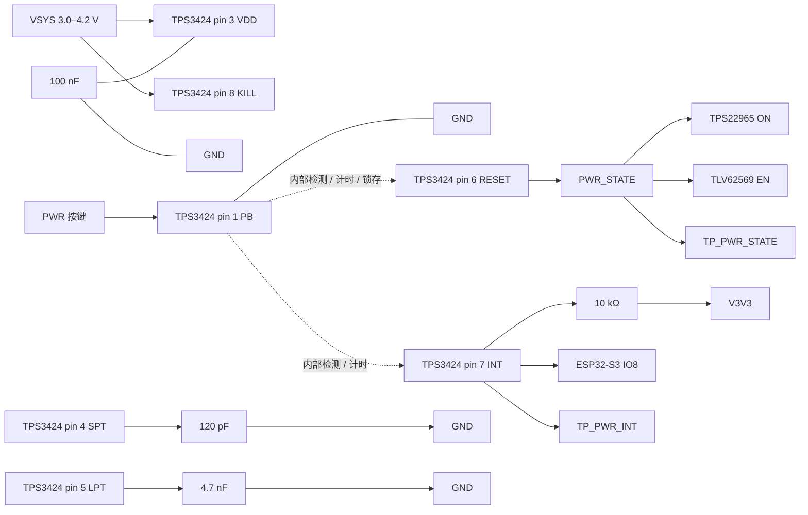

# TPS3424A11C13ADRLR 外围电路设计与接线

> 最近核验：通过
> 核验依据网表：`Netlist_Schematic1_2026-09-17.tel`，导出 2026-09-17 15:22，SHA-256 `e235e8a8e84d8f07727ae4f8d0051533ef5a849268e9b981ad207bac17fd8c10`
> 手册：`TPS3424-Rev.C.pdf`，SNVSCN9C，Rev.C（2024-09 首发 / 2025-08 修订），md5 `dd58efee77fae32f2ebc30c7e23e8643`
> 收口日期：2026-09-17 ｜ 库存快照：`库存列表-20260913211039.xlsx`（2026-09-13）
> 事实源：[电子木鱼-硬件原理图设计基线.md](../电子木鱼-硬件原理图设计基线.md)、[电源网络命名规范.md](../电源网络命名规范.md)

## 1. 依据与核验范围

### 手册

- `docs/hardware/芯片手册/TPS3424-Rev.C.pdf`，SNVSCN9C，Rev.C，31 页，md5 `dd58efee77fae32f2ebc30c7e23e8643`
- 用到的页码：p.4 Figure 4-3（料号解码）、p.5 Figure 5-3（8-pin 顶视图）、p.6 Table 5-2（引脚表）、p.7 §6.1/§6.3（绝对最大额定值与推荐工作条件）、p.9 §6.5/§6.6（电气与时序特性）、p.15 §7.3.1.1（PB）、p.17 §7.3.1.2/§7.3.1.3（定时公式与 KILL）、p.18 §7.3.2.2/§7.4（输出与功能模式）、p.19 §8.2（典型应用）、p.20 Equation 2/3、p.21 §8.3/§8.4（电源建议与布局）、p.24 Package Option Addendum
- 同目录的 `tps3424.pdf` 曾是本手册的同 md5 重复件，已删除


### 网表

- `Netlist_Schematic1_2026-09-17.tel`（位于 `~/Downloads/`，仓库外），导出 2026-09-17 15:22，SHA-256 `e235e8a8e84d8f07727ae4f8d0051533ef5a849268e9b981ad207bac17fd8c10`
- 设计期网表持续被重新导出，不纳入版本控制；本次核验的身份由「文件名 + SHA-256」固定


### 库存表

- `docs/hardware/外围电路设计/库存列表-20260913211039.xlsx`，快照 2026-09-13（距收口 4 天，未过期）


### 本次核验范围

- TPS3424 的**全部 8 个引脚**
- 外围元件：SPT 定时电容、LPT 定时电容、VDD 去耦电容、INT 上拉电阻、PWR 按键、TP_PWR_STATE、TP_PWR_INT
- 覆盖 8/8 脚，无未覆盖部分


### 未闭合事项


| 事项                  | 类型   | 影响或阻塞                                                                       | 依据 / 方法                                        |
| ------------------- | ---- | --------------------------------------------------------------------------- | ---------------------------------------------- |
| PWR 按键导通电阻与内部触点关系   | 样机实测 | 手册要求按键 ON 电阻小于 PB 内部上拉电阻的 20%（1000 kΩ → 门槛 200 kΩ）；四脚按键需确认 1-2 / 3-4 两侧内部短接 | 手册 p.15 §7.3.1.1、p.8 §6.5；断电测按键两侧：松开开路、按下近 0 Ω |
| SPT 计时精度            | 样机实测 | 手册可调版 tSP 精度 ±20% 的特征化条件是 SPT=330 pF，本设计 120 pF 不在该条件下，精度无手册保证              | 手册 p.9 §6.6；示波器测 PB 下降沿到 RESET 跳变的间隔           |
| SPT/LPT 网络寄生电容      | 样机实测 | 手册只对「引脚浮空」给出寄生 <50 pF 的上限，装电容时未给上限                                          | 手册 p.21 §8.4.1；实测复核                            |
| 冷启动 RESET 初态        | 样机实测 | 手册把 VDD < 1 V 时的 RESET 标为 Undefined，未给出上电初态的文字规格；本设计的「插电保持关断、按键才上电」依赖该初态为低  | 手册 p.18 §7.4；示波器记录首次上电                         |
| 电容贴装位置              | 样机实测 | 手册要求 SPT/LPT 电容紧靠对应引脚、VDD 去耦紧靠 VDD 引脚                                       | 手册 p.21 §8.4.1；PCB 布局复核                        |
| 上电 / 短按 / 长按 / 掉电时序 | 样机实测 | —                                                                           | 示波器同时测 PB、PWR_STATE、TPS22965 的 ON、VMAIN        |
| ERC / PCB DRC       | 样机实测 | —                                                                           | EDA                                            |


类型取 `样机实测`：以上全部要等实物才能关闭，不阻塞本文档成立。

## 2. 芯片逐脚接线和总接线图


| 脚号  | 名称    | 接法                                                   | 状态  |
| --- | ----- | ---------------------------------------------------- | --- |
| 1   | PB    | PWR 按键跨接至 GND，按下拉低；芯片内部 1000 kΩ 上拉至 VDD，不需外部上拉       | 符合  |
| 2   | GND   | GND                                                  | 符合  |
| 3   | VDD   | `VSYS`（3.0–4.2 V）+ 100 nF 去耦至 GND                    | 符合  |
| 4   | SPT   | 120 pF 至 GND                                         | 符合  |
| 5   | LPT   | 4.7 nF 至 GND                                         | 符合  |
| 6   | RESET | `PWR_STATE`：TPS22965 的 ON、TLV62569 的 EN、TP_PWR_STATE | 符合  |
| 7   | INT   | `PWR_INT`：10 kΩ 上拉至 `V3V3`、ESP32-S3 的 IO8、TP_PWR_INT | 符合  |
| 8   | KILL  | `VSYS`（= VDD）                                        | 符合  |


PB 到 RESET 之间不存在外部直连：按键检测、计时与锁存全部由芯片内部完成，pin 6 是内部逻辑的推挽输出。




### 布局要求

- 本器件、VDD 去耦电容、SPT 定时电容、LPT 定时电容紧凑放置；SPT/LPT 走线尽量短，远离 BQ25895 的开关节点、4G 与扬声器功率回路
- `PWR_STATE` 是推挽输出，不得再接上拉或下拉；不得用测试点对该网络硬拉电平
- `PWR_INT` 是开漏脉冲节点，10 kΩ 上拉已在位，不得再加第二组上拉


### 落图自查

在 EDA 中完成本页后，下列搜索应全部为 0 命中：

- `IO46` 与 `PWR_STATE` 同网（IO46 已悬空，不得接任何网络）
- `PWR_STATE` 上的任何上拉/下拉电阻
- `PWR_INT` 上的第二组上拉
- `PB` 与 `RESET` 直连


## 3. 参数复算与选型


### 3.1 定时公式与取值

手册 p.17 §7.3.1.2 Equation 1：

```text
tSP 或 tLP（秒）= 0.422 × C（nF）
```


| 项   | 代入                    | 结果                 | 选定值         |
| --- | --------------------- | ------------------ | ----------- |
| 短按  | C = 120 pF = 0.120 nF | tSP = **50.64 ms** | 120 pF/0603 |
| 长按  | C = 4.7 nF            | tLP = **1.9834 s** | 4.7 nF/0603 |


芯片在每次 power-up 时采样 SPT/LPT 上的电容值并存储（手册 p.17 §7.3.1.2），上电后再改电容不改变定时。

### 3.2 边界校验


| 项          | 手册限制     | 本设计                                                            | 判定  |
| ---------- | -------- | -------------------------------------------------------------- | --- |
| SPT 电容     | ≤ 100 nF | 0.12 nF                                                        | 符合  |
| LPT 电容     | ≤ 125 nF | 4.7 nF                                                         | 符合  |
| SPT < LPT  | 手册脚注强制   | 0.12 nF < 4.7 nF                                               | 符合  |
| VDD        | 1–6 V    | `VSYS` 3.0–4.2 V                                               | 符合  |
| PB         | 0 ~ VDD  | 0（接地）~ VDD（内部上拉）                                               | 符合  |
| KILL       | 0 ~ VDD  | = VDD                                                          | 符合  |
| INT        | 0 ~ VDD  | 0 ~ `V3V3`；`V3V3 ≤ VMAIN < VSYS = VDD` 恒成立（TLV62569 为降压拓扑，不升压） | 符合  |
| RESET 输出电流 | ≤ 5 mA   | 负载为 TPS22965 的 ON、TLV62569 的 EN 与测试点，均为高阻 CMOS 输入，合计远小于 5 mA   | 符合  |


`VSYS` 取 3.0–4.2 V 的依据：BQ25895 的 `SYS_MIN` 为 3.0–3.7 V（默认 3.5 V，手册 p.35 REG03），且其 NVDC 架构在电池完全耗尽时仍把系统调节在最低系统电压之上（p.19 §8.2.6.1）；上界随单节电池满充 4.2 V。详见[电源网络命名规范.md](../电源网络命名规范.md) §2。

### 3.3 料号解码

手册 p.4 Figure 4-3 的 7 个字段，与 p.24 Package Option Addendum 交叉验证：


| 位   | 值   | 字段            | 含义                                                |
| --- | --- | ------------- | ------------------------------------------------- |
| 1   | A   | RESET / PB 拓扑 | Push-pull **Active High** RESET，**Active Low** PB |
| 2   | 1   | 短按时长          | SPT 电容编程                                          |
| 3   | 1   | 长按时长          | LPT 电容编程                                          |
| 4   | C   | 中断脉宽          | SINT = 50 ms，LINT = SINT × 2 = 100 ms             |
| 5   | 1   | 锁存与 RESET 脉宽  | **Latched**                                       |
| 6   | 3   | Kill 去抖       | 500 ms                                            |
| 7   | A   | 引脚数           | 8-pin                                             |


p.24 Package Option Addendum（更新 2026-06-14）确认 `TPS3424A11C13ADRLR` 为 **Active / Production**，SOT-5X3 (DRL) 8 pin，LARGE T&R，−40 ~ 125 ℃，Part marking **S0001**。

### 3.4 器件行为

按手册 p.18 §7.4 功能模式表（Latched, Active High）：


| PWR 按键        | INT                | RESET / `PWR_STATE` | 系统  |
| ------------- | ------------------ | ------------------- | --- |
| 松开            | 高（外部上拉）            | 保持当前锁存状态            | 保持  |
| 按下 > 50.64 ms | 单脉冲 50 ms          | 置高                  | 上电  |
| 按下 > 1.9834 s | 双脉冲 50 ms + 100 ms | 锁存释放为低              | 断电  |


**KILL 接 VDD 的取舍**：手册 p.6 Table 5-2 与 p.17 §7.3.1.3 明确允许「未使用 KILL 功能时接 VDD」。代价是放弃主机主动或超时撤销锁存 RESET 的能力；关机仍由长按完成（p.18 §7.3.2.2）。该取舍已在本项目中确认。

### 3.5 对固件的约束

本器件没有寄存器接口，全部行为由料号配置（3.3）与外部电容（3.1）决定，不需要写寄存器。

**但上电时序对固件有硬约束**：ESP32-S3 从 IO8 读到的 `PWR_INT` 是 50 ms / 100 ms 的**脉冲**，不是电平。固件必须用 GPIO 边沿中断捕获，不得按电平轮询——50 ms 短于常规轮询周期，轮询会漏掉短按。系统上电那一次的脉冲（短按 50 ms）在 ESP32 启动完成前已经结束，固件收不到，也不需要。

## 4. BOM 表


| 用途       | 单板量 | 目标规格及型号                               | 嘉立创编号                                              | 可用库存快照                            | 嘉立创/库存 |
| -------- | --- | ------------------------------------- | -------------------------------------------------- | --------------------------------- | ------ |
| 按键控制器    | 1   | TPS3424A11C13ADRLR，SOT-5X3(DRL) 8-pin | [C48705347](https://item.szlcsc.com/50996833.html) | 未检出                               | 嘉立创采购  |
| SPT 定时电容 | 1   | 0603CG121J500NT，120 pF/0603           | C1643                                              | 可用 50（在库 50 − 占用 0，快照 2026-09-13） | 库存领用   |
| LPT 定时电容 | 1   | 0603B472K500NT，4.7 nF/0603            | C53987                                             | 可用 50（在库 50 − 占用 0，快照 2026-09-13） | 库存领用   |
| VDD 去耦电容 | 1   | 0603B104K500NT，100 nF/0603            | C30926                                             | 可用 89（在库 94 − 占用 5，快照 2026-09-13） | 库存领用   |
| INT 上拉电阻 | 1   | 0603WAF1002T5E，10 kΩ/0603             | C25804                                             | 可用 50（在库 50 − 占用 0，快照 2026-09-13） | 库存领用   |
| PWR 按键   | 1   | TSW063G43-250K，6.1×6.1×4.3 mm 立贴四脚轻触  | C722964                                            | 可用 16（在库 16 − 占用 0，快照 2026-09-13） | 库存领用   |


### 逐行待办

- **按键控制器**：嘉立创编号由用户于 2026-09-17 提供，未做页面库存与起订量核对，下单前需复核
- **SPT 定时电容、LPT 定时电容、VDD 去耦电容、INT 上拉电阻、PWR 按键**：编号取自 2026-09-13 库存快照且均在可用状态，本行无待办


### 单板合计与全板同料合计

1. 本对象 6 个料号，单板各 1 件
2. **PWR 按键与 BOOT 按键同料号**（TSW063G43-250K / C722964）：全板需 **2 件**，本表只计本对象的 1 件；库存可用 16 件，满足全板需求
3. **100 nF/0603（C30926）与 10 kΩ/0603（C25804）在整板多处使用**：本表只计本对象各 1 件，全板总需求须在整板 BOM 汇总时按同一编号合并计算，并在汇总件中给出库存缺口
4. 其余 4 项在本对象内唯一使用


### 采购清单

- **嘉立创采购**：TPS3424A11C13ADRLR（C48705347）
- **库存领用**：C1643、C53987、C30926、C25804、C722964
- 无需外购其他物料

