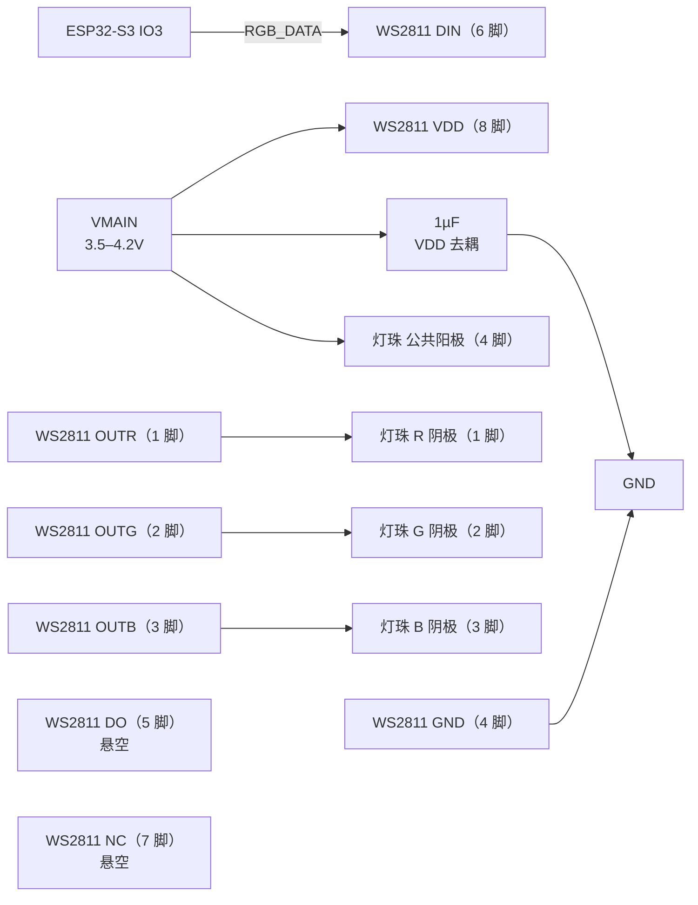

# WS2811 外围电路设计与接线

> 最近核验：**通过**（2026-09-17）
> 核验依据网表：`Netlist_Schematic1_2026-09-17 (2).tel`（导出 2026-09-17 23:31）SHA-256 `def286a5ac264cd2c5e795d5d4be3f8ed774f77382125920bfeb5e0b322fb6c7`
> 手册：`WS2811.pdf` Worldsemi **V2.2**（20240806，8 页）md5 `55a7e2bfc25efdc18247de0b998e4324`；`RGB灯珠.pdf` 统佳 TJ-S3528UG2W9TLCCYRGB-A5 承认书（10 页，无修订号）md5 `97318507c197202834488016e8b56018`
> 收口日期：2026-09-17 ｜ 库存快照：`库存列表-20260913211039.xlsx`（2026-09-13 21:10:39）
> 事实源：[`电子木鱼-硬件原理图设计基线.md`](../电子木鱼-硬件原理图设计基线.md)、[`电子木鱼-硬件网络清单.json`](../电子木鱼-硬件网络清单.json)、[`电源网络命名规范.md`](../电源网络命名规范.md)
>
> 本版只覆盖**网表与手册核验**。ERC、PCB DRC、示波器、电子负载、热测试与样机测试均未执行。

本文档以**引脚号、网络名和功能位置**为索引。位号由嘉立创 EDA 在每次导出时生成并在设计期持续重排，不写入本文档；查询「板上哪一颗是哪个」以 EDA 工程为准。

## 1. 依据与核验范围

### 1.1 依据

- **芯片手册**：`docs/hardware/芯片手册/WS2811.pdf`，Worldsemi WS2811 修订 **V2.2**，页脚标注 8 页，md5 `55a7e2bfc25efdc18247de0b998e4324`。本版用到第 1 页（主要特点、产品概述）、第 2 页（引出端排列、引出端功能表、最大额定值）、第 3 页（电气参数、开关特性、数据传输时间）、第 4 页（时序波形、24bit 数据结构）、第 5 页（典型应用电路三档）。
- **灯珠手册**：`docs/hardware/芯片手册/RGB灯珠.pdf`，统佳（TOGIALED）TJ-S3528UG2W9TLCCYRGB-A5 承认书，页脚标注 10 页，**无修订号**，md5 `97318507c197202834488016e8b56018`。本版用到第 2 页（外形尺寸、**引脚定义图**、焊盘图）、第 3 页（最大额定值、光电特性表）、第 5 页（绿通道 Vf-If 曲线）、第 6 页（蓝通道 Vf-If 曲线）、第 9 页（设计注意）。
- **网表**：`Netlist_Schematic1_2026-09-17 (2).tel`（导出 2026-09-17 23:31，SHA-256 见文首）。`$PACKAGES` 提供元件值与封装名，`$NETS` 提供端点连接。同一导出日的较早版本 `.tel`（23:16，`be1921d9…`）与 `(1).tel`（23:28，`4363dd5e…`）已弃用。网表按次核对、不归档进仓库，文中哈希对应上述那一次导出。
- **库存**：`库存列表-20260913211039.xlsx`，快照 2026-09-13 21:10:39，可用 = 在库 − 占用。
- **嘉立创页面**：2026-09-17 核对（见第 4 节）。

### 1.2 核验范围

WS2811（SOP-8，全板唯一 SOP-8 器件）的全部 8 个引脚，以及网表内与之相连的全部外围元件：共阳 RGB 状态灯珠 1 颗（4 脚全部）、VDD 去耦电容 1 颗。

**不在本文档范围**：`RGB_DATA` 归属的 ESP32-S3 IO3 驱动能力（属主控文档）；`VMAIN` 网络上同时服务 4G 模组、`TLV62569` 与其他负载的电容（归属由各负载的文档界定）；灯珠作为其他功能的复用（本设计为单一状态灯用途）。

### 未闭合事项

| 事项 | 类型 | 影响或阻塞 | 依据 / 方法 |
|---|---|---|---|
| ERC | 样机实测 | 原理图电气规则未跑 | 嘉立创 EDA ERC |
| PCB DRC | 样机实测 | 布局未验证；灯珠与驱动芯片的回路面积、`VMAIN` 去耦贴近 VDD 引脚 | 嘉立创 EDA DRC |
| 绿/蓝通道实际亮度与 OUT 脚余量 | 样机实测 | 手册未给出 OUT 脚的最小合规电压（compliance voltage），无法从手册判定 3.5–4.2V 供电下的实际光通量；本设计余量低于手册三档典型应用的最低设计点，见 §3.4 | 可调电源扫描 `VMAIN` 3.5–4.2V，测 OUT 脚电压与灯珠各通道电流 |
| `VMAIN` 瞬态下限 | 样机实测 | TPS22965 在 3.0–4.2V 工作点的导通电阻与压降手册未表征；4G 发射峰值时 `VMAIN` 可能瞬时低于 3.5V | 4G 发射峰值时测 `VSYS` 与 `VMAIN` 差压（与 TPS22965 文档第 1 节同一条未闭合项） |
| WS2811 嘉立创编号 | 外部确认 | BOM 归档需要；页面编号未经用户书面确认 | 嘉立创商品页核对 |
| 灯珠嘉立创编号 | 外部确认 | 同上 | 嘉立创商品页核对 |
| `电源网络命名规范.md` 的 `VMAIN` 口径 | 跨文档修改 | 该文写 3.0–4.2V，而 BQ25895 的 `REG03 = 0x3A` 使 `SYS_MIN = 3.5V`，实际下限为 3.5V；本文档按 3.5–4.2V 判定 | 先改真源，再改依赖文档 |
| `TPS22965DSGR` 文档的 WS2811 登记 | 跨文档修改 | 该文第 1 节未闭合事项把 WS2811 登记为「`VMAIN` 上的计划外消费者」并要求单独闭环，现已闭环 | 该文重新核验时更新 |
| `TPS22965DSGR` 文档的手册引用 | 跨文档修改 | 该文引用 `芯片手册/WS2812.pdf`，实际文件名为 `WS2811.pdf` | 同上 |

## 2. 芯片逐脚接线和总接线图

### 2.1 逐脚接线

**WS2811（SOP-8）**

| 脚号 | 名称 | 接法 | 状态 |
|---|---|---|---|
| 1 | OUTR | 灯珠 R 阴极 | 符合 |
| 2 | OUTG | 灯珠 G 阴极 | 符合 |
| 3 | OUTB | 灯珠 B 阴极 | 符合 |
| 4 | GND | `GND` | 符合 |
| 5 | DO | 悬空（本设计单颗使用，不级联） | NC |
| 6 | DIN | `RGB_DATA`（ESP32-S3 IO3） | 符合 |
| 7 | NC | 悬空（手册定义为空管脚） | NC |
| 8 | VDD | `VMAIN` | 符合 |

**状态灯珠（TJ-S3528UG2W9TLCCYRGB-A5，SMD3528-4P 共阳）**

| 脚号 | 名称 | 接法 | 状态 |
|---|---|---|---|
| 1 | R 阴极 | WS2811 OUTR（1 脚） | 符合 |
| 2 | G 阴极 | WS2811 OUTG（2 脚） | 符合 |
| 3 | B 阴极 | WS2811 OUTB（3 脚） | 符合 |
| 4 | 公共阳极 | `VMAIN` | 符合 |

**外围元件**

| 用途 | 接法 | 状态 |
|---|---|---|
| VDD 去耦 | 1µF，`VMAIN` 到 `GND` | 符合 |
| 电源到 VDD 的串联电阻（手册典型应用中的 Rd） | **不装**，VDD 直连 `VMAIN`，理由见 §3.2 | 符合 |

**引脚颜色顺序的落图核对（最易错项）**：灯珠手册第 2 页引脚图明确 `pin 1 = R`、`pin 2 = G`、`pin 3 = B`、`pin 4 = 公共阳极`，与 WS2811 的 `pin 1 = OUTR`、`pin 2 = OUTG`、`pin 3 = OUTB` 构成**同名相接**。逐条核对的实测反例：曾出现 `OUTR → pin 2`、`OUTG → pin 1`、`OUTB → pin 3` 的接法，红绿两路交叉、仅蓝路正确；该接法在原理图符号按通道命名网络标签时不会报错，只有对照灯珠手册第 2 页才能发现，重新落图时必须按编号逐一复核。

### 2.2 总接线图



图中只画板上实际存在的铜线连接。`DO`（5 脚）与 `NC`（7 脚）在本设计中无任何板上连接，故为孤立节点。灯珠三路阴极的对位是 `OUTR→R`、`OUTG→G`、`OUTB→B`，不是顺着引脚号任意排列。

### 2.3 落图操作

- 灯珠的四个焊盘按手册第 2 页焊盘图核对：`pin 1` 与 `pin 2` 在同一侧、`pin 4` 与 `pin 3` 在另一侧，`pin 4` 为公共阳极。EDA 符号的引脚编号须与实物一致；若符号把颜色文字标反（例如把 `pin 2` 标成 R），须同时修正符号，否则后续读图会持续误判。
- 检查 `DO`（5 脚）网络上不应存在任何元件：在网表中检索该引脚，应无端点。
- 检查 `VDD`（8 脚）与 `VMAIN` 之间不应存在串联电阻：手册典型应用的 Rd 在本设计不适用（§3.2）。
- 去耦电容应贴近 VDD 引脚与 GND 回地。

## 3. 参数复算与选型

### 3.1 VDD 去耦电容

**手册依据**：第 5 页典型应用电路三档（5V／12V／24V）**均**在 VDD 节点与 `GND` 之间给出 `Ci = 1uf`，三档取值一致，是手册对该元件位置与容量的唯一规定。

**代入与结果**：网表导出值为 `1µF`（0603），与手册推荐值一致，偏差 0。

**选定标准值**：1µF／0603。

**位置核对**：本设计的 VDD 直连 `VMAIN`，故该电容上端落在 `VMAIN` 网络、下端落在 `GND`，与手册「VDD 节点对地」的拓扑等效。

### 3.2 为什么本设计不装电源到 VDD 的串联电阻

手册第 5 页三档典型应用都在**供电轨与 VDD 引脚之间**串一个电阻 `Rd`：5V 档 150Ω、12V 档 4.7kΩ、24V 档 10kΩ。**该电阻不在 `DO` 与电源之间**——这一点在逐张放大第 5 页电路图后确认：`Rd` 上端接供电轨、下端接 VDD 引脚节点，该节点另接 `Ci` 到地；`DO` 在三档中都直接接下一级的 `DIN` 或引出板外，中间无元件。

**手册给出的机理**：第 1 页《主要特点》原文「芯片内置稳压管，24V 以下电源端只需串电阻到 VDD 脚，无需外加稳压管」。即 VDD 脚内部有稳压管，`Rd` 的作用是在**供电轨高于该稳压管钳位电压**时限流降压。

**由三档 Rd 值反解钳位电压**：设钳位电压为 `Vz`、芯片工作电流为 `I`，则三档满足 `(V轨 − Vz) / Rd = I`。取 5V 档与 12V 档联立：

```
(5 − Vz) / 150 = (12 − Vz) / 4700
4700 × (5 − Vz) = 150 × (12 − Vz)
23500 − 4700·Vz = 1800 − 150·Vz
Vz ≈ 4.77V
```

代回校验：5V 档电流 1.53mA、12V 档 1.54mA，两档一致；24V 档 1.92mA 同量级。**得 VDD 脚内部稳压管钳位电压约 4.8V、工作电流约 1.5mA。**

**本设计的判定**：供电轨 `VMAIN` 为 3.5–4.2V（下限依据见 §3.3），**低于 4.8V 的钳位电压**，稳压管不导通。此时串 `Rd` 不会起限流作用，只会把 VDD 进一步拉低为 `VDD = VMAIN − I·Rd`（按 150Ω 估算约再降 0.2V），对余量本已紧张的低压档位有害。因此**不装 Rd，VDD 直连 `VMAIN`**。

**依据边界（如实标注）**：手册第 2 页给出 VDD 引脚的额定范围为 **+3.5～+5.7V**，本设计 3.5–4.2V 落在该范围内，这是「不串 Rd」的直接依据。但手册三档典型应用全部串了 Rd，**手册没有给出供电轨低于钳位电压时的应用示例**；上述「低压不串阻」结论由第 1 页的钳位机理与三档 Rd 值反解得出，属**工程推断**，不是手册明写的条款。`Rd` 的功率、精度、温度系数与封装不在本核验范围。

### 3.3 VDD 供电域与 `VMAIN` 下限

**手册要求**：第 2 页《最大额定值》表「逻辑电源电压 VDD　+3.5～+5.7V」；第 3 页《电气参数》与《开关特性》两表表头的测试条件为 `VDD = 4.5～5.5V`。

**本板电源轨**：`VMAIN` 与 `VSYS` 同域（`VMAIN` 是 TPS22965 的输出、`VSYS` 是其输入），经 BQ25895 的 NVDC power-path 建立。`VSYS` 的下限由 BQ25895 `REG03` 的 `SYS_MIN` 决定，本项目 `REG03 = 0x3A` 对应 **`SYS_MIN = 3.5V`**（依据 [`BQ25895RTWR外围电路设计与接线.md`](BQ25895RTWR外围电路设计与接线.md) §3 寄存器配置），即电池完全耗尽时系统仍被调节在 3.5V 之上。上界随 `VBAT` 满充 4.2V。故 **`VMAIN` ≈ 3.5–4.2V**（差额为 TPS22965 的导通压降，见未闭合事项）。

**判定**：3.5–4.2V 落在手册 VDD 额定范围 +3.5～+5.7V 内，**符合**；下限正好取在手册下限上，无向下余量，故瞬态压降列为样机实测项。手册第 3 页的 4.5–5.5V 是电气参数的**测试条件**，不是引脚额定范围，不作为判定依据。

**`电源网络命名规范.md` 的口径差异**：该文把 `VSYS`／`VMAIN` 写为 3.0–4.2V，是把 `SYS_MIN` 的可配置范围（3.0–3.7V）当成了下限；其自述依据亦为「默认 3.5V」。本文档按项目实际寄存器配置取 3.5V，差异已列入未闭合事项，须先修正真源。

### 3.4 输出电流与灯珠匹配

- WS2811 第 3 页《电气参数》：`R、G、B 低电平输出电流 IOL` = 最小 14.0／典型 16.0／最大 18.0mA，测试条件 `DC=5V, DIN(FFH)`。
- 灯珠第 3 页《最大额定值》：`Forward Current (DC) IF` = 30mA；光电特性表的测试点为 `IF = 20mA`。
- **判定**：驱动电流 16mA（典型）落在灯珠 30mA 额定值内，并低于其 20mA 测试点，**符合**。

### 3.5 灯珠正向压降与 OUT 脚余量（样机实测项）

灯珠第 3 页光电特性表在 `IF = 20mA` 下给出：**R 通道 Vf = 1.8／2.0／2.4V**（min/typ/max），**G、B 通道 Vf = 2.8／3.0／3.4V**。WS2811 为恒流吸收输出，LED 阳极接 `VMAIN`、阴极接 `OUTR/OUTG/OUTB`，故 OUT 脚电压 = `VMAIN − Vf`：

| `VMAIN` | 红通道余量（typ 2.0V） | 绿/蓝余量（typ 3.0V） | 绿/蓝余量（max 3.4V） |
|---|---|---|---|
| 4.2V（满电） | 2.2V | 1.2V | 0.8V |
| 3.7V | 1.7V | 0.7V | 0.3V |
| 3.5V（下限） | 1.5V | 0.5V | 0.1V |

**有利因素**：灯珠 Vf 在 `IF = 20mA` 下标定，而本设计驱动电流为 16mA（典型）。灯珠第 5、6 页的 Vf-If 曲线显示 16mA 时绿/蓝 Vf 约 3.2V，较表中值低约 0.1V。

**手册空白**：WS2811 手册**未给出** OUTR/OUTG/OUTB 的最小合规电压或输出饱和压降，全文无 `VDD` 与 LED 正向压降余量的任何参数或曲线（第 2 页只有「R、G、B 输出端口耐压 VOUT 20V」这一上限；第 3 页的 `Vo = 0.4V` 挂在数据输出脚 `DO` 的 `Idout` 行下，不能当作 LED 驱动脚的合规电压）。

**可比对的量**：手册三档典型应用的 OUT 脚余量分别为 —— 5V 档 `5 − 3.4 = 1.6V`（最坏 Vf）、12V 档 `12 − 3×3.4 = 1.8V`、24V 档 `24 − 6×3.4 = 3.6V`，最低设计点为 1.6V。本设计在 `VMAIN` 下限处余量约 0.3V，**低于手册全部三档的设计点**。

**判定**：手册未覆盖该供电档位，绿/蓝通道的实际光通量无法从手册判定，列为**样机实测项**（见未闭合事项）；红通道余量在整个范围内充足。此项不阻塞文档定稿，但须在样机上先测后确认——若绿/蓝亮度不足，处理方向是给 WS2811 与灯珠换用更高的供电轨，而非加大输出电流（恒流值由芯片内部固定，外部不可调）。

### 3.6 固件接口约定

以下由选型决定，写入本节供固件参照：

- **数据格式**：每颗 24bit，顺序为 `R7…R0`、`G7…G0`、`B7…B0`，**高位先发**（手册第 4 页《24bit 数据结构》）。
- **帧复位**：连续低电平 > 280µs 判定为一帧结束（手册第 3 页《数据传输时间》）。该表另列 `T1L` 与 `T0L` 同为 580ns～1µs，与归零码常规不符，**固件时序不得直接按该行生成**，须以实测/示波器结果为准。
- **数据率**：可达 800Kbps（手册第 1 页）；单颗应用无级联数量约束。
- **驱动源**：ESP32-S3 的 IO3，3.3V 逻辑。WS2811 第 3 页给出 `VIH ≥ 0.55·VDD`，在本设计 `VDD` 最高 4.2V 时阈值为 2.31V，3.3V 逻辑满足；**此项按手册为符合，但 `电源网络命名规范.md` 与基线 §5.3.1 另有「5V 器件须增加电平转换」的口径，该口径与手册第 3 页的 `VIH` 公式不一致，属真源层面待澄清项**。
- **电流预算**：灯珠三通道全亮时约 `3 × 16mA = 48mA`，由 `VMAIN` 承担。

## 4. BOM 表

| 用途 | 单板量 | 目标规格及型号 | 嘉立创编号 | 可用库存快照 | 嘉立创/库存 |
|---|---:|---|---|---|---|
| 三通道 LED 驱动 | 1 | WS2811，SOP-8 | [C114581](https://www.lcsc.com/product-detail/C114581.html) | 未检出 | 外部采购 |
| 状态灯珠（共阳 RGB） | 1 | TJ-S3528UG2W9TLCCYRGB-A5，SMD3528-4P | [C601699](https://www.jlc-smt.com/lcsc/detail/C601699.html) | 未检出 | 嘉立创采购 |
| VDD 去耦 | 1 | CL10A105KP8NNNC，1µF/0603 | C26413 | 可用 241（在库 241 − 占用 0，快照 2026-09-13） | 库存领用 |

### 逐行待办

- **三通道 LED 驱动**：嘉立创编号 `C114581` 来自 2026-09-17 页面检索，**须由设计方在商品页复核后确认**；该料不在库存表内，按外部采购处理。
- **状态灯珠**：嘉立创编号 `C601699` 对应型号与原理图标注的 `TJ-S3528UG2W9TLCCYRGB-A5` 一致，**须在商品页复核库存与起订量**；该料不在库存表内，按嘉立创采购处理。
- **VDD 去耦**：无待办，可直接领用。

### 单板合计与全板同料合计

- **本对象单板用量**：WS2811 1 颗、灯珠 1 颗、1µF/0603 电容 1 颗。
- **`C26413`（1µF/0603）全板合计**：本对象认领 1 颗。同一料号在其他对象文档中的用量为 —— [`CW2015CHBD外围电路设计与接线.md`](CW2015CHBD外围电路设计与接线.md) §4 认领 1 颗（电池电压监测端对地电容）、[`ESP32-S3复位与启动控制设计.md`](ESP32-S3复位与启动控制设计.md) §4 认领 1 颗（EN 复位电容）。最新网表中 `1µF/0603` 共 4 颗，第 4 颗落在共享 `V3V3` 网络、无法归属单一器件，不计入任何文档认领。全板合计 3 颗认领 + 1 颗共享，与网表导出总数一致；可用 **241 颗**，**无缺口**。
- **`C601699` 与 `C114581`**：本对象独用，不跨文档共用。

### 采购清单

| 嘉立创编号 | 用途 | 状态 |
|---|---|---|
| C601699 | 状态灯珠 | 待采购，下单前复核页面库存 |
| C114581 | 三通道 LED 驱动 | 待采购，编号待设计方确认 |
| 待查 | —— | 若上两项库存不足，替代料号待查 |

---

**维护提示**：本文档的失效与回退遵循 `chip-peripheral-design` §2.4。若后续网表对 WS2811 或灯珠的连接做出任何改动，须在本文件顶部插入失效标记并把「最近核验」改为「未通过」，在重新核验全部通过前不得删除该标记。
