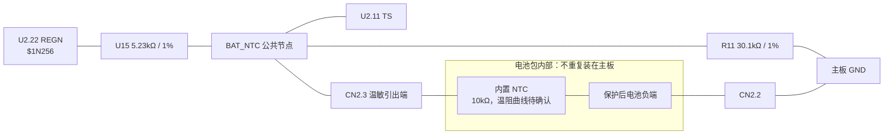
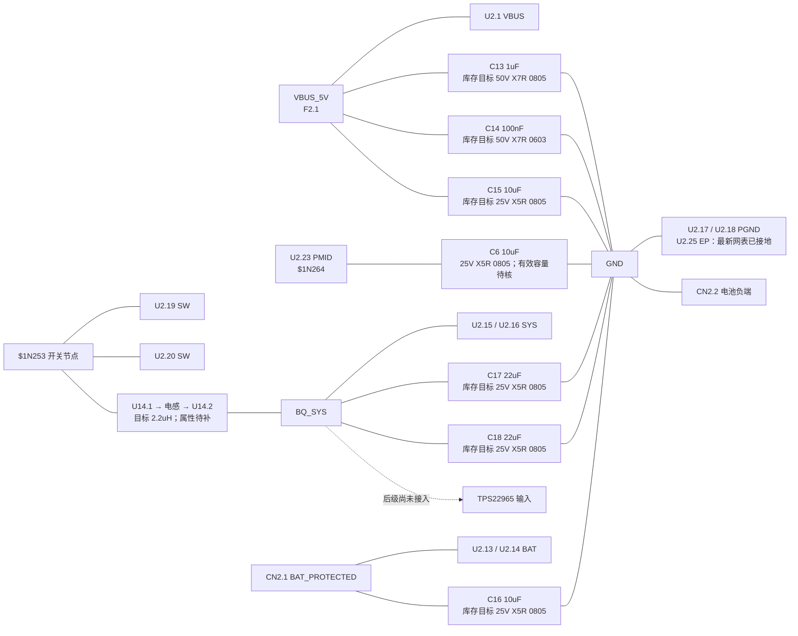
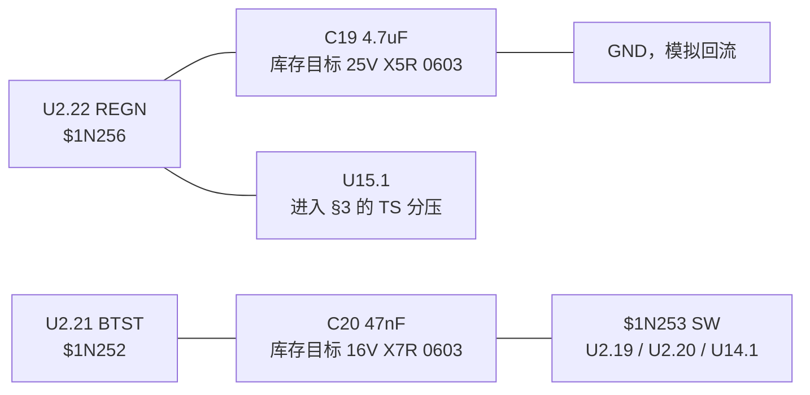
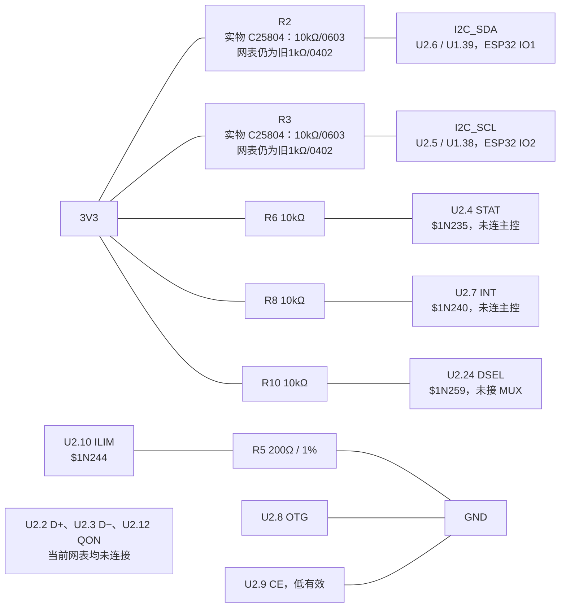

# BQ25895RTWR 外围电路设计与接线

> 修订日期：2026-09-13。依据最新网表 `Netlist_Schematic1_2026-09-13 (1).tel` 重新核对。
> 结论：BQ 核心功率/TS 接线符合数据手册，EP 接地已修复；I²C 上拉与原设计不一致，部分物料属性、后级供电及上电充电配置仍未闭合。不能表述为“元件选型、整机接线全部正确”。
> 本文替代此前重复的规格 BOM、采购 BOM、库存 BOM 及截图推测结论。图中位号仅对应本次网表，嘉立创可以自动重编号。

## 1. 依据与核验范围

- [BQ25895 本地 PDF](../芯片手册/bq25895.pdf)：SLUSC88C，Rev.C，2022-10。第 4–5 页脚表，第 8–10 页电气规格，第 22–23 页 TS，第 26 页 ILIM，第 31–40 页默认模式/寄存器，第 49–50 页外围计算，第 55 页布局。
- [最新网表](</Users/hongchenke/Downloads/Netlist_Schematic1_2026-09-13 (1).tel>)：`$PACKAGES` 确认导出的容值/阻值和封装名，`$NETS` 确认端点连接。SHA-256：`6cd71a4e4ee257ce065468691c6b1e7f47e9b97600bef1ca46469814be5301ef`。
- [库存表](库存列表-20260913211039.xlsx)：沿用 2026-09-13 21:10:39 导出表的“可用库存”快照。未扣料、未占用库存、未下单。
- [硬件基线](../电子木鱼-硬件原理图设计基线.md)、[网络清单](../电子木鱼-硬件网络清单.json)及 [板级合同](../../../_bmad-output/planning-artifacts/architecture/architecture-Electronic_Wooden_Fish-2026-09-08/ARCHITECTURE-SPINE.md)：用于判断系统接口。
- [长江微电 FXLB252012 原厂规格书](https://atta.szlcsc.com/upload/public/pdf/source/20220812/975CD70F8F8BB72DF45FA36D37878048.pdf)：本次已读正文并目视核对参数表。PDF 第 2 页（印刷页码 3/8）有 2R2 参数与焊盘尺寸。
- 网表没有电容耐压/介质/DC-bias 曲线、电阻精度和完整 MPN 字段。U2、U14 的导出值均为 `{Value}`。下面的具体库存 MPN 是选型目标，不能冒充已经从网表验证过的实装型号。

本次范围为 BQ25895 核心外围及其必要输入、I²C 和输出接口。网表包含其他模块，不代表它们已经接受完整审查。

## 2. 最新结果与修改项

### 2.1 已修复与撤回的旧结论

新旧网表逐端点比较，唯一连接变化是 `U2.25` 加入 `GND`，EP 悬空问题已经关闭到原理图网表层。

`BAT_NTC`、SW 双脚、电感、BTST 电容和 PMID 电容均已核对。不需要重画 TS 或把这些网络另行拆开。旧版将“截图看不清”写成严重错误，并要求删除重画 TS，这是不恰当的，现已撤回。旧版“只剩 PowerPAD 一个问题”的说法也遗漏了阻值和整机接口问题。

### 2.2 仍需处理的项目

| 项目 | 最新证据 | 修复/处理方案 |
| --- | --- | --- |
| R2、R3 的导出网表仍是旧值 | 最新 `.tel` 仍显示 `R0402 / 1kΩ`，但用户已实际替换为嘉立创 `C25804`（10kΩ/1%/0603） | 实物修正方向正确，但必须重新导出网表，使 R2/R3 反映 `10kΩ/0603`。更新后按 §5.4 以总线波形和实际电容确认速率。 |
| U14 电感的值未在导出中闭合 | 用户已确认使用嘉立创 `C3040393`，但最新 `.tel` 的 U14 value 仍为 `{Value}` | 实物选型可按 `FXLB252012-2R2-M / C3040393` 处理；在 EDA 属性中补写 `2.2uH` 和 MPN，重新导出网表。按 §5.2 的 2.7A/3.0A 电流限制评估系统负载。 |
| 电感不能仅按充电电流选型 | 旧公式只代入 1.024A，忽略系统分流 | 按“系统由 buck 提供的电流 + 电池充电电流”计算电感峰值。库存电感可作有限负载首版候选，不能认定适用任意 4G 满载。见 §5.2。 |
| BQ 输出尚未接入后级 | `BQ_SYS` 仅有 `C17.2 C18.2 U2.15 U2.16 U14.2`；U8、U9 出现在封装列表，但没有任何网络端点 | 后级设计阶段补齐 `BQ_SYS → TPS22965 → SYS_MAIN → TLV62569 → 3V3`，及负载开关控制/偏置。此项属于未完成接口，不是要求把 SYS 直接短接 BAT、3V3 或 M100。 |
| 当前 MCU 不能通过 INT 接收 BQ 中断 | `$1N240` 只有 R8.1、U2.7；STAT 同样只有上拉，未连 MCU | 若用 I²C 轮询，可保留现状。若固件需要 INT 中断，应先分配 GPIO 再接入；不能描述为已接主控中断。 |
| 1.5A 输入、1.024A 充电不是纯硬件保证 | CE 接地；网表没有 CC 电流检测，BQ D+/D− 未接 USB；POR/看门狗会影响寄存器 | 限流设置必须结合输入源能力。初始化前和 MCU 断电时的默认充电行为需纳入设计，见 §6。 |
| 电容有效容量未核实 | C6=10uF；C17+C18=44uF，均为标称值 | 取得最终 MPN 的偏压曲线，核对 C6 在 PMID 工作电压下有效值 ≥8.2uF、C17+C18 在 SYS 工作电压下有效值 ≥20uF。不足时优先增并同型号库存电容，再更新数量。 |

## 3. 电池内置 NTC 的接线

用户已确认电池包内部有 10kΩ NTC。本文将“10kΩ”按通常的 R25 标称解释，β 值、精度和实际温阻曲线仍未确认。连接以 NTC 另一端在电池包内部回到保护后负端、并经 CN2.2 接 GND 为前提；应核对电池包端子定义。

当前真实网表：

```text
'BAT_NTC' ; CN2.3 R11.2 U2.11 U15.2
'$1N256' ; C19.1 U2.22 U15.1
GND ; ... CN2.2 R11.1 ...
```

`BAT_NTC` 是一条导线的网络名，也是本板 TS 公共节点。主板上仅增加 5.23kΩ 和 30.1kΩ 两个固定电阻，内部 NTC 不应在主板再装一次。



不要将 CN2.3 直接接 GND，也不要接 BAT_PROTECTED。不应在 CN2.3 与 U2.11 之间再串一个 10kΩ 电阻。R11 是温度窗口调整电阻，不是用于替代 NTC，保留它。

## 4. 全部引脚和分区接线图

以下分区图一起覆盖 U2 的全部外部连接。图中实线仅表示电气连接，不表示电流方向；电容均是并联支路。参考号 U2 是本次 BQ，U1 是 ESP32，不要求用户改位号。

### 4.1 VBUS、PMID、BAT、SW、SYS 和地



VBUS、PMID、SW、SYS、BAT 五个节点不可外部互相短接。器件内部 MOSFET 完成相应电源路径；PMID 必需去耦，即使不用 OTG 也不能悬空不装电容。

### 4.2 REGN 与 BTST



C20 不接地。REGN 不作为 3V3 输出使用。原理图统一 GND；布局时把模拟回流与开关回流分开引到芯片附近的公共地/PowerPAD，不应只增加一个未连接的 PGND 标签。

### 4.3 I²C、控制和未使用引脚



QON 内部已有上拉，未用可以留空；原文关于“必须外接默认高电平”的暗示撤回。DSEL 上拉现状可以保留；未使用输出并不是普遍必须加上拉。若保留本图，仍按现有 R10 装配。

网表中的 `BQ_OTG_EN` 仅含 `U1.12`，并未连接 U2.8。它不是当前有效的 OTG 控制线路；本版遵循 U2.8 接地、不启用 OTG。项目 AGENTS、板级合同与该信号命名存在口径差异，本次不自行改占 GPIO 或接通升压。

## 5. 参数复算与选型条件

### 5.1 ILIM：200Ω 限制输入电流，不是充电电流

依据 PDF 第 9 页 KILIM、第 26 页公式：

```text
IINMAX = KILIM / RILIM
KILIM = 320 / 355 / 390 A·Ω
RILIM = 200Ω ±1% = 198…202Ω
典型 = 355/200 = 1.775A
含电阻偏差的估算范围 = 320/202 … 390/198 = 1.584…1.970A
R5 功耗约 = 0.8²/200 = 3.2mW，100mW 电阻足够
```

KILIM 表中测试条件为输入限流 1.5A，以上是按该系数计算的设计估算，并非额外的保证规格。启用 EN_ILIM 后，输入受硬件与寄存器限值共同限制；另有 DPM/ICO/温升约束。

不能把“200Ω 接好了”解释为电池只充 1.024A，也不能把 1.775A 解释为端口已经授权提供此电流。

### 5.2 电感：把系统负载计入

采用 2.2uH、5V 输入、1.5MHz 名义频率：

```text
D ≈ VSYS/VBUS
ΔIL = VBUS × D × (1−D)/(f × L)
D=0.5 的上界：ΔIL ≈ 0.379A
仅计 −20% 初始电感偏差，L=1.76uH：ΔIL ≈ 0.473A

充电且系统运行时：
IL_AVG ≈ I_SYS_FROM_BUCK + I_CHARGE
IL_PEAK ≈ IL_AVG + ΔIL/2
IL_RMS ≈ sqrt(IL_AVG² + ΔIL²/12)
```

旧计算 1.024+0.379/2=1.213A 只适用于系统负载约为零的示例。比如系统从 buck 取 1A、充电 1.024A时，平均电流约2.024A、按 L 偏差估算峰值约2.261A。DCR=82mΩ 时，仅直流铜损约0.336W，另有磁芯和交流损耗。该例还需输入功率预算允许，并不保证能同时达到。

库存 `FXLB252012-2R2-M` 的原厂参数：

| 参数 | 资料值与解释 |
| --- | --- |
| 电感量 | 2.2uH ±20%，100kHz/1V 测试 |
| DCR | 典型68mΩ，最大82mΩ |
| Heating Rating Current | TYP列3.0A、MAX列2.7A，按约40°C温升定义 |
| Saturation Current | TYP列3.3A、MAX列3.0A，按电感量下降约30%定义 |
| 屏蔽 | 原厂明确为磁屏蔽 |
| 外形 | 名义2.5×2.0mm，最大2.7×2.2×1.2mm |
| 推荐焊盘图 | 外包络2.6×2.1mm、两焊盘内间隙0.6mm，按原厂图核对 |
| 温度条件 | 参数基于25°C；器件总温度不能超过125°C |

原表“MAX”列的电流反而更低，本文忠实记录，不将3.0A宣称为全温保证下限。筛选时取较小的2.7A温升电流、3.0A饱和特征电流作参考，并留裕量；还须计入热环境、偏压导致的电感下降和工作频率损耗。

结论：库存电感具备作为首版候选的基本参数，可以优先保留。尚不能判定它满足未知系统最大负载。4G 峰值由电池经 BATFET 补充的部分不流经电感，不能把所有电池放电峰值简单加给电感；USB-only 时则没有电池补充。

### 5.3 电容：标称值匹配，有效值仍要核对

本版库存方案见 §7，X5R 器件不应继续被标成 X7R。PDF 第50页允许 X5R/X7R；这不等于小封装在直流偏压下仍保持标称容量。

- C6（PMID）：10uF nominal，按 ±10% 容差已可能只剩9uF；再叠加 DC bias/温度/老化后必须满足非 OTG 所需8.2uF。现有资料没有该料号在5V下的完整有效容量验证，不能声称已达标。
- C17+C18（SYS）：44uF nominal；只计 −20% 容差为35.2uF。完整工作条件下总有效值须≥20uF。
- C16（BAT）：按 PDF 第5页10uF建议配置，并检查实际偏压和瞬态。
- C19（REGN）：4.7uF/25V/X5R，耐压高于手册10V建议。还须确认该封装在实际REGN电压下的容量和稳定性。
- C20：47nF/16V/X7R 跨 BTST-SW，耐压针对两端差分电压，不能按 BTST 对地电位误判。
- C13：1uF近端去耦；C15=10uF和C14=100nF为本版附加并联支路，非 TI 强制“三颗组合”。它们不替代 PMID 的开关输入电容，电缆压降也不能单靠增容消除。

按名义参数，SYS 电容的开关纹波估算 `ΔV ≈ ΔIL/(8fCeff)`，取0.379A、20uF 得约1.58mV；不包含 ESR、布局和负载阶跃。电容纹波 RMS 约 `ΔIL/(2√3)`，上述例约0.109A。PMID 电容 RMS 约 `IL_AVG√(D(1−D))`，D=0.5 时达平均电感电流的一半。容值合格不等于纹波/温升和瞬态通过。

### 5.4 I²C 上拉：1kΩ 不是直接短路错误

网表 R2/R3 是1kΩ，各线拉低时约需 `(3.3−0.4)/1000=2.9mA`；BQ手册第10页给出5mA下VOL=0.4V的测试条件，故不能断言“1kΩ必然损坏或不能通信”。

但这是多器件共享总线，需按最弱器件、全部并联上拉与电容负载核对。实物已按库存 C25804 改为10kΩ/0603，每线拉低电流约0.29mA。重新导出网表后，R2/R3应显示为10kΩ/0603。

按 RC 估算 `tr≈0.8473×Rp×Cb`：10kΩ 在 Cb=100pF 时约847ns，适合100kHz标准模式的1us上升时间目标，但不满足400kHz快速模式300ns目标。10kΩ用于400kHz时总线电容约需≤35pF。首版建议100kHz起步；若需要400kHz，量测电容/波形后选择更小上拉，不能无条件认定10kΩ适合全速。

### 5.5 NTC 分压：拓扑通过，温度窗口有条件

对103AT参考曲线，PDF第23页使用 R(0°C)=27.28kΩ、R(45°C)=4.91kΩ。冷阈值约73.25%REGN，充电进行中的热截止阈值约44.75%REGN。解分压关系：

```text
VTS/VREGN = (R11 ∥ RNTC)/(U15 + R11 ∥ RNTC)
aC=1/0.7325−1，aH=1/0.4475−1
U15=(aH−aC)/(1/RHOT−1/RCOLD) ≈5.206kΩ
R11=1/(aC/U15−1/RCOLD) ≈29.859kΩ
选择 U15=5.23kΩ、R11=30.1kΩ
```

上述代入手册已舍入阈值得到的结果，与手册列出的5.21kΩ/29.87kΩ有轻微舍入差异，均选择相同标准值。复算 VTS/REGN：0°C约73.235%，25°C约58.936%，45°C约44.664%。这些是名义估算，未含 NTC/固定电阻/芯片阈值误差。

启动或故障后恢复充电使用约48.25%REGN的热阈值，不能把“0~45°C”描述为启动、停止都完全相同的精确窗口。仅有10kΩ标称不足以证明温度窗口正确；需电池包温阻曲线或关键温度阻值。断开内置NTC时理论比例约85.2%，短路时约0%，都会越出正常充电温度区间。

## 6. 上电配置与当前硬件边界

### 6.1 CE 接地会允许默认充电

本网表 U2.9=GND。按手册，第31页默认模式、REG03/04/05/06 的 POR 默认配置为：允许充电、快充目标2048mA、预充128mA、终止256mA、VREG=4.208V，实际还受输入/DPM/TS等限制。

因此，仅在文档写入 `ICHG=1.024A` 并不能保证刚插USB、主控没启动或主控掉电时只充1.024A。当前后级未连通，尤其不能假设主控已经能上电写寄存器。电池的允许充电电流、终止电压公差要覆盖默认模式；若不允许，需增加明确的默认禁止充电控制，再由有效控制端配置完成后使能 CE。该控制涉及掉电和电平设计，不能只把 CE 接到会随主控一起掉电的上拉。

### 6.2 配置建议（不是网表已实现项）

| 字段 | 建议/计算 |
| --- | --- |
| 地址 | 7-bit 0x6A |
| 初始化顺序 | 能通信后先清CHG_CONFIG，再设置并读回电压、电流、输入能力、温度/定时参数，最后允许充电；这不能代替POR阶段的硬件限制 |
| REG00.EN_HIZ / EN_ILIM | 0 / 1，显式写入并读回 |
| REG00.IINLIM | 已确认输入源允许≥1.5A时可选1.5A，字段码28；未识别输入源不得盲设1.5A |
| REG03.OTG_CONFIG | 0；硬件OTG脚也已接地 |
| REG02.AUTO_DPDM_EN / FORCE_DPDM | 0 / 0；D+/D−未接USB |
| REG02.HVDCP_EN / MAXC_EN | 0 / 0，不进行高压充电握手 |
| REG02.ICO_EN | 本版固定输入预算时可清0，避免与调试预期混淆；ICO不能代替USB端口能力识别 |
| REG04.ICHG | 条件候选1024mA，64mA步进，字段码16；电池规格确认前不作最终上限 |
| REG05.IPRECHG / ITERM | 条件候选128mA/128mA，两字段码均1；必须适合所用电芯 |
| REG06.VREG | 3.840V+16mV×码；4.192V为码22，4.208V为码23。没有精确4.200V档，必须按电芯允许上限和芯片误差选择，不能默认把4.208V等同4.200V |
| REG06.BATLOWV | 候选1，对应约3.0V上升切快充门限 |
| REG07.EN_TERM / EN_TIMER | 保持1，启用终止和安全定时 |
| REG07.WATCHDOG | 采用定期喂狗，或显式关闭该I²C看门狗并保留安全定时器；必须选择并实现一种。超时会恢复多个默认充电字段，不能只把40s换160s便认为问题解决 |
| REG08.BAT_COMP / VCLAMP | 首版保持0，未测电池路径电阻前不启用IR补偿 |

4.208V在+0.5%误差估算下约为4.229V；即使选4.192V，按相同误差估算也可到4.213V。电池标称“4.2V”不能直接替代其允许充电电压及公差。数据手册精度的测试档位见第8页，应按所选档位与电池规格核实。

### 6.3 Type-C 和输入功率

CC1/CC2当前各只有5.1kΩ Rd，BQ的D+/D−则未连接USB。Rd提供受电端识别，不是1.5A/2A供电能力检测。调试可使用已明确限流/额定能力的5V电源；面向任意电脑USB口或Type-C电源，需要端口能力识别后再设IINLIM。[TI关于受电端电流检测的说明](https://e2e.ti.com/support/interface-group/interface/f/interface-forum/1127292/tusb320-minumum-requirements-for-type-c-snk)

输入功率上限为 `VBUS×IIN`，系统和充电共同分配转换后的功率。5V×1.5A=7.5W是输入侧预算，电池4.2V×1.024A约4.30W，其余还要扣转换损耗后才能供系统。DPM会降低充电电流；USB-only无法靠电池补充输入不足。

F2、D6在网表仅导出封装及 `{Value}`，未证明保险丝电流、TVS钳位和浪涌能力，故本文不将前级标成“保护已验证”。

## 7. 唯一首版 BOM：库存优先及最新网表差异

“库存”表示库存快照有料且名义规格可匹配；不等于实际原理图已绑定该MPN，也不代表偏压/温升已通过。库存数量属于整项料号，多处使用时不得重复累计。

| 用途 / 本次位号 | 单板量 | 最新网表实际 | 目标规格及型号 | 嘉立创编号 | 可用库存快照 | 来源/动作 |
| --- | ---: | --- | --- | --- | ---: | --- |
| BQ / U2 | 1 | QFN24-EP，值未导出 | BQ25895RTWR，RTW 4×4mm；EP按当前库映射pin25 | [C80200](https://www.lcsc.com/product-detail/C80200.html) | 未检出 | 需嘉立创购买；核对MPN及脚/焊盘映射 |
| 电感 / U14 | 1 | 两端连接正确；值未导出，通用封装名 | FXLB252012-2R2-M，2.2uH±20%；DCR最大82mΩ；电流及焊盘见§5.2 | C3040393 | 6 | 库存候选；补属性、核对封装及负载裕量 |
| VBUS / C13 | 1 | 1uF/0805 | CL21B105KBFNNNE，1uF±10%/50V/X7R/0805 | C28323 | 44 | 库存 |
| VBUS / C14 | 1 | 100nF/0603 | 0603B104K500NT，100nF±10%/50V/X7R/0603 | C30926 | 89 | 库存 |
| VBUS、PMID、BAT / C15、C6、C16 | 3 | 10uF/0805，各一颗 | CL21A106KAYNNNE，10uF±10%/25V/X5R/0805 | C15850 | 21 | 库存；合计用3颗，C6有效容量须核实 |
| SYS / C17、C18 | 2 | 22uF/0805，各一颗 | CL21A226MAQNNNE，22uF±20%/25V/X5R/0805 | C45783 | 2 | 库存；数量刚好，有效总容量须核实 |
| REGN / C19 | 1 | 4.7uF/0603 | CL10A475KA8NQNC，4.7uF±10%/25V/X5R/0603 | C69335 | 50 | 库存 |
| BTST / C20 | 1 | 47nF/0603 | CC0603KRX7R7BB473，47nF±10%/16V/X7R/0603 | C115058 | 50 | 库存 |
| ILIM / R5 | 1 | 200Ω/0603 | 0603WAF2000T5E，200Ω±1%/100mW/0603 | C8218 | 50 | 库存 |
| STAT、INT、DSEL / R6、R8、R10 | 3 | 10kΩ/0603 | 0603WAF1002T5E，10kΩ±1%/100mW/0603 | C25804 | 50 | 库存 |
| I²C / R2、R3 | 2 | **实物已换 C25804，网表仍为旧1kΩ/0402** | 0603WAF1002T5E，10kΩ±1%/100mW/0603 | C25804 | 50 | **实物修正完成，需重导网表**；SDA/SCL各一颗 |
| TS上臂 / U15 | 1 | 5.23kΩ/0603 | CRCW06035K23FKEA，5.23kΩ±1%/100mW/0603 | [C844180](https://www.lcsc.com/product-detail/C844180.html) | 未检出 | 需嘉立创购买；精度未在TEL中导出 |
| TS下臂 / R11 | 1 | 30.1kΩ/0603 | RC0603FR-0730K1L，30.1kΩ±1%/100mW/0603 | [C137745](https://www.lcsc.com/product-detail/C137745.html) | 未检出 | 需嘉立创购买；精度未在TEL中导出 |
| 内置NTC | 主板0颗 | CN2.3接TS | 电池内部10kΩ，β/温阻曲线待确认 | 不另购主板NTC | 用户确认电池内置 | 沿用电池接口 |

单板本表：**9颗电容 + 8颗电阻 + 1颗电感 + 1颗BQ = 19件**，内置NTC不计主板物料。按实物已换R2/R3后，15颗阻容可从库存快照供应，1颗电感为库存候选，3件缺口是BQ和两颗TS固定电阻。若C6需增容或后级补充器件，数量随实际方案更新。

`U15`作为电阻位号、`U14`作为电感位号本身不会造成电气错误。无需为编号重新摆件。

### 7.1 修正旧采购表错误

- `CL10A226MQ8NRNC/C59461`实际为 **22uF/6.3V/X5R/0603**，此前写成16V/0805错误。它不是当前C17/C18的库存目标，请使用上表C45783。[参数页](https://www.lcsc.com/product-detail/C59461.html)
- `PRS5040-2R2MT/C2936651`页面为额定3.8A、Isat4.9A、DCR18mΩ、5×5mm；此前把两种电流写反且混入23.4mΩ。它只保留为备选，不能直接装进U14的2.5×2.0mm封装。本次页面显示缺货，不再称“已确认有货”。[参数页](https://www.lcsc.com/product-detail/C2936651.html)
- 原图/BOM中的X7R、6.3V、10V泛规格已统一为上述库存目标，未从TEL读出的属性均明确为选型要求。
- “库存有22uF两颗”并不证明有效电容已达20uF；原文的无条件通过判断撤回。

## 8. 验证记录及后续关闭条件

本次解析了最新网表的25个U2引脚/焊盘编号：22个有网络，2/3/12未连接且符合本版不用USB检测、QON留空的意图。62项相关端点到网络关系检查通过。新旧端点映射差异只有U2.25加入GND。实物已将R2/R3换为C25804，但该变化尚未反映到本次 `.tel` 导出文件。

验证覆盖网表连接和已导出的值/封装名，未执行嘉立创ERC、PCB DRC、焊盘实物匹配或样机测试。最终需要：

1. 重新导出网表，确认R2/R3为C25804对应的10kΩ/0603；不要让旧的1kΩ/0402记录继续作为交付依据。
2. 导出带MPN、商品编号、耐压、介质、精度的BOM。确认U2为BQ25895RTWR，U14为2.2uH目标型号，焊盘与实物匹配。
3. 核对电池包NTC曲线和允许充电参数，解决CE接地时的默认充电与主控关机情况。
4. 核对C6和C17/C18有效容量、U14实际负载/温升。导热焊盘连接已通过网表，但PCB铜皮和过孔仍需查看布局。
5. 后级设计完成后检查BQ_SYS到SYS_MAIN及3V3路径；再验证USB-only、电池-only和同时接入的电压、电流、温升与插拔瞬态。

布局按BQ手册第55页：PMID电容贴近pin23和PGND；SW双脚到电感输入最短，避免大面积开关铜；SYS电容贴近电感输出和芯片；REGN/TS模拟回流避开功率回流；PowerPAD可靠焊接并用导热过孔连接地平面。
