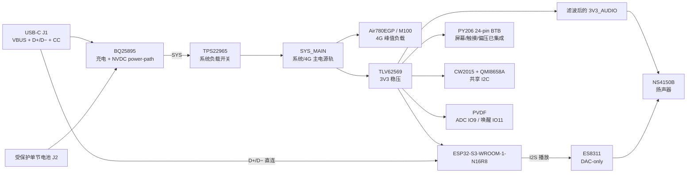
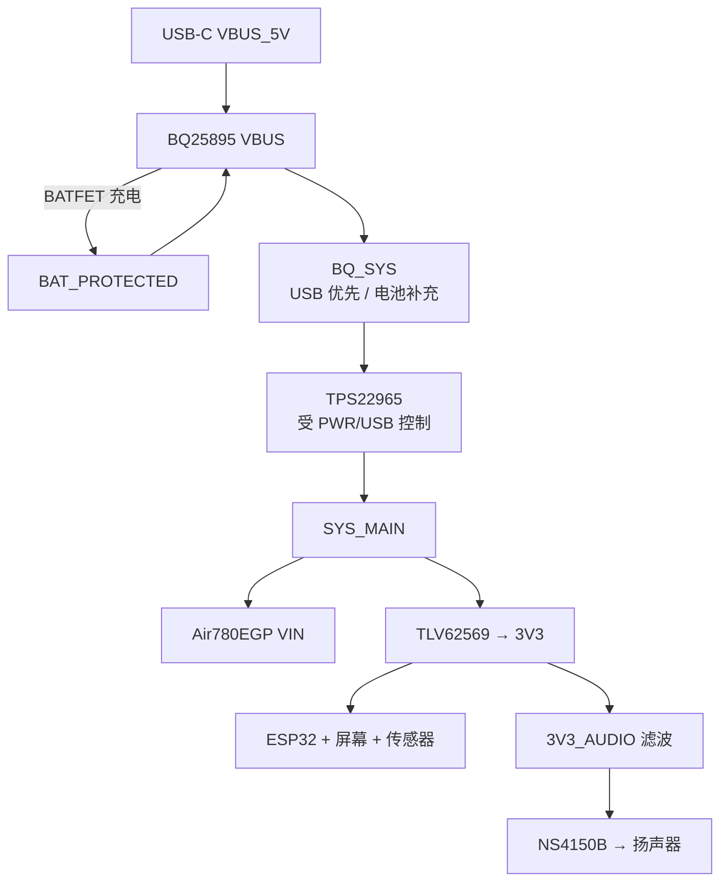

# 电子木鱼硬件二次开发文档

> 适用对象：基于 ESP32-S3-WROOM-1-N16R8 的 Electronic_Wooden_Fish（电子木鱼）硬件原理图、PCB 和固件二次开发。
> 本文档严格区分“项目接口合同”“首版推荐初值”和“必须样机验证”。当前硬件仍处于可落图基线，尚未完成 ERC、PCB DRC、打样和实物验收。
> GPIO 事实以本项目 `ARCHITECTURE-SPINE.md` §板级合同为准；ESP32-S3 模组能力以 Espressif 官方数据手册和硬件设计指南为约束。

## 外围电路原理图参考包

本文件负责硬件接口合同和网络事实；外围电路的原厂资料、典型应用页码和逐脚参考图索引位于 [`peripheral-reference/README.md`](peripheral-reference/README.md)。使用顺序为：整板总图 → 电源 → USB-C → 音频 → 传感器 → 显示/触摸 → 4G。

逐脚 SVG 用来建立网络和器件连接的可视参考；正式落图仍须打开索引中的原厂/厂商 PDF 典型应用页，在嘉立创 EDA 中使用真实符号和封装，并保留对应页码和版本记录。

## 0. 本轮已确认的设计决策

| 项目 | 决策 | 依据/影响 |
| --- | --- | --- |
| ES8311 数据回传 | **ES8311 ADC 回传不连接，IO17 留空** | `main_control` 的 IO17 实际是 GPS UART TX；其音频 I2S 输入脚为 IO48，且是录音链路。本项目只有木鱼音播放，因此不再为录音保留 IO17。 |
| M100 NET_STATUS | 载板有该引脚，但 `main_control` 只配置 IO16 为输入高阻，未调用 `gpio_get_level` 读取；EWF 最终不接 IO16 | 若保留兼容能力，IO16 输入高阻、禁用上下拉；若本项目不使用，ESP32 IO16 直接 NC。 |
| 按键 | 产品按键只有 **BOOT（GPIO0）** 和 **PWR（GPIO46）** | EN/RESET 不设产品按键，只留测试点；PWR 长按由 TPS3424 完成硬件开关机。 |
| USB 数据与充电 | 单 USB-C 的 D+/D− 直连 ESP32；BQ25895 D+/D− 不参与检测，按数据手册关闭该功能；CC1/CC2 仅负责受电识别。 | USB-C 数据直连 ESP32，USB 通信与充电同时进行。 |
| 充电时播放 | 目标是 USB 供电、单电池供电、同时接入且可边充边播；优先让功放使用低噪声独立电源，避免把充电开关噪声直接带入音频地和供电。 | 必须通过负载阶跃、音频底噪和充电插拔实测关闭。 |

## 1. 资料来源与结论摘要

### 1.1 资料来源

| 类型 | 路径/来源 | 用途 |
| --- | --- | --- |
| ESP32-S3-WROOM-1 模组数据手册 | [Espressif 官方 Datasheet](https://www.espressif.com/sites/default/files/documentation/esp32-s3-wroom-1_wroom-1u_datasheet_en.pdf) | 模组管脚、N16R8 Flash/PSRAM、启动绑带、电源和 USB |
| ESP32-S3 硬件设计指南 | [原理图检查清单](https://docs.espressif.com/projects/esp-hardware-design-guidelines/en/latest/esp32s3/schematic-checklist.html)；[PCB 布局](https://docs.espressif.com/projects/esp-hardware-design-guidelines/en/latest/esp32s3/pcb-layout-design.html) | 启动脚、GPIO、天线 keepout、去耦和布局 |
| 项目架构合同 | `_bmad-output/planning-artifacts/architecture/architecture-Electronic_Wooden_Fish-2026-09-08/ARCHITECTURE-SPINE.md` | 项目 GPIO、总线、业务边界和电源不变量 |
| 机器网络清单 | `docs/hardware/电子木鱼-硬件网络清单.json` | GPIO、I²C、网络、电源、连接器和测试点结构化事实 |
| 显示 BTB 资料 | `docs/hardware/3593896291PY206-W38-V2(2).pdf` | PY206 模组对外 24-pin 针脚；排线端公座 OK-14GM024-04，主板端母座 OK-14F024-04；CO5300/CST9217/OCP21351 均在模组内部 |
| 旧参考原理图 | `docs/hardware/SCH_遥控板_双TypeC_4G稳压_2026-09-07.pdf` | 仅交叉参考外围，不迁移旧 GPIO、双 Type-C 或 5V 4G 供电 |
| main_control 真源 | `/Users/hongchenke/Documents/Github/main_control/components/BSP/GPS/gps.c`、`gps.h`、`STUDIO/studio.h` | 核对 IO16 是否实际读取、IO17 的旧职责和 ES8311 I²S 方向 |

### 1.2 总体结论

- 本项目使用 ESP32-S3-WROOM-1-N16R8；IO35–37 连接模组内 Octal PSRAM，GPIO0/3/45/46 为启动绑带，EN 为专用复位输入。
- 4G Air780EGP/M100 从 BQ25895 的 `BQ_SYS` 经 TPS22965 形成 `SYS_MAIN`；USB-only 时由 BQ 的 NVDC power-path 直接供系统，电池-only 时由电池经 BQ SYS 供系统。
- 单 USB-C 的 D+/D− 直连 ESP32 USB-Serial-JTAG；BQ25895 D+/D− 不接 USB-C 数据线，固定配置输入限流并关闭 BC1.2 自动检测。
- 屏幕/触摸、音频、传感器、USB-C 和电源外围均已给出首版网络，但 FPC 方向、器件地址、电平、时序、峰值电流和 PCB 走线仍需验证。

## 2. 板级硬件总览

### 2.0 系统连接图



### 2.1 权威 GPIO 总表

以下表格就是后续画原理图和写 BSP 时的第一入口。`ESP32 合法性`只说明模组能否承载该 GPIO 功能，不代表外围电平、驱动极性或 PCB 已验证。

| 功能/信号 | ESP32-S3 GPIO | 方向 | 启动/内部资源属性 | ESP32 合法性 | 项目约束与验证 |
| --- | ---: | --- | --- | --- | --- |
| BOOT0 | IO0 | input_strapping | 是：启动绑带 | 允许；复用由 GPIO matrix/外设约束决定 | 下载时拉低；复位采样窗口不得被外设推错 |
| PWR_STATE | IO46 | input_strapping | 是：启动绑带 | 允许；复用由 GPIO matrix/外设约束决定 | 固件只读；PWR 长按由 TPS3424 完成硬开关机 |
| RESET_N | EN | reset_input | 否 | 允许；复用由 GPIO matrix/外设约束决定 | 独立按键/测试点 |
| PVDF_ADC | IO9 | analog_input | 否 | 允许；复用由 GPIO matrix/外设约束决定 | ADC1_CH8；前端 1MΩ 级限流；低漏钳位，不得越过 ADC 安全范围 |
| PVDF_CMP_WAKE | IO11 | wake_input | 否 | 允许；复用由 GPIO matrix/外设约束决定 | 比较器输出；仅唤醒，ADC 二次确认后才生成 physical_pvdf |
| I2C_SDA | IO1 | bidirectional_open_drain | 否 | 允许；复用由 GPIO matrix/外设约束决定 | I2C0 单一仲裁；共享上拉 |
| I2C_SCL | IO2 | bidirectional_open_drain | 否 | 允许；复用由 GPIO matrix/外设约束决定 | I2C0 单一仲裁；共享上拉 |
| TP_RST | IO38 | output | 否 | 允许；复用由 GPIO matrix/外设约束决定 | CST9217 RSTn，极性待实测 |
| TP_INT | IO39 | input | 否 | 允许；复用由 GPIO matrix/外设约束决定 | CST9217 中断，极性待实测 |
| IMU_INT1 | IO41 | input | 否 | 允许；复用由 GPIO matrix/外设约束决定 | QMI8658A INT1 预留；INT2 不接、不占 IO45 |
| LCD_RST | IO4 | output | 否 | 允许；复用由 GPIO matrix/外设约束决定 | CO5300 L_RES |
| LCD_CS | IO40 | output | 否 | 允许；复用由 GPIO matrix/外设约束决定 | CO5300 CS |
| LCD_SCLK | IO5 | output | 否 | 允许；复用由 GPIO matrix/外设约束决定 | CO5300 L_SCLK |
| LCD_D0 | IO6 | bidirectional | 否 | 允许；复用由 GPIO matrix/外设约束决定 | CO5300 L_IO0 |
| LCD_D1 | IO7 | bidirectional | 否 | 允许；复用由 GPIO matrix/外设约束决定 | CO5300 L_IO1 |
| LCD_D2 | IO12 | bidirectional | 否 | 允许；复用由 GPIO matrix/外设约束决定 | CO5300 L_IO2 |
| LCD_D3 | IO42 | bidirectional | 否 | 允许；复用由 GPIO matrix/外设约束决定 | CO5300 L_IO3 |
| LCD_EN | IO47 | output | 否 | 允许；复用由 GPIO matrix/外设约束决定 | CO5300 OLED_EN，有效极性/时序待实测 |
| I2S_DOUT | IO13 | output | 否 | 允许；复用由 GPIO matrix/外设约束决定 | ESP32 → ES8311 |
| I2S_WS | IO14 | output | 否 | 允许；复用由 GPIO matrix/外设约束决定 | ES8311 word select |
| I2S_BCLK | IO18 | output | 否 | 允许；复用由 GPIO matrix/外设约束决定 | ES8311 bit clock |
| I2S_MCLK | IO21 | output | 否 | 允许；复用由 GPIO matrix/外设约束决定 | ES8311 master clock |
| PA_EN | IO48 | output | 否 | 允许；复用由 GPIO matrix/外设约束决定 | 3V3_AUDIO 稳定后再拉高；静音/充电/故障时拉低 |
| M100_TXD | IO43 | output | 否 | 允许；复用由 GPIO matrix/外设约束决定 | ESP32 UART TX → M100 RXD；单一 AT 事务所有权 |
| M100_RXD | IO44 | input | 否 | 允许；复用由 GPIO matrix/外设约束决定 | M100 TXD → ESP32 UART RX |
| M100_DTR | IO10 | open_drain_output | 否 | 允许；复用由 GPIO matrix/外设约束决定 | DTR 有效极性待整模组手册/样机验证 |
| M100_RST | IO15 | high_z_or_open_drain | 否 | 允许；复用由 GPIO matrix/外设约束决定 | 载板 RST 方向/低有效性待验证 |
| RGB_DATA | IO3 | output | 是：启动绑带 | 允许；复用由 GPIO matrix/外设约束决定 | 用户状态灯，不作调试灯 |
| USB_D- | IO19 | bidirectional_usb | 否 | 允许；复用由 GPIO matrix/外设约束决定 | USB-Serial-JTAG；不得与 BQ D- 并联 |
| USB_D+ | IO20 | bidirectional_usb | 否 | 允许；复用由 GPIO matrix/外设约束决定 | USB-Serial-JTAG；不得与 BQ D+ 并联 |

**启动脚必须单独理解：** 正常 SPI 启动要求 GPIO0=1；进入联合下载模式要求 GPIO0=0 且 GPIO46=0。GPIO3 用于 JTAG 信号源选择，若保持默认 eFuse 配置则 USB Serial/JTAG 不受 GPIO3 影响；一旦烧录 `EFUSE_STRAP_JTAG_SEL`，RGB_DATA 外围必须提供确定的复位电平。GPIO45 控制 VDD_SPI，N16R8 不得接 QMI8658A INT2。EN 不得悬空，必须有明确复位电路。

**模组内部保留脚：** N16R8 的 IO35、IO36、IO37 已连接 Octal PSRAM，不能用于外设；项目同时不分配 IO22–34 和 IO45。后续任何换脚必须先修改 spine 与 JSON，再修改 BSP。

### 2.2 硬件总线实例分配

ESP32-S3 的外设信号可以通过 GPIO matrix 路由，但本项目固定以下实例，避免不同驱动各自抢脚。UART 的 TX/RX 按“主控方向”书写，载板 TXD/RXD 在 §5 交叉核对。

| 外设实例 | 正式用途 | GPIO/信号 | 连接模块 | 依据与注意事项 |
| --- | --- | --- | --- | --- |
| UART0 | USB/启动日志保留 | 不接业务外设 | ROM/调试保留 | 不接 Air780，不与 UART 业务混用 |
| UART1 | Air780EGP AT 通信 | TX=IO43、RX=IO44；DTR=IO10、RST=IO15 | M100/Air780 | 单一 AT 所有权；NET_STATUS 不接 ESP32；电平和极性待验证 |
| I2C0 | 全板共享配置/状态 | SDA=IO1、SCL=IO2 | BQ25895、CW2015、CST9217、ES8311、QMI8658A | BSP 单一仲裁；统一上拉和地址扫描 |
| I2S0 | 音频数据 | MCLK=IO21、BCLK=IO18、WS=IO14、DOUT=IO13 | ES8311 + NS4150B | codec 控制走 I2C，音频数据走 I2S |
| SPI3_HOST / QSPI | AMOLED 刷新 | CS=IO40、SCLK=IO5、D0=IO6、D1=IO7、D2=IO12、D3=IO42；RST=IO4；EN=IO47 | CO5300 | 成组布线；不占 SPI0/1 内部 Flash/PSRAM |
| USB Serial/JTAG | 烧录、CDC、OpenOCD | D−=IO19、D+=IO20 | USB-C J1 直连 ESP32 | 不需要 CH340X；USB 数据与 BQ VBUS 充电输入并行；不启用 USB-OTG |
| SDMMC | 不使用 | 无 | 无 SD 卡 | IO8/9/10 已分配项目功能，不得按旧图恢复 SD |

### 2.3 总线与资源分组

| 总线/资源 | 连接外设 | 当前状态 | 开发与布线注意事项 |
| --- | --- | --- | --- |
| I2C0 `IO1/IO2` | BQ25895、CW2015、CST9217、ES8311、QMI8658A | 已冻结接口；地址待实板扫描 | 单一上拉、短分支、地址无重复；业务通过 BSP 仲裁 |
| I2S0 | ES8311、NS4150B | 已冻结引脚 | 时钟/数据成组，模拟回流与功放回流分开 |
| SPI3/QSPI | CO5300 | 已冻结引脚 | 远离 4G 天线、功放输出；预留串阻位置 |
| Air780 UART | Air780EGP/M100 | 已冻结主控侧引脚 | IO43/44 不作 console；确认载板电平和交叉方向 |
| USB | USB-C、USB-C 直连、BQ、ESP32 | 已冻结拓扑 | D+/D− 差分、ESD 靠近连接器、禁止并联反灌 |
| 电源高电流 | `BQ_SYS`、`SYS_MAIN`、`3V3_AUDIO` | 网络边界已冻结 | BQ 开关回路、4G 和功放分区，不能让开关回流经过音频模拟地 |
| 模拟输入 | PVDF_RAW/ADC/CMP | IO9/IO11 已冻结 | 远离开关节点、4G、扬声器；低漏钳位靠近 ADC |
| 保留资源 | IO8、IO22–37、IO45、SPI0/1 | 不分配/仅测试点 | 不接外设，不在固件中初始化 |

## 3. 电源网络与 USB 数据路径

### 3.0 最终电源方案（已锁定）

本项目锁定为单 USB-C、单电池、可同时充电和运行的 NVDC 架构。BQ25895 的 `SYS` 是系统主电源节点：没有电池但有 USB 时，BQ 通过 power-path 直接提供系统电源；有电池但没有 USB 时，BATFET 将电池接入 SYS；两者同时存在时，USB 优先供系统并给电池充电，电池只在输入不足时补充。

| 使用状态 | 最终路径 | 设备行为 |
| --- | --- | --- |
| 仅 USB-C | `VBUS_5V → BQ25895 → BQ_SYS → TPS22965 → SYS_MAIN → 3V3/4G/音频` | 可开机、显示、4G、播放；无电池也能运行 |
| 仅电池 | `BAT_PROTECTED → BQ25895 BATFET/SYS → TPS22965 → SYS_MAIN` | 可开机、显示、4G、播放 |
| USB-C + 电池 | `VBUS_5V → BQ25895 power-path → SYS_MAIN`，同时 `BAT` 充电 | 设备继续运行，电池充电，USB 拔出后由电池无缝接管 |

**音频电源锁定：** 音频电源固定为滤波后的 3V3_AUDIO；NS4150B 的 VCC 使用从 `3V3` 分出的 `3V3_AUDIO`，在功放入口放磁珠或负载开关、10 µF + 100 nF 去耦，并让 ES8311 模拟地回流不经过 BQ 开关电流路径。这样充电时不会发生 OTG 升压启停，优先消除此前的低频噪声源。NS4150B 的音量、温升和失真仍必须按目标扬声器实测。

**系统电源开关：** TPS22965 的输入改接 `BQ_SYS`，输出命名为 `SYS_MAIN`；其 ON 由“VBUS 有效”与 TPS3424 锁存输出的硬件逻辑合取/或取决于所购器件的有效极性，必须保证 USB-only 时无需电池也能打开系统。PWR 长按仍由 TPS3424 完成硬关机，EN 只留测试点。



### 3.1 充电、运行与低噪声时序

1. USB-C 插入后，CC1/CC2 的 Rd 让充电器识别设备为受电端，BQ25895 建立 VBUS→SYS 的 power-path。
2. `SYS_MAIN` 稳定后启动 3V3、ESP32、显示和 4G；不等待或切换 OTG 音频升压。
3. `3V3_AUDIO` 经过滤波后给 NS4150B，`PA_EN` 仅在音频轨稳定后拉高。
4. 同时接入电池时，BQ25895 给电池充电；系统负载由 USB 优先供电，电池只作补充。
5. 充电插拔、4G 发射和扬声器播放必须分别测量 `SYS_MAIN`、`3V3_AUDIO`、功放地和扬声器输出端，确认没有低频纹波耦合。

### 3.2.1 最终电源外围

| 器件 | 最终用途 | 连接 | 关键外围/要求 |
| --- | --- | --- | --- |
| BQ25895 | 单节充电、NVDC power-path、系统供电 | VBUS=`VBUS_5V`、BAT=`BAT_PROTECTED`、SYS=`BQ_SYS` | `C_VBUS=1 µF`、`C_SYS≈20 µF`、`C_BAT=10 µF`、TS/NTC 按电池规格；D+/D− 不接 USB-C 数据线，关闭 BC1.2 自动检测并固定输入限流 |
| TPS3424 | PWR 长按检测与硬件锁存 | 电池/PWR 按键 → `SYS_EN` | EN 逻辑必须允许 USB-only 上电；长按关断不依赖 ESP32；具体时序按所购版本数据手册计算 |
| TPS22965 | 系统主负载开关 | IN=`BQ_SYS`、OUT=`SYS_MAIN` | `SYS_MAIN` 供 4G、3V3 和音频；输入/输出去耦靠近器件；不得让 4G 峰值经过细线 |
| TLV62569 | `SYS_MAIN → 3V3` | IN=`SYS_MAIN`、OUT=`3V3` | 2.2 µH、输入 10 µF+100 nF、输出 2×22 µF；最低输入和掉压需按电池/USB-only 实测 |
| 3V3_AUDIO 滤波 | 功放低噪声供电 | `3V3 → 磁珠/负载开关 → 3V3_AUDIO` | 功放入口 10 µF+100 nF；模拟地单独回流；不使用 BQ PMID 升压供音频 |

BQ25895 具备无电池 instant-on、NVDC power-path 和电池补充能力；本设计利用其 SYS 节点满足三种供电状态。BQ 的 D+/D− 仅在启用 USB/适配器检测时才需要，最终不连接到 USB-C 数据通道。

**不要把 `BQ_SYS` 直接短接到 M100：** M100 必须经过 TPS22965 形成 `SYS_MAIN`，以便 PWR 硬件关断、限流和测试点管理。

### 3.3 USB-C 供电与数据

| USB-C 信号 | 最终连接 | 作用 |
| --- | --- | --- |
| VBUS | J1 → BQ25895 VBUS | 充电和 USB-only 系统供电 |
| D+ / D− | J1 → ESP32 IO20 / IO19 | USB Serial/JTAG、烧录、CDC 日志 |
| CC1 / CC2 | 各 5.1 kΩ Rd → GND | 受电端识别和正反插检测 |
| BQ25895 D+ / D− | 按“不使用检测”方式处理 | 不接 USB-C 数据线；固定 `IINLIM/ILIM` |

Type-C 正反插由 CC1/CC2 完成，但 USB 2.0 的 D+/D− 在连接器内部已经是同一对逻辑信号，不需要为了正反插再做数据 MUX。USB 通信与充电可以同时进行；需要验证不同充电器下的输入限流和 BQ D+/D− 关闭方式。

## 4. 屏幕、触摸与 24-pin BTB

> 主板只放置 PY206 的 24-pin BTB 母座 `OK-14F024-04` 和对应保护/测试器件；屏幕排线尾端是配对公座 `OK-14GM024-04`。`CO5300`、`CST9217`、`OCP21351` 属于 PY206 屏幕模组内部器件，主板不重复放置其芯片。本节的逐脚可视化接线图见 [`peripheral-reference/display/py206-btb-24pin-wiring.svg`](peripheral-reference/display/py206-btb-24pin-wiring.svg)。

以下针脚来自仓库内 `docs/hardware/3593896291PY206-W38-V2(2).pdf` 第 3–4 页（型号/修订与实物接触方向仍需确认）。`TP-*` 为 CST9217 触摸侧，`L-*` 为 CO5300 QSPI 侧。PDF 的 `TP PIN定义` 是模组上的测试焊盘，不是第二个必须插接的 6-pin 外部连接器。

| FPC pin | 原厂符号 | EWF 网络 | 去向 | 状态 |
| ---: | --- | --- | --- | --- |
| 1 | `TP-VDD 3V` | `3V3` | 触摸供电 | **推荐初值**；电压/时序[必须样机验证] |
| 2 | `TP SCL 3V` | `I2C_SCL` | ESP32 IO2 | **已确认** |
| 3 | `TP-SDA 3V` | `I2C_SDA` | ESP32 IO1 | **已确认** |
| 4 | `TP INT 3V` | `TP_INT` | ESP32 IO39 | **已确认**；极性[必须样机验证] |
| 5 | `TP RST 3V` | `TP_RST` | ESP32 IO38 | **已确认**；极性[必须样机验证] |
| 6 | `TP-GND` | `GND` | 地 | **已确认** |
| 7 | `VDD 3V` | `3V3` | 显示逻辑供电 | **推荐初值**；电源时序[必须样机验证] |
| 8 | `VBAT` | `LCD_VBAT`（首版接 `SYS_MAIN`） | AMOLED 模拟/面板供电 | **推荐初值**；范围/纹波[必须样机验证] |
| 9 | `MTP/NC` | `NC` | 不接 | **已确认** |
| 10 | `VDD 3V` | `3V3` | 显示逻辑供电 | **推荐初值**；电源时序[必须样机验证] |
| 11 | `GND` | `GND` | 地 | **已确认** |
| 12 | `L RES` | `LCD_RST` | ESP32 IO4 | **已确认** |
| 13 | `GND` | `GND` | 地 | **已确认** |
| 14 | `L IO0` | `LCD_D0` | ESP32 IO6 | **已确认** |
| 15 | `GND` | `GND` | 地 | **已确认** |
| 16 | `L SCLK` | `LCD_SCLK` | ESP32 IO5 | **已确认** |
| 17 | `GND` | `GND` | 地 | **已确认** |
| 18 | `L IO3` | `LCD_D3` | ESP32 IO42 | **已确认** |
| 19 | `NC` | `NC` | 不接 | **已确认** |
| 20 | `L IO2` | `LCD_D2` | ESP32 IO12 | **已确认** |
| 21 | `CS` | `LCD_CS` | ESP32 IO40 | **已确认** |
| 22 | `L IO1` | `LCD_D1` | ESP32 IO7 | **已确认** |
| 23 | `OLED_EN` | `LCD_EN` | ESP32 IO47 | **已确认**；电源时序[必须样机验证] |
| 24 | `LTE`/`TE` | `LCD_TE` | 测试点或 NC；MVP 不用 | **推荐初值**；实物功能[必须样机验证] |

**BTB 接口门禁：** 第 8 脚是否需要独立 `LCD_VBAT`、公母座接触面与 1 脚方向、`TE` 是否需要接入、IO47 的有效极性，必须在实物插合与首帧示波器记录后才能冻结。


## 5. 模块深入说明

本章按可以单独评审和布线的模块组织。每一节都先说明“它做什么”，再说明“接到哪里、如何供电、布局时看什么、用什么证据关闭”。

### 5.1 电源及外围模块

**职责：** 由 BQ25895 建立 USB/电池 power-path，由 TPS3424/TPS22965 控制 SYS_MAIN；音频从 3V3 分出独立滤波轨。

| 模块 | 输入 | 输出/连接 | 设计判断 |
| --- | --- | --- | --- |
| BQ25895 | `VBUS_5V`、`BAT_PROTECTED` | `BQ_SYS`、充电状态 I²C | 负责 NVDC/充电和系统 power-path；不使用 OTG |
| TPS3424 + TPS22965 | BQ_SYS、PWR 按键/VBUS 有效 | `SYS_MAIN` | 长按断电由硬件完成；USB-only 仍可上电 |
| U4 3V3 稳压 | `SYS_MAIN` | `3V3` | 供 ESP32、显示逻辑、I²C、PVDF、RGB；电流和压降需测 |
| 3V3_AUDIO 滤波 | `3V3` | `3V3_AUDIO` | 只供 NS4150B；稳定后才允许 `PA_EN` |

布局时将 BQ 开关电感、输入/输出电容、TPS22965 和 4G 电源入口放在同一高电流区域；3V3、PVDF 和音频模拟地从开关节点旁边绕开。每条轨都要有测试点，详见 §3.2 与 §6.3。

### 5.2 屏幕与触摸模块

**职责：** 主板通过 `OK-14F024-04` 与屏幕排线端 `OK-14GM024-04` 配合的 24-pin BTB 同时提供显示、触摸和模组偏压所需的外部连接；CO5300、CST9217、OCP21351 只作为模组内部功能说明，不在主板重复集成。

| 子模块 | ESP32 资源 | 供电 | 必查项目 |
| --- | --- | --- | --- |
| CO5300 QSPI | IO4/40/5/6/7/12/42/47 | 逻辑 `3V3`，面板 `LCD_VBAT` 候选 | QSPI 成组、FPC 方向、首帧时序、`LCD_EN` 极性 |
| CST9217 | I²C IO1/2、RST IO38、INT IO39 | `3V3` | 地址、RST/INT 极性、坐标方向、上拉 |

FPC pin 1、接触面和 pin 8 `LCD_VBAT` 在拿到实物前只算推荐目标；任何“针脚连续”证据都不能替代供电时序和首帧波形。

### 5.3 音频模块

### 5.3.1 音频与 RGB 补充

- `ES8311`：共享 I²C；I²S `DOUT=IO13`、`WS=IO14`、`BCLK=IO18`、`MCLK=IO21`。codec 供电取 `3V3`，模拟地/数字地按数据手册和 PCB 回流处理。
- `NS4150B`：`VCC=3V3_AUDIO`，音频输入来自 ES8311 模拟输出，`PA_EN=IO48`。`PA_EN` 只有在 `3V3_AUDIO` 稳定后才可拉高；静音、充电、故障时拉低。
- `RGB_DATA=IO3`：优先使用 3.3 V 兼容 RGB 器件并接 `3V3`；若选 5 V 器件，必须增加电平转换与限流，不能直接把 3.3 V 数据线接到 5 V 输入。

#### 5.3.2 ES8311 / NS4150B 首版外围候选

| 器件 | 首选 MPN（LCSC） | 推荐初值（来源为旧参考图/数据手册典型电路） | 样机门禁 |
| --- | --- | --- | --- |
| ES8311 | `ES8311` QFN-20-EP 3×3（LCSC `C962342`） | I²C 上拉 `4.7 kΩ`；PVDD/DVDD 各 `100 nF`；AVDD `1 µF`；ADCVREF/DACVREF/MIC1N 各 `1 µF`；I²S 线可预留 `22 pF` DNP；OUTP/OUTN AC 耦合各 `1 µF`，串联 `0 Ω` 料位 | 地址/CE-CDAT、I²S 主从、22 pF 是否影响边沿、模拟地回流及增益必须按目标板实测；不迁移旧麦克风/语音链路。 |
| NS4150B | `NS4150B` MSOP-8（LCSC `C189961`） | VCC `1 µF + 22 µF + 22 µF`；BYPASS `1 µF`；差分输入各 `100 nF` 串联、各 `100 kΩ` 偏置；PA_EN 下拉 `100 kΩ`；输出端 `0 Ω` 料位与 `1 nF` EMI 预留 | 参考图中的值仅作起点；扬声器阻抗、输出功率、爆音/温升和 `PA_EN` 先后顺序必须在最终腔体实测。 |

ES8311 的 `I2C_SDA/SCL` 仍挂共享 `I2C0`，I²S 四根播放线只走音频路径；`3V3_AUDIO` 只供功放，不把 5 V 直接送入 ES8311。

### 5.4 电量计、IMU 与 PVDF 传感器

| 传感器 | 总线/引脚 | 供电 | 产品职责 | 主要风险 |
| --- | --- | --- | --- | --- |
| CW2015 | I²C IO1/2，参考地址 0x62 | `3V3` | 电量和低电状态 | 地址、电芯曲线、轮询阻塞 |
| QMI8658A | I²C IO1/2，INT1 IO41 | `3V3` | 上板但 MVP 默认不启用 | 不得接 IO45；SA0 地址需扫 |
| PVDF | ADC IO9、比较器唤醒 IO11 | `3V3` 模拟前端 | 产生 `physical_pvdf` | 过压、负摆幅、阈值、滞回、误触发 |

电量计和 IMU 是数字共享总线设备，PVDF 是模拟输入；三者不能共用同一段高噪声回流。PVDF 的 `1 MΩ` 限流、低漏钳位、比较器和 ADC RC 只作首版候选，必须用 `TP_PVDF_RAW/ADC/CMP` 关闭风险。

#### 5.4.1 PVDF 模拟前端与比较器

```text
PVDF+/- → 1 MΩ 级串联限流（推荐初值）
       → 低漏钳位/泄放网络（料号、阻值待定）
       ├→ PVDF_ADC（IO9 / ADC1_CH8）二次确认
       └→ 比较器输入 → PVDF_CMP_WAKE（IO11）低功耗唤醒
```

1MΩ、钳位器件、偏置/泄放、比较器料号、阈值、滞回、输出极性与消抖均为 **[必须样机验证]**；过压和负摆幅不得越过 ADC 安全范围。PVDF 只产生 `physical_pvdf` 事件，不保存或上传原始波形。测试点：`TP_PVDF_RAW`、`TP_PVDF_ADC`、`TP_PVDF_CMP`。

最终选型为 `TLV2369IDGKR`（VSSOP-8，LCSC `C2057867`）作缓冲、`TLV7042DGKR`（VSSOP-8，LCSC `C2760466`）作唤醒比较器；`R_PVDF_SER=1 MΩ`、`R_BIAS/泄放=10 MΩ`、`R_ADC=1 kΩ`、`C_ADC=100 nF`。这些值只用于首版占位与测试点布局，不能替代比较器输入共模、钳位漏电、阈值/滞回计算；TLV7042 输出形式与 IO11 唤醒极性必须实测。

### 5.5 Air780EGP / M100EG-C2 载板

| 载板端信号 | EWF 网络 | ESP32/电源去向 | 约束 |
| --- | --- | --- | --- |
| `VIN` | `M100_VIN`=`SYS_MAIN` | TPS22965 输出 | 3.3–4.5 V 系统轨；持续 >1 A、瞬时约 1.5–2 A；必须经负载开关 |
| `GND` | `GND` | 公共地 | 4G 回流与音频回流分区布局 |
| `TXD` | `M100_TXD` | ESP IO44（UART RX） | 单一 AT 入口 |
| `RXD` | `M100_RXD` | ESP IO43（UART TX） | 电平/交叉方向[必须样机验证] |
| `DTR` | `M100_DTR` | ESP IO10 开漏 | 唤醒/休眠有效极性[必须样机验证] |
| `RST` | `M100_RST` | ESP IO15 + TP | 载板输入/输出方向与低有效性[必须样机验证] |
| `NET_STATUS` | `M100_NET_STATUS_COMPAT` | M100 载板本地；ESP32 不接 | `main_control` 虽配置 IO16 高阻但未读取；EWF 直接 NC |
| `GNSS_VCC` | `M100_GNSS_VCC_NC` | `NC/TP` | GPS 非 MVP；不接 ESP32 |
| `SIM`/`ANT` | `M100_SIM_*`/`M100_ANT` | 载板/连接器 | 载板具体针脚、ESD、天线与机械结构[必须样机验证] |

4G 软件仍沿用 `docs/embedded/4g/` 的 AT、DTR、PDP、HTTPS 单事务经验，但本硬件合同不复制 `main_control` 的旧 GPIO（尤其旧 UART 与 `GNSS_VCC` 映射）。


### 5.6 USB-C、连接器与 LCSC 候选

**USB-C 模块的信号顺序：** J1 的 VBUS 只进入 `BQ25895.VBUS`；D+/D− 先进入 USB-C 直连 公共端，再单选到 BQ 或 ESP32；CC1/CC2 各通过 5.1 kΩ Rd 接地。USB-C 数据路径与 4G UART 完全独立，USB 连接不能改变 Air780EGP 的 AT 所有权。

| 位号 | 目标连接器 | 首选 MPN / LCSC | 适配条件与状态 |
| --- | --- | --- | --- |
| J1 | 单 USB-C 16P、USB2.0、SMT | `TYPEC-304-ACP16` / LCSC `C165948`（候选） | 机械沉板高度、外壳开孔和屏蔽脚布局[必须样机验证]；不再使用双 Type-C。 |
| J2 | 电池 3P、2.0 mm PH（BATT+/BATT−/NTC） | JST `B3B-PH-K-S(LF)(SN)` / LCSC `C131339` | 电池线径、锁扣方向、NTC B 值和保护板方案仍需确认。 |
| J3 | 显示 BTB 24P、0.4 mm、2×12、0.8H | OCN/亚奇 `OK-14F024-04` / 嘉立创 C9900019201（另有 C9900174853 库条目） | 屏幕排线配对公座为 `OK-14GM024-04`；必须核对 pin 1、接触面、焊盘和配合高度；不使用 0.5 mm FPC ZIF 座。 |
| J4 | M100EG-C2 载板排针 | `HDR1X10-P2.54`（LCSC 料号待载板实物核对） | 仅冻结逻辑信号交叉表（见落图记录）；实际排针位数/间距/方向[必须样机验证]。 |
| J5 | 单声道扬声器 2P | 2.0 mm/2.54 mm 连接器料号待腔体确认 | 阻抗、线长、极性与腔体[必须样机验证]。 |
| J6 | PVDF 2P 或焊盘 | 机械方案待定 | 传感器有效自由长度与应力释放[必须样机验证]。 |

### 5.7 首版 BOM 对照（可采购项与待定项分开）

| 位号 | MPN | LCSC | 数量 | 状态 | 备注 |
| --- | --- | --- | ---: | --- | --- |
| U1 | BQ25895RTWR | C80200 | 1 | 推荐初值 | QFN-24-EP；地址 0x6A |
| U2 | TPS3424A11C13ADRLR | 待核 | 1 | 推荐初值 | DRL/SOT-5X3；按版本核对时序 |
| U3 | TPS22965DSGR | C122837 | 1 | 推荐初值 | UDFN-8-EP 2×2；SYS_MAIN |
| U4 | TLV62569DBVR | C141836 | 1 | 推荐初值 | SOT-23-5；3V3 降压 |
| | | U7 | ESP32-S3-WROOM-1-N16R8 | C2913202 | 1 | 已确认 | 主控模组；采购批次仍需核对 |
| U8 | ES8311 | C962342 | 1 | 推荐初值 | QFN-20-EP；I²C 0x18 参考 |
| U9 | NS4150B | C189961 | 1 | 已确认功能 | MSOP-8；3–5 V 功放 |
| U10 | TLV2369IDGKR | C2057867 | 1 | 推荐型号 | PVDF 双路 RRIO 缓冲；B 通道按手册固定 |
| U11 | TLV7042DGKR | C2760466 | 1 | 推荐型号 | PVDF 双路开漏比较器；输出极性待测 |
| U12 | CW2015 | 待核 | 1 | 推荐初值 | 电量计；地址待扫 |
| U13 | QMI8658A | 待核 | 1 | 推荐初值 | SA0=高，0x6B；MVP 默认不启用 |
| J3 | PY206-W38-V2 24-pin BTB 母座 | OK-14F024-04 | 1 | 推荐目标 | 嘉立创 C9900019201；配对排线公座 OK-14GM024-04；CO5300/CST9217/OCP21351 均为模组内部 |
| J1 | TYPEC-304-ACP16 | C165948 | 1 | 推荐初值 | 单 USB-C 16P |
| J2 | B3B-PH-K-S(LF)(SN) | C131339 | 1 | 已确认接口 | 电池 3P PH 2.0 mm，含 NTC |
| J4 | M100EG-C2 载板 | 待核 | 1 | 推荐目标 | 逻辑排针/载板针脚待核 |
| R_PVDF_SER | 1 MΩ，1% | 采购时选 0603 | 1 | 推荐初值 | PVDF 限流，必须验证 |
| R_PVDF_BIAS | 10 MΩ，1% | 采购时选 0603 | 1 | 推荐初值 | 泄放/偏置，必须验证 |
| R_PVDF_ADC | 1 kΩ，1% | 采购时选 0603 | 1 | 推荐初值 | ADC 隔离，必须验证 |
| C_PVDF_ADC | 100 nF，X7R | 采购时选 0603 | 1 | 推荐初值 | ADC RC，必须验证 |

LCSC 库存、价格和替代料会变化；上述编号是 2026-09-09 检索到的候选，不构成采购锁定。缺少 LCSC 编号的器件必须在导入 EDA 前由采购/封装负责人补齐并复核封装。


## 6. 原理图落图、PCB 布线与验收

嘉立创落图的页层级和逐网连接记录见 [`嘉立创EDA-分层原理图落图记录.md`](嘉立创EDA-分层原理图落图记录.md)，机器侧字段见 [`电子木鱼-硬件网络清单.json`](电子木鱼-硬件网络清单.json)。所有页使用本文件的网络名，不在子页另起别名。

| 页码 | 页面 | 必须出现的网络/测试点 |
| --- | --- | --- |
| P01 | USB-C、BQ25895、TPS3424/TPS22965、电池与电源分轨 | `VBUS_5V`、`BAT_PROTECTED`、`BQ_SYS`、`SYS_MAIN`、`3V3`、`3V3_AUDIO`、`TP_BQ_SYS`、`TP_SYS_MAIN` |
| P02 | ESP32-S3 主控、下载/复位、USB-Serial-JTAG | `BOOT0`、`PWR_STATE`、`RESET_N`、`USB_D−`、`USB_D+`、`IO8_NC_TESTPOINT` |
| P03 | PY206-W38-V2 24-pin BTB（屏幕/触摸/偏压已集成） | `I2C_SDA/SCL`、`TP_RST/INT`、`LCD_*`、`LCD_VBAT`、`LCD_TE` |
| P04 | ES8311、NS4150B、扬声器、RGB | `I2S_*`、`3V3_AUDIO`、`PA_EN`、`RGB_DATA`、`SPK_P/N` |
| P05 | PVDF、限流/钳位、比较器与测试点 | `PVDF_RAW`、`PVDF_ADC`、`PVDF_CMP_WAKE`、三个 PVDF TP |
| P06 | M100EG-C2/Air780EGP、SIM、天线与测试点 | `M100_VIN`、`M100_TXD/RXD`、`M100_DTR`、`M100_RST`、`M100_NET_STATUS_COMPAT`、`M100_GNSS_VCC_NC` |
| P07 | 共享传感器与总线测试点 | `I2C_SDA/SCL`、`CW2015`、`QMI8658A`、`TP_I2C_SDA/SCL` |

## 6.2 开放项与样机验收矩阵

| 编号 | 开放项 | 何时关闭 | 证据要求 | 状态 |
| --- | --- | --- | --- | --- |
| HW-OI-001 | 受保护电池容量、保护板/NTC、机械与安全间距 | 选定电芯并完成充放电 | 电池规格、热/过流记录 | **[必须样机验证]** |
| HW-OI-002 | 3V3 稳压器料号、效率、纹波与启动 | 首版 PCB 负载测试 | 电子负载+示波器波形 | **[必须样机验证]** |
| HW-OI-003 | TPS3424/TPS22965 精确外围、PWR 长按/掉电时序 | 原理图 ERC + 实机按键测试 | 各轨上电顺序与掉压波形 | **[必须样机验证]** |
| HW-OI-004 | BQ25895 充电电流、ILIM、TS/NTC 与 SYS power-path | USB-only、电池-only、同时接入和满载测试 | SYS 电压、充电状态、温升、电流波形 | **[必须样机验证]** |
| HW-OI-005 | USB-C D+/D− 直连 ESP32、BQ D+/D− 关闭检测 | USB 枚举、不同充电器和输入限流 | PC 枚举、充电电流、反灌电压 | **[必须样机验证]** |
| HW-OI-006 | PY206 FPC 实物方向、VBAT/VDD 范围、OLED_EN/TE | 插合与首帧显示 | 针脚连续性、供电时序、首帧照片/波形 | **[必须样机验证]** |
| HW-OI-007 | CST9217、CW2015、ES8311、QMI8658A 实际 I²C 地址 | 上电扫描 | 扫描日志；地址不得重复 | **[必须样机验证]** |
| HW-OI-008 | PVDF 1M 限流、钳位、比较器料号/阈值/滞回 | 单次、1 秒 20 次及环境振动测试 | ADC 不越界、误触发/漏触发记录 | **[必须样机验证]** |
| HW-OI-009 | M100 UART 电平、RST/DTR 极性、NET_STATUS/GNSS_VCC 是否有载板针脚 | 载板资料与实测 | 针脚表、AT 回应、休眠/唤醒波形 | **[必须样机验证]** |
| HW-OI-010 | Air780EGP 发射峰值、电池轨压降与天线/散热 | 弱网满功率发射 | 电子负载/示波器，无掉压重启 | **[必须样机验证]** |
| HW-OI-011 | 扬声器阻抗、腔体、ES8311 增益、3V3_AUDIO 负载 | 目标外壳声学标定 | RMS/削顶/爆音与温升记录 | **[必须样机验证]** |

**样机状态声明：** 当前有文档、网络清单和原厂资料索引；嘉立创 EDA 工程仅保留 P01–P07 页树，未放置元件或运行 ERC，未进行 PCB 打样、实物插合、示波器/电子负载测试。任何输出、代码编译或静态检查通过都不能替代上述样机证据。

## 6.3 PCB 走线与布局检查清单

- 4G `SYS_MAIN`、USB VBUS、扬声器功放回路按峰值电流单独规划回流和铜宽；不得经 `3V3` 或 `BQ_SYS` 细线供电。
- `USB_DP/USB_DM` 至 USB-C 直连、再至 `USB_D±` 保持等长差分、连续参考地和最短回路；BQ 与 ESP32 两组选路端不得并联或跨接。
- QSPI `LCD_SCLK/D0–D3/CS` 成组布线，远离功放输出和 4G 天线馈线；BTB 连接器附近预留地回流与 ESD 位置。
- `I2C_SDA/SCL` 只放一组上拉，触摸/电量计/codec/IMU 分支短且可测试；预留 `TP_I2C_SDA/SCL`。
- PVDF `PVDF_RAW`、`PVDF_ADC`、`PVDF_CMP_WAKE` 与 4G/音频高噪声区域隔离，比较器和 ADC 测试点靠近前端；钳位回路先于 GPIO 保护。
- `ES8311` 模拟地、NS4150B 大电流回流和 4G 地按数据手册及分区策略布置，避免扬声器回流穿过 ADC/I²C 参考地。
- `IO0/IO46`、`EN`、`USB_D±`、`M100_RST/DTR`、`IO8_NC_TESTPOINT` 均保留可探测测试点；丝印标注方向和极性。
- ESP32-S3-WROOM-1 天线区域按模组 keepout 留空，模组下方和天线前方不铺铜、不放器件；3V3 去耦和 EN RC 靠近模组管脚。
- QSPI/USB 时钟或数据若出现过冲，在靠近 ESP32/模组端预留串联阻值；串阻、电容或磁珠的具体值由波形和阻抗结果决定。
- PCB 评审必须同时查看封装 pin-1、FPC 插座接触面、M100 天线净空和电池/扬声器机械干涉，不能只检查网络连通。

上述清单是 PCB 评审输入，不等同于 PCB DRC 通过；需在布局、阻抗、回流和实板测试阶段逐项关闭。

## 6.4 开发与验证路线

1. **原理图冻结前**：按 GPIO 合同和网络清单完成逐脚 ERC 预审，确认 FPC、M100 载板和器件封装资料；保存 ERC 报告和人工豁免清单。
2. **PCB 送审前**：完成电源分轨、USB/QSPI/I²C/音频/PVDF/4G 布局评审，运行 PCB DRC、检查天线 keepout/回流/封装方向，导出网表和 BOM。
3. **上电 bring-up**：先验证 `VBUS_5V`、`BAT_PROTECTED`、`SYS_MAIN`、`3V3`、`BQ_SYS` 和 `3V3_AUDIO` 时序，再验证 USB 枚举、I²C 扫描与显示首帧。
4. **功能样机**：依次关闭 PVDF 1–20 cps、音频爆音/温升、4G 发射掉压、充电暂停输入和 PWR/BOOT 启动绑带验收项。
5. **签收门禁**：分别归档 ERC、DRC、示波器/电子负载/实物插合证据，更新 JSON 与开放项状态；任何一项缺证据都不得宣称对应门禁通过。

## 6.1 外围电路原理图参考包

外围电路官方资料、页码和逐脚参考图见 [`peripheral-reference/README.md`](peripheral-reference/README.md)。SVG 是人工落图参考，不等同于嘉立创 EDA 的 ERC、PCB DRC 或样机验收。

## 7. 参考资料与追溯

- 主规范：`_bmad-output/implementation-artifacts/spec-electronic-wooden-fish-hardware-schematic-baseline.md`。
- 架构合同：`_bmad-output/planning-artifacts/architecture/architecture-Electronic_Wooden_Fish-2026-09-08/ARCHITECTURE-SPINE.md` §板级合同。
- FPC 目标资料：`docs/hardware/3593896291PY206-W38-V2(2).pdf`（第 3–4 页针脚/示意；目标版本与方向仍待实物核对）。
- 旧参考图：`docs/hardware/SCH_遥控板_双TypeC_4G稳压_2026-09-07.pdf`（只作反例；文件不改写、不复制其 CH340X/AMS1117/TPS631000/旧 GPIO）。
- 4G 软件迁移：`docs/embedded/4g/Air780EGP-AT联网与HTTPS经验.md`、`docs/embedded/4g/troubleshooting/Air780EGP-AT零响应与恢复.md`。
- M100 旧宏交叉核对：`/Users/hongchenke/Documents/Github/main_control/components/BSP/GPS/gps.h`；仅用于识别旧 GPIO，EWF 不复制。
