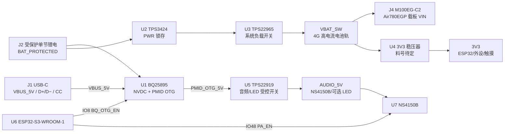

# 电子木鱼硬件原理图设计基线

> **状态：已确认的电气接口基线；未完成样机验证。**
>
> 本文件由 `_bmad-output/implementation-artifacts/spec-electronic-wooden-fish-hardware-schematic-baseline.md` 驱动，作为嘉立创 EDA 落图前的人可读事实源。`已确认` 只表示接口/边界已经冻结，`推荐初值` 只表示可用于首版落图的候选值，`[必须样机验证]` 表示不得写成样机已通过的工程门禁。
>
> 引脚唯一权威：`_bmad-output/planning-artifacts/architecture/architecture-Electronic_Wooden_Fish-2026-09-08/ARCHITECTURE-SPINE.md` §板级合同。本文件不改写用户提供的 PDF；旧图只作反例和交叉参考。

## 1. 目标与边界

### 1.1 已确认器件/功能边界

| 区域 | 器件或接口 | 基线结论 | 状态 |
| --- | --- | --- | --- |
| 主控 | `ESP32-S3-WROOM-1-N16R8` | 16 MB Flash / 8 MB PSRAM 模组；原生 USB-Serial-JTAG | **已确认** |
| 电池 | 单节受保护锂电池 | 仅一个电池连接器；保护电路随电池包或板级保护方案确认 | **已确认**；容量[必须样机验证] |
| 充电/电源路径 | `BQ25895` | NVDC 充电/系统路径，支持 PMID OTG；I²C 地址 `0x6A` | **已确认**；充电参数[必须样机验证] |
| 电源锁存/负载开关 | `TPS3424` + `TPS22965` | PWR 硬件锁存后打开系统电源；固件不模拟关机 | **已确认**；具体外围[必须样机验证] |
| 4G | `Air780EGP` / `M100EG-C2` 载板 | VIN 直接来自 `VBAT_SW`，允许 3.3–4.2 V、约 1.5–2 A 瞬态 | **已确认**；掉压[必须样机验证] |
| USB 数据 MUX | `FSW7227YMS10G/TR` | 单 USB-C 数据在 BQ D+/D− 与 ESP32 D+/D− 之间选一路；MSOP-10 首选 | **已确认**；料位可替代 |
| 显示/触摸 | `PY206-W38-V2`（CO5300AF-51，CST9217）24-pin FPC | 410×502 QSPI AMOLED；FPC 针脚见 §5 | **推荐目标**；实物版本/方向[必须样机验证] |
| 音频 | `ES8311` + `NS4150B` + 单声道扬声器 | I²C 配置、I²S 数据；功放由 `PA_EN=IO48` 控制 | **已确认**；腔体/增益[必须样机验证] |
| 实体敲击 | PVDF + 比较器 + ADC | 比较器唤醒 `IO11`，ADC 二次确认 `IO9`；不保存原始波形 | **已确认**；模拟前端/阈值[必须样机验证] |
| 传感器 | `CW2015`、`QMI8658C` | 电量计接共享 I²C；IMU 上板但 MVP 默认不启用，仅 INT1 | **已确认**；地址以实板扫描为准 |

### 1.2 禁止事项

- 不采用参考图中的 `CH340X`、`AMS1117`、`TPS631000`，不复制其旧 GPIO、5 V 4G 供电或双 Type-C 结构。
- `M100 VIN` 只能标为 `VBAT_SW` 电池轨；不得从 `BQ_SYS` 直接给 4G 主供电。
- `BQ_SYS` 与 `VBAT_SW` 在原理图上使用不同网络名；任何跨接必须在设计评审中单独批准。
- `GNSS_VCC` 不连接到 ESP32 GPIO；`IO8` 已释放为 `BQ_OTG_EN`。
- USB D+/D− 必须经过 `FSW7227` 单路选择；不得把 BQ 与 ESP32 数据线并联，也不得让 VBUS 反灌。
- 不引入 BLE、Wi‑Fi、GPS 业务链路；M100 的 GNSS 引脚仅保留 `NC/TP` 记录。

## 2. 系统电源与信号拓扑



### 2.1 电源网络表

| 网络名 | 来源 | 目标/消费者 | 电气边界 | 状态与验证 |
| --- | --- | --- | --- | --- |
| `VBUS_5V` | J1 VBUS | BQ `VBUS`、USB-MUX VBUS 感知/保护 | USB-C 输入，首版按 5 V / 2 A 设计 | **已确认**；输入 OVP/线损[必须样机验证] |
| `BAT_PROTECTED` | J2 `BATT+` | BQ `BAT`、TPS3424 电源输入 | 单节受保护锂电，约 3.0–4.2 V | **已确认**；电芯容量/保护阈值[必须样机验证] |
| `BQ_SYS` | BQ `SYS` | 仅 NVDC 系统侧/测试点（不得接 M100 VIN） | BQ 内部系统路径 | **已确认边界**；负载归属[必须样机验证] |
| `PMID_OTG_5V` | BQ `PMID`（OTG） | TPS22919 `VIN` | OTG 模式下约 5 V；无输入 VBUS 时才允许升压 | **推荐初值**；启动/限流[必须样机验证] |
| `VBAT_SW` | TPS22965 `OUT`（TPS3424 锁存控制） | M100 `VIN`、3V3 稳压器输入 | 电池优先高电流轨，3.3–4.2 V；持续 >1 A、瞬时 >2 A 能力 | **已确认**；发射掉压[必须样机验证] |
| `3V3` | U4 低压稳压器（料号待定） | ESP32、共享 I²C、触摸、显示逻辑、PVDF 比较器、RGB（首选） | 3.3 V 逻辑轨；不可承担 4G 峰值 | **已确认功能**；纹波/热/瞬态[必须样机验证] |
| `AUDIO_5V` | TPS22919 `OUT` | NS4150B `VCC`、若选 5 V RGB 则经独立限流/电平转换 | 受 `PMID_OTG_5V` 与电源良好条件控制 | **已确认功能**；实际负载[必须样机验证] |
| `GND` | J1/J2 共地 | 全板 | 单点/回流路径按 PCB 布局处理 | **已确认**；回流噪声[必须样机验证] |

**电源时序基线：** PWR 短按由 `TPS3424` 锁存，打开 `TPS22965` 后形成 `VBAT_SW`；先确认 `PMID_OTG_5V` 有效并让 `AUDIO_5V` 稳定，再拉高 `PA_EN`。BQ `SYS` 不得成为 M100 的主供电路径。充电期间固件暂停输入、经文推进和音频，但仍可显示充电与同步状态。

### 2.1.1 首版推荐外围（候选值，不是样机承诺）

下表把可直接放入嘉立创 EDA 的首版料号和值列出来；所有带「推荐初值」的项目都要在原理图审查和目标板实测后才能升格。数值参考 TI 数据手册及仓库旧参考图，旧图的拓扑、GPIO 和 5 V 4G 供电不迁移。

| 位号/功能 | 首选 MPN（封装/LCSC） | 推荐初值 | 说明/门禁 |
| --- | --- | --- | --- |
| U1 BQ25895 | `BQ25895RTWR`（QFN-24-EP，LCSC `C80200`） | `L_BQ=2.2 µH`（Isat ≥ 6 A）；`C_VBUS=1 µF + 100 nF`；`C_SYS≈20 µF`；`C_PMID=60 µF`；`C_REGN=4.7 µF`；`C_BTST=47 nF`；`R_ILIM=180 Ω`（约 2 A 输入限流候选）；`R_STAT/R_INT=10 kΩ` 上拉至 3V3；`TS=5.23 kΩ/30.1 kΩ + 10 kΩ NTC` | BQ 地址 `0x6A`；PMID 仅作 OTG 音频/LED 源。充电电流、NTC B 值、OTG 限流及电感温升[必须样机验证]。 |
| U2 TPS3424 | `TPS3424A11C13ADRLR`（SOT-5X3/DRL，LCSC 料号待核） | `SPT≈50 ms`、`LPT=4.7 nF`、长按约 2 s（均为候选）；PB/KILL 按数据手册配置；`RESET/INT` 保留测试点 | 具体短按/长按时间与 KILL 逻辑必须按所购版本计算，候选值不能当成冻结值。 |
| U3 TPS22965 | `TPS22965DSGR`（UDFN-8-EP 2×2，LCSC `C122837`） | `C_IN=22 µF + 100 nF`；`C_OUT=2.2–4.7 µF`；`C_CT=10 nF`（受控上升时间候选）；ON 不得悬空 | 6 A/16 mΩ 器件用于 `VBAT_SW`，输入/输出电容比和浪涌需示波器验证。 |
| U4 3V3 降压 | `TLV62569DBVR`（SOT-23-5，LCSC `C141836`） | `L=2.2 µH`（Isat ≥ 2.5 A）；`C_IN=10 µF + 100 nF`；`C_OUT=2×22 µF`；反馈 `R_TOP=453 kΩ`、`R_BOTTOM=100 kΩ`（约 3.32 V 候选） | 输入最低 2.5 V；电池轨跌至该值以下时是否改 buck-boost 属[必须样机验证]。严禁换回 AMS1117/TPS631000。 |
| U5 TPS22919 | `TPS22919DCKR`（SC-70-6，LCSC `C2149796`） | `C_IN=10 µF`；`C_OUT=22 µF`；ON 由 `PMID_VALID/AUDIO_EN` 驱动并加 `100 kΩ` 下拉；QOD 按数据手册接 | 1.5 A 受控上升；`AUDIO_5V` 稳定后才允许 PA_EN。 |
| U6 USB MUX | `FSW7227YMS10G/TR`（MSOP-10，LCSC `C32713318`） | `VDD=3V3`；SEL/DSEL 各预留 0 Ω/10 kΩ 选配与互斥焊盘 | 芯片带 D+/D− 过压/掉电隔离；默认 BQ 路径、强制焊盘单一路径有效仍需实测。 |

**BQ25895 落图要点：** `SW–L_BQ–SYS`、`BTST` 自举、`REGN` 去耦、`PMID` 输出电容和 `TS` 分压/NTC 必须按所购封装数据手册逐脚落图；`D+/D−` 只接 FSW7227 的 BQ 侧。`R_ILIM=180 Ω` 只作约 2 A 输入限流首版候选，USB-C 5 V/2 A 输入能力和热设计以样机波形为准。

**电源开关初值要点：** `TPS3424` 输出只负责锁存/使能，`TPS22965` 的 ON 不得由 ESP32 软件“关机”替代；`TPS22919` 的 ON 要有明确的 `PMID_VALID`/音频使能来源，不能悬空。具体电阻/电容值以所购器件的 datasheet 和 ERC 结果为准。

### 2.2 USB-C 与数据 MUX

| 网络名 | 连接 | 说明 |
| --- | --- | --- |
| `USB_DP_C` / `USB_DM_C` | J1 D+/D− → U6 `FSW7227` 公共端 | 仅一只 USB-C；串联阻尼/ESD 值[必须样机验证] |
| `USB_DP_BQ` / `USB_DM_BQ` | U6 一组选路端 → BQ D+/D− | 供 BC1.2/输入源识别；不接 ESP32 |
| `USB_D+` / `USB_D−` | U6 另一组选路端 → ESP32 IO20/IO19 | USB-Serial-JTAG 唯一调试通道 |
| `USB_MUX_SEL` / `USB_MUX_DSEL` | U6 控制脚 → `JP_USB_FORCE_BQ` / `JP_USB_FORCE_ESP` | 首版默认 BQ 检测路径；强制焊盘只能一路有效 |
| `CC1` / `CC2` | J1 → 5.1 kΩ Rd → GND | 设备端 UFP 角色；阻值为首版推荐值 |
| `VBUS_5V` | J1 VBUS → BQ VBUS | VBUS 反灌由 BQ/保护与布局共同保证，不从 ESP32 输出 |

`FSW7227YMS10G/TR` 是首选料位（MSOP-10），可替代料必须保持相同的单路选择与断电隔离语义。`DSEL/SEL` 的默认电平、上电先接 BQ 的时序和强制焊盘互斥性均列入 [必须样机验证]。

## 3. ESP32-S3 板级 GPIO 合同

| 功能 | 信号/网络 | GPIO | 方向/电气约束 | 状态 |
| --- | --- | ---: | --- | --- |
| BOOT | `BOOT0` | IO0 | 输入启动绑带；下载时拉低 | **已确认** |
| PWR | `PWR_STATE` | IO46 | **只读输入**；strapping，硬件电源电路处理长按 | **已确认** |
| RESET | `RESET_N` | EN | 独立按键/测试点，不占普通 GPIO | **已确认** |
| PVDF ADC | `PVDF_ADC` | IO9 / ADC1_CH8 | 输入；前端限流、低漏钳位 | **已确认**；模拟值[必须样机验证] |
| PVDF 唤醒 | `PVDF_CMP_WAKE` | IO11 | 低功耗唤醒输入；比较器输出 | **已确认**；极性/阈值[必须样机验证] |
| 共享 I²C | `I2C_SDA` / `I2C_SCL` | IO1 / IO2 | 单一总线仲裁与上拉 | **已确认** |
| CST9217 | `TP_RST` / `TP_INT` | IO38 / IO39 | 复位/中断，方向按驱动配置 | **已确认**；坐标/极性[必须样机验证] |
| QMI8658C | `IMU_INT1` | IO41 | 仅 INT1；INT2 不接、不占 IO45 | **已确认** |
| CO5300 | `LCD_RST/CS/SCLK/D0/D1/D2/D3/EN` | IO4/40/5/6/7/12/42/47 | QSPI；IO47 为 OLED_EN | **已确认**；FPC 方向[必须样机验证] |
| ES8311 | `I2S_DOUT/WS/DIN/BCLK/MCLK` | IO13/14/17/18/21 | I²S 数据；codec 控制走 I²C | **已确认** |
| NS4150B | `PA_EN` | IO48 | 功放使能；静音/暂停/故障回低 | **已确认** |
| Air780EGP | `M100_TXD/RXD` | IO43 / IO44 | UART 单一 AT 所有权（TX/RX 交叉） | **已确认** |
| Air780EGP | `M100_DTR` / `M100_RST` / `M100_NET_STATUS_COMPAT` | IO10 / IO15 / IO16 | DTR 开漏；RST/NET_STATUS 按载板能力接入；IO16 无对应脚时 TP/NC | **已确认**；极性[必须样机验证] |
| BQ25895 | `BQ_OTG_EN` | IO8 | ESP32 输出到 BQ OTG 脚；不连接 M100 GNSS_VCC | **已确认**；时序[必须样机验证] |
| RGB | `RGB_DATA` | IO3 | 用户状态灯，不作调试灯 | **已确认**；LED 电平/电流[必须样机验证] |
| USB | `USB_D−` / `USB_D+` | IO19 / IO20 | 原生 USB-Serial-JTAG；不启用 USB-OTG | **已确认** |

保留脚：GPIO45 不接 QMI INT2；GPIO33–37 及模组保留的 Flash/PSRAM 脚不作普通 GPIO。下载绑带要求 `IO0=0`、`IO46=0`，复位采样窗口内外设不得主动驱动错误电平。

## 4. 共享 I²C 总线与地址

总线：`I2C0`（推荐初值 100 kHz，最终速率[必须样机验证]），SDA=`IO1`、SCL=`IO2`，统一上拉与单一仲裁。地址按 7-bit 表示：

| 器件/位号 | 地址 | 地址来源/选择 | 连接与职责 | 状态 |
| --- | --- | --- | --- | --- |
| `U1 BQ25895` | `0x6A` | TI 数据手册固定地址 | 充电、NVDC、PMID OTG、状态寄存器 | **已确认**；实板 ACK[必须样机验证] |
| `U2 CW2015` | `0x62`（参考） | 目标料号手册待复核 | 电量与低电状态 | **推荐初值**；上电扫描[必须样机验证] |
| `U3 CST9217` | `0x5A`（参考） | PY206 目标模组/手册待复核 | 触摸控制器 | **推荐初值**；上电扫描[必须样机验证] |
| `U4 ES8311` | `0x18`（参考） | CE/CDATA 配置，按目标芯片手册确认 | codec 控制 | **推荐初值**；上电扫描[必须样机验证] |
| `U5 QMI8658C` | `0x6B`（SA0=高） | 避开 BQ `0x6A`；INT2 不接 | MVP 默认不启用，未来 WoM | **推荐初值**；SA0/扫描[必须样机验证] |

落图要求：清单中的地址不得重复；若实板扫描与参考地址不符，先更新本基线与 spine，再改固件，不在驱动中静默兼容多个地址。

## 5. PY206-W38-V2 24-pin FPC 网络映射

以下针脚来自仓库内 `docs/hardware/3593896291PY206-W38-V2(2).pdf` 第 3–4 页（型号/修订与实物接触方向仍需确认）。`TP-*` 为 CST9217 触摸侧，`L-*` 为 CO5300 QSPI 侧。

| FPC pin | 原厂符号 | EWF 网络 | 去向 | 状态 |
| ---: | --- | --- | --- | --- |
| 1 | `TP-VDD 3V` | `3V3` | 触摸供电 | **推荐初值**；电压/时序[必须样机验证] |
| 2 | `TP SCL 3V` | `I2C_SCL` | ESP32 IO2 | **已确认** |
| 3 | `TP-SDA 3V` | `I2C_SDA` | ESP32 IO1 | **已确认** |
| 4 | `TP INT 3V` | `TP_INT` | ESP32 IO39 | **已确认**；极性[必须样机验证] |
| 5 | `TP RST 3V` | `TP_RST` | ESP32 IO38 | **已确认**；极性[必须样机验证] |
| 6 | `TP-GND` | `GND` | 地 | **已确认** |
| 7 | `VDD 3V` | `3V3` | 显示逻辑供电 | **推荐初值**；电源时序[必须样机验证] |
| 8 | `VBAT` | `LCD_VBAT`（首版接 `VBAT_SW`） | AMOLED 模拟/面板供电 | **推荐初值**；范围/纹波[必须样机验证] |
| 9 | `MTP/NC` | `NC` | 不接 | **已确认** |
| 10 | `VDD 3V` | `3V3` | 显示逻辑供电 | **推荐初值**；电源时序[必须样机验证] |
| 11 | `GND` | `GND` | 地 | **已确认** |
| 12 | `L RES` | `LCD_RST` | ESP32 IO4 | **已确认** |
| 13 | `GND` | `GND` | 地 | **已确认** |
| 14 | `L IO0` | `LCD_D0` | ESP32 IO6 | **已确认** |
| 15 | `GND` | `GND` | 地 | **已确认** |
| 16 | `L SCLK` | `LCD_SCLK` | ESP32 IO5 | **已确认** |
| 17 | `GND` | `GND` | 地 | **已确认** |
| 18 | `L IO3` | `LCD_D3` | ESP32 IO42 | **已确认** |
| 19 | `NC` | `NC` | 不接 | **已确认** |
| 20 | `L IO2` | `LCD_D2` | ESP32 IO12 | **已确认** |
| 21 | `CS` | `LCD_CS` | ESP32 IO40 | **已确认** |
| 22 | `L IO1` | `LCD_D1` | ESP32 IO7 | **已确认** |
| 23 | `OLED_EN` | `LCD_EN` | ESP32 IO47 | **已确认**；电源时序[必须样机验证] |
| 24 | `LTE`/`TE` | `LCD_TE` | 测试点或 NC；MVP 不用 | **推荐初值**；实物功能[必须样机验证] |

**FPC 门禁：** 第 8 脚是否需要独立 `LCD_VBAT`、FPC 正反面与 1 脚方向、`TE` 是否需要接入、IO47 的有效极性，必须在实物插合与首帧示波器记录后才能冻结。

## 6. 外设与关键网络

### 6.1 Air780EGP / M100EG-C2 载板

| 载板端信号 | EWF 网络 | ESP32/电源去向 | 约束 |
| --- | --- | --- | --- |
| `VIN` | `M100_VIN`=`VBAT_SW` | TPS22965 输出 | 3.3–4.2 V；持续 >1 A、瞬时约 1.5–2 A；不得接 `BQ_SYS` |
| `GND` | `GND` | 公共地 | 4G 回流与音频回流分区布局 |
| `TXD` | `M100_TXD` | ESP IO44（UART RX） | 单一 AT 入口 |
| `RXD` | `M100_RXD` | ESP IO43（UART TX） | 电平/交叉方向[必须样机验证] |
| `DTR` | `M100_DTR` | ESP IO10 开漏 | 唤醒/休眠有效极性[必须样机验证] |
| `RST` | `M100_RST` | ESP IO15 + TP | 载板输入/输出方向与低有效性[必须样机验证] |
| `NET_STATUS` | `M100_NET_STATUS_COMPAT` | ESP IO16；无对应脚时 `TP_NET_STATUS/NC` | 仅兼容逻辑观测，不作为业务必需 |
| `GNSS_VCC` | `M100_GNSS_VCC_NC` | `NC/TP`，不接 ESP IO8 | GPS 非 MVP；IO8 留给 `BQ_OTG_EN` |
| `SIM`/`ANT` | `M100_SIM_*`/`M100_ANT` | 载板/连接器 | 载板具体针脚、ESD、天线与机械结构[必须样机验证] |

4G 软件仍沿用 `docs/embedded/4g/` 的 AT、DTR、PDP、HTTPS 单事务经验，但本硬件合同不复制 `main_control` 的旧 GPIO（尤其旧 UART 与 `GNSS_VCC` 映射）。

### 6.2 音频与 RGB

- `ES8311`：共享 I²C；I²S `DOUT=IO13`、`WS=IO14`、`DIN=IO17`、`BCLK=IO18`、`MCLK=IO21`。codec 供电取 `3V3`，模拟地/数字地按数据手册和 PCB 回流处理。
- `NS4150B`：`VCC=AUDIO_5V`，音频输入来自 ES8311 模拟输出，`PA_EN=IO48`。`PA_EN` 只有在 `AUDIO_5V` 稳定后才可拉高；静音、充电、故障时拉低。
- `RGB_DATA=IO3`：优先使用 3.3 V 兼容 RGB 器件并接 `3V3`；若选 5 V 器件，必须增加电平转换与限流，不能直接把 3.3 V 数据线接到 5 V 输入。

#### 6.2.1 ES8311 / NS4150B 首版外围候选

| 器件 | 首选 MPN（LCSC） | 推荐初值（来源为旧参考图/数据手册典型电路） | 样机门禁 |
| --- | --- | --- | --- |
| ES8311 | `ES8311` QFN-20-EP 3×3（LCSC `C962342`） | I²C 上拉 `4.7 kΩ`；PVDD/DVDD 各 `100 nF`；AVDD `1 µF`；ADCVREF/DACVREF/MIC1N 各 `1 µF`；I²S 线可预留 `22 pF` DNP；OUTP/OUTN AC 耦合各 `1 µF`，串联 `0 Ω` 料位 | 地址/CE-CDAT、I²S 主从、22 pF 是否影响边沿、模拟地回流及增益必须按目标板实测；不迁移旧麦克风/语音链路。 |
| NS4150B | `NS4150B` MSOP-8（LCSC `C189961`） | VCC `1 µF + 22 µF + 22 µF`；BYPASS `1 µF`；差分输入各 `100 nF` 串联、各 `100 kΩ` 偏置；PA_EN 下拉 `100 kΩ`；输出端 `0 Ω` 料位与 `1 nF` EMI 预留 | 参考图中的值仅作起点；扬声器阻抗、输出功率、爆音/温升和 `PA_EN` 先后顺序必须在最终腔体实测。 |

ES8311 的 `I2C_SDA/SCL` 仍挂共享 `I2C0`，I²S 五根线只走音频路径；`AUDIO_5V` 只供功放，不把 5 V 直接送入 ES8311。

### 6.3 PVDF 模拟前端与比较器

```text
PVDF+/- → 1 MΩ 级串联限流（推荐初值）
       → 低漏钳位/泄放网络（料号、阻值待定）
       ├→ PVDF_ADC（IO9 / ADC1_CH8）二次确认
       └→ 比较器输入 → PVDF_CMP_WAKE（IO11）低功耗唤醒
```

1MΩ、钳位器件、偏置/泄放、比较器料号、阈值、滞回、输出极性与消抖均为 **[必须样机验证]**；过压和负摆幅不得越过 ADC 安全范围。PVDF 只产生 `physical_pvdf` 事件，不保存或上传原始波形。测试点：`TP_PVDF_RAW`、`TP_PVDF_ADC`、`TP_PVDF_CMP`。

首版可落图的模拟前端候选：`TLV2369IDGKR`（低功耗 RRIO 运放，LCSC `C2057867`）作缓冲/偏置，`TLV7042`（低功耗比较器，具体封装/LCSC 料号待采购核对）作唤醒比较器；`R_PVDF_SER=1 MΩ`、`R_BIAS/泄放=10 MΩ`、`R_ADC=1 kΩ`、`C_ADC=100 nF`。这些值只用于首版占位与测试点布局，不能替代比较器输入共模、钳位漏电、阈值/滞回计算；TLV7042 输出形式与 IO11 唤醒极性必须实测。

### 6.4 连接器与 LCSC 候选

| 位号 | 目标连接器 | 首选 MPN / LCSC | 适配条件与状态 |
| --- | --- | --- | --- |
| J1 | 单 USB-C 16P、USB2.0、SMT | `TYPEC-304-ACP16` / LCSC `C165948`（候选） | 机械沉板高度、外壳开孔和屏蔽脚布局[必须样机验证]；不再使用双 Type-C。 |
| J2 | 电池 3P、2.0 mm PH（BATT+/BATT−/NTC） | JST `B3B-PH-K-S(LF)(SN)` / LCSC `C131339` | 电池线径、锁扣方向、NTC B 值和保护板方案仍需确认。 |
| J3 | 显示 FPC 24P、0.5 mm、双面接触候选 | HRS `FH34SRJ-24S-0.5SH(50)` / LCSC `C324726` | 目标 PDF 未给出板上接触方向；下单前必须拿实物 FPC 对插。 |
| J4 | M100EG-C2 载板排针 | `HDR1X10-P2.54`（LCSC 料号待载板实物核对） | 仅冻结逻辑信号交叉表（见落图记录）；实际排针位数/间距/方向[必须样机验证]。 |
| J5 | 单声道扬声器 2P | 2.0 mm/2.54 mm 连接器料号待腔体确认 | 阻抗、线长、极性与腔体[必须样机验证]。 |
| J6 | PVDF 2P 或焊盘 | 机械方案待定 | 传感器有效自由长度与应力释放[必须样机验证]。 |

### 6.5 首版 BOM 对照（可采购项与待定项分开）

| 位号 | MPN | LCSC | 数量 | 状态 | 备注 |
| --- | --- | --- | ---: | --- | --- |
| U1 | BQ25895RTWR | C80200 | 1 | 推荐初值 | QFN-24-EP；地址 0x6A |
| U2 | TPS3424A11C13ADRLR | 待核 | 1 | 推荐初值 | DRL/SOT-5X3；按版本核对时序 |
| U3 | TPS22965DSGR | C122837 | 1 | 推荐初值 | UDFN-8-EP 2×2；VBAT_SW |
| U4 | TLV62569DBVR | C141836 | 1 | 推荐初值 | SOT-23-5；3V3 降压 |
| U5 | TPS22919DCKR | C2149796 | 1 | 推荐初值 | SC-70-6；AUDIO_5V |
| U6 | FSW7227YMS10G/TR | C32713318 | 1 | 已确认首选 | MSOP-10；USB 数据 MUX |
| U7 | ESP32-S3-WROOM-1-N16R8 | C2913202 | 1 | 已确认 | 主控模组；采购批次仍需核对 |
| U8 | ES8311 | C962342 | 1 | 推荐初值 | QFN-20-EP；I²C 0x18 参考 |
| U9 | NS4150B | C189961 | 1 | 已确认功能 | MSOP-8；3–5 V 功放 |
| U10 | TLV2369IDGKR | C2057867 | 1 | 推荐初值 | PVDF 缓冲；封装/通道核对 |
| U11 | TLV7042 | 待核 | 1 | 推荐初值 | PVDF 比较器；输出极性待测 |
| U12 | CW2015 | 待核 | 1 | 推荐初值 | 电量计；地址待扫 |
| U13 | QMI8658C | 待核 | 1 | 推荐初值 | SA0=高，0x6B；MVP 默认不启用 |
| U14 | CO5300AF-51 / PY206-W38-V2 | 目标模组采购 | 1 | 推荐目标 | 410×502 QSPI AMOLED |
| J1 | TYPEC-304-ACP16 | C165948 | 1 | 推荐初值 | 单 USB-C 16P |
| J2 | B3B-PH-K-S(LF)(SN) | C131339 | 1 | 已确认接口 | 电池 3P PH 2.0 mm，含 NTC |
| J3 | FH34SRJ-24S-0.5SH(50) | C324726 | 1 | 推荐初值 | FPC 24P 0.5 mm，接触方向待核 |
| J4 | M100EG-C2 载板 | 待核 | 1 | 推荐目标 | 逻辑排针/载板针脚待核 |
| R_PVDF_SER | 1 MΩ，1% | 采购时选 0603 | 1 | 推荐初值 | PVDF 限流，必须验证 |
| R_PVDF_BIAS | 10 MΩ，1% | 采购时选 0603 | 1 | 推荐初值 | 泄放/偏置，必须验证 |
| R_PVDF_ADC | 1 kΩ，1% | 采购时选 0603 | 1 | 推荐初值 | ADC 隔离，必须验证 |
| C_PVDF_ADC | 100 nF，X7R | 采购时选 0603 | 1 | 推荐初值 | ADC RC，必须验证 |

LCSC 库存、价格和替代料会变化；上述编号是 2026-09-09 检索到的候选，不构成采购锁定。缺少 LCSC 编号的器件必须在导入 EDA 前由采购/封装负责人补齐并复核封装。

## 7. 嘉立创 EDA 落图页与统一网络名

嘉立创落图的页层级和逐网连接记录见 [`嘉立创EDA-分层原理图落图记录.md`](嘉立创EDA-分层原理图落图记录.md)，机器侧字段见 [`电子木鱼-硬件网络清单.json`](电子木鱼-硬件网络清单.json)。所有页使用本文件的网络名，不在子页另起别名。

| 页码 | 页面 | 必须出现的网络/测试点 |
| --- | --- | --- |
| P01 | USB-C、BQ25895、TPS3424/TPS22965、电池与电源分轨 | `VBUS_5V`、`BAT_PROTECTED`、`BQ_SYS`、`PMID_OTG_5V`、`VBAT_SW`、`3V3`、`AUDIO_5V`、`TP_VBAT_SW`、`TP_PMID` |
| P02 | ESP32-S3 主控、下载/复位、USB-Serial-JTAG | `BOOT0`、`PWR_STATE`、`RESET_N`、`USB_D−`、`USB_D+`、`BQ_OTG_EN` |
| P03 | CO5300/CST9217 24-pin FPC | `I2C_SDA/SCL`、`TP_RST/INT`、`LCD_*`、`LCD_VBAT`、`LCD_TE` |
| P04 | ES8311、NS4150B、扬声器、RGB | `I2S_*`、`AUDIO_5V`、`PA_EN`、`RGB_DATA`、`SPK_P/N` |
| P05 | PVDF、限流/钳位、比较器与测试点 | `PVDF_RAW`、`PVDF_ADC`、`PVDF_CMP_WAKE`、三个 PVDF TP |
| P06 | M100EG-C2/Air780EGP、SIM、天线与测试点 | `M100_VIN`、`M100_TXD/RXD`、`M100_DTR`、`M100_RST`、`M100_NET_STATUS_COMPAT`、`M100_GNSS_VCC_NC` |
| P07 | 共享传感器与总线测试点 | `I2C_SDA/SCL`、`CW2015`、`QMI8658C`、`TP_I2C_SDA/SCL` |

## 8. 开放项与样机验收矩阵

| 编号 | 开放项 | 何时关闭 | 证据要求 | 状态 |
| --- | --- | --- | --- | --- |
| HW-OI-001 | 受保护电池容量、保护板/NTC、机械与安全间距 | 选定电芯并完成充放电 | 电池规格、热/过流记录 | **[必须样机验证]** |
| HW-OI-002 | 3V3 稳压器料号、效率、纹波与启动 | 首版 PCB 负载测试 | 电子负载+示波器波形 | **[必须样机验证]** |
| HW-OI-003 | TPS3424/TPS22965 精确外围、PWR 长按/掉电时序 | 原理图 ERC + 实机按键测试 | 各轨上电顺序与掉压波形 | **[必须样机验证]** |
| HW-OI-004 | BQ25895 充电电流、ILIM、TS/NTC、OTG 限流 | USB-C 5 V/2 A 与满载测试 | BQ 状态寄存器、温升、电流波形 | **[必须样机验证]** |
| HW-OI-005 | FSW7227 SEL/DSEL 默认态、强制焊盘互斥、D+/D−隔离 | 三种 USB 路由逐项插拔 | PC 枚举、BQ 检测、反灌电压 | **[必须样机验证]** |
| HW-OI-006 | PY206 FPC 实物方向、VBAT/VDD 范围、OLED_EN/TE | 插合与首帧显示 | 针脚连续性、供电时序、首帧照片/波形 | **[必须样机验证]** |
| HW-OI-007 | CST9217、CW2015、ES8311、QMI8658C 实际 I²C 地址 | 上电扫描 | 扫描日志；地址不得重复 | **[必须样机验证]** |
| HW-OI-008 | PVDF 1M 限流、钳位、比较器料号/阈值/滞回 | 单次、1 秒 20 次及环境振动测试 | ADC 不越界、误触发/漏触发记录 | **[必须样机验证]** |
| HW-OI-009 | M100 UART 电平、RST/DTR 极性、NET_STATUS/GNSS_VCC 是否有载板针脚 | 载板资料与实测 | 针脚表、AT 回应、休眠/唤醒波形 | **[必须样机验证]** |
| HW-OI-010 | Air780EGP 发射峰值、电池轨压降与天线/散热 | 弱网满功率发射 | 电子负载/示波器，无掉压重启 | **[必须样机验证]** |
| HW-OI-011 | 扬声器阻抗、腔体、ES8311 增益、AUDIO_5V 负载 | 目标外壳声学标定 | RMS/削顶/爆音与温升记录 | **[必须样机验证]** |

**样机状态声明：** 当前有文档、可落图网络记录和离线 HTML/SVG 复刻图；嘉立创 EDA 工程仅保留 P01–P07 页树，未放置元件或运行 ERC，未进行 PCB 打样、实物插合、示波器/电子负载测试。任何输出、代码编译或静态检查通过都不能替代上述样机证据。

## 9. 参考资料与追溯

- 主规范：`_bmad-output/implementation-artifacts/spec-electronic-wooden-fish-hardware-schematic-baseline.md`。
- 架构合同：`_bmad-output/planning-artifacts/architecture/architecture-Electronic_Wooden_Fish-2026-09-08/ARCHITECTURE-SPINE.md` §板级合同。
- FPC 目标资料：`docs/hardware/3593896291PY206-W38-V2(2).pdf`（第 3–4 页针脚/示意；目标版本与方向仍待实物核对）。
- 旧参考图：`docs/hardware/SCH_遥控板_双TypeC_4G稳压_2026-09-07.pdf`（只作反例；文件不改写、不复制其 CH340X/AMS1117/TPS631000/旧 GPIO）。
- 4G 软件迁移：`docs/embedded/4g/Air780EGP-AT联网与HTTPS经验.md`、`docs/embedded/4g/troubleshooting/Air780EGP-AT零响应与恢复.md`。
- M100 旧宏交叉核对：`/Users/hongchenke/Documents/Github/main_control/components/BSP/GPS/gps.h`；仅用于识别旧 GPIO，EWF 不复制。
