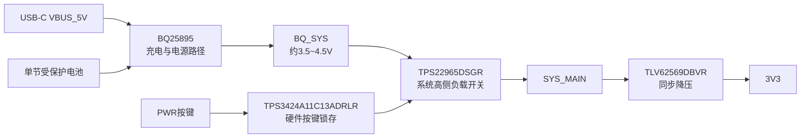

这四颗芯片组成的是一套“单节锂电池充电、系统电源路径管理、硬件开关机和 3.3 V 稳压”电源子系统。



## 1. BQ25895RTWR

### 芯片作用

BQ25895 是整套电源系统的核心芯片，负责：

- 单节锂离子/锂聚合物电池充电
- USB 或外部输入电源管理
- 电池与系统之间的 NVDC 电源路径管理
- 电池补充供电
- 输入电流限制和动态功率管理
- 电池温度 NTC 检测
- 电池运输模式和 BATFET 控制
- 通过 I²C 读取充电状态、电池电压、温度和故障
- 可选的 5 V OTG 升压输出

TI 对它的定义是单节、最高 5 A 的开关型电池充电器，同时集成系统电源路径管理和 BATFET。它可以自动在 VBUS、电池和两者之间选择系统供电路径。[TI BQ25895 产品资料](https://www.ti.com/product/BQ25895)

### 在你的项目中的作用

你的连接关系是：

```text
VBUS_5V
   ↓
BQ25895 VBUS
   ↓
BQ25895 SYS
   ↓
BQ_SYS
```

电池连接：

```text
BAT_PROTECTED
   ↓
BQ25895 BAT
```

工作状态如下：

| 状态            | BQ25895 行为                           |
| --------------- | -------------------------------------- |
| 只有 USB        | USB 给系统供电，系统可以在无电池时运行 |
| 只有电池        | 电池通过 BATFET 给 SYS 供电            |
| USB + 电池      | USB 优先给系统供电，同时给电池充电     |
| 4G 瞬时负载过大 | 电池可以通过 BATFET 补充系统电流       |
| 输入电流不足    | 通过输入限流和 DPM 降低充电电流        |

### 外围电路功能名称

推荐名称：

> 单节锂电池充电与 NVDC 系统电源路径管理

原理图页名可以写：

> `P01_单节电池充电与BQ_SYS电源路径`

---

## 2. TPS22965DSGR

### 芯片作用

TPS22965 是一个大电流高侧负载开关，本质上是一个集成 MOSFET 的电源通断器。

它负责：

- 控制系统主电源是否送出
- 切断 4G、3.3 V 稳压器和音频电源
- 限制上电浪涌电流
- 调整输出上升时间
- 关断时通过 QOD 快速释放输出电压
- 承受较大的系统工作电流

它的输入范围为 0.8 V 到 5.7 V，最大连续电流为 6 A，典型导通电阻约 16 mΩ。[TI TPS22965 资料](https://www.ti.com/product/TPS22965)

### 在你的项目中的作用

```text
BQ_SYS ──> TPS22965 IN
             TPS22965 OUT ──> SYS_MAIN
```

TPS22965 不负责充电，也不负责产生稳定的 3.3 V。它只负责决定 `BQ_SYS` 是否连接到系统主电源 `SYS_MAIN`。

`SYS_MAIN` 再供给：

- Air780EGP/M100 4G 模块
- TLV62569 稳压器
- 音频电源滤波级
- 其它系统负载

TPS22965 的 `ON` 脚由 TPS3424、USB 有效状态或其它硬件逻辑控制。

### 为什么不能直接把 BQ_SYS 接到 4G

项目要求是：

```text
BQ_SYS → TPS22965 → SYS_MAIN → 4G
```

而不是：

```text
BQ_SYS → 4G
```

原因是 TPS22965 提供了系统级电源隔离和硬件断电能力。PWR 长按关机时，TPS3424 可以让 TPS22965 关闭，系统主电源被切断，整个过程不依赖 ESP32 软件。

### 外围电路功能名称

推荐名称：

> 系统主电源高侧负载开关与浪涌控制

原理图页名可以写：

> `P01_SYS_MAIN系统电源开关`

---

## 3. TPS3424A11C13ADRLR

### 芯片作用

TPS3424 是低功耗硬件按键控制器，不是大电流电源开关。

它负责：

- 检测短按和长按
- 产生可配置的短按、长按时间
- 输出硬件锁存状态
- 控制系统电源开关的使能
- 产生 RESET 或 INT 信号
- 支持 KILL 关断控制
- 在主控尚未启动时完成按键处理

TI 将 TPS3424 定义为带可编程延时、锁存、复位和中断输出的纳米功耗按键控制器。它可以用于控制电压稳压器或电路断路器。[TI TPS3424 资料](https://www.ti.com/product/TPS3424)

### 在你的项目中的作用

按下 PWR 键时：

```text
PWR_BUTTON
   ↓
TPS3424 PB
   ↓
TPS3424 内部短按/长按判断
   ↓
输出 SYS_EN 或相关控制信号
   ↓
TPS22965 ON
   ↓
SYS_MAIN 上电或断电
```

长按关机时：

```text
PWR_BUTTON 长按
   ↓
TPS3424 判断达到长按时间
   ↓
TPS3424 改变锁存输出
   ↓
TPS22965 关闭
   ↓
SYS_MAIN 断电
```

ESP32 的 GPIO46 只读取电源状态，不负责直接完成硬件关机。

### 需要特别区分

TPS3424：

```text
负责判断按键和产生控制逻辑
```

TPS22965：

```text
负责真正切断系统电源
```

所以 TPS3424 不能替代 TPS22965，也不能让大电流 4G 电源直接流过自身。

### 外围电路功能名称

推荐名称：

> 硬件电源按键检测与系统电源锁存控制

原理图页名可以写：

> `P01_PWR按键与硬件电源锁存`

---

## 4. TLV62569DBVR

### 芯片作用

TLV62569 是同步降压型 DC/DC 稳压器，负责把系统主电源转换成稳定的 3.3 V。

它负责：

- 将 `SYS_MAIN` 降压为 `3V3`
- 为 ESP32、传感器、I²C、显示逻辑等提供稳定电源
- 通过外部反馈电阻设定输出电压
- 提供最高约 2 A 输出能力
- 具备软启动、过流保护、热关断和轻载省电模式

其输入范围为 2.5 V 到 5.5 V，输出可调范围约为 0.6 V 到输入电压，典型开关频率约 1.5 MHz。[TI TLV62569 数据手册](https://www.ti.com/lit/ds/symlink/tlv62569.pdf)

### 在你的项目中的作用

```text
SYS_MAIN
   ↓
TLV62569 VIN
   ↓
TLV62569 SW → 2.2uH 电感
   ↓
TLV62569 VOUT
   ↓
3V3
```

`3V3` 供电对象包括：

- ESP32-S3-WROOM-1
- BQ25895 的 I²C 上拉
- CW2015
- QMI8658A
- CST9217
- ES8311 数字部分
- 显示逻辑
- PVDF 比较器
- RGB 指示灯等

反馈分压决定输出电压：

```text
3V3 ── R_TOP ── FB ── R_BOTTOM ── GND
```

项目当前建议：

```text
R_TOP = 453 kΩ
R_BOTTOM = 100 kΩ
```

### 外围电路功能名称

推荐名称：

> SYS_MAIN 到 3.3 V 的同步降压稳压

原理图页名可以写：

> `P01_SYS_MAIN转3V3同步降压`

---

## 四颗芯片合起来的总功能名

如果必须给这四颗芯片外围电路整体起一个功能名字，我建议使用：

> 单节锂电池充电与系统电源管理子系统

这是最适合作为工程和原理图正式名称的叫法。

如果想更完整一些，可以写：

> 单节锂电池充电、NVDC 电源路径、硬件电源锁存与 3.3 V 稳压子系统

如果作为嘉立创原理图页面标题，建议使用：

> `P01_单节电池充电与系统电源管理`

如果作为模块或 Skill 名称，建议使用：

> `single-cell-battery-system-power-management`

四颗芯片的职责对应关系可以固定为：

| 芯片               | 核心职责                     | 推荐功能名                         |
| ------------------ | ---------------------------- | ---------------------------------- |
| BQ25895RTWR        | 充电、电池管理、系统电源路径 | 单节锂电池充电与 NVDC 电源路径管理 |
| TPS22965DSGR       | 系统主电源通断和浪涌控制     | 系统主电源高侧负载开关             |
| TPS3424A11C13ADRLR | PWR 按键检测和硬件锁存       | 硬件电源按键与锁存控制器           |
| TLV62569DBVR       | SYS_MAIN 转 3.3 V            | 3.3 V 同步降压稳压器               |

在你的项目中，最清晰的层级是：

```text
BQ25895       = 电池与输入电源管理
TPS3424       = 电源按键逻辑
TPS22965      = 系统电源通断
TLV62569      = 3.3V 电源生成
```

这四颗芯片共同构成：

```text
电池充电 → 电源路径管理 → 硬件开关机 → 系统 3.3V 供电
```
